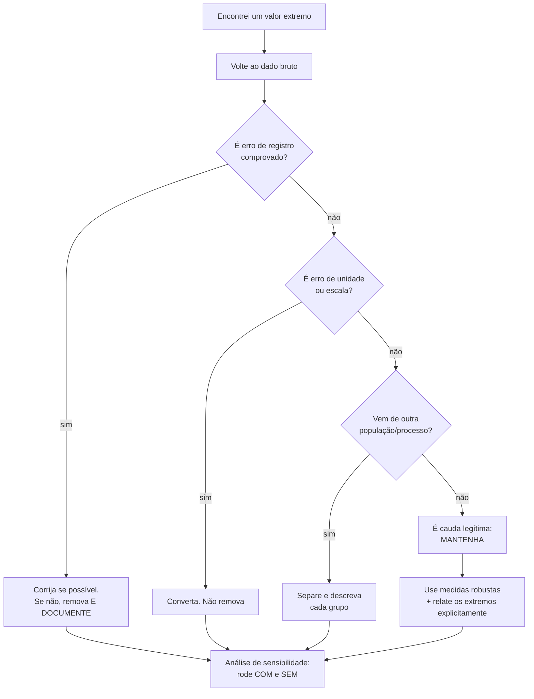

# 19. Robustez e outliers — o que fazer com o valor esquisito

`Nível: intermediário → avançado` · `Última atualização: 20/08/2026`
`Simulações executadas em Python 3.10.12 em 20/08/2026; saídas reais.`

> A pergunta errada é "como detectar outliers?".
> A pergunta certa é **"o que este valor está me dizendo?"** — e ela não tem resposta
> automática.

---

## 19.1 O que é um outlier

Um valor **muito distante** dos demais. E é só isso que a definição garante — não diz nada
sobre ele estar errado.

**As quatro origens possíveis**, e elas pedem ações opostas:

| Origem | Exemplo | O que fazer |
|---|---|---|
| **1. Erro de medição/registro** | idade 999; peso 0 kg; data 1900 | corrigir ou remover, **documentando** |
| **2. Erro de unidade** | altura 172 no meio de valores em metros | **converter**, não remover |
| **3. Outra população misturada** | um servidor de outro datacenter | separar e descrever à parte |
| **4. Cauda legítima da distribuição** | um salário de R$ 48 mil; uma cidade de 12 milhões | **manter** — é o dado mais informativo que você tem |

**As categorias 3 e 4 são as mais comuns em dados reais e as mais frequentemente destruídas.**

> **A regra ética deste arquivo:** você pode remover um valor por causa do **processo que o
> gerou** (soube que o sensor falhou, que a linha foi duplicada, que a unidade estava errada).
> Você **não pode** removê-lo por causa do **efeito que ele tem no resultado**. A primeira é
> limpeza de dados; a segunda é fabricação de evidência, e a fronteira entre as duas é
> exatamente esta.

E o custo de remover errado é histórico: em 1985, o TOMS/Nimbus-7 da NASA vinha descartando
automaticamente leituras muito baixas de ozônio sobre a Antártida por serem "fisicamente
implausíveis". O buraco na camada de ozônio foi descoberto por uma equipe britânica com
instrumentos de solo. Os dados de satélite continham o buraco havia anos — **filtrado como
outlier**. Quando reprocessaram sem o filtro, lá estava ele.

---

## 19.2 Ponto de ruptura — robustez medida

O **ponto de ruptura** é a fração dos dados que pode ser arbitrariamente corrompida sem
levar a estimativa a qualquer valor.

```python
import random, statistics as st

def mad(d):
    m = st.median(d)
    return 1.4826 * st.median([abs(x - m) for x in d])

random.seed(9)
base = [random.gauss(100, 10) for _ in range(1000)]
print(f"{'% contaminado':>14} {'media':>9} {'mediana':>9} {'DP':>10} {'MAD':>9} {'aparada10%':>11}")
for pct in [0, 1, 5, 10, 20, 40]:
    d = list(base)
    k = int(len(d) * pct / 100)
    for i in range(k):
        d[i] = 1e6                       # contaminacao absurda
    o = sorted(d)
    kk = int(len(o) * 0.10)
    print(f"{pct:>13}% {st.mean(d):>9.1f} {st.median(d):>9.1f} {st.stdev(d):>10.1f} "
          f"{mad(d):>9.1f} {st.mean(o[kk:len(o)-kk]):>11.1f}")
```

```
 % contaminado     media   mediana         DP       MAD  aparada10%
            0%     100.1     100.1        9.9       9.0       100.0
            1%   10099.1     100.3    99538.6       9.2       100.2
            5%   50095.1     100.7   218032.2       9.8       101.0
           10%  100090.2     101.3   300120.0      10.7       102.3
           20%  200080.2     103.1   400160.0      13.3    125089.8
           40%  400060.1     109.7   490094.0      28.1    375064.4
```

Leia linha por linha:

- **1% de contaminação** (10 valores em 1.000): a média salta de 100 para **10.099**, o desvio
  padrão de 9,9 para **99.539**. Mediana e MAD nem piscam.
- **20%**: a mediana ainda diz 103,1 e o MAD 13,3 — ambos ainda descrevem os dados limpos.
  A **média aparada a 10% quebra aqui**, e devia mesmo: seu ponto de ruptura é 10%.
- **40%**: a mediana finalmente começa a ceder (109,7), e o MAD dobra. Ainda assim são os
  únicos números com alguma relação com a realidade.

| Estimador | Ponto de ruptura |
|---|---|
| média, desvio padrão, variância, correlação de Pearson | **0%** |
| média aparada a k% | k% |
| IQR | 25% |
| Hodges-Lehmann | ~29% |
| **mediana, MAD** | **50%** (o máximo possível) |

Não existe estimador com ponto de ruptura acima de 50% — passando disso, os "contaminados"
viram maioria e não há como distingui-los dos dados legítimos.

---

## 19.3 Detectores de outlier — e por que todos falham

### Regra 1: escore-z (`|z| > 3`)

```
z = (x − x̄)/s
```

**Falha por circularidade:** o outlier infla `x̄` e `s`, então ele reduz o próprio escore-z.
Este é o **efeito de mascaramento** (*masking*): com dois ou mais outliers, nenhum deles é
detectado, porque juntos inflam `s` o bastante para se esconderem mutuamente.

E há um limite aritmético que raramente se menciona: numa amostra de tamanho `n`, o escore-z
máximo possível é `(n−1)/√n`. **Com `n = 10`, nenhum valor pode ter `|z| > 2,85`** — a regra
`|z| > 3` **nunca** dispara, por mais absurdo que seja o valor.

### Regra 2: escore-z modificado (`|Mᵢ| > 3,5`)

```
Mᵢ = 0,6745 · (xᵢ − mediana) / MAD_bruto
```

Usa mediana e MAD em vez de média e desvio padrão: **imune ao mascaramento**. É a recomendação
de Iglewicz e Hoaglin (1993) e a melhor regra simples que existe.

⚠️ Cuidado com um caso de borda: se mais de 50% dos valores forem idênticos, o MAD é **zero** e
o escore explode ou fica indefinido. Acontece com contagens e dados discretos.

### Regra 3: cerca de Tukey (`1,5 × IQR`)

A mais usada, e a mais mal compreendida.

```python
random.seed(42)
N = 200000
casos = {
    "normal":      [random.gauss(0, 1) for _ in range(N)],
    "uniforme":    [random.uniform(0, 1) for _ in range(N)],
    "exponencial": [random.expovariate(1) for _ in range(N)],
    "log-normal":  [math.exp(random.gauss(0, 1)) for _ in range(N)],
}
print(f"{'distribuicao':>14} {'1,5xIQR':>9} {'3xIQR':>8}")
for nome, d in casos.items():
    print(f"{nome:>14} {frac_marcada(d):>8.2%} {frac_marcada(d, 3.0):>8.2%}")
```

```
Fracao de dados marcados como 'outlier' pela cerca de 1,5xIQR
(nenhum destes conjuntos tem outlier de verdade -- sao todos limpos)

  distribuicao   1,5xIQR    3xIQR
        normal    0.71%    0.00%
      uniforme    0.00%    0.00%
   exponencial    4.84%    0.93%
    log-normal    7.74%    3.23%
      t (gl=3)    5.47%    1.29%
```

**Nenhum desses conjuntos tem outlier.** São todos amostras limpas da distribuição declarada.

- Na **normal**, a cerca marca 0,71% — que é exatamente o que Tukey calibrou: raro o bastante
  para chamar atenção, comum o bastante para não gritar toda hora.
- Na **log-normal**, ela marca **7,74%**. Em dados de renda, tempo de resposta ou tamanho de
  cidade, quase 1 em cada 13 observações perfeitamente normais é rotulada "outlier".

> **A cerca de 1,5×IQR pressupõe simetria.** Aplicada a dados assimétricos, ela acusa a cauda
> longa inteira. Remover o que ela marca em dados de renda é **remover os ricos e depois
> concluir que a renda é homogênea**.

**Correções possíveis:** aplicar a cerca em escala log; usar a cerca ajustada de Hubert e
Vandervieren (2008), que corrige pela assimetria (*medcouple*); ou simplesmente usar `3×IQR` e
tratar como "candidato extremo".

### Comparativo

| Método | Imune a mascaramento? | Supõe simetria? | Recomendação |
|---|---|---|---|
| `\|z\| > 3` | ❌ | sim | ❌ não use |
| escore-z modificado (MAD) | ✅ | sim | ✅ melhor regra simples |
| cerca 1,5×IQR | ✅ | **sim** | ⚠️ só com dados simétricos |
| cerca ajustada (medcouple) | ✅ | não | ✅ para dados assimétricos |
| distância de Mahalanobis robusta (MCD) | ✅ | multivariada | ✅ para várias variáveis |
| Isolation Forest / LOF | ✅ | não | ✅ alta dimensão; caixa-preta |

---

## 19.4 Outlier multivariado: o que nenhuma regra univariada pega

Uma pessoa de 1,50 m não é outlier. Uma pessoa de 110 kg não é outlier.
Uma pessoa de **1,50 m e 110 kg** é um outlier claro — e nenhuma análise coluna a coluna o
encontra.

```
   peso
   120 |                                    ● ← outlier multivariado
       |                          ● ●          (normal em cada eixo,
   100 |                   ● ● ●                anômalo no conjunto)
       |            ● ● ●
    80 |     ● ● ●
       |  ● ●
    60 |●
       +─────────────────────────────────── altura
        1,50   1,60   1,70   1,80   1,90
```

Ferramentas: distância de **Mahalanobis** (que usa a matriz de covariância, mas ela mesma é
contaminada pelos outliers — por isso se usa a versão robusta, **MCD**), *Local Outlier
Factor*, *Isolation Forest*.

**Em detecção de fraude, esta é praticamente a definição do problema.** Nenhuma transação é
suspeita isoladamente; a combinação (valor + horário + local + dispositivo) é.

---

## 19.5 Árvore de decisão: o que fazer



### A análise de sensibilidade é o padrão profissional

Sempre que a decisão sobre um valor extremo for discutível, **rode a análise das duas formas**
e reporte:

> "Com o outlier: média 7.060. Sem ele: 4.135. As conclusões não mudam / mudam assim."

Isso transforma uma decisão arbitrária escondida em uma informação explícita. É a prática que
separa análise defensável de análise conveniente, e custa dois minutos.

---

## 19.6 A tentação estatística mais comum, dita sem rodeios

Você roda a análise. O resultado não dá o que você esperava. Você olha os dados, vê um valor
extremo, remove, roda de novo, e agora dá.

**Isso é p-hacking**, exatamente como descrito em [18-inferencia-p-e-ic.md](18-inferencia-p-e-ic.md),
e não deixa de ser porque a justificativa parece técnica. A diferença entre limpeza legítima e
fabricação está inteiramente na **ordem dos acontecimentos**:

| Legítimo | Não legítimo |
|---|---|
| critério definido **antes** de ver os resultados | critério escolhido **depois** de ver o efeito |
| baseado no **processo** que gerou o dado | baseado no **efeito** sobre a conclusão |
| aplicado a **todos** os grupos igualmente | aplicado só onde atrapalha |
| **documentado** no relatório | omitido |
| acompanhado de **análise de sensibilidade** | rodado uma vez só |

---

## Autoteste

1. Quais são as quatro origens possíveis de um outlier, e por que a ação é diferente em cada?
2. Com 1% de contaminação, o que aconteceu com a média e com a mediana na simulação?
3. Existe estimador com ponto de ruptura acima de 50%? Por quê?
4. O que é mascaramento, e por que a regra `|z| > 3` sofre dele?
5. Com `n = 10`, qual é o maior escore-z possível? O que isso implica?
6. A cerca de 1,5×IQR marcou 7,74% dos dados de uma log-normal limpa. Por quê?
7. Uma pessoa de 1,50 m e 110 kg: por que nenhuma análise coluna a coluna a detecta?
8. Qual é a regra ética para remover um valor extremo?
9. O que é análise de sensibilidade e por que ela deve ser padrão?
10. O que a NASA perdeu por filtrar outliers automaticamente?

<details><summary>Respostas</summary>

1. (i) erro de registro → corrigir/remover documentando; (ii) erro de unidade → **converter**;
   (iii) outra população → **separar** e descrever cada grupo; (iv) cauda legítima →
   **manter**, pois costuma ser a observação mais informativa.
2. A média saltou de 100,1 para **10.099** e o DP de 9,9 para **99.539**. Mediana (100,3) e
   MAD (9,2) praticamente não se moveram.
3. **Não.** Acima de 50% os contaminados são maioria, e não há critério para distingui-los dos
   dados legítimos — a "contaminação" passa a ser os dados.
4. **Mascaramento** é quando dois ou mais outliers inflam `x̄` e `s` a ponto de nenhum deles
   ser detectado. A regra `|z| > 3` sofre porque usa exatamente as estatísticas que o outlier
   contamina — é circular.
5. `(n−1)/√n = 9/√10 ≈ 2,85`. Com `n = 10`, **nenhum** valor pode ter `|z| > 3`, então a regra
   nunca dispara, por mais absurdo que seja o dado.
6. Porque a cerca **pressupõe simetria**. Numa distribuição assimétrica, a cauda longa
   legítima cai inteira fora da cerca. Aplicá-la a rendas é remover os ricos e depois concluir
   que a renda é homogênea.
7. Porque é um outlier **multivariado**: cada valor é comum isoladamente, e só a combinação é
   anômala. Exige Mahalanobis robusta (MCD), LOF ou Isolation Forest.
8. Remover pelo **processo que gerou o dado** (sensor falhou, unidade errada, linha duplicada)
   é legítimo; remover pelo **efeito que ele tem no resultado** é fabricação de evidência.
9. Rodar a análise **com e sem** o valor discutível e reportar ambos. Torna explícita uma
   decisão que de outro modo ficaria escondida, e custa dois minutos.
10. A descoberta do **buraco na camada de ozônio**: o filtro automático do TOMS/Nimbus-7
    descartava leituras muito baixas como "fisicamente implausíveis". O buraco estava nos
    dados havia anos.

</details>

---

**Próximo:** [20-visualizacao-de-medidas.md](20-visualizacao-de-medidas.md) — como desenhar,
e o que cada gráfico esconde.
