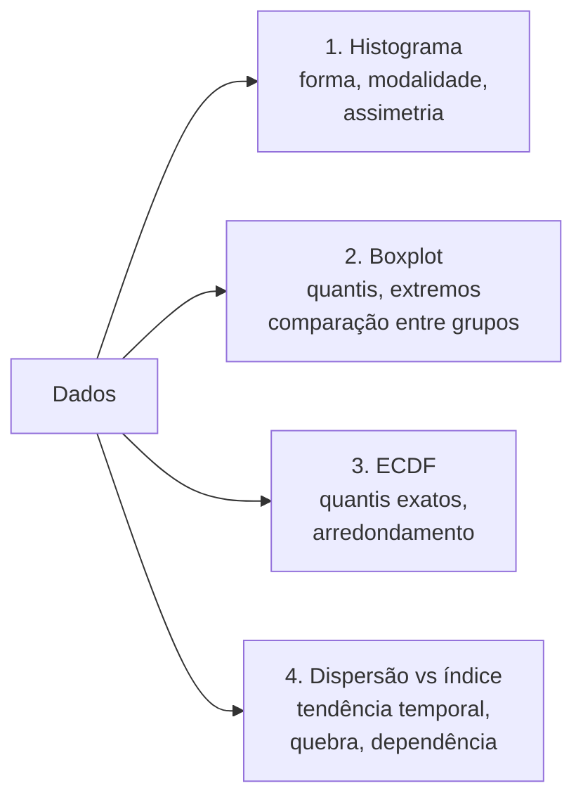

# 20. Visualização — como desenhar as medidas, e o que cada gráfico esconde

`Nível: intermediário` · `Última atualização: 20/08/2026`
`Código executado em Python 3.10.12 em 20/08/2026; saídas reais.`

> Anscombe já provou ([exemplo 9](06-exemplos.md)) que resumo não substitui desenho.
> Este arquivo é sobre o passo seguinte: **cada gráfico também esconde alguma coisa**, e é
> preciso saber o quê.

---

## 20.1 A hierarquia dos gráficos para uma variável

| Gráfico | Mostra | **Esconde** |
|---|---|---|
| **Barra com média** ("dinamite") | média | ❌ tudo o mais — **evite** |
| **Boxplot** | mediana, quartis, extremos | **modalidade**, `n`, forma dentro da caixa |
| **Histograma** | forma completa | depende do nº de classes; esconde valores exatos |
| **ECDF** | tudo, sem escolha arbitrária | menos intuitivo à primeira vista |
| **Gráfico de pontos / enxame** | todos os dados | polui com `n` grande |
| **Violino** | forma + resumo | suaviza demais com `n` pequeno; inventa cauda |
| **Violino + pontos** | forma + dados + resumo | ✅ **o padrão-ouro para `n` moderado** |

---

## 20.2 O boxplot: o que ele mostra e o buraco que tem

```
              ┌─────┬─────┐
     ├────────┤     │     ├────────┤      o        o
              └─────┴─────┘
     |        |     |     |        |      |        |
   bigode    Q1  mediana  Q3     bigode  outliers marcados
   inferior                     superior   (fora de 1,5×IQR)
```

Inventado por Tukey em 1977, para ser desenhado à mão. Mostra cinco números e a assimetria de
relance. É excelente para **comparar muitos grupos lado a lado**.

**O buraco: o boxplot não revela modalidade.**

```python
random.seed(1234)
N = 2000
uni = [random.gauss(10, 2.2) for _ in range(N)]
bi  = [random.gauss(7.2, 0.9) if random.random() < 0.5 else random.gauss(12.8, 0.9)
       for _ in range(N)]
```

```
 UNIMODAL: media=10.03  mediana=9.99  DP=2.22  Q1=8.44  Q3=11.56  min=3.55 max=17.34
  BIMODAL: media=9.93  mediana=9.00  DP=2.95  Q1=7.15  Q3=12.74  min=4.54 max=16.00
```

Médias praticamente idênticas (10,03 e 9,93), faixas semelhantes. Um boxplot dos dois lado a
lado mostra duas caixas parecidas. **O histograma conta outra história:**

```
histograma UNIMODAL:                          histograma BIMODAL:
      3.60 | #                       7              3.60 |                          0
      4.40 | ####                    23             4.40 | ##                       15
      5.20 | ######                  37             5.20 | ###########              88
      6.00 | #############           78             6.00 | ##############################   237
      6.80 | #####################   128            6.80 | ############################################ 348
      7.60 | ###################···  215            7.60 | ##############################   237
      8.40 | ####################··  242            8.40 | ##########               82
      9.20 | ###################···  271            9.20 | ##                       17
     10.00 | ###################···  255           10.00 | #                        9
     10.80 | ###################···  256           10.80 | ##########               80
     11.60 | ###############         188           11.60 | ###############################  245
     12.40 | #######################  142          12.40 | #########################################    323
     13.20 | #############           83            13.20 | #############################    232
     14.00 | #######                 45            14.00 | #########                71
     14.80 | ###                     21            14.80 | ##                       15
```

O conjunto bimodal tem **um vale exatamente onde ficam a média e a mediana**. Apenas 9 das
2.000 observações caem na classe que contém a média. **A "medida de tendência central" aponta
para o lugar em que quase não há dados.**

Isso não é curiosidade: é o "homem médio" de Quetelet ([arquivo 11](11-historia.md)) e o
projeto de cabines de avião dos anos 1940. E é o motivo de o boxplot, sozinho, ser
insuficiente.

**Regra:** com `n < 200`, **plote os pontos** sobre o boxplot. Com `n` maior, use violino,
histograma ou ECDF junto.

---

## 20.3 O histograma e a decisão que muda tudo

O número de classes (*bins*) é a decisão mais subjetiva da estatística descritiva. O mesmo
conjunto de 300 observações normais:

```
-- 3 classes --                      -- 8 classes --                    -- 40 classes --
     -4.00 | #####            33          -4.00 |                  1        (ruidoso, cheio
     -1.33 | ################  243        -3.00 | ###              9         de picos e vales
      1.33 | ####             24          -2.00 | ################ 46        que são só acaso)
                                          -1.00 | ################ 95
   parece uniforme                         0.00 | ################ 104
   ou triangular                           1.00 | #############    38
                                           2.00 | ##               7
                                        parece um sino
```

**Três classes:** perde o sino. **Quarenta:** cria picos e vales que são flutuação amostral.
**Oito:** correto.

| Regra | Fórmula | Quando |
|---|---|---|
| **Sturges** | `⌈log₂ n⌉ + 1` | padrão histórico; ruim com `n > 200` ou assimetria |
| **Scott** | largura `= 3,49·s·n^(−1/3)` | supõe normalidade |
| **Freedman-Diaconis** | largura `= 2·IQR·n^(−1/3)` | ✅ robusto; **o padrão recomendado** |
| **√n** | `⌈√n⌉` classes | regra de bolso de planilha |

O [projeto-modelo](07-projeto-modelo/README.md) usa Freedman-Diaconis por ser o único robusto
a outliers — usa IQR em vez de desvio padrão.

> **Hábito profissional:** olhe o histograma com **duas ou três** escolhas de classe antes de
> concluir qualquer coisa sobre a forma. Se um "segundo pico" some ao mudar de 20 para 15
> classes, ele não existia.

---

## 20.4 ECDF — o gráfico que não esconde nada

A **função de distribuição acumulada empírica** (ECDF) responde, para cada valor `x`: *que
fração dos dados é ≤ x?*

```
   1,0 ┤                          ┌────────────
       │                     ┌────┘
   0,75┤ ─ ─ ─ ─ ─ ─ ─ ─┌────┘ ← Q3
       │              ┌─┘
   0,50┤ ─ ─ ─ ─ ─ ┌──┘  ← mediana
       │        ┌──┘
   0,25┤ ─ ─ ┌──┘  ← Q1
       │  ┌──┘
   0,0 ┼──┘
       └──────────────────────────────────────
```

**Por que ela é subestimada:**

- **não tem parâmetro arbitrário** — nada de escolher classes ou largura de banda;
- **mostra todos os dados**, sem perda;
- permite ler **qualquer** quantil diretamente do eixo vertical;
- comparar dois grupos é trivial: duas curvas sobrepostas, e a distância vertical máxima entre
  elas **é** a estatística de Kolmogorov-Smirnov;
- degraus grandes revelam **valores repetidos** e arredondamento na coleta;
- patamares horizontais revelam **vales** — ou seja, bimodalidade.

**Por que é pouco usada:** exige um segundo de treino para ler. Vale o segundo.

> **Opinião profissional:** para comparar distribuições, a ECDF é superior ao histograma em
> quase todos os aspectos. Para *comunicar* forma a quem não é da área, o histograma ganha por
> ser imediatamente intuitivo. Use ECDF para analisar, histograma para apresentar.

---

## 20.5 A barra com barrinha de erro: por que evitar

O gráfico de barras com uma média e um "±" no topo — chamado *dinamite* ou *plunger plot* —
é o mais comum em artigos científicos e o menos informativo que existe.

Problemas, em ordem de gravidade:

1. **Esconde a distribuição inteira.** Duas barras idênticas podem vir de dados bimodais,
   assimétricos ou com outliers. O leitor não tem como saber.
2. **A barrinha é ambígua.** DP? EP? IC95%? Amplitude? Quatro coisas diferentes, mesmo desenho.
   E, como o EP é `√n` vezes menor, há incentivo silencioso para usá-lo.
3. **A barra sugere que o zero é significativo** e que a área é proporcional, o que raramente
   faz sentido para uma média.
4. **Esconde o `n`.** Uma barra de `n = 3` é desenhada igual a uma de `n = 300`.

**O que usar no lugar:** pontos individuais + mediana + IC. Vários periódicos de biologia e
psicologia hoje **exigem** isso. Se `n < 30`, não há desculpa: mostre todos os pontos.

---

## 20.6 Regras de honestidade em gráficos

| Regra | Por quê |
|---|---|
| **Eixo Y começa em zero** em gráfico de **barras** | a barra codifica magnitude pela área/comprimento; truncar mente |
| Em gráfico de **linhas**, truncar é aceitável | a linha codifica variação, não magnitude — mas **sinalize** |
| **Nunca use eixo Y duplo** para sugerir correlação | dá para fabricar qualquer relação escolhendo as escalas |
| **Marque a escala log** claramente | crescimento exponencial parece linear em log |
| **Mostre o `n`** no gráfico ou na legenda | sempre |
| **Diga o que é o `±`** | DP, EP, IC — quatro coisas diferentes |
| **Não use gráfico de pizza com mais de 5 fatias** | comparação de ângulos é imprecisa; use barras |
| **Não use 3D em dado 2D** | a perspectiva distorce áreas sistematicamente |
| **Cuidado com mapas coropléticos de contagem** | eles mapeiam população, não o fenômeno; use taxas |
| **Use paletas acessíveis** | ~8% dos homens têm alguma deficiência de visão de cores; evite vermelho-verde |

> **A distorção estatisticamente honesta e visualmente enganosa mais comum:** mapa de calor de
> contagem absoluta. Um mapa de "número de casos de doença rara por município" é sempre um mapa
> de onde há mais gente. A correção é usar **taxa**, e mesmo assim municípios pequenos terão
> taxas instáveis (um caso em 500 habitantes = 200 por 100 mil). É a **falácia da área
> pequena**, e ela produz manchetes falsas sobre "cidade com maior incidência de câncer do
> país" toda semana.

---

## 20.7 Diagnóstico visual em 4 gráficos

Antes de qualquer análise, quatro desenhos que levam 30 segundos e evitam quase todo desastre:



O quarto é o mais esquecido e às vezes o mais revelador: **plote o valor contra a ordem de
coleta**. Ele mostra deriva de instrumento, mudança de operador, quebra de processo,
sazonalidade — tudo o que viola a suposição de que as observações são independentes e
identicamente distribuídas. Se houver tendência ali, **todas as fórmulas de erro deste curso
estão subestimando a incerteza**.

---

## Autoteste

1. O que o boxplot esconde, e como se compensa?
2. Dois conjuntos com média 10,03 e 9,93. Um é bimodal. Por que a média é enganosa nele?
3. O mesmo dado com 3, 8 e 40 classes parece uniforme, sino e ruído. Qual regra usar?
4. Por que Freedman-Diaconis é preferível a Scott?
5. Cite três coisas que a ECDF mostra e o histograma não.
6. Quatro problemas do gráfico de barras com barra de erro.
7. Quando truncar o eixo Y é aceitável e quando não é?
8. Por que um mapa de contagem de casos é quase sempre um mapa de população?
9. Qual é o quarto gráfico do diagnóstico, e o que ele detecta?
10. Você tem `n = 25`. Qual gráfico usar?

<details><summary>Respostas</summary>

1. Esconde **modalidade** (não distingue unimodal de bimodal), o `n`, e a forma dentro da
   caixa. Compensa-se plotando os pontos por cima (`n < 200`) ou acrescentando violino,
   histograma ou ECDF.
2. Porque a média cai no **vale** entre os dois picos: apenas 9 de 2.000 observações estão na
   classe que a contém. Ela aponta para o lugar onde quase não há dados.
3. **Freedman-Diaconis** (largura `= 2·IQR·n^(−1/3)`), por ser robusta a outliers. E olhe o
   histograma com duas ou três escolhas antes de concluir sobre a forma.
4. Porque Scott usa o **desvio padrão**, contaminado por outliers, e supõe normalidade;
   Freedman-Diaconis usa o **IQR**, que é robusto.
5. Quantis exatos lidos diretamente; **degraus** que revelam valores repetidos e arredondamento
   na coleta; ausência de qualquer parâmetro arbitrário. (E a comparação direta entre dois
   grupos, cuja distância vertical máxima é a estatística de Kolmogorov-Smirnov.)
6. Esconde a distribuição; a barrinha é ambígua (DP/EP/IC/amplitude); a barra sugere que o
   zero e a área importam; e esconde o `n`.
7. Em gráfico de **linhas** é aceitável (a linha codifica variação), desde que sinalizado. Em
   gráfico de **barras** não é, porque a barra codifica magnitude por comprimento/área.
8. Porque a contagem absoluta é aproximadamente proporcional à população. Use **taxas** — e
   mesmo assim atenção à **falácia da área pequena**: municípios pequenos produzem taxas
   instáveis e ocupam os extremos de qualquer ranking.
9. **Valor contra ordem de coleta.** Detecta deriva, quebra de processo, mudança de operador e
   sazonalidade — ou seja, violações da suposição de independência que invalidam todas as
   fórmulas de erro.
10. **Todos os pontos individuais**, com mediana e IC sobrepostos. Com `n = 25` não há desculpa
    para esconder os dados.

</details>

---

**Próximo:** [60-teoria-avancada.md](60-teoria-avancada.md) — o que sustenta tudo isso, com
demonstrações.
