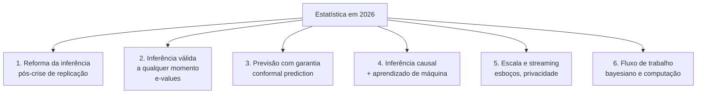

# 65. Estado da arte — onde o campo está em agosto de 2026

`Nível: pesquisa` · `Última atualização: 20/08/2026`
`⚠️ Este arquivo envelhece rápido. Reavalie a cada 6 meses.`
`Fontes web consultadas em 20/08/2026 (rodapé).`

> Estatística descritiva parece um campo encerrado — média e desvio padrão têm mais de um
> século. Não é. O que mudou não foram as fórmulas: foi **o que se considera uma afirmação
> defensável**, e a escala em que se calcula.

---

## 65.1 As seis frentes ativas

---

## 65.2 Frente 1 — A reforma da inferência: onde chegamos

**Onde estamos, em números:** replicações em larga escala continuam encontrando taxas baixas.
Em ciências do comportamento, esforços multiequipe de meta-pesquisa encontram cerca de
**metade** das alegações publicadas replicáveis; em ciências da vida e pesquisa pré-clínica,
as estimativas de reprodutibilidade robusta ficam frequentemente na faixa de **10% a 25%**.

**O que efetivamente mudou desde 2016:**

| Mudança | Situação em 2026 |
|---|---|
| Declaração da ASA sobre valores-p (2016) | consolidada como referência; citada em diretrizes editoriais |
| "Moving beyond p < 0,05" (2019) | influente; alguns periódicos baniram "estatisticamente significante" |
| **Registered Reports** | em centenas de periódicos; **revisão do método antes dos resultados** |
| **Pré-registro** | prática corrente em psicologia e ensaios clínicos; crescente em economia |
| Exigência de tamanho de efeito + IC | virou padrão em muitos periódicos |
| Compartilhamento de dados e código | exigido por várias agências financiadoras |
| Relato de resultados negativos | ainda subincentivado — **o gargalo persiste** |

**O que não mudou:** o incentivo. Carreiras continuam medidas por publicações, e publicações
continuam favorecendo resultados positivos e novos.

> **Opinião profissional, declarada como tal:** a evidência disponível sugere que a reforma
> **procedimental** (Registered Reports, pré-registro, revisão do método antes do resultado)
> produziu mais efeito que a reforma **estatística** (trocar p por Bayes, por e-value, por
> intervalo). Isso é coerente com o diagnóstico: o problema nunca foi a fórmula, foi a
> liberdade de escolha não declarada. Trocar de estatística sem mudar o incentivo apenas
> muda de sala o mesmo comportamento.

---

## 65.3 Frente 2 — E-values e inferência válida a qualquer momento

**O problema real que isso resolve:** você mediu, em [18-inferencia-p-e-ic.md](18-inferencia-p-e-ic.md),
que espiar os dados enquanto coleta eleva o falso positivo de 5% para 29%. Mas **espiar é o
que todo mundo faz**: painéis de A/B test, monitoramento de ensaio clínico, dashboards de
produto. A prática é inevitável; o método clássico não a comporta.

**A ideia do e-value.** Um *e-value* é uma variável aleatória não negativa `E` com
`E[E] ≤ 1` sob `H₀`. Interpretação direta: é o **fator de multiplicação da sua riqueza** numa
aposta contra `H₀`. Um `E = 20` significa "aposta que multiplicou por 20 o capital contra a
hipótese nula".

O que isso dá, e o valor-p não dá:

- **Combináveis por multiplicação.** E-values de estudos independentes se multiplicam. Fazer
  meta-análise vira aritmética.
- **Válidos sob parada opcional.** Você pode olhar quando quiser, parar quando quiser,
  continuar coletando depois de olhar — a garantia de erro **não se degrada**. Isso é
  consequência da desigualdade maximal de Ville para supermartingales.
- **Válidos post hoc.** Decidir o limiar depois de ver o resultado não invalida a inferência.
- Geram **sequências de confiança**: intervalos que valem simultaneamente para todos os `n`.

**Onde está o campo em 2026:** área muito ativa — Vovk, Shafer, Ramdas, Grünwald e
colaboradores. Há um workshop dedicado no NeurIPS 2026 (*E-Values: From Statistics to ML*),
aplicações em ensaios clínicos adaptativos com monitoramento contínuo, testes múltiplos, e
integração com predição conformal.

**Limitações honestas:** e-values são **menos potentes** que testes de amostra fixa quando você
realmente tem `n` fixo — você paga pela flexibilidade. E a adoção fora de estatística e ML
ainda é pequena; ferramentas de fácil uso estão surgindo agora.

> **Opinião:** é a inovação técnica mais relevante da inferência nos últimos 20 anos, porque
> resolve um problema que **todo mundo tem na prática** e que a teoria clássica tratava como
> má conduta em vez de tratar como requisito.

---

## 65.4 Frente 3 — Predição conformal

**O problema:** modelos de aprendizado de máquina dão previsões pontuais sem incerteza — ou
com "probabilidades" mal calibradas que ninguém deveria levar a sério.

**A ideia (Vovk, Gammerman, Shafer, anos 2000, popularizada nos 2020):** a partir de qualquer
modelo, produza **conjuntos de previsão** com garantia de cobertura marginal:
`P(y ∈ C(x)) ≥ 1 − α`.

- Funciona com **qualquer** modelo, como caixa-preta — rede neural, floresta, LLM.
- **Sem suposição distribucional**; exige apenas **trocabilidade** (uma condição mais fraca
  que iid).
- A garantia é de **amostra finita**, não assintótica.

**Onde está em 2026:** integração com e-values (*conformal e-prediction*), predição conformal
adaptativa para distribuições que mudam ao longo do tempo, cobertura condicional (a garantia
padrão é apenas **marginal** — em média sobre todos os `x` —, o que é mais fraco do que o
usuário costuma supor), aplicações em imagem médica, direção autônoma e avaliação de LLM.

**A limitação que se deve declarar sempre:** cobertura marginal de 90% **não** significa 90%
para cada subgrupo. Um sistema conformal pode ter 99% de cobertura para o grupo majoritário e
60% para uma minoria, e ainda assim cumprir a garantia. Cobertura condicional exata é
**provadamente impossível** sem suposições adicionais.

---

## 65.5 Frente 4 — Inferência causal encontra aprendizado de máquina

A fusão mais consequente para quem trabalha com dados. Componentes:

- **DAGs e o cálculo-do**: Pearl e a formalização de quando um efeito causal é identificável
  a partir de dados observacionais.
- **Double/Debiased Machine Learning** (Chernozhukov et al.): use aprendizado de máquina para
  estimar as funções de estorvo (*nuisance*) — propensão e regressão do desfecho — e ainda
  assim obter inferência válida sobre o efeito causal, com divisão de amostra e ortogonalização
  de Neyman.
- **Estimadores duplamente robustos e TMLE** (van der Laan): consistentes se **um** dos dois
  modelos estiver correto.
- **Florestas causais** (Athey & Wager): efeitos heterogêneos por subgrupo, com IC.
- **Ferramentas maduras:** `EconML` (Microsoft Research), `CausalML` (Uber), `DoWhy`, `grf`
  em R.

Segundo levantamentos de mercado de 2025–2026, a adoção de "causal AI" cresce rápido em
organizações que já usam IA — número frequentemente citado: cerca de 25% adicionais de
organizações planejando adotar até 2026.

> **Ressalva profissional, e é importante:** nenhum desses métodos cria informação causal a
> partir de dados observacionais. Todos dependem de **suposições não verificáveis** — a
> principal sendo "não há confundidor não observado". O aprendizado de máquina melhora a
> **estimação** dado o desenho; não substitui o **desenho**. Um experimento aleatorizado
> pequeno continua valendo mais que um estudo observacional gigante com DML. Isso não é
> conservadorismo: é o que a matemática da identificação diz.

---

## 65.6 Frente 5 — Escala, esboços e privacidade

**Esboços (*sketches*).** Estruturas de dados sublineares que estimam estatísticas em fluxos:
t-digest e KLL para quantis, HyperLogLog para cardinalidade, Count-Min para frequências.
Estão dentro de praticamente todo banco de dados analítico e sistema de observabilidade
moderno. O p99 do seu painel quase certamente vem de um t-digest.

**Privacidade diferencial.** Publicar estatísticas sem revelar indivíduos, com garantia
matemática de privacidade (parâmetro `ε`). Adotada pelo **Censo dos EUA de 2020** — a maior
aplicação real até hoje, e também a mais controversa: demógrafos documentaram distorções
relevantes em áreas pequenas, e a discussão sobre o equilíbrio entre privacidade e utilidade
segue aberta.

> **O trade-off, dito com clareza:** privacidade diferencial adiciona **ruído deliberado**. Em
> agregados grandes, o ruído é irrelevante. Em áreas pequenas — justamente onde políticas
> locais são decididas — ele pode dominar o sinal. Não há solução técnica que elimine esse
> conflito; é uma escolha política que se expressa na escolha de `ε`.

**Aprendizado federado e estatística sem centralizar dados**: calcular médias, variâncias e
modelos sem que os dados saiam dos dispositivos ou das instituições. Relevante em saúde, em
que dados não podem ser reunidos por lei.

---

## 65.7 Frente 6 — Fluxo de trabalho bayesiano e computação

O bayesianismo deixou de ser posição filosófica e virou **ferramenta de rotina**, por três
motivos práticos:

1. **Computação viável.** MCMC eficiente (NUTS/HMC) via Stan, PyMC, NumPyro, Turing.jl;
   e inferência variacional para escala grande.
2. **Modelos hierárquicos** resolvem naturalmente o problema de "ranquear unidades com `n`
   pequeno" — é o encolhimento de Stein ([arquivo 60](60-teoria-avancada.md)) com uma moldura
   coerente e interpretável.
3. **Fluxo de trabalho explícito** (Gelman et al., *Bayesian Workflow*): checagem preditiva
   a priori, ajuste, diagnóstico de convergência, checagem preditiva a posteriori, análise de
   sensibilidade à prior. Isso transformou a prática de "escolher uma prior e defender" em um
   processo verificável.

**O que continua difícil:** escolher priors defensáveis em modelos complexos; comunicar
resultados a públicos treinados em valores-p; e o custo computacional em dados muito grandes.

### E a estatística com modelos de linguagem?

Duas direções, ambas incipientes em 2026 e ambas merecendo ceticismo:

- **LLMs como assistentes de análise**: gerar código, sugerir métodos, explicar resultados.
  Útil, e com um risco específico: modelos produzem análises **plausíveis e erradas** com a
  mesma fluência com que produzem as corretas. A verificação continua sendo humana e
  necessária.
- **Estatística *sobre* LLMs**: como avaliar sistemas cuja saída é texto, com incerteza
  calibrada? É aqui que predição conformal, e-values e testes válidos a qualquer momento estão
  encontrando aplicação — avaliação sequencial de modelos que mudam entre as medições.

---

## 65.8 O que **não** mudou, e provavelmente não vai mudar

Vale contrastar, porque a lista de novidades pode dar a impressão errada:

- **Média e desvio padrão continuam sendo o resumo padrão.** Nenhuma alternativa os substituiu,
  e nenhuma deveria — eles são ótimos para o que fazem.
- **A aleatorização continua sendo a única forma de blindar contra confundidores
  desconhecidos.** Nenhum método computacional mudou isso, e é um resultado lógico, não
  tecnológico.
- **`EP = σ/√n`** continua valendo e continua sendo a restrição econômica dominante em
  pesquisa.
- **Dados enviesados continuam produzindo conclusões enviesadas**, com qualquer método.
  Modelos maiores não corrigem viés de amostragem; eles o reproduzem com mais confiança.
- **Olhar os dados** continua sendo insubstituível. Anscombe (1973) segue válido, e a versão
  moderna (Datasaurus) apenas o reforçou.

---

## 65.9 Problemas em aberto

1. **Cobertura condicional em predição conformal** — garantir cobertura por subgrupo, e não
   apenas em média, sem suposições fortes.
2. **Inferência após seleção de modelo** (*post-selection inference*) — como fazer inferência
   válida quando o modelo foi escolhido olhando os mesmos dados. Há avanços (*selective
   inference*, *knockoffs*), sem solução geral.
3. **Descoberta causal a partir de dados observacionais** — quão longe é possível ir sem
   experimento? Limites teóricos conhecidos, prática ainda frágil.
4. **Quantificar incerteza em modelos superparametrizados** — a teoria clássica de
   viés-variância não explica bem por que redes gigantescas generalizam (o fenômeno do
   *double descent*).
5. **Privacidade × utilidade em áreas pequenas** — sem solução técnica satisfatória.
6. **Comunicar incerteza a quem decide** — problema de pesquisa em si, com literatura própria,
   e provavelmente o de maior impacto prático de toda esta lista.

---

## 65.10 O que isso muda para quem só quer descrever dados

Sendo direto: **quase nada, no cálculo; muito, na conduta.**

| Prática de 2010 | Prática recomendada em 2026 |
|---|---|
| relatar média ± DP | relatar mediana + IQR quando assimétrico; sempre com `n` |
| relatar `p < 0,05` | relatar tamanho de efeito + IC; `p` exato se relatar |
| decidir a análise depois | pré-registrar, ou declarar que foi exploratório |
| olhar o A/B test todo dia | usar teste sequencial ou e-values |
| remover outlier que atrapalha | critério prévio + análise de sensibilidade |
| barra com barrinha de erro | mostrar os pontos |
| "significativo" | "compatível com efeitos entre X e Y" |
| ranquear por média bruta | encolhimento hierárquico quando `n` varia entre unidades |

---

## Autoteste

1. Que reforma pós-crise de replicação teve mais efeito: a estatística ou a procedimental?
2. O que é um e-value, e que problema prático ele resolve?
3. Por que e-values permitem "espiar" os dados sem inflar o erro?
4. Qual é a garantia da predição conformal, e qual é a limitação que se deve sempre declarar?
5. O que o Double Machine Learning faz — e o que ele **não** faz?
6. Qual é o trade-off central da privacidade diferencial?
7. Por que modelos hierárquicos bayesianos são melhores para ranquear unidades com `n` pequeno?
8. Cite três coisas que **não** mudaram e não devem mudar.
9. Cite dois problemas em aberto na quantificação de incerteza.
10. Que mudança concreta de prática você adotaria amanhã, se analisa dados?

Respostas

1. A **procedimental** (Registered Reports, pré-registro, revisão do método antes do
   resultado). O problema era liberdade de escolha não declarada, não a fórmula.
2. Variável aleatória não negativa com `E[E] ≤ 1` sob `H₀`; interpretável como fator de
   multiplicação de riqueza numa aposta contra a nula. Resolve o problema de **parada
   opcional**: monitorar continuamente sem inflar o erro.
3. Porque a garantia vem da desigualdade maximal de Ville para supermartingales, que vale
   **simultaneamente para todos os tempos de parada** — não apenas para um `n` fixado de
   antemão.
4. Cobertura `P(y ∈ C(x)) ≥ 1 − α`, sem suposição distribucional, em amostra finita, para
   qualquer modelo. **Limitação:** a cobertura é **marginal**, não condicional — pode ser 99%
   num subgrupo e 60% em outro e ainda cumprir a garantia.
5. **Faz:** estima funções de estorvo com aprendizado de máquina e ainda entrega inferência
   válida sobre o efeito causal, via ortogonalização e divisão de amostra. **Não faz:** criar
   identificação causal — continua dependendo de "não há confundidor não observado", que é
   inverificável.
6. **Ruído deliberado** em troca de garantia de privacidade. Irrelevante em agregados grandes,
   potencialmente dominante em áreas pequenas — exatamente onde políticas locais são decididas.
7. Porque **encolhem** as estimativas de unidades com poucos dados na direção da média geral,
   reduzindo o erro total (é o resultado de Stein). Ranquear por média bruta coloca nos
   extremos justamente as unidades com `n` pequeno e estimativa instável.
8. Média e DP como resumo padrão; a aleatorização como única blindagem contra confundidores
   desconhecidos; `EP = σ/√n`; dados enviesados produzindo conclusões enviesadas; a
   necessidade de olhar os dados.
9. Cobertura **condicional** em predição conformal; inferência **após seleção de modelo**.
   (Também: incerteza em modelos superparametrizados.)
10. Resposta pessoal. As de maior retorno imediato: relatar IC em vez de p; declarar quantas
    comparações foram feitas; parar de olhar o A/B test diariamente sem método sequencial.

---

## Fontes consultadas (20/08/2026)

- ASA, *Statement on p-Values* (2016) e *"Moving to a World Beyond p < 0,05"*, **The American
  Statistician** 73(sup1), 2019: <https://www.tandfonline.com/doi/full/10.1080/00031305.2019.1583913>
- Amrhein, Greenland & McShane, *"Retire statistical significance"*, **Nature** 567 (2019)
- Workshop *E-Values: From Statistics to ML*, NeurIPS 2026: <https://e-values-workshop.github.io/>
- Vovk, *Conformal e-prediction* (arXiv:2001.05989, rev. 2025);
  *E-Values Expand the Scope of Conformal Prediction* (arXiv:2503.13050, 2025)
- Chernozhukov et al., *Double/Debiased Machine Learning*, **The Econometrics Journal**, 2018
- Microsoft Research **EconML**: <https://econml.azurewebsites.net/> · Uber **CausalML**
- Gelman et al., *Bayesian Workflow* (arXiv:2011.01808)
- Levantamentos de reprodutibilidade em ciências da vida e do comportamento, consultados via
  busca em 20/08/2026 (ver [95-referencias.md](95-referencias.md))

---

**Próximo:** [70-pratica.md](70-pratica.md) — laboratórios para fazer com as mãos.
