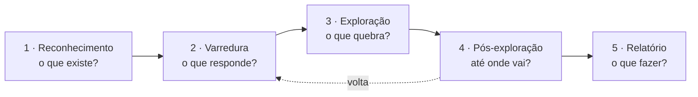

# 01 · O que é um Ethical Hacker — explicação para leigo total

`Nível: iniciante` · `Última atualização: 12/08/2026`

Este arquivo não pressupõe **nada**. Nem programação, nem redes, nem informática além de saber
usar um computador. Todo termo técnico é definido na primeira vez que aparece.

---

## 1. A analogia do arrombador contratado

Imagine um banco novo. Cofre importado, câmeras, alarme, guardas, portas blindadas.
O gerente acha que está seguro. Mas "achar" não é saber.

Então o banco contrata **um arrombador profissional**. Assina um contrato com ele dizendo:
*"Durante a semana que vem, você tem permissão para tentar entrar neste banco por qualquer
meio que não machuque ninguém e não destrua nada. No fim, você me entrega um relatório
dizendo exatamente como entrou."*

O arrombador passa três dias observando o prédio de fora. Descobre que a porta dos fundos fica
destrancada das 6h às 6h20, quando o pessoal da limpeza chega. Descobre que a senha do alarme
está escrita num post-it colado no monitor da recepção — dá para ler pela vidraça com um
binóculo. Descobre que o cofre é excelente, mas a parede ao lado dele é de drywall.

No sexto dia ele entra, tira uma foto de dentro do cofre, sai, e não leva nada.
No sétimo, entrega o relatório.

**Esse arrombador é o ethical hacker.** O banco é qualquer empresa. O cofre é o banco de dados
de clientes. A porta destrancada das 6h é um servidor esquecido sem atualização. O post-it é
uma senha padrão que ninguém trocou. A parede de drywall é o sistema secundário que ninguém
lembrou de proteger porque "ele não tem dado importante" — só que ele conversa com o que tem.

O nome técnico da profissão é **pentester** (de *penetration tester*, "testador de invasão").
"Ethical hacker" é o termo popular. "Analista de segurança ofensiva" é como aparece na vaga.

---

## 2. Por que uma empresa paga por isso

Três motivos, em ordem de honestidade decrescente:

**Motivo 1 — descobrir o problema antes do criminoso.**
Um vazamento de dados custa caro: multa, processo, clientes perdidos, sistema parado.
Pagar R$ 30 mil para alguém encontrar a falha é mais barato que pagar R$ 3 milhões depois que
ela foi usada.

**Motivo 2 — obrigação regulatória ou contratual.**
Bancos, operadoras de cartão, hospitais e empresas listadas em bolsa são **obrigados** a fazer
testes periódicos. A norma PCI DSS (regra do setor de cartões de crédito) exige teste de
invasão pelo menos uma vez por ano. A LGPD (Lei Geral de Proteção de Dados, Lei 13.709/2018)
exige "medidas de segurança adequadas" — e um relatório de pentest é a prova documental de que
a empresa tomou essas medidas. Uma boa parte do mercado existe por causa deste motivo, não do
primeiro.

**Motivo 3 — precisar de um documento para uma auditoria ou para ganhar um cliente.**
Grandes empresas exigem que seus fornecedores mostrem um relatório de pentest recente. Muitas
vezes o que se compra é o carimbo. Isto é uma verdade desconfortável do mercado e ninguém
gosta de falar dela em conferência — mas é onde uma parcela relevante do faturamento está.

> **Opinião profissional, não consenso:** o Motivo 3 é responsável por boa parte dos pentests
> ruins que existem. Quando o cliente quer o PDF e não a segurança, o incentivo do fornecedor
> é entregar o PDF barato. Saber distinguir um cliente do Motivo 1 de um do Motivo 3 muda a
> qualidade da sua vida profissional inteira.

---

## 3. O que essa pessoa faz num dia normal

Vamos matar o mito do filme. O trabalho real, num dia típico:

| Hora | O que acontece |
|---|---|
| 09h00 | Ler e-mail. Confirmar com o cliente que o teste de hoje pode continuar. |
| 09h30 | Rodar ferramentas que listam quais computadores e serviços existem no alvo. Esperar. |
| 10h30 | Ler a saída dessas ferramentas. Anotar 40 coisas. 38 não levam a lugar nenhum. |
| 12h00 | Almoço. |
| 13h00 | Investigar as 2 coisas promissoras. Ler documentação de um software obscuro de 2017. |
| 15h00 | Tentar 15 variações de um ataque. Todas falham. |
| 16h00 | A décima sexta funciona. Você entra. Tira print, anota o passo exato, **não avança sem pensar**. |
| 16h30 | Documentar. Escrever o passo a passo para o cliente conseguir reproduzir. |
| 18h00 | Escrever relatório. Isto vai tomar mais tempo do que a invasão tomou. |

Proporção real da profissão, na minha experiência e na de todo pentester honesto que conheço:

```
Leitura e pesquisa   ████████████████████████████████  40%
Documentação         ████████████████████             25%
Ferramenta rodando   ████████████                     15%
Reunião e e-mail     ████████                         10%
"Hackear" de fato    ████████                         10%
```

Se você quer a profissão pela adrenalina dos 10%, vai desistir nos 25% de documentação.
Quem fica é quem gosta dos 40% de leitura.

---

## 4. As cinco fases — a espinha dorsal de tudo

Todo teste de invasão, desde os anos 90, segue a mesma sequência. Os nomes mudam de
metodologia para metodologia, a lógica não muda:



**1 · Reconhecimento.** Descobrir o que o alvo tem, sem tocar nele. Quais sites, quais
domínios, quais funcionários, qual tecnologia usa, o que já vazou dele em algum lugar da
internet. É o arrombador observando o prédio de fora.

**2 · Varredura e enumeração.** Agora tocando: descobrir quais computadores estão ligados,
quais "portas" estão abertas, qual programa e qual versão está atrás de cada porta.
*Porta*, aqui, é um número que identifica um serviço num computador — a porta 443 é onde mora
o site seguro, a 22 é onde mora o acesso remoto de administração, e assim por diante.

**3 · Exploração.** Usar uma falha para conseguir fazer algo que você não deveria poder:
entrar sem senha, ler dados de outro usuário, executar um comando no servidor.

**4 · Pós-exploração.** Você entrou — e daí? Consegue virar administrador? Consegue alcançar
outros computadores a partir daí? Consegue chegar no dado que realmente importa? É aqui que
se mede o **impacto real**, e impacto é o que o cliente compra.

**5 · Relatório.** Escrever tudo de forma que o diretor entenda o risco e o programador saiba
o que corrigir. **Esta fase é o produto.** As quatro anteriores são o processo.

Cada fase tem um arquivo dedicado neste curso: [`14`](14-reconhecimento-e-osint.md),
[`15`](15-varredura-e-enumeracao.md), [`16`](16-vulnerabilidades-e-exploracao.md),
[`17`](17-pos-exploracao-e-movimentacao.md), [`24`](24-relatorio-e-comunicacao.md).

---

## 5. As cores dos chapéus — e por que a metáfora é ruim

Você vai ouvir isso em todo lugar, então precisa saber:

| Termo | Significado popular | O que é de verdade |
|---|---|---|
| **White hat** | "hacker do bem" | Alguém que age **com autorização documentada**. |
| **Black hat** | "hacker do mal" | Criminoso. Age sem autorização, para lucro ou dano. |
| **Grey hat** | "meio termo" | Age sem autorização mas alega boa intenção. **Isto é crime**, independentemente da intenção. |

A metáfora vem dos faroestes americanos, onde mocinho usava chapéu branco e bandido, preto.
Ela é ruim por dois motivos.

Primeiro: **a diferença não é moral, é jurídica e documental**. As mesmas mãos, as mesmas
ferramentas e os mesmos comandos. A única diferença entre o white hat e o black hat é um
contrato assinado com escopo definido. Não é "intenção boa" — é papel.

Segundo: o "grey hat" não existe legalmente. Se você escaneia o site de uma empresa sem
autorização e manda um e-mail educado avisando da falha, você cometeu um crime e depois
confessou por escrito. Já houve gente processada exatamente assim.
Leia [`12-etica-lei-e-contrato.md`](12-etica-lei-e-contrato.md) — é o arquivo mais importante
deste curso, e não é o mais técnico.

Termos relacionados que você vai encontrar:

- **Red team** — equipe que simula um adversário real, com objetivo ("chegar no banco de
  dados de folha de pagamento") e sem avisar a equipe de defesa. Mais longo e mais realista
  que um pentest.
- **Blue team** — a equipe de defesa. Monitora, detecta, responde.
- **Purple team** — red e blue trabalhando juntos e ao vivo, para o blue aprender a detectar
  enquanto o red ataca. Na minha opinião, é o formato com melhor retorno por real gasto para
  a maioria das empresas de médio porte.
- **Bug bounty** — programas em que empresas pagam por falha encontrada, para qualquer pessoa
  do mundo, com regras publicadas. É legalmente autorizado *dentro das regras publicadas*, e
  só ali.

---

## 6. Os cinco porquês: por que sistemas são inseguros?

Vamos aplicar a regra de não parar no primeiro nível de explicação.

**Por que 1 — Por que existem falhas de segurança?**
Porque software é escrito por humanos e humanos erram. Um sistema operacional moderno tem
dezenas de milhões de linhas de código. A taxa histórica é de aproximadamente 0,5 a 25 defeitos
por mil linhas de código, dependendo do processo. Uma fração pequena desses defeitos tem
consequência de segurança. Mas uma fração pequena de dezenas de milhões ainda é muita coisa.

**Por que 2 — Por que não se escreve software sem defeito?**
Porque verificar formalmente que um programa está correto é caríssimo. Existe software
formalmente verificado (o microkernel seL4, por exemplo) e ele funciona — mas custou anos-homem
de matemática para poucas dezenas de milhares de linhas. Fazer isso com o Windows inteiro é,
hoje, economicamente impossível.

**Por que 3 — Por que é economicamente impossível?**
Porque o mercado premia velocidade de entrega, não ausência de defeito. Uma empresa que leva
5 anos para lançar um produto perfeitamente seguro perde para a que lança em 6 meses um
produto razoável. Isto é um **trade-off econômico explícito**, não uma falha de caráter dos
programadores: o custo do defeito é externalizado — quem paga o vazamento é o usuário, não
quem escreveu o código. Enquanto essa externalidade existir, o incentivo permanece.

**Por que 4 — Por que essa externalidade não foi corrigida?**
Ela está sendo, devagar, por lei. A LGPD no Brasil, o GDPR na Europa e o *Cyber Resilience Act*
europeu (em vigor por etapas até dezembro de 2027) transferem parte do custo para o fabricante.
Foi exatamente isso que criou o mercado de segurança dos últimos 10 anos. Regulação é o motor
econômico da sua futura profissão — vale entender isso desde o primeiro dia.

**Por que 5 — E por que não basta corrigir todas as falhas conhecidas e acabar?**
Porque a superfície muda mais rápido do que se corrige. Toda semana a empresa sobe um serviço
novo, integra um fornecedor, atualiza uma biblioteca. E porque há um limite teórico duro:
**não existe programa capaz de decidir, para todo programa, se ele é seguro.** Isso decorre do
problema da parada, provado indecidível por Turing em 1936 — o teorema de Rice generaliza:
qualquer propriedade semântica não trivial de programas é indecidível. Não é limitação de
tecnologia; é limitação matemática. É por isso que a segurança é uma prática contínua e não um
projeto com data de término — e é por isso que sua profissão não vai acabar.
(Detalhe formal em [`60-teoria-avancada.md`](60-teoria-avancada.md).)

---

## 7. O que hacking ético **não** é

- **Não é o que aparece em filme.** Ninguém digita rápido em duas telas verdes e "entra no
  mainframe" em 30 segundos. O ataque de 30 segundos existe, mas veio de três semanas de
  reconhecimento antes.
- **Não é rodar uma ferramenta que acha tudo.** Existem *scanners* automáticos e eles são
  úteis. Mas eles encontram o que já é conhecido. Falha de lógica de negócio — "consigo
  comprar com desconto de 200%" — nenhum scanner acha. É por isso que a profissão existe.
- **Não é só web.** Web é a porta de entrada mais comum da carreira, mas há redes internas,
  Active Directory, nuvem, mobile, IoT, hardware, engenharia social.
- **Não exige ser gênio em matemática.** Exige teimosia, método e capacidade de ler
  documentação chata. Criptografia avançada é uma especialidade dentro do campo, não o campo.
- **Não é anônimo.** O pentester profissional trabalha com nome, CNPJ ou carteira assinada,
  nota fiscal, contrato e seguro de responsabilidade civil.

---

## 8. Existe carreira? Quanto se ganha?

Existe, e é uma das áreas de TI com mais demanda que oferta em 2026 — no Brasil e fora.
Números concretos, salários, custo de entrada e como o dinheiro entra estão em
[`80-custos-e-licencas.md`](80-custos-e-licencas.md), com data de consulta.

O resumo honesto: **é uma carreira boa, mas não é uma carreira de entrada.**
Quase ninguém vira pentester como primeiro emprego. O caminho normal passa por suporte,
infraestrutura, redes, desenvolvimento ou SOC (centro de operações de segurança) primeiro.
Isso não é burocracia — é que você não consegue quebrar bem o que nunca construiu ou operou.
O plano completo, mês a mês, está em
[`25-carreira-passo-a-passo.md`](25-carreira-passo-a-passo.md).

---

## 9. Qual é a próxima página?

1. Se você quer saber se tem o que é preciso → [`02-pre-requisitos.md`](02-pre-requisitos.md)
2. Se você quer o plano de carreira agora → [`25-carreira-passo-a-passo.md`](25-carreira-passo-a-passo.md)
3. Se você quer instalar o laboratório hoje → [`03-instalacao.md`](03-instalacao.md)
4. **Antes de tocar em qualquer alvo** → [`12-etica-lei-e-contrato.md`](12-etica-lei-e-contrato.md)

---

## Autoteste

1. Qual é a única diferença real entre um white hat e um black hat?
2. Cite os três motivos pelos quais uma empresa contrata um pentest, e diga qual deles produz
   os piores testes.
3. Quais são as cinco fases de um teste de invasão? Qual delas é o produto entregue?
4. Por que "grey hat" não é uma categoria válida no Brasil?
5. Segundo a distribuição de tempo real da profissão, qual atividade consome mais tempo:
   hackear ou ler?
6. Que limite matemático impede que exista uma ferramenta capaz de provar que um sistema
   qualquer é seguro?
7. Por que a regulação (LGPD, GDPR, CRA) é o motor econômico dessa profissão?
8. Explique com suas palavras por que um scanner automático não substitui um pentester.
