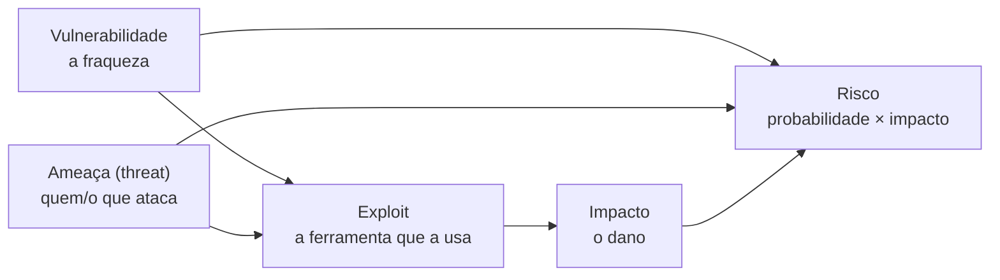

# 10 · Fundamentos — vocabulário e modelos mentais

`Nível: iniciante → intermediário` · `Última atualização: 12/08/2026`

Antes de qualquer técnica, o vocabulário. Este arquivo define os conceitos que aparecem em
todos os outros. Cada termo abstrato ganha exemplo concreto na sequência. Todos estão também
no [`GLOSSARIO.md`](GLOSSARIO.md).

---

## 1. A tríade CIA — o que "segurança" significa

Segurança da informação protege três propriedades. Toda vulnerabilidade quebra ao menos uma:

| Propriedade | Significado | Exemplo de quebra |
|---|---|---|
| **Confidencialidade** | só quem pode, vê | vazamento de banco de dados de clientes |
| **Integridade** | o dado não é alterado sem autorização | atacante muda o valor de uma transferência |
| **Disponibilidade** | o serviço está no ar quando preciso | ataque de negação de serviço derruba o site |

Alguns modelos acrescentam **autenticidade** (o dado veio de quem diz ter vindo) e
**não-repúdio** (o autor não pode negar o ato). Guarde a CIA; ela é o esqueleto de toda
avaliação de risco.

> **Aplicação prática:** ao achar uma falha, pergunte "qual letra da CIA ela quebra e quão
> gravemente?". Um IDOR quebra confidencialidade. Um `DROP TABLE` por SQLi quebra integridade
> e disponibilidade. Isso já orienta a severidade.

## 2. Vulnerabilidade, ameaça, exploit, risco — não são sinônimos

Este é o erro de vocabulário mais comum de quem começa. As quatro palavras são distintas:

- **Vulnerabilidade** — a fraqueza em si. Ex.: "o servidor roda uma versão com falha conhecida".
- **Ameaça (threat)** — o agente ou evento que pode explorar a fraqueza. Ex.: um grupo
  criminoso, um funcionário insatisfeito, um worm automatizado.
- **Exploit** — o código ou técnica que transforma a vulnerabilidade em ação. Ex.: o script
  que usa a falha para abrir um shell.
- **Risco** — a combinação: quão provável é a ameaça explorar a vulnerabilidade, e quão grave
  é o impacto. **Risco = probabilidade × impacto.** É o que o cliente realmente quer saber.

**Por que a distinção importa:** uma vulnerabilidade crítica num sistema sem valor e sem
exposição é risco baixo. Uma vulnerabilidade média num sistema exposto que guarda dado de
cartão é risco alto. Você não reporta vulnerabilidades; você reporta **riscos**.

## 3. CVE, CVSS, CWE, CPE — o alfabeto das falhas

O campo padronizou como se nomeia e mede falhas. Você vai ver estas siglas todo dia:

| Sigla | O que é | Exemplo |
|---|---|---|
| **CVE** | *Common Vulnerabilities and Exposures* — um **identificador único** de uma vulnerabilidade específica em um produto | `CVE-2021-44228` (Log4Shell) |
| **CWE** | *Common Weakness Enumeration* — a **classe** de fraqueza, abstrata | `CWE-89` (SQL Injection) |
| **CVSS** | *Common Vulnerability Scoring System* — a **nota** de 0 a 10 da severidade | `9.8` |
| **CPE** | *Common Platform Enumeration* — nome padronizado de um **produto/versão** | `cpe:/a:apache:log4j:2.14.1` |
| **KEV** | *Known Exploited Vulnerabilities* — catálogo da CISA de CVEs **sendo exploradas** na prática | prioriza correção |
| **EPSS** | *Exploit Prediction Scoring System* — probabilidade de uma CVE ser explorada nos próximos 30 dias | complementa o CVSS |

**Relação:** um **CWE** (a classe, ex. "injeção de SQL") se manifesta como um **CVE** (a
instância, ex. "SQLi no produto X versão Y"), que recebe um **CVSS** (a nota) e afeta um
**CPE** (o produto). A CVE pode entrar no **KEV** se estiver sendo explorada.

> **Opinião profissional:** CVSS é útil e insuficiente. Ele mede a falha isolada, não o seu
> contexto. Uma CVSS 9.8 num serviço interno atrás de três firewalls pode ser risco menor que
> uma CVSS 6.5 na borda. Use CVSS como ponto de partida, KEV e EPSS para priorizar, e seu
> julgamento para o risco final. Priorizar cegamente por CVSS é um erro comum de programa de
> gestão de vulnerabilidade.

## 4. 0-day, n-day, exploit público

- **0-day (zero-day):** vulnerabilidade que o fabricante ainda **não conhece** (ou não
  corrigiu). Não há patch. Zero dias de aviso. É o mais valioso e o mais raro.
- **n-day:** falha já conhecida e corrigida, mas presente em sistemas que **não atualizaram**.
  A esmagadora maioria dos ataques reais usa n-day, não 0-day — porque atualizar é difícil e
  lento nas organizações.
- **Exploit público / PoC:** código de demonstração publicado (Exploit-DB, GitHub, Metasploit).
  Quando um PoC vira público, a janela de risco de um n-day dispara.

> **Contraintuição útil:** iniciantes sonham com 0-days. Profissionais ganham a vida com
> n-days e configuração errada. O "hacking" real é, na maioria, encontrar o que já se sabe
> estar quebrado e ninguém consertou.

## 5. Superfície de ataque e vetor de ataque

- **Superfície de ataque:** a soma de todos os pontos por onde um atacante *poderia* entrar —
  cada porta aberta, cada campo de formulário, cada API, cada funcionário suscetível a
  phishing, cada dependência de software. **Reduzir a superfície** (desligar o que não se usa)
  é a defesa mais barata que existe.
- **Vetor de ataque:** o caminho específico usado num ataque concreto. Ex.: "o vetor foi um
  e-mail de phishing com anexo malicioso".

**Exemplo concreto:** um servidor com 30 portas abertas tem superfície maior que um com 2.
Se o ataque entrou pela porta 445 (SMB), esse foi o vetor. Diminuir superfície = fechar 28
portas; isso reduz o número de vetores possíveis sem você precisar adivinhar qual seria usado.

## 6. Autenticação × autorização — a confusão que gera metade dos bugs

- **Autenticação (authN):** "**quem** é você?" Provar identidade — senha, token, biometria.
- **Autorização (authZ):** "o que você **pode** fazer?" Depois de saber quem é, decidir a
  quais recursos tem direito.

**O bug clássico (IDOR, ver [`06`](06-exemplos.md) ex. 9):** o sistema autentica bem ("você é
o Bruno") mas não autoriza por objeto ("você pode ver a fatura da Ana?"). Autenticar sem
autorizar por recurso é a raiz da categoria nº 1 do OWASP Top 10:2025.

Termos vizinhos:
- **Accounting/Auditoria:** registrar o que foi feito (o terceiro "A" do modelo AAA).
- **MFA (autenticação multifator):** exigir dois ou mais fatores (algo que você sabe, tem, é).
- **SSO / OAuth / SAML / OIDC:** protocolos para delegar autenticação (login "com Google").

## 7. Modelos mentais que orientam o ataque

### 7.1 "Confie em nada que venha do cliente"
Tudo que chega ao servidor — parâmetro de URL, campo de formulário, cookie, cabeçalho, corpo
JSON — pode ter sido alterado pelo atacante. Validação feita **só** no navegador é decoração:
o atacante contorna o navegador. Toda validação de segurança acontece no **servidor**. Este
único princípio explica SQLi, XSS armazenado, IDOR, upload malicioso e mais.

### 7.2 "Defesa em profundidade"
Não confie numa só barreira. Firewall + autenticação + autorização + criptografia + monitoramento.
Cada camada assume que a anterior pode falhar. Do lado ofensivo, seu trabalho é encontrar o
ponto onde falta uma camada.

### 7.3 "Menor privilégio"
Cada usuário, processo e serviço deve ter o mínimo de permissão para sua função. O achado
"esse serviço roda como root sem precisar" é menor-privilégio violado — e é a diferença entre
um comprometimento contido e um total.

### 7.4 "A cadeia de ataque" (kill chain)
Ataque real quase nunca é um passo. É uma **cadeia**: recon → acesso inicial → escalada →
movimentação → objetivo. Quebrar **qualquer elo** derruba a cadeia. Isso orienta tanto o
ataque (procure o próximo elo) quanto o relatório (mostre a cadeia, priorize por elo). Ver o
Exemplo 14 de [`06`](06-exemplos.md) e o MITRE ATT&CK em [`13`](13-metodologias-e-frameworks.md).

## 8. Tipos de teste — a caixa e sua cor

| Modelo | O que o testador sabe | Simula | Custo/tempo |
|---|---|---|---|
| **Black box** | nada além do alvo | atacante externo sem informação | mais tempo em recon |
| **Grey box** | acesso parcial (uma conta, algum doc) | insider limitado / usuário comum | equilíbrio comum |
| **White box** | código-fonte, credenciais, arquitetura | revisão profunda, máxima cobertura | mais achados por hora |

**Opinião profissional:** white box quase sempre dá **mais segurança por real gasto** — sem o
tempo perdido em adivinhação, o testador cobre mais. Black box tem valor para medir "o que um
estranho consegue", mas empresas que só compram black box costumam estar comprando teatro, não
segurança. Grey box é o padrão pragmático.

## 9. Pentest × Red team × Vuln assessment × Bug bounty

| Atividade | Objetivo | Duração | Avisa a defesa? |
|---|---|---|---|
| **Vulnerability assessment** | listar o máximo de falhas (amplo, raso) | dias | sim |
| **Penetration test** | provar impacto explorando falhas (profundo, com escopo) | 1–3 semanas | geralmente sim |
| **Red team** | atingir um objetivo como um adversário real, testando também detecção | semanas a meses | **não** (o blue não sabe) |
| **Bug bounty** | falhas contínuas, pagas por resultado, por multidão | contínuo | via regras públicas |
| **Purple team** | red + blue juntos, para melhorar detecção ao vivo | dias | é o ponto |

A diferença entre *vuln assessment* e *pentest* cai numa pergunta: você **explora** as falhas
para provar impacto (pentest) ou só as **lista** (assessment)? Muita gente vende assessment
com scanner e chama de pentest. Saber a diferença protege seu cliente e sua reputação.

## 10. Os cinco porquês: por que "só um firewall" não basta?

**Por quê 1** — Por que não basta pôr um firewall e considerar-se seguro?
Porque o firewall controla *quais conexões* passam, mas não *o que* trafega dentro das
conexões permitidas. A porta 443 (HTTPS) precisa estar aberta para o site funcionar — e é por
ela que passam SQLi, XSS e a maioria dos ataques web.

**Por quê 2** — Por que o firewall não inspeciona o conteúdo?
Firewalls de camada 3/4 decidem por IP e porta. Existem firewalls de aplicação (WAF) que
inspecionam conteúdo — mas eles trabalham por assinatura/heurística e são contornáveis, porque
não entendem a **lógica de negócio** da aplicação.

**Por quê 3** — Por que não entendem a lógica de negócio?
Porque "comprar com desconto de 200%" é uma requisição perfeitamente válida em HTTP; só é
errada no *significado* do negócio, que o WAF não conhece. Nenhuma ferramenta genérica conhece
as regras específicas da sua aplicação.

**Por quê 4** — Por que não se ensina a regra de negócio ao WAF?
Porque as regras mudam a cada release e são incontáveis. Codificá-las todas no WAF seria
reescrever a aplicação no WAF. É economicamente e praticamente inviável.

**Por quê 5** — Então o que resolve?
Nada resolve *sozinho*. Por isso **defesa em profundidade**: cada camada cobre o que a outra
não vê, e a validação da lógica de negócio vive **dentro da aplicação**, no servidor, feita
por quem conhece as regras. Não há bala de prata — há camadas. Este é o fato fundamental que
faz a profissão existir: se houvesse uma barreira única e suficiente, não haveria o que testar.

---

## Autoteste

1. Quais são as três propriedades da tríade CIA? Dê um exemplo de falha que quebra cada uma.
2. Diferencie vulnerabilidade, ameaça, exploit e risco. Qual deles o cliente realmente quer
   saber?
3. Qual a relação entre CWE, CVE, CVSS e CPE?
4. Por que profissionais ganham mais dinheiro com n-days do que com 0-days?
5. Explique a diferença entre autenticação e autorização com o exemplo do IDOR.
6. O que significa "não confie em nada que venha do cliente", e quais falhas esse princípio
   explica?
7. Qual a diferença central entre um *vulnerability assessment* e um *pentest*?
8. Por que um firewall, sozinho, não torna um sistema seguro? Leve o "porquê" até o fim.
9. Quando um red team é preferível a um pentest, e por que ele não avisa o blue team?
