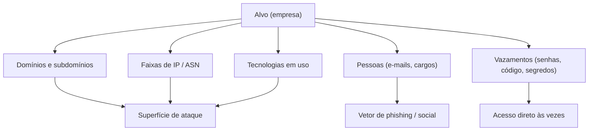

# 14 · Reconhecimento e OSINT

`Nível: intermediário` · `Última atualização: 12/08/2026`

Recon é a fase que iniciantes pulam e profissionais amam. O acesso que parece "sorte" quase
sempre veio de três dias de reconhecimento paciente. Este arquivo cobre passivo, ativo e OSINT.

> ⚖️ Recon **ativo** toca o alvo e exige autorização. Recon **passivo** (consultar fontes de
> terceiros) é mais seguro, mas nem tudo é anônimo. Ver [`12`](12-etica-lei-e-contrato.md).

---

## 1. Passivo × ativo — a distinção que importa

- **Reconhecimento passivo:** coletar informação **sem tocar no alvo**, usando fontes de
  terceiros (buscadores, registros públicos, Shodan, certificados). O alvo não vê você.
- **Reconhecimento ativo:** interagir diretamente com o alvo (varredura de porta, requisições
  HTTP, consultas DNS ao servidor do alvo). O alvo pode registrar você.

**Por que começar pelo passivo:** você monta o mapa antes de fazer barulho. Muitas vezes o
passivo já revela o caminho, e você chega no ativo sabendo onde olhar — menos ruído, mais
eficiência.

## 2. O que você está procurando



## 3. Descoberta de domínios e subdomínios

Cada subdomínio é uma porta potencial. `admin.empresa.com`, `dev.empresa.com`,
`vpn.empresa.com`, `old.empresa.com` — os esquecidos são os mais vulneráveis.

**Passivo (sem tocar no alvo):**
```bash
subfinder -d empresa.com -all -silent          # agrega dezenas de fontes passivas
amass enum -passive -d empresa.com
```
- **Certificate Transparency** ([crt.sh](https://crt.sh)): todo certificado TLS emitido é
  registrado publicamente. Buscar `%.empresa.com` revela subdomínios que a empresa nem sabia
  estar expostos. Fonte poderosa e subutilizada.
- **DNS histórico / passivo:** SecurityTrails, DNSdumpster.

**Ativo (toca o DNS do alvo):**
```bash
# Força bruta de subdomínio por resolução DNS
dnsx -d empresa.com -w /usr/share/seclists/Discovery/DNS/subdomains-top1million-5000.txt -silent
ffuf -w LISTA -u https://empresa.com -H "Host: FUZZ.empresa.com" -fs 0   # vhosts
```

## 4. Faixas de IP, ASN e infraestrutura

```bash
whois empresa.com                  # registrante, servidores de nome, datas
whois -h whois.radb.net '!gAS_NUMERO'   # prefixos de um ASN
```
- **ASN (Autonomous System Number):** identifica os blocos de IP de uma organização grande.
  Descobrir o ASN revela **todas** as faixas de IP dela — enorme expansão de superfície.
- **BGP.he.net** (Hurricane Electric): explorar ASN, prefixos, vizinhos.
- **Shodan/Censys:** buscam o que já está exposto e indexado, **sem tocar no alvo**.
  ```
  shodan search 'org:"Empresa S.A." port:3389'      # RDP exposto?
  shodan search 'ssl.cert.subject.cn:empresa.com'
  ```

## 5. Tecnologias em uso (fingerprinting passivo)

Saber o que roda direciona o ataque:
```bash
whatweb -a3 https://empresa.com     # CMS, framework, servidor, versões
```
- **Wappalyzer / BuiltWith:** stack de tecnologia por site.
- **Cabeçalhos HTTP:** `Server`, `X-Powered-By`, cookies (`PHPSESSID`, `JSESSIONID`) entregam
  a plataforma.
- **Favicon hash:** o hash do favicon identifica produtos (útil no Shodan: `http.favicon.hash:`).

## 6. OSINT sobre pessoas — o elo humano

Para phishing autorizado e para adivinhar padrões de usuário/senha:

```bash
theHarvester -d empresa.com -b all   # e-mails, nomes, subdomínios de várias fontes
```
- **Padrão de e-mail:** descobrir se é `nome.sobrenome@`, `inicial+sobrenome@`, etc. Um e-mail
  conhecido revela o padrão → você gera a lista de todos os funcionários do LinkedIn.
- **LinkedIn:** cargos, tecnologias ("procuro dev Java Spring" numa vaga entrega o stack),
  organograma. Ferramentas como `linkedin2username` geram listas de usuário.
- **Redes sociais / GitHub pessoal:** funcionários vazam informação sem perceber.
- **Metadados de documentos:** PDFs e DOCs públicos carregam autor, software, às vezes caminhos
  internos e nomes de usuário (`exiftool`, FOCA).

## 7. Vazamentos — às vezes o acesso está de graça

- **Credenciais vazadas:** bases de vazamentos passados (Have I Been Pwned para verificar
  exposição; em pentest autorizado, bases como DeHashed). Senha reutilizada + sem MFA = acesso
  direto, sem "hackear" nada.
- **Segredos em código público (GitHub):** chaves de API, senhas, tokens commitados por
  engano. Ferramentas: `trufflehog`, `gitleaks`, `github-dorks`.
  ```bash
  trufflehog github --org=empresa --only-verified
  ```
- **Buckets S3 / storage aberto:** `empresa-backup`, `empresa-dev` públicos. Ver [`21`](21-nuvem-e-containers.md).
- **Google dorks** — busca avançada:
  ```
  site:empresa.com filetype:pdf
  site:empresa.com inurl:admin
  site:empresa.com intext:"senha" | intext:"password"
  "empresa.com" site:pastebin.com
  intitle:"index of" site:empresa.com     # listagem de diretório exposta
  ```

## 8. Organizando o achado — o mapa vira alvo

Recon sem organização é ruído. Estruture desde o começo:
- Uma planilha/nota com: subdomínios → IP → portas → tecnologia → observação.
- Ferramentas de fluxo: `subfinder | httpx | nuclei` encadeados dão de subdomínio a
  vulnerabilidade num pipeline.
- **Priorize:** o subdomínio "esquecido" (`old`, `dev`, `test`, `staging`, `backup`) e o que
  destoa do padrão. É onde as regras de segurança atuais não chegaram.

## 9. Recon como fase contínua

Recon não termina na fase 1. Cada acesso revela nova informação (nova rede interna, novas
credenciais, novos hosts) que reinicia o ciclo num nível mais profundo. Em AD, por exemplo, a
primeira credencial abre a enumeração do domínio inteiro. Ver [`20`](20-active-directory.md).

## 10. Os cinco porquês: por que recon paga tanto?

**Por quê 1** — Por que investir dias em recon em vez de já atacar?
Porque você não pode explorar o que não sabe existir. O ativo vulnerável costuma ser o que
ninguém mapeou — o subdomínio esquecido, não o site principal endurecido.

**Por quê 2** — Por que existem ativos que ninguém mapeou dentro da própria empresa?
Porque organizações crescem por acreção: fusões, projetos abandonados, "sobe rápido que é só
um teste". Ninguém tem o inventário completo da própria superfície — nem a empresa.

**Por quê 3** — Por que não têm o inventário?
Porque manter inventário é custo sem retorno visível até o dia do incidente. O incentivo é
entregar o novo, não catalogar o velho. Dívida de inventário é a regra, não a exceção.

**Por quê 4** — Por que isso não muda com ferramenta de descoberta de ativos?
Muda em parte — CAASM e ASM (Attack Surface Management) existem justamente para isso. Mas eles
também só veem o que conseguem correlacionar; o shadow IT e o ativo de terceiro escapam.

**Por quê 5** — Qual é a parada?
Um **trade-off econômico permanente**: mapear tudo, sempre, custa mais do que o risco percebido
até o incidente. Enquanto for assim, sempre haverá superfície não mapeada — e é por isso que
recon bem feito continuará sendo o diferencial do bom pentester. Sua vantagem é fazer o
inventário que o alvo não fez.

---

## Autoteste

1. Diferencie recon passivo de ativo e diga por que começar pelo passivo.
2. Por que Certificate Transparency (crt.sh) é uma fonte tão valiosa de subdomínios?
3. O que é um ASN e por que descobri-lo expande tanto a superfície de ataque?
4. Como um único e-mail conhecido pode virar a lista de todos os funcionários?
5. Cite duas formas pelas quais "o acesso está de graça" já no recon (sem exploração).
6. Escreva um Google dork para achar PDFs no domínio `empresa.com`.
7. Por que subdomínios como `dev`, `old` e `staging` são prioridade?
8. Por que sempre haverá superfície não mapeada numa organização? Leve o porquê até o fim.
