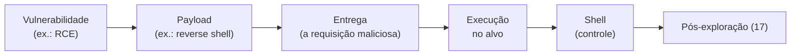

# 16 · Vulnerabilidades e exploração — do bug ao shell

`Nível: avançado` · `Última atualização: 12/08/2026`

Este arquivo abre a caixa-preta do "exploit". O que é uma vulnerabilidade por dentro, quais
são as grandes classes, e — o ponto alto — como um buffer overflow de pilha funciona, passo a
passo, no nível da memória. É o arquivo mais técnico do núcleo.

---

## 1. O que é uma vulnerabilidade, mecanicamente

Uma vulnerabilidade é um ponto onde o programa aceita uma entrada que **viola uma suposição do
programador**. Três ingredientes num exploit:

1. **Fonte (source):** onde a entrada do atacante entra (parâmetro, arquivo, pacote).
2. **Fluxo:** o caminho que essa entrada percorre sem ser devidamente validada/saneada.
3. **Sink:** o ponto perigoso onde ela causa efeito (uma query SQL, um `exec`, um `memcpy`,
   o HTML da página).

Achar bug é achar um **source** que chega a um **sink** perigoso sem saneamento no meio. Toda
a análise (manual ou com ferramenta de *taint analysis*) gira em torno disso.

## 2. As grandes classes de vulnerabilidade

| Classe | Onde | Efeito | Arquivo |
|---|---|---|---|
| **Injeção** (SQL, comando, LDAP, etc.) | entrada vira parte de uma linguagem interpretada | executar comando/consulta arbitrária | [`18`](18-seguranca-web.md) |
| **Broken Access Control** (IDOR, path traversal) | falta checagem de autorização | acessar dado/função alheia | [`18`](18-seguranca-web.md) |
| **XSS** | entrada vira HTML/JS no navegador de outro | executar script no contexto da vítima | [`18`](18-seguranca-web.md) |
| **Deserialização insegura** | objeto serializado controlado pelo atacante | RCE | §5 |
| **Corrupção de memória** (overflow, UAF) | linguagens sem segurança de memória (C/C++) | RCE, escalada | §6–8 |
| **Erros de lógica** | a regra de negócio está errada | fraude, bypass | scanner não acha |
| **Configuração incorreta** | padrão inseguro, permissão larga | acesso direto | [`10`](10-fundamentos.md) |
| **Segredos expostos** | credencial no código/log | acesso direto | [`14`](14-reconhecimento-e-osint.md) |

## 3. De vulnerabilidade a exploit a shell

A cadeia típica de exploração remota:



- **Payload:** o que você quer que rode após explorar. Reverse shell, bind shell,
  meterpreter, um único comando. Gerado com `msfvenom` (ver [`05`](05-manual-de-uso.md) §8).
- **Shell:** acesso a linha de comando no alvo. *Reverse* (alvo conecta em você) fura firewall
  de entrada; *bind* (você conecta no alvo) precisa de porta acessível. Estabilização de TTY
  em [`05`](05-manual-de-uso.md) §8.

## 4. Injeção de comando — o exemplo mais direto

Quando a aplicação passa entrada do usuário para o shell do sistema:
```php
// vulnerável: concatena entrada num comando do SO
system("ping -c 1 " . $_GET['host']);
```
Entrada `host=8.8.8.8; id` executa `ping -c 1 8.8.8.8; id` — o `;` encadeia seu comando.
Variações: `|`, `&&`, `$(...)`, backticks. **Causa-raiz:** entrada não confiável vira parte de
um comando interpretado (o mesmo pecado do SQLi). **Defesa:** não chamar o shell; usar APIs que
recebem argumentos como lista (`execve` com array), com allowlist.

## 5. Deserialização insegura

Objetos serializados (Java, PHP, .NET, Python pickle) que o atacante controla podem, ao serem
**desserializados**, disparar código. Em Java, "gadget chains" (ysoserial) transformam um blob
malicioso em RCE. Foi a raiz de falhas gravíssimas (várias no Struts, e a categoria é parente
do Log4Shell). **Defesa:** não desserializar dado não confiável; usar formatos de dados
(JSON) sem lógica de reconstrução de objeto; assinar/validar.

## 6. Corrupção de memória — por que C é perigoso

Linguagens como **C e C++ não verificam limites de arrays** nem gerenciam memória
automaticamente. O programador é responsável, e erra. Linguagens *memory-safe* (Rust, Go, Java,
Python) eliminam a maioria dessas classes por construção — daí o movimento de reescrita atual
(ver [`65`](65-estado-da-arte.md)).

**A estrutura da pilha (stack):** quando uma função é chamada, o processador empilha um *stack
frame* com as variáveis locais e, crucialmente, o **endereço de retorno** — para onde a CPU
volta quando a função termina.

```
       endereços altos
   +----------------------+
   |  ... chamador ...     |
   +----------------------+
   |  endereço de retorno  |  ← se você sobrescrever isto, controla o fluxo
   +----------------------+
   |  saved base pointer   |
   +----------------------+
   |  buffer[64]           |  ← sua entrada vai aqui, e cresce PARA CIMA
   +----------------------+
       endereços baixos
```

## 7. Buffer overflow de pilha — passo a passo

Considere:
```c
void vulneravel(char *entrada) {
    char buffer[64];
    strcpy(buffer, entrada);   // strcpy NÃO checa tamanho — o bug
}
```
`strcpy` copia até encontrar um byte nulo, sem se importar que `buffer` só tem 64 bytes. Se
`entrada` tiver 100 bytes, os 36 excedentes **transbordam** para o que está acima na pilha —
incluindo o endereço de retorno.

**A exploração clássica (sem mitigações), conceitualmente:**

1. **Descobrir o offset.** Enviar um padrão cíclico (`pattern_create`) e ver, no depurador
   (`gdb`), com qual trecho o endereço de retorno foi sobrescrito. Isso diz exatamente quantos
   bytes até o endereço de retorno (ex.: 76).
2. **Controlar o retorno.** Com 76 bytes de lixo + 4/8 bytes escolhidos, você define para onde
   a CPU "retorna". Você sequestrou o fluxo de execução.
3. **Apontar para o shellcode.** Colocar na entrada um *shellcode* (código de máquina que abre
   um shell) e fazer o endereço de retorno apontar para ele. Um `NOP sled` (`\x90...`) dá
   folga de mira.
4. **Executar.** A função "retorna" para o seu shellcode → shell.

```
[ NOP sled \x90\x90... ][ shellcode ][ preenchimento ][ endereço → NOP sled ]
```

**Laboratório para praticar isto de verdade:** protostar, `exploit.education`, e o clássico
tema do OSCP. Você faz no gdb/pwndbg com `pwntools`. É um rito de passagem — entender overflow
muda como você vê software para sempre.

## 8. Por que isso quase não funciona mais — as mitigações

Sistemas modernos têm defesas em camadas. Cada uma quebra um passo acima:

| Mitigação | O que faz | Quebra qual passo |
|---|---|---|
| **Stack canary** | valor secreto antes do endereço de retorno; se mudou, aborta | detecta o overflow (passo 2) |
| **NX / DEP** | marca a pilha como não-executável | shellcode na pilha não roda (passo 3) |
| **ASLR** | randomiza endereços a cada execução | você não sabe para onde apontar (passo 2–3) |
| **PIE** | randomiza também o próprio binário | idem, mais forte |
| **RELRO** | protege a GOT contra sobrescrita | ataques à tabela de funções |
| **CFI** | verifica que saltos vão a alvos legítimos | sequestro de fluxo em geral |

A resposta ofensiva evoluiu: **ROP (Return-Oriented Programming)** contorna o NX reutilizando
pedaços de código já existente ("gadgets") em vez de injetar shellcode; vazamentos de memória
(*info leak*) contornam ASLR revelando um endereço. Exploração moderna é uma corrida entre
essas mitigações e técnicas de contorno — ver [`60`](60-teoria-avancada.md).

**Consequência prática:** exploração de binário do zero contra alvo moderno é uma
especialidade difícil (pesquisa de vulnerabilidade, escrita de exploit, VR/ED). A maioria dos
pentests **não** faz isso — usa exploits prontos para n-days e foca em web/AD/config. Saber
como funciona te dá profundidade; não é o trabalho diário da maioria.

## 9. Onde achar e como usar exploits prontos

```bash
searchsploit <produto> <versão>         # base offline do Exploit-DB (vem no Kali)
searchsploit -m 49757                    # copia o exploit para a pasta atual
```
- **Exploit-DB, GitHub, Metasploit** são as fontes.
- **REGRA:** **leia o código antes de rodar.** Exploits públicos podem estar quebrados, mal
  escritos, ou conter *backdoor* (sim, gente planta backdoor em "exploit" para pegar
  script kiddies). Rodar exploit alheio às cegas contra seu alvo — ou contra você mesmo — é
  erro clássico e perigoso.
- Adapte: IP, porta, offset, caminho. Exploit raramente funciona colado sem ajuste.

## 10. Os cinco porquês: por que ainda existem overflows em 2026?

**Por quê 1** — Por que ainda há corrupção de memória se as defesas são tão boas?
Porque bilhões de linhas de C/C++ legado ainda rodam (kernels, navegadores, drivers,
firmware), e mitigações reduzem exploração, não eliminam o bug.

**Por quê 2** — Por que não reescrever tudo em linguagem memory-safe?
Custa fortunas e anos. Reescrever um kernel ou um navegador inteiro é projeto de década. É um
**trade-off econômico**: o custo de reescrever compete com o custo (externalizado) das falhas.

**Por quê 3** — Por que o custo das falhas não força a reescrita?
Porque, historicamente, quem paga o overflow não é quem escreveu o C — é o usuário. A
externalidade de novo (ver [`01`](01-introducao-leigo.md) §6). Isso está mudando com regulação
e com Rust ganhando adoção em áreas críticas.

**Por quê 4** — Por que Rust não resolveu ainda?
Adoção leva tempo; há inércia de ecossistema, curva de aprendizado, e interoperar Rust com C
legado reintroduz risco na fronteira. Já reduz muito o novo código vulnerável, mas o legado
fica.

**Por quê 5** — Qual é a parada?
Uma **decisão econômica de longo prazo em transição**: memory safety por construção é a direção
(Android, Windows, kernel Linux já têm Rust; agências recomendam em 2024–2026), mas o legado C
sobrevive enquanto reescrevê-lo custar mais do que o risco aceito. Overflows vão minguar, não
sumir de repente — pela mesma lógica de custo que os manteve vivos.

---

## Autoteste

1. Quais são os três ingredientes de um exploit (source, fluxo, sink)? Dê um exemplo.
2. Diferencie payload e shell. Por que reverse shell é preferível a bind na maioria dos casos?
3. Na injeção de comando, qual é a causa-raiz e qual a defesa correta?
4. Desenhe o stack frame e diga qual campo o overflow visa sobrescrever e por quê.
5. Liste os quatro passos da exploração clássica de um buffer overflow.
6. Para cada mitigação (canary, NX, ASLR), diga qual passo do overflow ela quebra.
7. O que é ROP e qual mitigação ele contorna?
8. Por que você deve **ler** um exploit público antes de executá-lo?
9. Por que ainda existem overflows em 2026, apesar de linguagens memory-safe? Leve o porquê até o fim.
