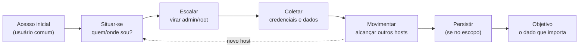

# 17 · Pós-exploração e movimentação lateral

`Nível: avançado` · `Última atualização: 12/08/2026`

Você entrou. E agora? A pós-exploração é onde se mede o **impacto real** — e impacto é o que o
cliente compra. Este arquivo cobre escalada de privilégio, persistência, coleta de credenciais,
pivoting e movimentação lateral.

> ⚖️ Tudo aqui só dentro do escopo autorizado. "Até onde eu conseguiria ir" se demonstra com o
> mínimo necessário para provar; não se destrói, não se exfiltra dado real. Ver [`12`](12-etica-lei-e-contrato.md).

---

## 1. Os objetivos da pós-exploração

Depois do acesso inicial (geralmente como usuário sem privilégio), você quer:



Cada acesso reinicia o ciclo num nível mais fundo. É por isso que a fase de recon "volta" (ver
[`14`](14-reconhecimento-e-osint.md) §9).

## 2. Situar-se — a enumeração local

Antes de agir, entenda onde você está:
```bash
whoami; id; hostname            # quem e onde
uname -a; cat /etc/os-release   # qual sistema (Linux)
ip a; ip route; cat /etc/hosts  # que redes eu alcanço? caminho para pivotar
ps aux; netstat -tulpn          # o que roda; serviços internos não expostos fora
sudo -l                         # o que posso rodar como root (achado nº 1)
env; history                    # variáveis e histórico às vezes têm segredo
```
No Windows: `whoami /all`, `systeminfo`, `ipconfig /all`, `net user`, `net localgroup administrators`.

## 3. Escalada de privilégio — de usuário a administrador

**A ideia:** achar algo mal configurado que o sistema executa com mais privilégio do que você
tem, e abusar. Ferramentas que automatizam a busca:
```bash
./linpeas.sh          # Linux — destaca caminhos de escalada em cores
.\winPEASx64.exe      # Windows
```

### Caminhos comuns no Linux
| Vetor | Como achar | Como abusar |
|---|---|---|
| **sudo mal configurado** | `sudo -l` | GTFOBins do binário permitido (ver [`06`](06-exemplos.md) ex. 7) |
| **Binário SUID** | `find / -perm -4000 -type f 2>/dev/null` | GTFOBins seção SUID (ex. 8) |
| **Capabilities** | `getcap -r / 2>/dev/null` | ex.: `cap_setuid` em python |
| **Cron rodando como root** com script editável | `cat /etc/crontab`, `ls -la /scripts` | editar o script |
| **Kernel vulnerável** | `uname -r` + searchsploit | exploit de kernel (arriscado, pode travar) |
| **Senha em arquivo** | grep por "password" em configs, history | reusar |
| **Grupo docker/lxd** | `id` | montar `/` num container → root (ver [`21`](21-nuvem-e-containers.md)) |

### Caminhos comuns no Windows
- **Serviços com permissão fraca** (unquoted service path, binário substituível).
- **AlwaysInstallElevated**, tarefas agendadas, tokens.
- **Credenciais** em registro, arquivos de resposta (`unattend.xml`), GPP.
- **Abuso de privilégios de token** (`SeImpersonatePrivilege` → Potato attacks).

**GTFOBins** ([gtfobins.github.io](https://gtfobins.github.io)) e **LOLBAS**
([lolbas-project.github.io](https://lolbas-project.github.io)) são as consultas obrigatórias —
dado um binário, mostram como abusá-lo.

## 4. Coleta de credenciais

Credencial é a moeda da movimentação. Onde procurar:
- **Linux:** `/etc/shadow` (hashes), chaves SSH (`~/.ssh/id_rsa`), configs de app com senha,
  `history`, variáveis de ambiente, arquivos de backup.
- **Windows:** SAM local, memória do LSASS (mimikatz — hashes, tickets, às vezes senha em
  texto), credential manager, DPAPI, arquivos de configuração.
- **Rede:** capturas de tráfego, sessões abertas.

No Windows/AD, `secretsdump.py` (impacket) e mimikatz são as ferramentas centrais. Ver [`20`](20-active-directory.md).

## 5. Movimentação lateral (lateral movement)

Com credencial em mãos, alcançar **outros** hosts:
- **Reutilização de credencial:** a mesma senha/hash funciona em várias máquinas (imagem
  corporativa clonada). `netexec smb REDE/24 -u user -H HASH` mostra onde. Ver
  pass-the-hash em [`06`](06-exemplos.md) ex. 12.
- **Execução remota:** `psexec.py`, `wmiexec.py`, `evil-winrm`, PowerShell Remoting.
- **Pass-the-ticket, overpass-the-hash:** técnicas Kerberos ([`20`](20-active-directory.md)).

## 6. Pivoting — usar um host comprometido como trampolim

O host que você comprometeu costuma alcançar redes internas que **você** não alcança
diretamente. Pivoting é rotear seu tráfego através dele:

```bash
# Túnel SOCKS através de uma sessão SSH (o clássico)
ssh -D 1080 usuario@host_comprometido       # abre proxy SOCKS local na 1080
# depois, use proxychains para mandar ferramentas pela rede interna:
proxychains nmap -sT 10.10.10.0/24
```
- **Chisel** e **ligolo-ng** são os padrões atuais para túnel quando não há SSH — mais
  flexíveis, funcionam em Windows.
- **Meterpreter:** `run autoroute -s 10.10.10.0/24` + `socks_proxy`.

```
Você  →  [host DMZ comprometido]  →  rede interna 10.10.10.0/24 (invisível de fora)
         o host vê as duas redes; você "empresta" a visão dele
```

Pivoting é o que transforma "comprometi um servidor web" em "comprometi a rede corporativa
inteira". É o coração do Exemplo 14 de [`06`](06-exemplos.md).

## 7. Persistência — voltar sem repetir o ataque

Em red team (não em pentest curto), você quer manter acesso mesmo se a máquina reiniciar:
- **Linux:** chave SSH adicionada, cron/systemd, usuário novo, backdoor em serviço.
- **Windows:** tarefa agendada, chave Run, serviço, WMI, conta.
- **AD:** golden/silver ticket, DCSync, conta com direitos ocultos.

> ⚖️ Persistência **modifica** o sistema. Em pentest, só faça se explicitamente no escopo, e
> **documente e reverta tudo** ao final. Deixar backdoor esquecido num cliente é falha grave
> — cria a vulnerabilidade que você deveria estar prevenindo.

## 8. Limpeza e higiene do teste

Ao terminar, você é responsável por não deixar o cliente pior:
- Remover ferramentas subidas, shells, contas criadas, tarefas de persistência.
- Registrar o que foi alterado (para o relatório e para a reversão).
- Restaurar configurações mexidas.
- Entregar e destruir cópias de dados sensíveis coletados.

## 9. Detecção — o outro lado

Cada ação sua deixa rastro: logon anômalo, processo estranho, tráfego de C2, uso de ferramenta
conhecida. Em red team, parte da avaliação é justamente **se o blue detecta**. Mapear suas
técnicas ao MITRE ATT&CK ([`13`](13-metodologias-e-frameworks.md)) permite ao cliente medir
cobertura de detecção. Um bom pentester pensa "isto gera qual alerta?" — porque o relatório
que diz "consegui e vocês não viram" vale mais que "consegui".

## 10. Os cinco porquês: por que a escalada de privilégio quase sempre existe?

**Por quê 1** — Por que quase todo host comprometido acaba escalando para root/admin?
Porque sistemas reais acumulam configuração excessivamente permissiva: um sudo largo, um SUID
esquecido, uma senha num arquivo.

**Por quê 2** — Por que acumulam permissão em excesso?
Porque permissão a mais "faz funcionar" e permissão de menos "quebra" — sob pressão de prazo,
o administrador afrouxa até funcionar e não volta a apertar.

**Por quê 3** — Por que não voltam a apertar?
Porque apertar tem custo (testar, arriscar quebrar) e benefício invisível (nada acontece de
diferente até o incidente). O incentivo é deixar como está.

**Por quê 4** — Por que ferramentas de hardening não resolvem?
Ajudam (CIS Benchmarks, least-privilege por padrão), mas colidem com a realidade operacional:
cada exceção "temporária" vira permanente, e ninguém audita o acúmulo.

**Por quê 5** — Qual é a parada?
Um **trade-off organizacional permanente** entre agilidade e menor privilégio. Enquanto afrouxar
for mais barato e imediato que endurecer, a dívida de privilégio se acumula — e a escalada
existe. É por isso que "menor privilégio" é o controle mais recomendado e o menos praticado,
e por que sua fase de escalada quase nunca sai vazia.

---

## Autoteste

1. Quais são os objetivos, em ordem, da pós-exploração?
2. Qual comando você roda **primeiro** para escalada no Linux, e por quê?
3. Diferencie escalada de privilégio de movimentação lateral.
4. O que é pivoting e como um proxy SOCKS via SSH o realiza?
5. Por que persistência exige cuidado ético e documental especial num pentest?
6. Onde se procura credencial num host Windows comprometido?
7. Por que o relatório "consegui e vocês não detectaram" vale mais que "consegui"?
8. Por que a escalada de privilégio quase sempre encontra um caminho? Leve o porquê até o fim.
