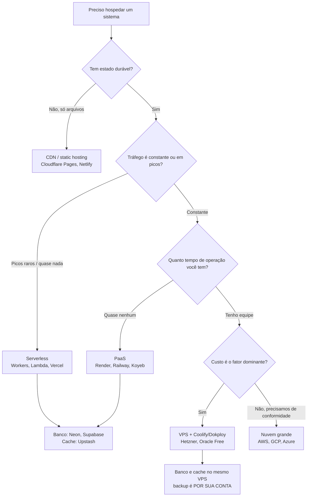

# 10 · Fundamentos — o vocabulário e os modelos mentais

`Nível: iniciante a intermediário` · `Atualizado em 18/08/2026`

Este capítulo estabelece o vocabulário que todos os outros usam. Nenhum termo aparece aqui
sem ser definido.

---

## 1. O que é, fisicamente, "hospedar"

Reduzido ao osso, hospedar é manter **um processo** rodando **numa máquina** com **um endereço
IP alcançável**, **escutando numa porta**, com **algum armazenamento** que sobrevive a
reinícios.

```
                       INTERNET
                          │
                    (endereço IP)
                          │
              ┌───────────▼────────────┐
              │   máquina (física ou   │
              │   virtual)             │
              │   ┌──────────────────┐ │
              │   │ processo         │ │ ← seu código, rodando
              │   │  escuta :3000    │ │
              │   └────────┬─────────┘ │
              │            │           │
              │   ┌────────▼─────────┐ │
              │   │ armazenamento    │ │ ← sobrevive ao reinício
              │   └──────────────────┘ │
              └────────────────────────┘
```

Tudo que a indústria vende — PaaS, serverless, edge, Kubernetes — é uma forma diferente de
**quem cuida de qual parte desse desenho**. Nada mais.

**Cinco porquês sobre "por que preciso de uma máquina de outra pessoa":**

1. Porque preciso de endereço IP público estável → 2. porque meu provedor residencial dá IP
dinâmico e frequentemente me põe atrás de CGNAT (veja [`portas-de-rede`](../portas-de-rede/00-MAPA.md))
→ 3. porque IPv4 acabou: a IANA distribuiu o último bloco `/8` em **3 de fevereiro de 2011**
→ 4. porque o espaço de 32 bits do IPv4 comporta ~4,3 bilhões de endereços, decisão tomada em
1981 na RFC 791, quando ninguém imaginava a internet doméstica → 5. **parada legítima: uma
decisão histórica documentada com consequência matemática irreversível.** O IPv6 resolve, mas
a adoção é parcial e leva décadas.

---

## 2. As camadas de responsabilidade

O eixo que organiza o mercado inteiro é: **quanto você cuida versus quanto eles cuidam**.

```
       VOCÊ CUIDA                          ELES CUIDAM
  ┌───────────────────────────────────────────────────────┐
  │ ████████████████████████████████████████ │            │  máquina própria (on-premises)
  │ ██████████████████████████████ │                      │  IaaS (EC2, Hetzner, DigitalOcean)
  │ ████████████████████ │                                │  CaaS (Cloud Run, ECS, Fly)
  │ ██████████ │                                          │  PaaS (Render, Railway, Heroku)
  │ █████ │                                               │  FaaS (Lambda, Workers, Vercel)
  │ ██ │                                                  │  BaaS (Supabase, Firebase)
  └───────────────────────────────────────────────────────┘
```

| Sigla | Nome | Você entrega | Eles cuidam de | Exemplo (2026) |
|---|---|---|---|---|
| **IaaS** | Infraestrutura como serviço | uma máquina virtual crua | hardware, rede, hipervisor | Hetzner, EC2, Oracle Cloud, Scaleway |
| **CaaS** | Container como serviço | uma imagem de container | SO, runtime, escala, rede | Cloud Run, Fly.io, ECS, Northflank |
| **PaaS** | Plataforma como serviço | código-fonte + `package.json` | build, container, SO, escala, TLS | Render, Railway, Koyeb, Heroku |
| **FaaS** | Função como serviço | uma função | absolutamente todo o resto | Lambda, Cloudflare Workers, Vercel Functions |
| **BaaS** | Backend como serviço | esquema de dados e regras | banco, auth, storage, API | Supabase, Firebase, Appwrite |
| **SaaS** | Software como serviço | nada; você usa | tudo | Gmail, Notion |

**Como escolher, em uma frase por linha:**

- Precisa rodar *qualquer coisa*, inclusive processos estranhos e daemons? **IaaS**.
- Já tem `Dockerfile` e quer escala automática sem administrar servidor? **CaaS**.
- Quer entregar código e não pensar em mais nada? **PaaS**.
- O tráfego é intermitente e o trabalho é curto? **FaaS**.
- É um CRUD com login e você quer entregar em uma semana? **BaaS**.

> **Opinião profissional, declarada como opinião.** A maior parte das equipes pequenas
> escolhe uma camada mais baixa do que precisa, por medo de aprisionamento, e paga em tempo de
> operação o que economizaria em fatura. A recomendação que dou há anos: **comece na camada
> mais alta que resolva o seu caso e desça só quando doer**. Descer é sempre possível; subir
> depois de ter construído um zoológico de scripts é caro.

---

## 3. Processo, container, máquina virtual

Três coisas confundidas o tempo todo.

| | Isolamento | Peso | Tempo de partida | Compartilha kernel? |
|---|---|---|---|---|
| **Processo** | fraco (mesmo SO) | KB–MB | microssegundos | sim |
| **Container** | médio (namespaces + cgroups do Linux) | MB | dezenas de ms | **sim** |
| **MicroVM** (Firecracker) | forte (hipervisor) | dezenas de MB | ~125 ms | não |
| **Máquina virtual** | forte | GB | dezenas de segundos | não |
| **Isolate V8** (Workers) | médio (sandbox de linguagem) | ~3 MB | **< 5 ms** | sim |

**Container não é máquina virtual.** É um processo comum do Linux com a visão do mundo
restringida por dois mecanismos do kernel:

- **namespaces** — o processo enxerga apenas *seus* processos, *sua* rede, *seu* sistema de
  arquivos, *seu* hostname. Introduzidos no kernel Linux entre 2002 e 2013.
- **cgroups** (control groups) — limitam quanto de CPU, memória e I/O o processo pode
  consumir. Criados no Google e incorporados ao kernel em 2007.

**Por que isso importa na prática:** container compartilha o kernel. Uma falha grave de
kernel afeta todos os containers da máquina. Por isso, plataformas que rodam código de
**clientes diferentes** na mesma máquina — Fly.io, AWS Lambda — usam **microVMs**
(Firecracker), não containers puros. E por isso a Cloudflare escolheu um caminho ainda mais
radical: *isolates* V8, que iniciam em milissegundos porque não há sistema operacional para
iniciar. O preço: você não roda qualquer coisa, só JavaScript/WASM.

---

## 4. Estado: a divisão que explica todo o resto

**Stateless** ("sem estado"): o serviço não guarda nada entre requisições. Duas instâncias são
intercambiáveis. Pode ser morto e recriado a qualquer momento.

**Stateful** ("com estado"): o serviço guarda dados que precisam sobreviver. Não pode ser
descartado sem cuidado.

```
Frontend    → stateless (arquivos)         → barato, infinitamente escalável
Backend     → DEVE ser stateless           → escalável e descartável
Redis       → stateful, mas descartável    → pode perder tudo, é só reconstruir
PostgreSQL  → stateful e insubstituível    → é aqui que mora o dinheiro do problema
```

**A lei econômica que governa hospedagem:** *cômputo é barato e escala a zero; estado é caro
e nunca escala a zero.* Um backend sem tráfego custa R$ 0 nas plataformas modernas. Um banco
de 20 GB custa igual às 4h da manhã de domingo. É por isso que toda camada gratuita é generosa
com CPU (Cloudflare: 100 mil requisições/dia) e mesquinha com disco (Neon: 0,5 GB).

**Como tornar um backend stateless — a lista prática:**

| Estado que costuma ficar no processo | Onde deveria estar |
|---|---|
| Sessão de usuário | Redis, ou cookie assinado |
| Cache em memória (`Map`) | Redis (ou cache local *como otimização*, nunca como fonte) |
| Upload de arquivo no disco local | S3, R2, Supabase Storage |
| Fila de trabalho em array | Redis Streams, SQS, RabbitMQ |
| Contador, rate limit | Redis |
| Agendamento (`setInterval`) | cron da plataforma, ou um worker dedicado |
| Conexão WebSocket | ainda é estado; exige *sticky session* ou um barramento (pub/sub) |

O documento canônico sobre isso é [**The Twelve-Factor App**](https://12factor.net/pt_br/),
escrito por Adam Wiggins na Heroku em 2011. Envelheceu em alguns pontos, mas os fatores III
(configuração no ambiente), VI (processos sem estado) e IX (descartabilidade) continuam
sendo a diferença entre um sistema que hospeda bem e um que não.

---

## 5. As quatro peças, formalmente

### 5.1 Frontend

Arquivos estáticos (HTML, CSS, JS, imagens) entregues por uma **CDN** — *Content Delivery
Network*, uma malha de servidores em dezenas ou centenas de cidades que guardam cópias do seu
conteúdo perto do usuário.

Propriedades: sem estado, cacheável, custo por GB transferido próximo de zero, latência
dominada pela distância física. **É a peça mais barata e a mais fácil de hospedar de graça** —
por isso a competição é feroz e as camadas gratuitas são absurdamente generosas.

Variações modernas que borram a fronteira: **SSR** (renderização no servidor), **SSG**
(geração estática no build), **ISR** (regeneração incremental) e **RSC** (componentes de
servidor). Veja [`spa-single-page-application`](../spa-single-page-application/00-MAPA.md).

### 5.2 Backend

Um processo de longa duração (ou uma função efêmera) que aplica regras, autentica, valida e
orquestra dados.

Propriedades: **deve** ser stateless, custo por tempo de CPU e memória, e é a peça que decide
se você paga por hora ligada (PaaS) ou por requisição (FaaS).

### 5.3 Banco relacional — PostgreSQL

Armazenamento **durável** com garantias **ACID**:

- **A**tomicidade — ou a transação inteira acontece, ou nada dela acontece.
- **C**onsistência — as regras (chaves, checks) nunca são violadas.
- **I**solamento — transações concorrentes não enxergam o meio do trabalho uma da outra.
- **D**urabilidade — depois do `COMMIT`, o dado sobrevive a queda de energia.

O PostgreSQL implementa isso com **WAL** (*write-ahead log*: escreve o que vai fazer antes de
fazer) e **MVCC** (*multiversion concurrency control*: leitores não bloqueiam escritores).
Detalhes em [`postgresql`](../postgresql/00-MAPA.md).

**O detalhe arquitetural que afeta hospedagem mais do que qualquer outro:** o PostgreSQL usa
**um processo do sistema operacional por conexão**. Cada conexão custa alguns megabytes de RAM
antes de qualquer consulta. Um plano pequeno suporta 20 a 100 conexões — e é por isso que
*pooler* de conexões (PgBouncer, Supavisor, Hyperdrive) deixou de ser luxo e virou requisito
em arquiteturas serverless.

*Por que um processo por conexão?* Decisão do POSTGRES original em Berkeley, anos 1980:
isolamento e simplicidade valiam mais que eficiência de memória, num tempo em que a
concorrência esperada era de dezenas, não de dezenas de milhares. **Parada legítima: decisão
histórica documentada**, hoje debatida (há trabalho em curso para um modelo de threads no
PostgreSQL, discutido desde 2023 e ainda não entregue até a versão 18).

### 5.4 Banco de acesso rápido — Redis

Estrutura de dados **em memória**, acessada pela rede. Não é "um banco mais rápido": é uma
categoria diferente.

| | PostgreSQL | Redis |
|---|---|---|
| Onde vivem os dados | disco (com cache em RAM) | **RAM** (com persistência opcional) |
| Latência típica | 0,5 a 5 ms | **0,05 a 0,3 ms** |
| Modelo | tabelas, SQL, joins, transações | chave→estrutura (string, hash, lista, set, zset, stream) |
| Garantia | ACID | melhor esforço; durabilidade opcional e imperfeita |
| Consulta | qualquer coisa em SQL | por chave (ou varredura, que você deve evitar) |
| Custo por GB | baixo | **10 a 30× maior** |
| Se cair | catástrofe | inconveniente |

**Usos legítimos do Redis:** cache, sessão, limite de taxa, fila, trava, contador, ranking,
pub/sub, feature flag.
**Usos ilegítimos:** ser a única cópia de qualquer dado que importe.

Sobre licença e nomes (**Redis**, **Valkey**, **Dragonfly**): veja
[`30-catalogo-redis.md`](30-catalogo-redis.md). Resumo: a Redis Inc. trocou a licença BSD por
SSPL/RSAL em março de 2024; a Linux Foundation forkou como **Valkey** (BSD); a Redis voltou
atrás em maio de 2025 e o Redis 8 passou a oferecer também **AGPLv3**. Em agosto de 2026,
Valkey é o padrão em Fedora, Ubuntu 26.04 LTS, Debian e nos serviços gerenciados da AWS.

---

## 6. O que a plataforma faz por você — o mapa completo

Toda plataforma de deploy resolve, em graus diferentes, esta lista. Quando avaliar uma,
verifique item por item:

| # | Responsabilidade | Se a plataforma não fizer, quem faz? |
|---|---|---|
| 1 | **Build** — transformar código em artefato executável | você, num CI |
| 2 | **Registro de imagem** — guardar e versionar o artefato | você (Docker Hub, GHCR) |
| 3 | **Agendamento** — decidir em qual máquina roda | você |
| 4 | **Rede** — IP público, DNS, balanceamento | você (nginx, Caddy) |
| 5 | **TLS** — certificado emitido e renovado | você (Let's Encrypt + certbot) |
| 6 | **Escala** — subir e descer instâncias | você (scripts, alertas) |
| 7 | **Health check e reinício** | você (systemd, supervisor) |
| 8 | **Rollout sem queda** — trocar versão sem derrubar | você (blue-green na mão) |
| 9 | **Segredos** — guardar e injetar credenciais | você (Vault, SOPS) |
| 10 | **Logs e métricas** | você (Loki, Prometheus, Grafana) |
| 11 | **Backup do estado** | **você, quase sempre** |
| 12 | **Atualização de SO e correção de CVE** | você |

Preço de um PaaS ≈ o custo do seu tempo nesses 12 itens. Quando alguém diz "um VPS de
R$ 25 substitui os R$ 200 do Render", está comparando o item 3 e ignorando os outros onze.
Isso pode ser um bom negócio — mas é uma escolha, não uma economia gratuita.

---

## 7. Latência: o orçamento que ninguém mede

Números de ordem de grandeza que todo arquiteto deveria ter memorizados:

| Operação | Tempo | Comparação |
|---|---|---|
| Referência a cache L1 da CPU | 1 ns | 1 segundo (escala humana) |
| Leitura de RAM | ~100 ns | 1,5 minuto |
| Leitura aleatória de SSD NVMe | ~100 µs | 1 dia |
| Redis na mesma região | ~0,3 ms | 3,5 dias |
| PostgreSQL na mesma região, consulta simples | ~1 ms | 11 dias |
| Ida e volta São Paulo ↔ São Paulo | ~2 ms | 23 dias |
| Ida e volta São Paulo ↔ Virgínia (EUA) | ~120 ms | 3,8 anos |
| Ida e volta São Paulo ↔ Oregon (EUA) | ~170 ms | 5,4 anos |
| Ida e volta São Paulo ↔ Frankfurt | ~200 ms | 6,3 anos |
| Cold start de container pequeno | 0,5 a 3 s | décadas |
| Cold start de serviço adormecido (Render Free) | ~50 s | milênios |

**A consequência que decide arquitetura:** se o seu backend está em Oregon e o banco em São
Paulo, **cada consulta custa ~170 ms de rede**. Uma página que faz 8 consultas sequenciais
gasta 1,4 segundo apenas viajando. Colocar app e banco na mesma região é a otimização de maior
retorno e menor esforço que existe — e a mais ignorada.

Limite físico: a luz percorre ~200.000 km/s em fibra óptica. São Paulo–Virgínia são ~7.600 km,
ida e volta 15.200 km ⇒ **76 ms só de física**, antes de qualquer roteador. **Parada legítima:
lei física.** Nenhuma otimização de software vence isso; só mudar a geografia.

---

## 8. As três moedas de cobrança

Toda fatura de nuvem é composta de três coisas. Reconhecê-las evita 90% dos sustos.

1. **Tempo ligado** (vCPU-hora, GB-hora de RAM) — você paga por existir, mesmo ocioso.
   É o modelo do PaaS e do VPS.
2. **Uso** (requisição, invocação, CPU-ms, comando Redis, linha lida) — você paga por
   trabalho feito. É o modelo serverless.
3. **Estado e movimento** (GB-mês de armazenamento, **GB de egress**) — você paga por guardar
   e por transmitir para fora.

> **A moeda que mais surpreende é o egress** (tráfego de saída). Entrar é grátis; sair custa.
> Na AWS, US$ 0,09/GB nas primeiras faixas — o que faz 1 TB de saída custar ~US$ 90/mês.
> Na Cloudflare R2, o egress é **zero**. Essa assimetria não é técnica: é estratégia de
> retenção de cliente, e foi tão notória que virou lei. O *Data Act* europeu
> (Regulamento (UE) 2023/2854, aplicável desde 12/09/2025) determina, no artigo 29, que as
> **taxas de troca de provedor — incluindo o egress cobrado para migrar — sejam reduzidas
> durante a transição e fiquem proibidas a partir de 12 de janeiro de 2027**.
> **Parada legítima: um trade-off econômico explícito, com consequência regulatória.**

---

## 9. Um mapa mental para decidir



---

## Autoteste

1. Descreva, com suas palavras, o que muda entre IaaS, CaaS, PaaS, FaaS e BaaS.
2. Por que container **não** é máquina virtual, e o que isso implica para quem hospeda código de terceiros?
3. Enuncie a lei econômica que governa hospedagem e dê um exemplo numérico de camada gratuita que a comprova.
4. Liste cinco tipos de estado que costumam ficar no processo por engano e diga onde cada um deveria estar.
5. Por que o PostgreSQL sofre com muitas conexões, e qual é a origem histórica disso?
6. Seu backend está em Oregon e o banco em São Paulo. Quanto custa, em milissegundos, uma página com 8 consultas sequenciais?
7. Quais são as três moedas de cobrança, e qual delas mais surpreende na fatura?
8. Qual é o limite físico da latência entre São Paulo e a Virgínia, e por que nenhuma otimização de software o vence?

---

### Fontes consultadas (18/08/2026)

- The Twelve-Factor App (Adam Wiggins, 2011) — 12factor.net
- Documentação do kernel Linux — namespaces(7), cgroups(7)
- AWS — *Firecracker: Lightweight Virtualization for Serverless Applications* (NSDI 2020)
- Cloudflare — *How Workers works* (modelo de isolates V8)
- PostgreSQL 18 — documentação de arquitetura e de conexões
- Regulamento (UE) 2023/2854 (*Data Act*), artigo 29 — retirada gradual das taxas de troca de provedor; proibição total a partir de 12/01/2027
