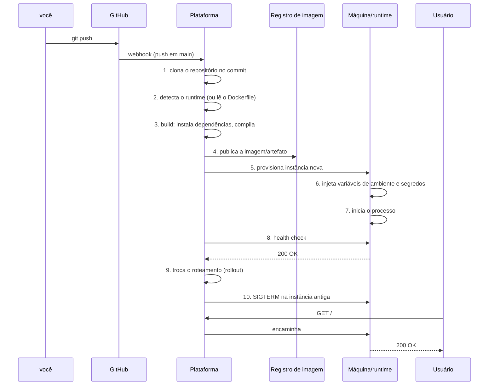

# 12 · Anatomia de um deploy — o que acontece entre o `git push` e a resposta HTTP

`Nível: intermediário` · `Atualizado em 18/08/2026`

Este capítulo abre a caixa-preta. Toda plataforma faz **as mesmas dez etapas**; o que muda é
quanto delas ela esconde. Saber a sequência é o que permite depurar quando algo falha "sem
motivo".

---

## O caminho completo



---

## Etapa 1 — Gatilho e clone

O `git push` dispara um **webhook** (uma requisição HTTP que o GitHub faz para a plataforma).
A plataforma clona o repositório **naquele commit específico** — não na branch. Isso importa:
o deploy é imutável e identificado por SHA, e é o que torna o rollback possível.

**Onde falha:** repositório privado sem permissão concedida; branch errada configurada;
monorepo sem `rootDir` definido; webhook removido por engano.

**Como verificar:** painel do GitHub → *Settings → Webhooks* → *Recent Deliveries*. Ali você
vê a requisição, o código de resposta e o corpo. Se o webhook não saiu, o problema é do lado
do Git; se saiu com erro 4xx/5xx, é da plataforma.

---

## Etapa 2 — Detecção do runtime

Sem `Dockerfile`, a plataforma **adivinha** o que é o seu projeto. Cada uma tem sua heurística:

| Sinal encontrado | Conclusão |
|---|---|
| `package.json` | Node — a versão vem de `engines.node`, `.nvmrc` ou o padrão da plataforma |
| `requirements.txt` / `pyproject.toml` | Python |
| `go.mod` | Go |
| `Gemfile` | Ruby |
| `pom.xml` / `build.gradle` | Java |
| `Dockerfile` | **ganha de todos os outros** |
| `next.config.js` | Next.js (build específico, com saída otimizada) |

Por baixo, Render, Railway, Koyeb e Heroku usam **buildpacks** — Cloud Native Buildpacks ou
Nixpacks — que são conjuntos de regras que transformam código-fonte em imagem OCI sem
`Dockerfile`.

> **Recomendação prática:** deixe a plataforma adivinhar enquanto o projeto for simples. No
> momento em que você precisar de uma biblioteca do sistema (`libvips`, `ffmpeg`, fontes,
> locale pt-BR), escreva o `Dockerfile`. E, como dito em [`11`](11-historia.md), o
> `Dockerfile` é a sua apólice contra aprisionamento.

**Onde falha:** versão de runtime diferente da sua máquina (o clássico "funciona local");
projeto na subpasta e a plataforma olhando a raiz; dois gerenciadores de pacote (`yarn.lock` e
`package-lock.json` juntos) confundindo a detecção.

---

## Etapa 3 — Build

Aqui roda `npm ci`, `pip install`, `go build`, `docker build`. Três coisas para saber:

**Cache de build.** A plataforma tenta reaproveitar camadas ou o diretório de dependências. Se
o seu build demora 6 minutos toda vez, provavelmente o cache não está sendo aproveitado — no
Docker, isso quase sempre é ordem errada de `COPY` (veja [`06`](06-exemplos.md), exemplo 8).

**Variáveis em tempo de build ≠ em tempo de execução.** Esta distinção derruba gente todo dia:

```
BUILD                                 RUNTIME
├── vars disponíveis no build         ├── vars disponíveis no processo
├── frontend "assa" a var no bundle   ├── backend lê process.env a cada uso
└── mudou a var? PRECISA rebuildar    └── mudou a var? basta reiniciar
```

Num frontend (Vite, Next, CRA), `VITE_API_URL` é **embutida no JavaScript durante o build**.
Trocá-la no painel sem reconstruir não muda nada. E — atenção — **qualquer segredo colocado
numa variável de frontend está público**: ele está literalmente no arquivo `.js` que o
navegador baixa.

**Limites de build:** Vercel corta em 45 minutos; Render e Railway contam minutos de pipeline
contra a cota do plano. Build lento não é só chato: é cota consumida.

---

## Etapa 4 — Artefato e registro

O resultado é uma **imagem OCI** (o padrão de container, mantido pela Open Container
Initiative), ou um pacote proprietário (Heroku chama de *slug*). A imagem é imutável e
identificada por um *digest* SHA-256.

**Por que importa:** rollback é apenas "aponte para o digest anterior". E `latest` **não é uma
versão** — é um apelido móvel. Depender de `latest` significa não saber o que está rodando.

---

## Etapa 5 — Provisionamento

A plataforma escolhe uma máquina, aloca CPU e memória (cgroups), monta volumes se houver e
prepara a rede. Aqui aparecem os limites de plano: 512 MB de RAM, 0,1 vCPU, sem disco
persistente no plano gratuito do Render.

**Onde falha:** `OOMKilled` — o processo estourou a memória e o kernel o matou. O sintoma é
brutal e sem explicação: o container reinicia sozinho, sem stack trace. Em Node, a causa mais
comum é o heap padrão do V8 maior que o limite do container; a correção é
`NODE_OPTIONS=--max-old-space-size=384` num container de 512 MB.

---

## Etapa 6 — Variáveis e segredos

Injetadas como variáveis de ambiente do processo. Duas armadilhas:

1. **Mudar variável exige novo deploy** na maioria das plataformas (Render, Vercel). Em Fly.io,
   `flyctl secrets set` **reinicia as máquinas** automaticamente. Em Railway, dispara redeploy.
2. **Variável de ambiente é visível** para qualquer processo filho, aparece em `/proc/<pid>/environ`
   e vaza em log e em relatório de erro que despeja o ambiente. Não é o mecanismo mais seguro
   que existe; é o mais **compatível**. Para segredo de alto valor, use um cofre com rotação.

---

## Etapa 7 — Início do processo

A plataforma executa o comando de start. Três regras que causam o erro mais comum de todos:

1. **Escute em `0.0.0.0`, não em `127.0.0.1`.** Dentro de um container, `127.0.0.1` é acessível
   apenas ao próprio container. O balanceador não alcança e você recebe
   `no open ports detected` ou `502`.
2. **Use `process.env.PORT`.** A plataforma escolhe a porta e a informa por variável. Porta
   fixa no código = serviço inalcançável.
3. **Seu processo deve ser o PID 1 bem-comportado**, ou usar um init (`dumb-init`, `tini`).
   Sem isso, `SIGTERM` é ignorado e o encerramento gracioso não acontece.

---

## Etapa 8 — Health check

A plataforma chama um endpoint (`/health`, `/healthz`, ou a raiz) até receber sucesso.
Vocabulário que vem do Kubernetes e vale em qualquer lugar:

| Sonda | Pergunta | O que acontece se falhar |
|---|---|---|
| **liveness** | o processo está vivo? | reinicia o container |
| **readiness** | pode receber tráfego? | tira do balanceador, **sem** reiniciar |
| **startup** | já terminou de iniciar? | adia as outras durante a partida |

**O erro caro:** usar o mesmo endpoint para as três, e fazê-lo checar o banco. Se o banco cai,
a *liveness* falha, **todas** as instâncias reiniciam ao mesmo tempo, e o banco — que já estava
sofrendo — recebe uma tempestade de reconexões. Isso é um laço de realimentação positiva e já
transformou incidente de 5 minutos em queda de 2 horas.

Regra: **liveness não toca em dependência externa. Readiness toca.**

---

## Etapa 9 — Rollout

A troca da versão antiga pela nova. Estratégias:

| Estratégia | Como funciona | Custo | Risco |
|---|---|---|---|
| **Recreate** | derruba tudo, sobe o novo | zero | **queda** durante a troca |
| **Rolling** | troca instância por instância | baixo | duas versões no ar ao mesmo tempo |
| **Blue-green** | sobe o ambiente inteiro em paralelo e vira o tráfego | 2× por alguns minutos | baixo; rollback instantâneo |
| **Canário** | manda 1%, depois 10%, depois 100% | baixo | o menor de todos; exige métrica |

Planos gratuitos costumam usar **recreate** (há queda). Planos pagos usam **rolling** ou
**blue-green** ("zero-downtime deploy" é o nome comercial).

> **A consequência que quase ninguém considera:** em rolling e blue-green, **duas versões do
> seu código rodam simultaneamente por alguns minutos, contra o mesmo banco**. Por isso toda
> migração precisa ser compatível com o código velho. Se o deploy N remove uma coluna que o
> código N−1 ainda lê, você tem erro em produção durante a janela do rollout —
> intermitente, difícil de reproduzir, e some sozinho. É um dos bugs mais confusos que existem.
>
> A solução é o padrão **expand/contract**:
> 1. *Expand*: adicione a coluna nova (nula), sem remover a velha. Deploy.
> 2. Faça o código escrever nas duas e ler da nova. Deploy.
> 3. Migre os dados antigos.
> 4. *Contract*: remova a coluna velha. Deploy. **Três deploys, nenhum minuto de queda.**

---

## Etapa 10 — Roteamento, DNS e TLS

O que acontece na primeira requisição do usuário:

```
usuário digita app.exemplo.com.br
   │
   ├─► DNS: consulta recursiva até achar o CNAME → seu-app.onrender.com → IP
   │
   ├─► TCP: handshake de 3 vias (1 ida e volta)
   │
   ├─► TLS 1.3: handshake (1 ida e volta; 0 se houver retomada de sessão)
   │      └─ SNI diz qual certificado o servidor deve apresentar
   │
   ├─► Balanceador da plataforma: escolhe uma instância saudável
   │
   ├─► Sua aplicação: responde
   │
   └─► HTTP/2 ou HTTP/3 de volta
```

**Certificado TLS.** A plataforma pede um certificado ao **Let's Encrypt** (ou ZeroSSL) em seu
nome, resolvendo um desafio ACME:

- **HTTP-01**: prova o controle do domínio servindo um arquivo em `/.well-known/acme-challenge/`.
  Exige que o DNS já aponte para a plataforma — por isso "adicione o domínio depois de criar o
  CNAME", e não antes.
- **DNS-01**: prova criando um registro `TXT`. É o único que emite **certificado curinga**
  (`*.exemplo.com`).

Certificado do Let's Encrypt vale **90 dias** e é renovado automaticamente por volta do 60º.
*Por que 90 dias?* Para forçar automação e limitar o dano de uma chave vazada. **Parada
legítima: decisão de projeto documentada pela ISRG**, e a tendência é encurtar ainda mais —
o CA/Browser Forum aprovou em 2025 a redução progressiva do prazo máximo de certificados TLS
para 47 dias até 2029.

**Onde falha, na ordem de frequência:**

| Sintoma | Causa | Correção |
|---|---|---|
| `DNS_PROBE_FINISHED_NXDOMAIN` | registro não criado, ou ainda propagando | `dig +short app.exemplo.com.br`; espere o TTL |
| `ERR_CERT_COMMON_NAME_INVALID` | certificado emitido para outro nome | confira se o domínio foi adicionado na plataforma |
| `ERR_TOO_MANY_REDIRECTS` | Cloudflare em modo "Flexible" + app forçando HTTPS | troque o SSL da Cloudflare para **Full (strict)** |
| `502 Bad Gateway` | app não escuta em `0.0.0.0:$PORT`, ou morreu na partida | veja a etapa 7 e os logs |
| `504 Gateway Timeout` | app demorou mais que o limite da plataforma | otimize, ou mova para trabalho assíncrono |
| `525 SSL handshake failed` | Cloudflare Full (strict) e origem sem certificado válido | instale certificado de origem, ou use Full |

---

## O que dura quanto (ordens de grandeza reais)

| Etapa | Tempo típico |
|---|---|
| Webhook + clone | 1 a 5 s |
| Build Node pequeno com cache | 20 a 60 s |
| Build Node sem cache | 2 a 6 min |
| Build de imagem Docker multi-stage | 1 a 5 min |
| Provisionamento + partida | 5 a 30 s |
| Health check até passar | 5 a 60 s |
| **Total, `push` → no ar** | **1 a 8 min** |
| Deploy de função serverless (Workers, Vercel) | **5 a 30 s** |

Se o seu ciclo passa de 10 minutos, o custo não é o tempo: é que **você para de fazer deploys
pequenos**, e deploy grande é onde moram os incidentes.

---

## Autoteste

1. Liste as dez etapas de um deploy, de memória.
2. Qual a diferença entre variável de build e variável de runtime, e por que ela derruba tanta gente?
3. Por que um segredo numa variável `VITE_*` está público?
4. Explique por que *liveness* não deve checar o banco de dados, com o cenário de falha completo.
5. O que é `expand/contract` e qual bug ele evita durante um rollout?
6. Por que o desafio HTTP-01 exige que o DNS já aponte para a plataforma?
7. Você recebe `ERR_TOO_MANY_REDIRECTS` depois de pôr o site atrás da Cloudflare. O que é e como se corrige?
8. Por que `latest` não é uma versão?

---

### Fontes consultadas (18/08/2026)

- Open Container Initiative — especificações de imagem e runtime
- Let's Encrypt / ISRG — política de validade de 90 dias e desafios ACME (RFC 8555)
- CA/Browser Forum — ballot de 2025 sobre redução progressiva do prazo de certificados TLS
- Kubernetes — documentação de *liveness*, *readiness* e *startup probes* (vocabulário de referência)
- Documentação de build de Render, Railway, Vercel, Fly.io e Cloudflare
