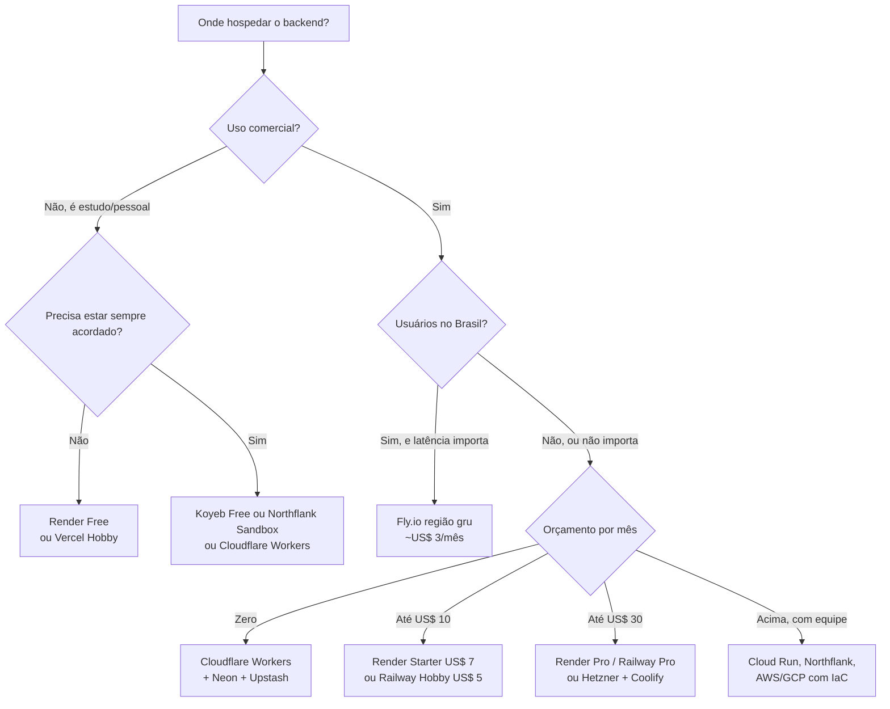

# 20 · Catálogo — onde hospedar o **backend**

`Nível: intermediário` · `Preços e limites consultados na web em 18/08/2026`
`⚠️ Prazo de validade prático: ~6 meses. Confirme antes de decidir.`

Quinze opções, cada uma com o que ela realmente entrega. A tabela mestra de preços em moeda e
a conversão para BRL estão em [`80-custos-e-licencas.md`](80-custos-e-licencas.md); aqui o foco
é **o que dá e o que não dá para fazer**.

---

## Resumo executivo

| Plataforma | Gratuito? | O que o gratuito dá | Dorme? | Região no Brasil | Melhor para |
|---|---|---|---|---|---|
| **Cloudflare Workers** | ✅ permanente | 100 mil req/dia, 10 ms de CPU/invocação | não (não existe processo) | ✅ (borda) | API leve, alta escala, custo zero |
| **Render** | ✅ permanente | 750 h/mês, 512 MB | **sim, 15 min** | ❌ | primeiro deploy, PaaS clássico |
| **Koyeb** | ✅ permanente | 1 serviço, 512 MB, 0,1 vCPU, 2 GB SSD | não (sem escala a zero) | ❌ | serviço pequeno sempre ligado, de graça |
| **Northflank** | ✅ Sandbox | 2 serviços + 1 banco + 2 crons, **sempre ligado** | não | ❌ | pilha completa gratuita, sem sono |
| **Google Cloud Run** | ✅ permanente | 2 mi req/mês, 180 mil vCPU-s, 360 mil GiB-s | sim (escala a zero) | ✅ `southamerica-east1` | container com pico, dentro do GCP |
| **Zeabur** | ✅ com sono | plano gratuito com auto-sleep, sem SLA | sim | ❌ | alternativa simples, público asiático |
| **Deno Deploy** | ✅ permanente | 1 mi req/mês, 100 GB de saída, 50 ms CPU/req | não | ✅ (borda) | TypeScript na borda |
| **Railway** | ⚠️ residual | US$ 1 de crédito/mês (1 vCPU, 0,5 GB) | não, **acaba o crédito** | ❌ | melhor experiência de uso; a partir de US$ 5 |
| **Fly.io** | ❌ desde 2024 | trial de 2 h de VM ou 7 dias | opcional (`suspend`) | ✅ **`gru` São Paulo** | latência no Brasil por ~US$ 3/mês |
| **Heroku** | ❌ desde 2022 | — | Eco dorme em 30 min | ❌ | legado; hoje sem motivo para começar aqui |
| **Vercel** | ✅ Hobby | 1 mi invocações, 4 CPU-h, 100 GB | escala a zero | ✅ (borda) | frontend Next.js + API leve. **Uso comercial proibido no Hobby** |
| **AWS (Lambda/ECS)** | ⚠️ mudou | US$ 100–200 em créditos, plano expira em 6 meses | — | ✅ `sa-east-1` | quem já está na AWS ou precisa de conformidade |
| **Oracle Cloud** | ✅ "Always Free" | 2 OCPU ARM + 12 GB RAM, 200 GB de disco, 10 TB de saída | não | ✅ São Paulo/Vinhedo | **o gratuito mais generoso do mundo** — com ressalvas sérias |
| **Hetzner + Coolify** | ❌ (~€ 5,49/mês) | — | não | ❌ (Alemanha, EUA, Cingapura) | melhor custo-benefício bruto |
| **Azure App Service** | ✅ F1 | 60 min de CPU/dia, 1 GB RAM, sem domínio próprio | — | ✅ Brasil Sul | quem já vive no Azure |

---

## 1. Render

**O que é.** PaaS clássica, herdeira direta da experiência do Heroku. Conecta ao GitHub,
detecta o runtime, constrói e publica.

**Camada gratuita (verificada em 18/08/2026):**
- **750 horas de instância por mês** para serviços web (serviço dormindo não consome).
- **Dorme após 15 minutos sem tráfego**; acordar leva cerca de 1 minuto.
- Sem disco persistente, sem escala horizontal, **sem acesso a shell/SSH**.
- Sem rede privada; portas de saída 25, 465 e 587 (SMTP) bloqueadas.
- **PostgreSQL gratuito:** 1 GB, um por workspace, **expira 30 dias após a criação** com
  14 dias de carência; sem backup e sem pooler.
- **Key Value (compatível com Redis) gratuito:** um por workspace, 25 MB, **sem persistência**
  (perde tudo ao reiniciar).
- Banda e minutos de build contam contra a cota do workspace (plano Hobby: 1 assento).

**Pago:** instância a partir de **US$ 7/mês** (não dorme). Workspace Pro US$ 25/mês.
**Regiões:** Oregon, Ohio, Virgínia, Frankfurt, Cingapura. **Sem região no Brasil.**

**Veredito.** Melhor porta de entrada para quem nunca fez deploy: a experiência é limpa, o
`render.yaml` é bom, e a documentação é honesta sobre os limites. **O sono de 15 minutos torna
o plano gratuito inadequado para qualquer coisa que um usuário real vá acessar.** O banco
gratuito que expira em 30 dias é uma armadilha para quem não lê — coloque no calendário.

---

## 2. Railway

**O que é.** A melhor experiência de uso do setor, na minha opinião: canvas visual,
provisionamento de Postgres e Redis em dois cliques, variáveis referenciadas entre serviços.

**Planos (18/08/2026):**
- **Trial:** US$ 5 de crédito único, expira em 30 dias, **sem cartão**.
- **Free:** depois do trial, **US$ 1 de crédito por mês**; limites por serviço: 1 vCPU,
  0,5 GB de RAM, 1 GB efêmero, 0,5 GB de volume, 1 réplica.
- **Hobby: US$ 5/mês**, com US$ 5 de uso incluído (você paga os US$ 5 mesmo sem usar);
  48 vCPU, 48 GB de RAM, 5 GB de volume, 6 réplicas por serviço.
- **Pro: US$ 20/mês** com US$ 20 de uso incluído.

**Regiões:** us-west2 (Califórnia), us-east4 (Virgínia), europe-west4 (Amsterdã),
asia-southeast1 (Cingapura). **Sem região no Brasil.**

**Veredito.** US$ 1/mês de crédito é suficiente para um serviço minúsculo por poucos dias, não
para hospedar algo. Trate o Railway como **plataforma paga de US$ 5** — e, nessa faixa, é
excelente. Cuidado com o modelo de uso: um serviço mal configurado (laço quente, memória
crescente) consome crédito rápido e a conta chega.

---

## 3. Fly.io

**O que é.** MicroVMs (Firecracker) distribuídas em ~30 regiões, com a **única região no
Brasil** entre as plataformas de container pequenas: `gru` (Guarulhos/São Paulo).

**Preço (18/08/2026), pay-as-you-go, sem camada gratuita:**

| Recurso | Preço |
|---|---|
| `shared-cpu-1x` 256 MB | ~US$ 2,02/mês |
| `shared-cpu-1x` 512 MB | ~US$ 3,32/mês |
| `shared-cpu-1x` 1 GB | ~US$ 5,92/mês |
| `shared-cpu-1x` 2 GB | ~US$ 11,11/mês |
| Volume | US$ 0,15/GB-mês |
| Snapshot | US$ 0,08/GB-mês (10 GB grátis) |
| Saída EUA/Europa | US$ 0,02/GB |
| **Saída América do Sul** | **US$ 0,04/GB** |
| IPv4 dedicado | US$ 2/mês (IPv6 é gratuito) |
| Suporte | US$ 29 / US$ 199 / US$ 2.500 por mês |

**Trial:** 2 horas de VM ou 7 dias, o que vier primeiro. Contas antigas mantêm o legado de
3 máquinas gratuitas.

**Veredito.** Com `auto_stop_machines = "suspend"` e `min_machines_running = 0`, uma API
brasileira de baixo tráfego custa **US$ 2 a 4 por mês** e responde em ~5 ms para usuários em
São Paulo, contra ~170 ms de qualquer plataforma em Oregon. **É a melhor relação
latência/preço para o Brasil.** O custo: mais complexidade que Render/Railway, e a documentação
supõe que você entende redes. Cuidado com o IPv4 dedicado — se você não precisa, use IPv6 +
proxy compartilhado e economize US$ 2/mês.

---

## 4. Koyeb

**Camada gratuita (confirmada na documentação em 18/08/2026):**
- **Um serviço web gratuito** com **512 MB de RAM, 0,1 vCPU e 2 GB de SSD**, nas regiões
  Frankfurt ou Washington D.C.
- **Um PostgreSQL gratuito** com 1 GB de armazenamento, limitado a **5 horas de tempo ativo**.
- Não há escala a zero automática (está no roteiro); você pode pausar manualmente.

**Pago:** Pro US$ 29/mês + computação (US$ 10 incluídos); Scale US$ 299/mês (US$ 100 incluídos).

**Veredito.** O serviço web gratuito **não dorme**, o que o torna melhor que o Render gratuito
para um bot, um webhook ou uma API interna. O banco de 5 horas ativas é essencialmente uma
demonstração — use Neon ou Supabase junto. 0,1 vCPU é **muito pouco**: qualquer pico de CPU
enfileira requisições.

---

## 5. Northflank

**Camada gratuita:** **2 serviços, 1 banco de dados e 2 cron jobs**, com computação
**sempre ligada** (sem sono).

**Pago (uso, por segundo):** US$ 0,01667 por vCPU-hora, US$ 0,00833 por GB-hora, saída
US$ 0,06/GB, disco US$ 0,15/GB-mês. Planos prontos a partir de ~US$ 5,40/mês. Sem cobrança por
assento.

**Veredito.** É a **camada gratuita mais completa para uma pilha inteira**: dá para rodar API
+ worker + banco sem pagar e sem dormir. Menos conhecida do que merece. O painel é mais
complexo que o do Render — é uma plataforma feita para equipes, com pipeline, ambientes de
preview e build integrado.

---

## 6. Cloudflare Workers (e Containers)

**O que é.** Não é PaaS: é execução na borda em *isolates* V8, em centenas de cidades.

**Gratuito (18/08/2026):** **100.000 requisições/dia**, **10 ms de CPU por invocação**
(tempo esperando I/O **não** conta), Workers KV com 100 mil leituras/dia, mil escritas/dia e
1 GB, D1 com 5 milhões de linhas lidas/dia e 5 GB, **Hyperdrive com 100 mil consultas/dia**.

**Pago:** **US$ 5/mês** mínimo, com 10 milhões de requisições e 30 milhões de CPU-ms
incluídos; depois US$ 0,30 por milhão de requisições e US$ 0,02 por milhão de CPU-ms.
**Cloudflare Containers** (para rodar imagem Docker de verdade) exige o plano pago.

**Veredito.** Para uma API que faz validação, autenticação e consultas curtas, **é a melhor
relação custo/escala do mercado, e provavelmente gratuita para sempre no seu caso**. Os
limites reais não são os anunciados, são estes: você **não roda Node completo** (é uma API
própria com compatibilidade parcial), **não mantém conexão TCP persistente** com o banco (daí
o Hyperdrive) e **não faz trabalho pesado de CPU**. Se o seu backend é Express com dez
bibliotecas nativas, não é aqui.

---

## 7. Google Cloud Run

**Gratuito permanente:** 2 milhões de requisições/mês, 180.000 vCPU-segundos e 360.000
GiB-segundos por mês (em regiões selecionadas dos EUA). Escala a zero.

**Região no Brasil:** `southamerica-east1` (São Paulo) — mas a **franquia gratuita vale só em
regiões dos EUA**.

**Veredito.** Roda qualquer container, escala a zero, cold start bom. É a opção séria para quem
já vive no Google Cloud. Duas ressalvas: **Cloud SQL não tem camada gratuita** (o banco vai
custar a partir de ~US$ 10/mês, ou você usa Neon/Supabase por fora), e a experiência de uso do
GCP é a de um console corporativo, não a de uma PaaS.

---

## 8. Vercel

**Hobby (gratuito):** 100 GB de *Fast Data Transfer*, 1 milhão de requisições de borda,
1 milhão de invocações de função, **4 CPU-horas ativas**, 360 GB-horas de memória
provisionada, 200 projetos, 100 deploys/dia. **Ao estourar, o projeto pausa** — não há
cobrança surpresa no Hobby.

**A restrição que mais gente ignora:** as *fair use guidelines* da Vercel dizem que **o plano
Hobby é restrito a uso não comercial e pessoal**. Um SaaS, uma loja ou um blog monetizado
exigem o Pro (US$ 20 por assento/mês).

**Veredito.** Insuperável para frontend Next.js. Como backend genérico, é caro e limitado —
as funções são efêmeras e o modelo de cobrança (CPU ativa, memória provisionada, transferência)
é difícil de prever. **Use a Vercel pelo frontend, não pelo backend.**

---

## 9. Heroku

Sem camada gratuita desde **28/11/2022**. **Eco dynos: US$ 5/mês** por 1.000 horas de dyno
compartilhadas entre todos os seus Eco dynos, que **dormem após 30 minutos** sem tráfego.
Mini Postgres e Mini Key-Value a partir de ~US$ 5/mês cada.

**Veredito.** Historicamente importante, tecnicamente ultrapassado pelos concorrentes e mais
caro que todos eles. **Não há razão para começar um projeto novo aqui em 2026** — a não ser
manter algo que já existe.

---

## 10. Oracle Cloud — "Always Free"

**O gratuito mais generoso que existe, e o que mais exige cautela.**

Recursos "Always Free" (documentação oficial, 18/08/2026):

| Recurso | Franquia |
|---|---|
| **Ampere A1 (ARM)** | 1.500 OCPU-horas e 9.000 GB-horas por mês — equivalente a **2 OCPU e 12 GB de RAM** contínuos |
| VM AMD `E2.1.Micro` | 2 instâncias, 1/8 de OCPU e 1 GB cada |
| Block Volume | **200 GB** no total, com 5 backups |
| Autonomous Database | **2 bancos**, 1 OCPU e 20 GB cada (Oracle DB, não PostgreSQL) |
| Load Balancer | 1 flexível, 10 Mbps |
| **Saída de dados** | **10 TB por mês** |

> **Atenção — mudança recente.** A franquia Ampere A1 para contas Always Free **era
> equivalente a 4 OCPU e 24 GB** e hoje a documentação oficial declara **2 OCPU e 12 GB**.
> A alteração foi feita sem comunicado amplo. Se você leu tutoriais falando em 4/24, eles
> estão desatualizados.

**Ressalvas sérias, e são muitas:**
- Cadastro exige cartão de crédito para verificação e reprova muitos pedidos do Brasil, sem
  explicar por quê.
- **Instâncias ociosas podem ser recuperadas (terminadas)** pela Oracle. O volume de boot é
  preservado por um período.
- A capacidade de Ampere A1 é frequentemente esgotada na região escolhida ("Out of capacity"),
  e a espera pode durar dias.
- Há relatos consistentes, ao longo dos anos, de contas encerradas sem aviso claro.

**Veredito, declarado como opinião.** 2 OCPU ARM com 12 GB de RAM e 10 TB de saída, de graça e
com região no Brasil, **não tem concorrente**. É excelente para laboratório, estudo, ambiente
de homologação e projeto pessoal. **Eu não colocaria produção de cliente ali** sem backup
externo e sem plano de migração testado — não por qualidade técnica, mas porque o risco de
perda de conta é assimétrico e você não tem a quem recorrer.

---

## 11. VPS + Coolify / Dokploy (o caminho auto-hospedado)

**A ideia.** Aluga-se uma máquina crua e instala-se um painel que dá experiência de PaaS:
deploy por `git push`, TLS automático via Let's Encrypt, banco em um clique, backup agendado.

**Preços de VPS (18/08/2026 — aproximados; a Hetzner reajustou em 01/04 e em 15/06/2026,
confirme no site antes de contratar):**

| Provedor | Plano | Recursos | Preço aprox. |
|---|---|---|---|
| **Hetzner** | CX23 | 2 vCPU, 4 GB, 40 GB NVMe | ~€ 5,49/mês (+ IPv4 à parte) |
| **Hetzner** | CAX11 (ARM) | 2 vCPU ARM, 4 GB, 40 GB | ~€ 5,99/mês |
| **Hetzner** | CX33 | 4 vCPU, 8 GB, 80 GB | ~€ 10/mês |
| **DigitalOcean** | Basic | 1 vCPU, 1 GB | US$ 6/mês |
| **Contabo** | VPS S | 4 vCPU, 8 GB | ~€ 6/mês (banda e I/O piores) |
| **Oracle** | Always Free ARM | 2 OCPU, 12 GB | **€ 0** |

**Painéis:** **Coolify** (v4.0 lançado em maio de 2026; ~1,2 GB de RAM ociosa; 280+ serviços
de um clique) e **Dokploy** (mais leve, ~0,8 GB ociosa, modelo mental mais simples).
Ambos são open source e gratuitos para auto-hospedagem.

**O que você recebe e o que passa a dever:**

| Recebe | Deve |
|---|---|
| 5 a 20× mais recursos pelo mesmo dinheiro | atualizar o SO e aplicar correções de segurança |
| controle total, sem limite artificial | monitorar e ser acordado quando cair |
| banco e cache na mesma máquina (latência ~0,2 ms) | **fazer e testar backup — ninguém faz por você** |
| zero aprisionamento | responder por disponibilidade |

**Conta honesta.** Some ao aluguel: 3 a 6 horas por mês de manutenção. A R$ 100/hora, são
R$ 300 a R$ 600 — mais do que a economia na maioria dos projetos pequenos. **A vantagem
econômica do VPS aparece quando a fatura gerenciada passa de ~US$ 100/mês**, ou quando você já
tem alguém que faz operação de qualquer jeito.

---

## 12. Menções rápidas

- **Deno Deploy** — gratuito: 1 milhão de requisições/mês, 100 GB de saída, 50 ms de CPU por
  requisição, 1 GiB de KV, 50 domínios. Excelente para TypeScript na borda.
- **Zeabur** — plano gratuito com auto-sleep e sem SLA; Dev a US$ 5/mês. Simples, bom para
  projetos pequenos.
- **Azure App Service F1** — 60 minutos de CPU por dia, 1 GB de RAM, **sem domínio próprio**.
  Serve para demonstração, não para produção.
- **AWS** — desde 15/07/2025, contas novas escolhem entre plano gratuito (US$ 100 de crédito,
  mais US$ 100 por tarefas, **expira em 6 meses**) e plano pago. O free tier de 12 meses de
  EC2/RDS acabou para contas novas. Mais de 30 serviços continuam "always free" (Lambda,
  DynamoDB, CloudFront em faixas limitadas).
- **Clever Cloud** (França) — sem camada gratuita permanente desde 2023; a partir de ~€ 4,80/mês.
  Interessante para quem precisa de soberania europeia.
- **Scaleway, OVH, Magalu Cloud, Locaweb** — nuvens regionais. A **Magalu Cloud** é a opção
  brasileira relevante para quem precisa de dado no Brasil com contrato em real; não tem
  camada gratuita comparável.

---

## Como escolher — árvore de decisão

---

## Autoteste

1. Qual é a única plataforma pequena deste catálogo com região no Brasil, e quanto custa a menor máquina dela?
2. Por que o plano gratuito do Render não serve para um sistema com usuários reais?
3. O que exatamente a Vercel proíbe no plano Hobby, e quem é afetado?
4. Compare Koyeb Free e Render Free: qual é a diferença que mais importa, e para qual caso de uso?
5. Quais são os três limites *reais* do Cloudflare Workers, além dos números anunciados?
6. Cite quatro ressalvas concretas do "Always Free" da Oracle.
7. A partir de que faixa de fatura o VPS auto-hospedado costuma compensar, e por quê?
8. O que mudou no free tier da AWS em julho de 2025?

---

### Fontes consultadas (18/08/2026)

- Render — *Free Instance Types*, *Regions*, *CLI* e página de preços — render.com/docs
- Railway — *Pricing Plans* e *Regions* — docs.railway.com
- Fly.io — *Pricing* (docs/about/pricing) e *Regions* — fly.io
- Koyeb — *Pricing FAQ* — koyeb.com/docs/faqs/pricing
- Northflank — página de preços — northflank.com/pricing
- Cloudflare — *Workers Pricing*, *D1 Pricing*, *Hyperdrive Pricing*, *Pages Functions Pricing*
- Vercel — *Limits*, *Hobby Plan* e *Fair Use Guidelines* — vercel.com/docs
- Google Cloud — *Free Tier* e preços do Cloud Run
- Oracle — *Always Free Resources* — docs.oracle.com/en-us/iaas/Content/FreeTier
- AWS — anúncio de 15/07/2025 sobre o novo Free Tier
- Heroku — *New Low-Cost Plans* (Eco/Mini)
- Hetzner — página *Cost-optimized* (linha CX23/CX33/CX43/CX53) e docs sobre o reajuste de 15/06/2026;
  valores em euro conferidos em agregadores e marcados como aproximados
