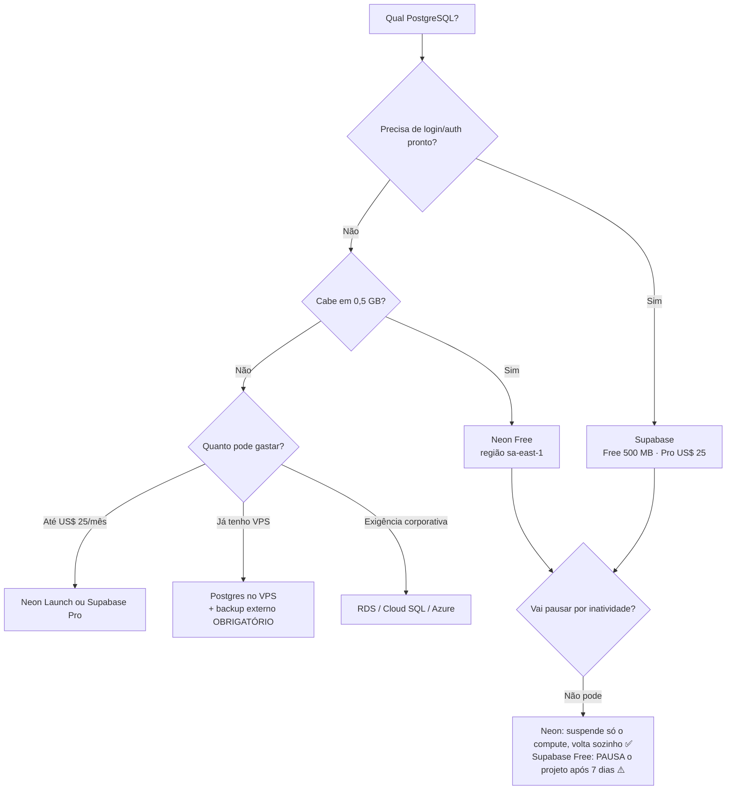

# 25 · Catálogo — onde hospedar o **PostgreSQL**

`Nível: intermediário` · `Preços e limites consultados na web em 18/08/2026`
`⚠️ Prazo de validade prático: ~6 meses.`

O banco é **a peça mais importante e a mais cara** da sua pilha. É onde mora o que você não
pode perder. Este capítulo trata cada opção com o rigor que ela merece.

---

## Resumo executivo

| Serviço | Gratuito | Tamanho no gratuito | Pausa/expira? | Região no Brasil | Backup no gratuito |
|---|---|---|---|---|---|
| **Neon** | ✅ permanente | 0,5 GB/projeto, 100 CU-h/mês | suspende em 5 min (retoma sozinho) | ✅ `sa-east-1` | histórico curto |
| **Supabase** | ✅ permanente | 500 MB, 5 GB de saída, 2 projetos | **pausa após 7 dias sem uso** | ✅ `sa-east-1` | ❌ |
| **Aiven** | ✅ permanente | 1 vCPU, 1 GB RAM, 1 GB disco | pode ser desligado se ocioso muito tempo | ❌ (EUA/EU/Ásia) | ❌ |
| **Koyeb** | ✅ com teto | 1 GB, **5 h ativas** | sim | ❌ | ❌ |
| **Render** | ⚠️ temporário | 1 GB | **expira 30 dias após criar** | ❌ | ❌ |
| **Railway** | ❌ | — (consome o crédito) | — | ❌ | conforme o plano |
| **Prisma Postgres** | ✅ | plano gratuito; pagos a partir de US$ 29/mês | — | verificar | — |
| **CockroachDB** | ✅ | 10 GiB + 50 mi RU/mês (**não é PostgreSQL**, é compatível) | — | multi-região | ✅ |
| **Fly Managed Postgres** | ❌ | — | — | ✅ `gru` | ✅ |
| **AWS RDS / Aurora** | ⚠️ créditos | plano novo expira em 6 meses | — | ✅ `sa-east-1` | ✅ |
| **Google Cloud SQL** | ❌ | **não tem camada gratuita**; US$ 300 em créditos por 90 dias | — | ✅ | ✅ |
| **Auto-hospedado (VPS)** | ❌ (custo do VPS) | limitado pelo disco | não | onde você quiser | **por sua conta** |

---

## 1. Neon — **a recomendação padrão**

**O que é.** PostgreSQL com **separação entre computação e armazenamento**: o armazenamento
vive num serviço próprio (sobre object storage) e o *compute* é um processo que sobe e desce.
Isso permite duas coisas que nenhum Postgres tradicional faz: **suspender em segundos** e
**ramificar o banco como se fosse Git** (`branch`), com cópia instantânea por *copy-on-write*.

**Plano gratuito (verificado em 18/08/2026):**
- **0,5 GB de armazenamento por projeto**
- **100 CU-horas de computação por projeto/mês** (CU = *compute unit*)
- **até 100 projetos**, **10 branches por projeto**
- **suspensão automática após 5 minutos** de inatividade (retoma na próxima consulta,
  custando algumas centenas de milissegundos)

**Planos pagos:** *Launch* a US$ 0,106/CU-hora e US$ 0,35/GB-mês; *Scale* a US$ 0,222/CU-hora;
500 GB de saída incluídos por projeto, depois US$ 0,10/GB. **Sem mínimo mensal.**

**Regiões:** 8 na AWS, incluindo **South America (São Paulo) `aws-sa-east-1`**.
A região é **fixa na criação do projeto** e não pode ser alterada.

**Veredito.** É o que eu recomendo para 80% dos casos deste curso. Motivos: tem região no
Brasil, o gratuito é permanente e não pausa o projeto (só suspende o compute, que volta
sozinho), a ramificação é genuinamente útil (um branch de banco por pull request), e o
caminho de crescimento é contínuo, sem salto de preço. **A limitação real é 0,5 GB** — cabem
centenas de milhares de linhas pequenas, e não cabe nenhum arquivo binário.

---

## 2. Supabase — banco **e** plataforma

**O que é.** PostgreSQL gerenciado + API REST gerada automaticamente (PostgREST) +
autenticação + storage + realtime + edge functions. É BaaS construído sobre Postgres puro,
com código aberto.

**Plano gratuito (18/08/2026):**
- **500 MB** de banco (CPU compartilhada, 500 MB de RAM)
- **5 GB de saída**, **1 GB de storage de arquivos**
- **50.000 usuários ativos mensais** na autenticação
- **2 projetos ativos** por organização
- **⚠️ Projetos gratuitos são pausados após 7 dias de inatividade.** Podem ser restaurados
  pelo painel — mas ficam fora do ar até você perceber.
- Sem backup automático (o Pro tem diário, com 7 dias de retenção)

**Pro:** **US$ 25/mês** — 100 mil MAU, 8 GB de disco, 250 GB de saída, 100 GB de storage,
backup diário, **e a garantia de não pausar**.

**Regiões:** 12, incluindo **`sa-east-1` (São Paulo)**.

**Veredito.** Se o seu sistema precisa de **login pronto**, Supabase economiza semanas — a
autenticação inclui e-mail, OAuth, magic link e MFA, integrada com **RLS** (*Row Level
Security*) do próprio Postgres, que é a forma correta de fazer autorização multi-inquilino.
**A pausa por inatividade é o problema:** um portfólio que ninguém visita por 8 dias fica fora
do ar, e o recrutador vê erro. Para qualquer coisa séria, US$ 25/mês.

> **Fato relevante:** RLS não é da Supabase — é do PostgreSQL, desde a versão 9.5 (2016).
> A Supabase apenas o colocou no centro do produto. Isso significa que a lógica de
> autorização que você escrever ali **migra** para qualquer Postgres.

---

## 3. Aiven

**Gratuito:** um nó de **1 vCPU, 1 GB de RAM e 1 GB de disco**, sem prazo de validade
declarado — mas a Aiven se reserva o direito de desligar serviços ociosos por período
prolongado. Há planos gratuitos também de **MySQL, Valkey, OpenSearch e Kafka**, o que
permite montar uma pilha inteira de graça.

**Regiões do plano gratuito:** conjunto limitado, **sem Brasil**.

**Veredito.** A oferta gratuita mais "de verdade" em formato tradicional: é um Postgres normal,
com console, métricas e logs, e não uma versão capada. 1 GB de disco é pouco, e a ausência de
região no Brasil custa ~170 ms por consulta a partir daqui. Ótimo para estudo, integração e
para experimentar Kafka sem pagar.

---

## 4. Render Postgres

1 GB, um por workspace, **e o ponto que precisa estar em negrito: expira 30 dias após a
criação**, com 14 dias de carência antes de o banco e os dados serem apagados. Sem backup, sem
pooler de conexões.

**Veredito.** Serve para uma demonstração de um mês. **Não use para nada que precise durar.**
Se você já está no Render, o caminho sensato é: aplicação no Render, banco na Neon.

---

## 5. Prisma Postgres, Turso, Xata, Nile, Tembo — a safra nova

Este é o segmento mais volátil do mercado, e a lição de 2026 é dura:

| Serviço | Situação em 18/08/2026 |
|---|---|
| **Prisma Postgres** | tem plano gratuito; pagos a partir de US$ 29/mês. Integrado ao ORM Prisma |
| **Turso** | gratuito com 5 GB, 100 bancos, 500 milhões de linhas lidas/mês. **Não é PostgreSQL** — é libSQL, um fork do SQLite |
| **Xata** | **o plano "Lite" gratuito foi aposentado em 28/02/2026.** Hoje é por uso, a partir de ~US$ 0,012/hora + US$ 0,28/GB-mês |
| **Nile** | Postgres multi-inquilino; oferta gratuita com ~10 GB (verificar disponibilidade) |
| **Tembo** | plano gratuito com desligamento após 14 dias |
| **CockroachDB** | gratuito com 10 GiB e 50 milhões de *request units*/mês. Compatível com o dialeto PostgreSQL, **mas não é PostgreSQL** — extensões e algumas funções não existem |
| **ElephantSQL** | **encerrado em janeiro de 2025** |

> **A lição, e ela vale dinheiro:** três dos serviços desta lista mataram ou reduziram
> drasticamente a camada gratuita em 18 meses. Se você escolher um deles, **garanta que o
> `pg_dump` funcione e que você tenha um backup externo**. Compatível-com-Postgres não é
> Postgres: CockroachDB e Turso não aceitam `pg_dump`/`pg_restore` diretos, e migrar de lá
> para um Postgres de verdade é trabalho, não comando.

---

## 6. As nuvens grandes

| Serviço | Camada gratuita | Preço mínimo realista | Observação |
|---|---|---|---|
| **AWS RDS** | contas novas: créditos de US$ 100–200, plano expira em 6 meses | ~US$ 15/mês (`db.t4g.micro` + disco) | `sa-east-1` disponível; egress caro |
| **AWS Aurora Serverless v2** | — | escala a partir de 0 ACU, mas com custo de armazenamento e I/O | bom para carga irregular, caro para carga constante |
| **Google Cloud SQL** | **nenhuma**; US$ 300 em créditos por 90 dias | ~US$ 10 a 15/mês | não confunda com a camada gratuita do Cloud Run |
| **Azure Database for PostgreSQL** | 12 meses limitados para contas novas | ~US$ 15/mês | Brasil Sul disponível |

**Veredito.** Escolha uma nuvem grande quando houver um motivo que não seja técnico:
conformidade, contrato corporativo, exigência de cliente, ou o resto do sistema já morar lá.
Para um projeto pequeno, você paga mais e trabalha mais.

---

## 7. Auto-hospedar PostgreSQL

Rodar `postgres:18` num VPS custa apenas o VPS. Um Hetzner CX23 (2 vCPU, 4 GB) aguenta
**dezenas de milhões de linhas** e milhares de requisições por minuto para uma aplicação
típica. Latência para o app na mesma máquina: **~0,2 ms**, contra 1 a 5 ms de um serviço
gerenciado na mesma região, e ~170 ms de um em outro continente.

**O que você passa a dever, item por item:**

| Tarefa | Frequência | Consequência de não fazer |
|---|---|---|
| Backup (`pg_dump` ou `pgBackRest`) | diário | **perda total de dados** |
| **Testar a restauração** | trimestral | descobrir no incidente que o backup não presta |
| Atualizar versão maior | anual | ficar sem correção de segurança |
| Aplicar correções de segurança | mensal | CVE explorada |
| Monitorar disco | contínuo | **disco cheio = banco parado**, e é a causa nº 1 de queda de Postgres auto-hospedado |
| Ajustar `shared_buffers`, `work_mem`, `max_connections` | uma vez, revisto | desempenho ruim sem explicação |
| Verificar `autovacuum` e bloat | mensal | tabela inchada, consultas lentas |

> **Opinião, declarada.** Auto-hospedar Postgres é **tecnicamente fácil e operacionalmente
> traiçoeiro**. Subir leva 3 minutos; o problema aparece no mês 14, quando o disco enche às
> 2h da manhã de um sábado, ou quando você descobre que o `pg_dump` estava falhando em
> silêncio desde março. Se você vai fazer isso, faça três coisas **no primeiro dia**: alerta
> de disco acima de 80%, backup automatizado **para fora da máquina**, e uma restauração de
> teste. Sem essas três, você não tem um banco — tem uma bomba-relógio.

---

## 8. O tema que decide sua arquitetura: **conexões**

O PostgreSQL usa **um processo do sistema operacional por conexão**. Cada conexão consome
alguns megabytes antes de qualquer consulta.

```
Plano gratuito Neon/Supabase  ─►   ~20 a 60 conexões
Plano pequeno pago            ─►   ~100 conexões
db.t4g.micro na AWS           ─►   ~85 conexões

Sua aplicação com 3 instâncias × pool de 10 = 30 conexões
Serverless com 200 invocações concorrentes  = 200 conexões ⇒ ESTOURO
```

Erros literais que isso produz:

```
FATAL: sorry, too many clients already
FATAL: remaining connection slots are reserved for non-replication superuser connections
```

**As soluções, em ordem de preferência:**

1. **Um pool por processo, com `max` pequeno** (2 a 5 em plano gratuito). O total é
   `instâncias × max` — faça essa multiplicação **antes** de escalar.
2. **Pooler externo em modo transaction**: PgBouncer, **Supavisor** (Supabase) ou o pooler
   embutido da Neon. Multiplexa milhares de conexões de cliente em dezenas no servidor.
   Use a *connection string* do pooler, não a direta.
3. **Hyperdrive** (Cloudflare) quando o backend roda na borda.
4. **HTTP em vez de TCP**: o driver serverless da Neon (`@neondatabase/serverless`) fala com o
   banco por HTTP/WebSocket, o que também resolve firewall corporativo bloqueando a 5432.

> **Cuidado com o modo *transaction* do pooler:** ele não suporta `PREPARE` nomeado,
> `LISTEN/NOTIFY`, temp tables entre comandos nem *advisory locks* de sessão. Se o seu ORM
> usa prepared statements (o Prisma usa), você precisa desligar isso explicitamente
> (`?pgbouncer=true` ou `statement_cache_size=0`). Este é o bug de produção mais comum de
> quem adota pooler sem ler a documentação.

---

## 9. Como escolher



**Minha recomendação, em uma frase:** **Neon na região `sa-east-1`** para quase todo mundo;
**Supabase** se você quer autenticação pronta; **Postgres no VPS** se você já opera um VPS e
tem backup testado; **RDS** se alguém exigir.

---

## 10. Checklist antes de confiar dados a um serviço

- [ ] Consigo rodar `pg_dump` e obter um arquivo restaurável? (Se não, **não é Postgres**.)
- [ ] Já restaurei esse dump em outro lugar, com sucesso?
- [ ] Sei em que região os dados estão fisicamente? (LGPD — veja [`45`](45-brasil-latencia-e-lgpd.md))
- [ ] Sei o que acontece se eu não usar o serviço por 30 dias?
- [ ] Sei quantas conexões o meu plano suporta e quantas a minha aplicação abre?
- [ ] Tenho backup **fora** do provedor?
- [ ] Sei quanto custa o próximo degrau de plano — e o degrau depois dele?
- [ ] Existe cobrança por egress? Quanto?

---

## Autoteste

1. Por que a Neon consegue suspender e retomar em segundos, e o RDS não?
2. Qual é a diferença prática entre "suspender o compute" (Neon) e "pausar o projeto" (Supabase Free)?
3. O que expira 30 dias depois de criado, e o que acontece nos 14 dias seguintes?
4. Por que "compatível com PostgreSQL" não é PostgreSQL? Cite duas consequências.
5. Explique a matemática que estoura o limite de conexões numa arquitetura serverless.
6. Quais são as quatro soluções para o problema de conexões, e qual delas quebra prepared statements?
7. Liste as três coisas que devem ser feitas no primeiro dia de um Postgres auto-hospedado.
8. Quantos serviços desta lista mataram ou reduziram a camada gratuita entre 2025 e 2026?

---

### Fontes consultadas (18/08/2026)

- Neon — página de preços e *Regions* (`aws-sa-east-1` confirmada) — neon.com
- Supabase — página de preços, *Available regions* e *Going into prod* (pausa após 7 dias) — supabase.com
- Aiven — *Free tier* e *Free PostgreSQL database* — aiven.io
- Render — *Free instance types* (expiração do Postgres gratuito) — render.com/docs/free
- Koyeb — *Pricing FAQ* (Postgres gratuito de 5 h ativas) — koyeb.com/docs
- Cloudflare — *Hyperdrive Pricing*
- Google Cloud — *Free tier* (Cloud SQL sem camada gratuita)
- AWS — anúncio do novo Free Tier (15/07/2025)
- Comunicados de encerramento: ElephantSQL (jan/2025), Xata Lite (28/02/2026)
- PostgreSQL 18 — documentação de conexões, `max_connections` e pooling
