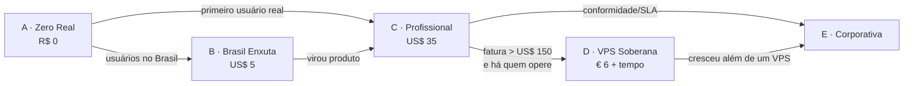

# 40 · Cinco arquiteturas de referência — a resposta prática

`Nível: intermediário` · `Preços consultados em 18/08/2026` · `Câmbio usado: US$ 1 ≈ R$ 5,20 · € 1 ≈ R$ 6,10`

Este é **o arquivo central do curso**. Cinco pilhas montadas, com custo, teto de crescimento e
o **gatilho de troca** de cada uma. Escolha uma, monte, e volte aqui quando ela apertar.

---

## Como escolher em 60 segundos

| Sua situação | Vá para |
|---|---|
| Estou aprendendo / é um projeto pessoal / não posso gastar nada | **Pilha A — Zero Real** |
| Tenho usuários reais no Brasil e latência importa | **Pilha B — Brasil Enxuta** |
| É um produto de verdade, pequeno, com clientes pagantes | **Pilha C — Profissional Enxuta** |
| Quero o máximo de recursos pelo menor preço e sei operar Linux | **Pilha D — VPS Soberana** |
| Empresa, conformidade, auditoria, equipe dedicada | **Pilha E — Corporativa** |

---

## Pilha A — **Zero Real** (R$ 0,00/mês)

> Para: aprender, portfólio, TCC, protótipo, projeto pessoal, MVP sem usuários ainda.

```
┌────────────────────────────────────────────────────────────────┐
│  Frontend   →  Cloudflare Pages            R$ 0  (ilimitado)   │
│  Backend    →  Cloudflare Workers          R$ 0  (100k req/dia)│
│               (ou Render Free, se precisar de Node completo)   │
│  PostgreSQL →  Neon Free, sa-east-1        R$ 0  (0,5 GB)      │
│  Redis      →  Upstash Free                R$ 0  (256 MB/500k) │
│  DNS + TLS  →  Cloudflare                  R$ 0                │
│  CI         →  GitHub Actions              R$ 0                │
│  Backup     →  GitHub Actions + pg_dump    R$ 0  (exemplo 12)  │
└────────────────────────────────────────────────────────────────┘
                       TOTAL: R$ 0,00
```

**Cartão de crédito exigido:** nenhum.

**O que cabe aqui:**
- ~100.000 requisições por dia à API (Workers)
- ~500.000 comandos Redis por mês ≈ **5.500 requisições/dia** se você usar 3 comandos por
  requisição — **este costuma ser o primeiro limite a estourar**
- 0,5 GB no banco: entre 500 mil e 2 milhões de linhas pequenas
- tráfego de frontend ilimitado

**O que NÃO cabe:**
- upload de arquivo (use Cloudflare R2: 10 GB grátis, egress zero)
- processamento pesado de CPU (Workers dá 10 ms de CPU por invocação)
- processo de longa duração / worker de fila (Workers não são processos)
- e-mail transacional (nenhum plano gratuito decente; use Resend, 3.000/mês grátis)

**Variação A2 — se você precisa de Node completo** (Express, bibliotecas nativas, WebSocket):
troque o backend por **Render Free** (aceitando o sono de 15 min e o despertar de ~1 min) ou
**Koyeb Free** / **Northflank Sandbox** (não dormem). Custo continua R$ 0.

**Gatilhos de troca (quando sair de A):**
- ✋ o sono de 15 minutos incomoda um usuário real → vá para **C** (US$ 7) ou **B**
- ✋ a cota do Upstash estoura → cache local no processo, ou US$ 5 a 10/mês em Redis
- ✋ passou de 0,5 GB no banco → Neon Launch (por uso) ou Supabase Pro (US$ 25)
- ✋ **o projeto virou comercial e você está na Vercel Hobby** → obrigatório sair
- ✋ latência para usuário brasileiro incomoda → **B**

---

## Pilha B — **Brasil Enxuta** (≈ US$ 5–8/mês ≈ R$ 26–42)

> Para: sistema com usuários reais no Brasil, onde 170 ms extras por consulta são inaceitáveis.

```
┌──────────────────────────────────────────────────────────────────┐
│  Frontend   →  Cloudflare Pages (PoPs no Brasil)     R$ 0        │
│  Backend    →  Fly.io, região gru (São Paulo)        US$ 2–4     │
│               shared-cpu-1x 512 MB, suspend + auto-start          │
│  PostgreSQL →  Neon Free ou Launch, sa-east-1        US$ 0–5     │
│  Redis      →  Upstash Free (réplica em São Paulo)   US$ 0       │
│  Backup     →  GitHub Actions + pg_dump              R$ 0        │
└──────────────────────────────────────────────────────────────────┘
              TOTAL: US$ 2 a 9/mês  (R$ 10 a R$ 47)
```

**Por que essa combinação.** É a **única** que coloca cômputo e banco a poucos milissegundos
do usuário brasileiro por menos de US$ 10. A conta de latência:

| Arranjo | Ida e volta app↔banco | 8 consultas sequenciais |
|---|---|---|
| App em Oregon + banco em São Paulo | ~170 ms | **1.360 ms** |
| App e banco em São Paulo | ~2 ms | **16 ms** |

**85 vezes mais rápido**, pelo mesmo dinheiro. Nenhuma otimização de código chega perto disso.

**Atenção ao custo:** o IPv4 dedicado do Fly custa US$ 2/mês. Se você não precisa (a maioria
não precisa — use o proxy compartilhado e IPv6), economize. A saída de dados da América do Sul
custa US$ 0,04/GB, o dobro dos EUA e da Europa.

**Gatilhos de troca:**
- ✋ precisa de mais de uma máquina sempre acordada → `min_machines_running = 1` e o custo sobe
  para ~US$ 4–6
- ✋ o time não domina Fly.io (a plataforma é mais crua) → **C**, aceitando a latência
- ✋ a carga cresceu → aumente a VM antes de escalar horizontalmente; vertical é mais simples

---

## Pilha C — **Profissional Enxuta** (≈ US$ 32–37/mês ≈ R$ 165–190)

> Para: produto de verdade, com clientes pagantes, sem equipe de infraestrutura.

```
┌──────────────────────────────────────────────────────────────────┐
│  Frontend   →  Cloudflare Pages                       US$ 0      │
│  Backend    →  Render Starter (não dorme)             US$ 7      │
│  Worker     →  Render Worker (fila, e-mail, relatório) US$ 7     │
│  PostgreSQL →  Supabase Pro  OU  Neon Launch          US$ 25 / ~5│
│               (backup diário, sem pausa, 8 GB)                    │
│  Redis      →  Upstash pay-as-you-go                  ~US$ 1–5   │
│  Monitoramento → Better Stack / UptimeRobot (gratuito) US$ 0     │
│  Erros      →  Sentry (plano gratuito)                US$ 0      │
└──────────────────────────────────────────────────────────────────┘
        TOTAL: US$ 32 a 44/mês  (R$ 165 a R$ 230)
```

**O que você compra com esses US$ 35 que a Pilha A não tem:**

| Item | Por que vale |
|---|---|
| **Backup diário automático** | a diferença entre um susto e o fim da empresa |
| **Nenhum sono, nenhuma pausa** | o cliente nunca vê 50 segundos de espera |
| **Worker separado** | trabalho pesado sai do caminho da requisição |
| **Alerta quando cai** | você fica sabendo antes do cliente |
| **Rastreamento de erro** | você conserta o que não sabia que estava quebrado |

> **Se eu tivesse que recomendar uma única pilha para alguém lançando um SaaS pequeno hoje,
> seria esta.** É a faixa em que o custo ainda é irrelevante perto do valor do seu tempo, e em
> que todos os riscos operacionais graves já estão cobertos.

**Variação C2 — com região no Brasil:** troque o Render por Fly.io `gru` (US$ 4–8) e o banco
por Neon `sa-east-1`. Custo semelhante, latência muito melhor, operação um pouco mais crua.

**Gatilhos de troca:**
- ✋ fatura passando de US$ 150/mês → avalie a **D** com a conta de tempo incluída
- ✋ exigência de dado no Brasil por contrato/LGPD → **C2**, **D** com VPS no Brasil, ou **E**
- ✋ precisa de VPC, private link, auditoria formal → **E**

---

## Pilha D — **VPS Soberana** (≈ € 6–11/mês ≈ R$ 37–67, mais o seu tempo)

> Para: quem sabe operar Linux, quer o máximo de recursos por real, e aceita a
> responsabilidade.

```
┌────────────────────────────────────────────────────────────────────┐
│  1 VPS Hetzner CX23 (2 vCPU, 4 GB, 40 GB NVMe)      ~€ 5,49        │
│  + IPv4                                              ~€ 0,60        │
│  ┌──────────────────────────────────────────────┐                  │
│  │ Coolify (ou Dokploy)                          │                 │
│  │  ├── seu backend (container)                  │                 │
│  │  ├── PostgreSQL 18 (container + volume)       │                 │
│  │  ├── Valkey 9 (container)                     │                 │
│  │  └── Traefik/Caddy + TLS automático           │                 │
│  └──────────────────────────────────────────────┘                  │
│  Frontend → Cloudflare Pages (fora do VPS)            € 0          │
│  Backup   → para Cloudflare R2 ou Backblaze B2      ~US$ 0–2       │
└────────────────────────────────────────────────────────────────────┘
       TOTAL EM DINHEIRO: ~€ 6 a 11/mês   (R$ 37 a R$ 67)
       TOTAL REAL: + 3 a 6 h/mês do seu tempo
```

**O que você ganha:** 2 vCPU e 4 GB de RAM com banco e cache na **mesma máquina** (latência
~0,2 ms), sem cota de comandos, sem limite de conexões artificial, sem aprisionamento.
Comparado à Pilha C, é **5 a 10 vezes mais capacidade pelo mesmo dinheiro**.

**O que você deve, e não é negociável:**

- [ ] Backup diário **para fora do VPS** (R2, B2, S3) — automatizado, verificado
- [ ] **Uma restauração de teste por trimestre**
- [ ] Alerta de disco acima de 80% (disco cheio = banco parado)
- [ ] Correções de segurança do SO (`unattended-upgrades`)
- [ ] Firewall: só 22, 80 e 443 abertos; **Postgres e Redis apenas em `127.0.0.1`**
- [ ] SSH só por chave, sem senha, sem root
- [ ] Monitoramento externo (o VPS não avisa que caiu)

**A conta honesta:** economia de ~US$ 25/mês em relação à Pilha C = R$ 130. Se a manutenção
consome 4 horas por mês e o seu tempo vale R$ 100/hora, **você perdeu R$ 270**. A conta vira
favorável quando a fatura gerenciada passa de ~US$ 100/mês, quando você já tem várias
aplicações na mesma máquina, ou quando o tempo é seu e não tem custo de oportunidade.

> **Risco que ninguém coloca na planilha:** um único VPS é um **ponto único de falha**. Disco
> corrompido, provedor com problema, ou você apagando algo por engano = tudo cai junto —
> aplicação, banco e cache. Na Pilha C, uma falha do Render não derruba o banco. Se o
> sistema não pode cair, ou você aceita esse risco explicitamente, ou paga por redundância
> (dois VPS + réplica) e perde a vantagem de custo.

---

## Pilha E — **Corporativa** (a partir de ~US$ 200/mês)

> Para: empresa com equipe, conformidade, auditoria, SLA contratual.

```
┌───────────────────────────────────────────────────────────────────┐
│  Frontend   →  CloudFront + S3, ou Cloudflare Enterprise          │
│  Backend    →  Cloud Run / ECS Fargate / EKS, com autoescala      │
│  PostgreSQL →  RDS Multi-AZ (sa-east-1) ou Cloud SQL HA           │
│  Redis      →  ElastiCache (Valkey) ou MemoryDB                   │
│  Segredos   →  Secrets Manager / Vault, com rotação               │
│  Observabil.→  CloudWatch/Grafana + tracing distribuído (OTel)    │
│  IaC        →  Terraform/OpenTofu, revisado em PR                 │
│  Rede       →  VPC privada, sem banco exposto à internet          │
└───────────────────────────────────────────────────────────────────┘
```

**Quando isso é a resposta certa:** exigência regulatória (Bacen, ANS, LGPD com contrato
específico), SLA contratual com multa, integração com rede corporativa existente, ou uma
equipe de plataforma que já opera isso.

**Quando isso é a resposta errada:** quando alguém escolheu por medo de "não parecer
profissional". Uma pilha C bem operada é mais confiável que uma AWS mal configurada — e
configuração ruim de AWS é a regra, não a exceção, em equipes pequenas.

---

## Tabela comparativa das cinco

| | A · Zero Real | B · Brasil Enxuta | C · Profissional | D · VPS Soberana | E · Corporativa |
|---|---|---|---|---|---|
| **Custo/mês** | R$ 0 | R$ 10–47 | R$ 165–230 | R$ 37–67 + tempo | R$ 1.000+ |
| **Seu tempo/mês** | ~0 h | ~1 h | ~1 h | **3–6 h** | equipe |
| **Latência (BR)** | 150–200 ms | **~20 ms** | 150–200 ms | conforme o provedor | conforme o projeto |
| **Dorme?** | sim (variação A2: não) | não | não | não | não |
| **Backup automático** | você faz (Actions) | você faz | ✅ incluído | **você faz** | ✅ |
| **Suporta quantos usuários** | centenas/dia | milhares/dia | dezenas de milhares/dia | dezenas de milhares/dia | o que pagar |
| **Ponto único de falha** | não | não | não | **sim** | não |
| **Aprisionamento** | médio | baixo | médio | **nenhum** | alto |
| **Risco de perder tudo** | médio (contas gratuitas) | baixo | baixo | **médio (se o backup falhar)** | baixo |

---

## O caminho de evolução recomendado



**Não pule etapas.** O erro mais caro que vejo em equipes pequenas é começar na E "porque um
dia vamos escalar". Você paga a complexidade hoje pelo problema de amanhã que provavelmente
não vem — e ainda entrega mais devagar.

---

## As três decisões que valem mais que a escolha da plataforma

1. **Ter um `Dockerfile`.** Custa uma tarde e torna qualquer migração viável.
2. **Ter backup automático, externo e testado.** É a única coisa desta lista cuja ausência é
   irreversível.
3. **Colocar app e banco na mesma região.** Ganho de 10 a 80× em latência, custo zero.

Se você fizer só essas três e escolher a plataforma "errada", vai ficar bem. Se acertar a
plataforma e errar essas três, uma hora vai doer.

---

## Autoteste

1. Qual é o primeiro limite a estourar na Pilha A, e por quê?
2. Faça a conta de latência que justifica a Pilha B, com 8 consultas sequenciais.
3. Quais cinco coisas você compra com os US$ 35 da Pilha C?
4. Liste as sete obrigações não negociáveis da Pilha D.
5. Qual risco da Pilha D não aparece em nenhuma planilha de custo?
6. Em que ponto a Pilha D passa a compensar financeiramente, considerando o seu tempo?
7. Quando a Pilha E é a resposta errada?
8. Quais são as três decisões que valem mais que a escolha da plataforma?
