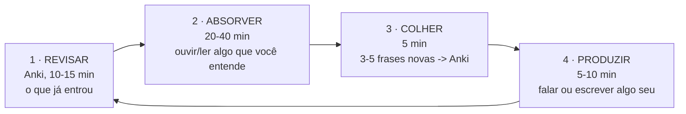

# 04 · Como começar — da tela vazia à sua primeira conversa

`Nível: iniciante` · `Última atualização: 31/08/2026`

> Pressupõe o ambiente do [03-instalacao](03-instalacao.md) pronto — ou, no mínimo, uma conta no
> AnkiWeb e um navegador. **Não repetimos a instalação aqui.**
> Objetivo deste arquivo: em 90 minutos você terá dito e entendido suas primeiras frases reais,
> e terá um ciclo de estudo que se repete todo dia.

---

## 04.1 O "hello world" do inglês

O equivalente do `print("hello world")` para uma língua **não é** uma lista de palavras.
É a menor unidade que já **funciona sozinha**: um diálogo completo que você consegue executar
inteiro, do começo ao fim.

Aqui está. Leia em voz alta. Sim, agora, em voz alta — este curso inteiro depende de você fazer
isso, e ninguém está ouvindo.

```text
A:  Hi! I'm Ronaldo.              /haɪ  aɪm .../          Oi! Eu sou o Ronaldo.
B:  Hi, Ronaldo. I'm Sarah.       /haɪ ... aɪm ˈsɛərə/    Oi, Ronaldo. Eu sou a Sarah.
A:  Nice to meet you.             /naɪs tə ˈmiːt juː/     Prazer em conhecer você.
B:  Nice to meet you too.         /naɪs tə ˈmiːt juː tuː/ Prazer em conhecer você também.
A:  Where are you from?           /wɛər ər juː frɒm/      De onde você é?
B:  I'm from Canada. And you?     /aɪm frəm ˈkænədə/      Sou do Canadá. E você?
A:  I'm from Brazil.              /aɪm frəm brəˈzɪl/      Sou do Brasil.
B:  Nice. What do you do?         /wɒt dʊ juː duː/        Legal. O que você faz (da vida)?
A:  I work with computers.        /aɪ wɜːk wɪð .../       Eu trabalho com computadores.
B:  Oh, cool.                     /oʊ kuːl/               Ah, legal.
```

Os símbolos entre barras são **IPA**, o alfabeto fonético — a única notação confiável para
pronúncia em inglês. Você não precisa dominá-lo hoje; precisa saber que ele existe e que
`ə` é o som mais comum da língua. O guia completo está em [05-manual-de-uso](05-manual-de-uso.md) §05.2.

### O que já tem aí dentro (e você nem percebeu)

| Fragmento | O que ensina |
|---|---|
| `I'm` | contração de `I am` — **o inglês falado é feito de contrações**; quem fala "I am" o tempo todo soa como robô |
| `Nice to meet you` | um **chunk**: bloco pronto, memorizado inteiro, não montado palavra a palavra |
| `Where are you from?` | ordem da pergunta: **palavra-Q + verbo + sujeito** |
| `What do you do?` | o `do` auxiliar, que não se traduz e existe só para formar a pergunta |
| `And you?` | devolver a pergunta com duas palavras — o truque nº 1 de sobrevivência |

**Meta de hoje:** dizer esse diálogo inteiro, de cor, nos dois papéis, sem olhar. Leva ~15 min.

---

## 04.2 Verificação — como saber que deu certo

Grave-se dizendo o diálogo (gravador do celular serve) e confira:

- [ ] Você disse **sem parar** entre as palavras de `Nice to meet you` — soa como *nice-tuh-MEET-chu*, uma coisa só.
- [ ] Você disse `I'm`, não `I am`.
- [ ] Em `What do you do?`, o segundo `do` é mais forte que o primeiro.
- [ ] Você conseguiu fazer os dois papéis sem consultar o texto.

Se marcou os quatro: **funcionou**. Você acabou de executar o primeiro programa.

Se travou: normal. Ouça um nativo dizendo cada linha — cole a frase no
https://youglish.com/ e repita atrás. Isso é *shadowing*, e é a técnica central do
[40-speaking](40-speaking.md).

---

## 04.3 O ciclo de trabalho diário

Este é o equivalente do "editar → compilar → rodar → depurar". Ele tem quatro fases e você vai
repeti-lo **todos os dias pelos próximos anos**. Aprenda-o bem.



| Fase | Tempo | O que fazer | Erro comum |
|---|---|---|---|
| **1 · Revisar** | 10–15 min | abrir o Anki e zerar as revisões do dia. **Primeiro, sempre** | deixar para o fim → não acontece → o baralho vira dívida e você abandona |
| **2 · Absorver** | 20–40 min | ouvir/ler algo em inglês que você entende ~90% | escolher material difícil demais por orgulho |
| **3 · Colher** | 5 min | tirar **3 a 5 frases inteiras** do material e virar cartões | colher 30 palavras soltas — ver [75-armadilhas](75-armadilhas.md) §75.2 |
| **4 · Produzir** | 5–10 min | falar sozinho sobre o dia, ou escrever 3 frases | pular esta fase; é a que mais dói e a que mais rende |

**Total: 40–70 min.** Em dia ruim, faça só a fase 1 (10 min). O que não pode é ter um dia zero.

> **A regra do ciclo:** você não avança fazendo mais no dia bom. Você avança **não zerando** no
> dia ruim. Sequência ininterrupta bate volume.

---

## 04.4 Onde arrumar material que você entende (hoje, de graça)

O critério é o do §2.5: **um texto onde você não conhece 3 a 5 palavras em cada 100**.

**Se você é zero absoluto (pré-A1 / A1):**

| Fonte | O que é | Link |
|---|---|---|
| BBC Learning English — *Beginner* | vídeos curtos com transcrição | https://www.bbc.co.uk/learningenglish |
| British Council LearnEnglish — *A1* | trilha estruturada com exercícios | https://learnenglish.britishcouncil.org/ |
| VOA Learning English — *Let's Learn English* | série completa, fala lenta | https://learningenglish.voanews.com/ |

**Se você é A2/B1:**

| Fonte | O que é |
|---|---|
| **VOA Learning English** — notícias em velocidade reduzida, com vocabulário controlado |
| **Simple English Wikipedia** — https://simple.wikipedia.org — o mundo inteiro em inglês fácil |
| **6 Minute English** (BBC) — podcast com transcrição, 6 min, dois apresentadores |
| **Graded readers** — livros escritos para nível: Penguin Readers, Oxford Bookworms |

**Se você é B1+:** pare de usar material didático. Use **material real do assunto que você já
gosta** — o item que você listou no §2.7. Canal de YouTube da sua área, podcast do seu hobby,
documentação da ferramenta que você usa. É aqui que o estudo deixa de ser obrigação.

---

## 04.5 Seu primeiro baralho no Anki, em 10 minutos

**Regra que define tudo:** o cartão guarda **uma frase**, não uma palavra solta.
Por quê? Porque palavra fora de contexto perde a companhia — e é a companhia (a *colocação*)
que faz você usar a palavra certo. Ver [20-vocabulario](20-vocabulario.md) §20.5.

1. No Anki: *Baralhos → Criar Baralho* → nome: `Inglês::Frases`.
   (`::` cria sub-baralho; use `Inglês::Frases`, `Inglês::Escuta` etc.)
2. *Adicionar* → tipo **Básico** ou **Cloze**.
3. Preencha assim:

**Cartão de reconhecimento (frente → verso):**
```
Frente:  Where are you from?
Verso:   De onde você é?
         [áudio]  · /wɛər ər juː frɒm/
```

**Cartão de lacuna (Cloze) — melhor para gramática e colocação:**
```
Texto:   I'm {{c1::from}} Brazil.
Dica:    (preposição de origem)
```

O Cloze força você a **produzir** a peça no meio de uma frase real, que é exatamente o que a
fala exige. Use Cloze para preposições, artigos, tempos verbais e expressões fixas.

4. Sincronize (`Y`). Abra no celular. Revise no ônibus.

**Quantos cartões por dia?** 10 novos. Não 50. Ver [03-instalacao](03-instalacao.md) §03.4.

---

## 04.6 Os cinco primeiros erros de uso (não de instalação)

Estes aparecem na primeira semana, em todo mundo.

### Erro 1 — Cartões com uma palavra só e tradução única
`house = casa`. Parece eficiente. É a maior fonte de "sei a palavra mas não consigo usar".
**Correção:** a frase inteira, do material que você leu. `I'm looking for a house to rent.`

### Erro 2 — Colher demais
Você lê um artigo, acha 40 palavras novas e põe todas no Anki. Em duas semanas você tem 200
revisões por dia e abandona.
**Correção:** máximo 5 por sessão. As outras 35 você reencontrará — o que é frequente volta.
Se não voltar, não era importante.

### Erro 3 — Ler a resposta antes de tentar
No Anki, você olha a frente, pensa "ah, é...", e vira o cartão. Isso não é revisão, é leitura.
O que consolida memória é o **esforço de recuperação**, não a exposição.
**Correção:** obrigue-se a **dizer a resposta em voz alta** antes de virar. Se não sair em
8 segundos, é "Again".

### Erro 4 — Estudar só de olho, nunca de ouvido
Você acumula vocabulário que só existe na versão escrita. Aí ouve `Whaddaya wanna do?` e não
reconhece `What do you want to do?` — palavras que você "sabe".
**Correção:** todo cartão importante ganha **áudio**. E 50% do seu tempo de absorção é escuta.

### Erro 5 — Esperar para falar
"Vou falar quando estiver pronto." Não vai. Você vai adiar por três anos e continuar não falando.
**Correção:** fale sozinho, hoje, no chuveiro, sobre o seu dia. Errado. Em voz alta.
A produção com erro que é corrigida ensina; a produção adiada não ensina nada.

---

## 04.7 A primeira semana, dia a dia

| Dia | Absorver (30 min) | Colher | Produzir (10 min) |
|---|---|---|---|
| 1 | o diálogo do §04.1 + um vídeo *Beginner* da BBC | 5 frases | dizer o diálogo nos dois papéis |
| 2 | mesmo vídeo do dia 1 + um novo | 5 frases | apresentar-se em voz alta, gravando |
| 3 | vídeo novo; **reveja o do dia 1 sem legenda** | 5 frases | descrever seu quarto em 5 frases |
| 4 | um episódio de *6 Minute English* com transcrição | 5 frases | escrever 5 frases sobre seu dia |
| 5 | mesmo episódio, **sem** transcrição | 3 frases | ler suas 5 frases do dia 4 em voz alta |
| 6 | algo do **seu** assunto favorito, em inglês | 5 frases | descrever seu trabalho em 6 frases |
| 7 | descanso ativo: uma série com legenda **em inglês** | 0 | recontar o episódio em voz alta, 2 min |

Ao fim da semana você terá: ~30 cartões, ~4 h de contato, e cinco gravações suas para comparar
depois. **Guarde a gravação do dia 2.** Em seis meses ela vale mais que qualquer certificado.

---

## 04.8 Como saber que está funcionando (métricas honestas)

Progresso em idioma é lento demais para ser sentido no dia a dia. Meça:

| Métrica | Como medir | Frequência |
|---|---|---|
| **Constância** | dias sem zerar, no Review Heatmap do Anki | diária |
| **Horas de contato** | um contador simples; o [07-projeto-modelo](07-projeto-modelo/) tem um script | semanal |
| **Cartões maduros** | *Estatísticas → Card Counts → Mature* (intervalo > 21 dias) | mensal |
| **Escuta** | reassistir um vídeo de 2 meses atrás e notar quanto ficou fácil | bimestral |
| **Fala** | regravar o mesmo texto de 3 meses atrás e comparar | trimestral |
| **Nível CEFR** | EF SET | semestral |

**Não meça:** "quantas palavras eu sei" (impossível de estimar sozinho e desmotivante),
nem "quanto tempo falta" (a curva é logarítmica e a estimativa sempre decepciona).

---

## 04.9 Os cinco porquês: por que revisão espaçada e não repetição normal?

1. Porque a memória decai exponencialmente após um encontro (curva do esquecimento, Ebbinghaus, 1885).
2. Por que revisar exatamente **antes** de esquecer? Porque o ganho de uma revisão é maior quanto
   mais difícil ela foi — sem falhar (*desirable difficulty*, Bjork).
3. Por que não revisar tudo todo dia, então? Porque o custo cresce linearmente com o número de
   itens e o benefício não; com 5.000 cartões, revisar tudo é ~4 h/dia. Inviável.
4. Por que um algoritmo, e não intuição? Porque a intuição humana sistematicamente superestima
   o que já sabe (*ilusão de fluência*): o que parece fácil na hora some em uma semana.
5. **Parada — limite matemático/econômico:** existe um trade-off duro entre retenção alvo e
   número de revisões/dia. O FSRS resolve isso como problema de otimização com dados reais.
   Elevar a retenção de 0,90 para 0,95 aumenta a carga diária em ~50%. Não há almoço grátis.

---

## Autoteste

1. Por que o "hello world" do inglês é um diálogo e não uma lista de palavras?
2. O que é um *chunk*? Aponte dois no diálogo do §04.1.
3. Descreva as quatro fases do ciclo diário e diga qual delas nunca pode ser pulada em dia ruim.
4. Qual é o critério numérico para escolher material do seu nível?
5. Por que um cartão do Anki deve conter uma frase e não uma palavra?
6. Explique a diferença entre "revisar" e "reler" no Anki, e por que ela importa.
7. Você "sabe" a frase `What do you want to do?` e não reconhece `Whaddaya wanna do?`. Qual erro do §04.6 explica isso?
8. Cite três métricas de progresso que valem a pena e uma que não vale.

**Próximo:** [05-manual-de-uso.md](05-manual-de-uso.md) — como ler a notação do campo (IPA, dicionário, glosas).
Depois: [06-exemplos.md](06-exemplos.md) e o [07-projeto-modelo/](07-projeto-modelo/).
