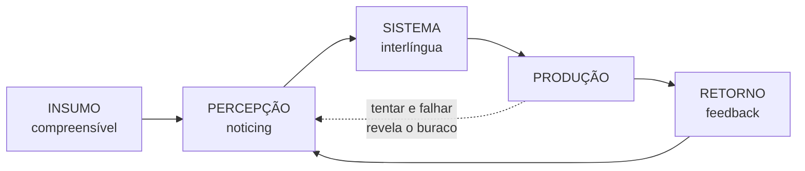

# 10 · Fundamentos — o que é uma língua e o que significa aprendê-la

`Nível: intermediário` · `Última atualização: 31/08/2026`

> Aqui os conceitos ganham nome preciso. Tudo que veio no [01](01-introducao-leigo.md) de forma
> intuitiva é redefinido formalmente, com a terminologia que a literatura usa.
> Este arquivo é o vocabulário de trabalho do resto do curso.

---

## 10.1 As camadas de uma língua

Toda língua natural é um sistema em camadas. Cada uma tem seus problemas e seu tipo de treino.

```
┌─────────────────────────────────────────────────────────────────┐
│ PRAGMÁTICA    o que se quer dizer, para quem, com que intenção   │  ← 55
│ ├─ DISCURSO   como as frases se ligam em texto/conversa          │  ← 45, 50
│ │  ├─ SEMÂNTICA   o significado das palavras e combinações       │  ← 20
│ │  │  ├─ SINTAXE     a ordem e a estrutura da frase              │  ← 25, 30
│ │  │  │  ├─ MORFOLOGIA  a forma das palavras (-s, -ed, -ing)     │  ← 25
│ │  │  │  │  ├─ FONOLOGIA   os sons que contrastam na língua      │  ← 12
│ │  │  │  │  │  └─ FONÉTICA   os sons como fatos físicos          │  ← 12
└─────────────────────────────────────────────────────────────────┘
```

**Por que a ordem importa:** um problema de camada baixa se disfarça de problema de camada alta.
Quem "não entende o que falam" quase nunca tem problema de vocabulário (semântica) — tem
problema de **fonologia**: não segmenta o fluxo sonoro em palavras. Diagnosticar na camada
errada é a causa mais comum de estudo desperdiçado. Ver [35-listening](35-listening.md) §35.2.

| Camada | Exemplo de problema | Onde tratar |
|---|---|---|
| Fonética/Fonologia | não distingue `ship`/`sheep`; não reconhece `wanna` | [12](12-fonetica-e-fonologia.md) |
| Morfologia | esquece o `-s` da 3ª pessoa; usa `-ed` em verbo irregular | [25](25-gramatica-nucleo.md) |
| Sintaxe | *"You like it?"* em vez de *"Do you like it?"* | [25](25-gramatica-nucleo.md) |
| Semântica | usa `make` onde vai `do` | [20](20-vocabulario.md) |
| Discurso | escreve parágrafos sem conectivo; texto "solto" | [50](50-writing.md) |
| Pragmática | soa rude sem querer; usa imperativo em pedido | [55](55-pragmatica-e-variacao.md) |

---

## 10.2 Competência × desempenho

Distinção introduzida por **Noam Chomsky** (1965) e ainda operante:

| | Definição | Como se observa |
|---|---|---|
| **Competência** | o conhecimento internalizado da língua | não se observa diretamente |
| **Desempenho** (*performance*) | o que a pessoa efetivamente diz ou entende, com gagueira, erro e cansaço | é tudo o que se observa |

Implicação prática incômoda: **você só é avaliado pelo desempenho.** Não adianta "saber" a regra
se sob pressão sai errado. E o inverso: um dia ruim de desempenho não significa que você
regrediu.

Consequência para o estudo: treine **sob condições parecidas com as reais** — com pressa, com
ruído, sem consultar. Estudar só em condições ideais produz competência que não sobrevive
ao desempenho.

---

## 10.3 Habilidades receptivas × produtivas, e o vocabulário assimétrico

| | Receptivo | Produtivo |
|---|---|---|
| Oral | **escutar** | **falar** |
| Escrito | **ler** | **escrever** |

O vocabulário se divide na mesma linha:

- **Vocabulário receptivo**: palavras que você reconhece ao ver ou ouvir.
- **Vocabulário produtivo**: palavras que você consegue **usar** espontaneamente.

O receptivo é tipicamente **2 a 3 vezes maior** que o produtivo — em nativos também. Isso não é
defeito; é a estrutura normal do léxico mental. Mas explica a queixa mais comum do mundo:

> *"Eu entendo tudo, só não consigo falar."*

Não é bloqueio psicológico. É que **as duas coisas são treinos diferentes**, e você só fez um.
Reconhecer exige apenas ativar uma memória; produzir exige recuperá-la sem pista, escolher entre
concorrentes e montar a forma correta em tempo real.

**Como converter receptivo em produtivo:** cartões de produção (cloze, tradução PT→EN),
escrita, e fala com correção. É por isso que o [07-projeto-modelo](07-projeto-modelo/) gera
**dois** cartões por frase.

---

## 10.4 O CEFR — o que é e o que ele não é

O **CEFR** (*Common European Framework of Reference for Languages*, em português "Quadro Europeu
Comum de Referência") é publicado pelo Conselho da Europa. A versão vigente é o
**Companion Volume de 2020**, que substituiu o provisório de 2018 e o original de 2001.

**O que ele é:** uma escala de **descritores de capacidade** — frases do tipo
*"consigo fazer X"* (*can-do statements*), organizadas em seis níveis.

**O que ele não é:**
- não é um currículo (não diz o que ensinar, nem em que ordem);
- não é uma contagem de palavras nem uma lista de gramática;
- não é um teste (IELTS, TOEFL, Cambridge **mapeiam** para o CEFR, não o definem).

### A estrutura

| Grupo | Níveis | Nome |
|---|---|---|
| **A** — usuário básico | A1, A2 | Breakthrough, Waystage |
| **B** — usuário independente | B1, B2 | Threshold, Vantage |
| **C** — usuário proficiente | C1, C2 | Effective Operational Proficiency, Mastery |

O Companion Volume de 2020 acrescentou o nível **Pré-A1** e subdivisões (`A2+`, `B1+`, `B2+`).

### A mudança de 2020 que importa: mediação

O CEFR original tinha quatro habilidades. O de 2020 organiza tudo em **quatro modos de
comunicação**:

| Modo | O que é | Exemplo |
|---|---|---|
| **Recepção** | ler, ouvir | ler a documentação |
| **Produção** | falar, escrever | apresentar o projeto |
| **Interação** | os dois ao mesmo tempo, com outra pessoa | reunião, chat |
| **Mediação** ⭐ | fazer a comunicação acontecer entre outros, ou entre um texto e alguém | resumir um artigo para o time; explicar o que o cliente estrangeiro quis dizer; traduzir informalmente numa reunião |

**A mediação é a habilidade mais usada no trabalho real e a menos ensinada.** O CEFR 2020
também acrescentou descritores para **interação online** e **competência plurilíngue** — usar
duas línguas na mesma interação, que é o que de fato acontece num time brasileiro que fala
inglês.

*Documento oficial (gratuito, PDF):* https://rm.coe.int/common-european-framework-of-reference-for-languages-learning-teaching/16809ea0d4

---

## 10.5 Interlíngua — a sua língua é um sistema, não uma pilha de erros

Conceito de **Larry Selinker** (1972), e um dos mais úteis do campo.

> **Interlíngua** é o sistema linguístico próprio do aprendiz, em cada momento: nem a língua
> materna, nem a língua-alvo, mas um terceiro sistema **com regras próprias e consistentes**.

Se você diz *"He don't like"* de forma sistemática, isso **não** é ausência de regra: é uma regra
sua (`don't` = negação universal). Ela está errada em relação ao inglês, mas é uma hipótese
coerente — e hipóteses se substituem com **evidência**, não com bronca.

Três implicações práticas:

1. **Erro sistemático ≠ descuido.** Se você erra sempre no mesmo ponto, tem uma regra errada
   instalada. Corrigir exige insumo abundante e atenção dirigida àquele ponto, não repetição
   de "não pode".
2. **Ordem natural.** Certas estruturas só são aprendidas depois de outras, e forçar a ordem não
   funciona. O `-s` da terceira pessoa (*he works*) é das últimas coisas a se estabilizar, mesmo
   sendo das primeiras a se ensinar. Ver [60-teoria-avancada](60-teoria-avancada.md) §60.5.
3. **Fossilização.** Um erro pode se estabilizar permanentemente, mesmo com anos de exposição —
   especialmente se ele **não atrapalha a comunicação** (e portanto nunca gera correção).
   É a razão de existir gente com 20 anos nos EUA que ainda diz *"I have 30 years"*.
   Prevenção: correção explícita cedo, e atenção consciente ao ponto. Ver [75-armadilhas](75-armadilhas.md) §75.7.

---

## 10.6 Insumo, produção e interação — o motor

| Termo | Definição | Papel |
|---|---|---|
| **Insumo** (*input*) | a língua que você recebe e **entende** | matéria-prima; sem ele não há aquisição |
| **Insumo compreensível** | insumo levemente acima do seu nível (`i+1`) | onde a aquisição acontece |
| **Produção** (*output*) | a língua que você produz | força o processamento **sintático**, não só semântico |
| **Interação negociada** | conversa em que se pede repetição, se reformula, se confirma | ⭐ combina os dois e gera insumo sob medida |
| **Percepção** (*noticing*) | dar-se conta conscientemente de uma forma | Schmidt (1990): sem notar, não entra |
| **Retorno** (*feedback*) | correção, reformulação, cara de incompreensão | fecha o ciclo |

**Por que a produção é indispensável, se o insumo já ensina?** Porque entender uma frase pode ser
feito **só pela semântica**: *"Yesterday he go to the store"* é perfeitamente compreensível — você
não precisa processar o tempo verbal para entender. Já **produzir** exige decidir a forma. Esse é
o argumento de **Merrill Swain** (1985), e é a razão de o [07-projeto-modelo](07-projeto-modelo/)
insistir em cartões de produção.



---

## 10.7 Aquisição × aprendizado

Distinção de **Stephen Krashen** (1982), muito citada e muito disputada:

| | Aquisição | Aprendizado |
|---|---|---|
| Como acontece | inconsciente, por exposição a significado | consciente, por estudo de regra |
| Produz | fluência espontânea | conhecimento sobre a língua |
| Serve para | falar | monitorar/corrigir, se houver tempo |

Krashen sustentava que os dois sistemas são **separados** e que o aprendizado consciente
**nunca** vira aquisição ("hipótese da não-interface"). Essa posição forte é hoje **minoritária**.
A visão dominante (posição de interface fraca ou forte) é que o conhecimento explícito **acelera
a percepção** e, com prática suficiente, se automatiza.

**Fato · consenso · opinião:**
- **Fato:** insumo compreensível abundante é necessário. Ninguém contesta.
- **Consenso amplo:** só regra, sem uso, não produz fluência.
- **Disputado:** se o conhecimento explícito vira implícito, e em que medida.
- **Minha recomendação profissional:** gaste ~85% do tempo em insumo e uso, ~15% em gramática
  explícita usada como **atalho de percepção** — para adultos, entender a regra encurta o
  caminho até notar a forma no insumo. Detalhe em [60-teoria-avancada](60-teoria-avancada.md).

---

## 10.8 O que compõe a fluência, tecnicamente

Fluência não é uma coisa só. A literatura decompõe a produção em três dimensões (**CAF**), que
**competem entre si**:

| Dimensão | O que mede | Como aumentar |
|---|---|---|
| **Complexidade** | frases subordinadas, vocabulário raro | ler e escrever material difícil |
| **Correção** (*accuracy*) | ausência de erro | atenção, correção, revisão |
| **Fluência** | velocidade, pausas, ausência de reformulação | repetição, chunks, prática cronometrada |

**O trade-off é real e mensurável:** ao pedir a um aprendiz que fale com mais precisão, a
velocidade cai; ao pedir mais velocidade, os erros sobem. Você não maximiza os três ao mesmo
tempo — **escolhe** o alvo de cada exercício.

Aplicação: numa apresentação de trabalho, priorize **correção e fluência** e reduza a
complexidade deliberadamente. Frase simples e correta comunica melhor que frase elaborada e
truncada. Isso não é "falar mal"; é engenharia de comunicação.

---

## 10.9 Os cinco porquês: por que entender é mais fácil que falar?

1. Porque reconhecer exige menos que recuperar.
2. Por quê? Porque no reconhecimento o estímulo já traz a pista; na produção você parte do
   significado e precisa buscar a forma sem pista.
3. Por que isso é mais caro? Porque a busca compete com outras palavras semelhantes e exige
   inibir as erradas — inclusive as do português.
4. Por que a competição do português é forte? Porque o português está muito mais consolidado
   (décadas de uso diário) e vence por ativação, a não ser que o inglês esteja fortemente
   automatizado naquele item.
5. **Parada — arquitetura da memória:** é uma propriedade geral da memória humana, não do inglês.
   Reconhecimento e recordação livre têm curvas de desempenho diferentes em qualquer domínio
   (o mesmo vale para nomes de pessoas, ruas, música). Não há atalho: a única forma de melhorar
   recordação é **praticar recordação**.

---

## Autoteste

1. Liste as camadas de uma língua, da mais concreta à mais abstrata.
2. Alguém diz "não entendo o que falam". Em que camada está o problema, provavelmente, e por quê?
3. Diferencie competência de desempenho e diga qual delas é avaliada.
4. Por que o vocabulário receptivo é maior que o produtivo, mesmo em nativos?
5. O que o CEFR é e o que ele explicitamente não é?
6. O que é mediação e por que ela é a habilidade mais usada no trabalho?
7. Explique interlíngua e diga por que erro sistemático não é descuido.
8. Qual o argumento de Swain para a produção ser indispensável, se o insumo já ensina?
9. Onde Krashen está em consenso e onde está em minoria?
10. O que é o trade-off CAF e como usá-lo a seu favor numa apresentação?

**Próximo:** [11-historia.md](11-historia.md) — por que o inglês é assim.
