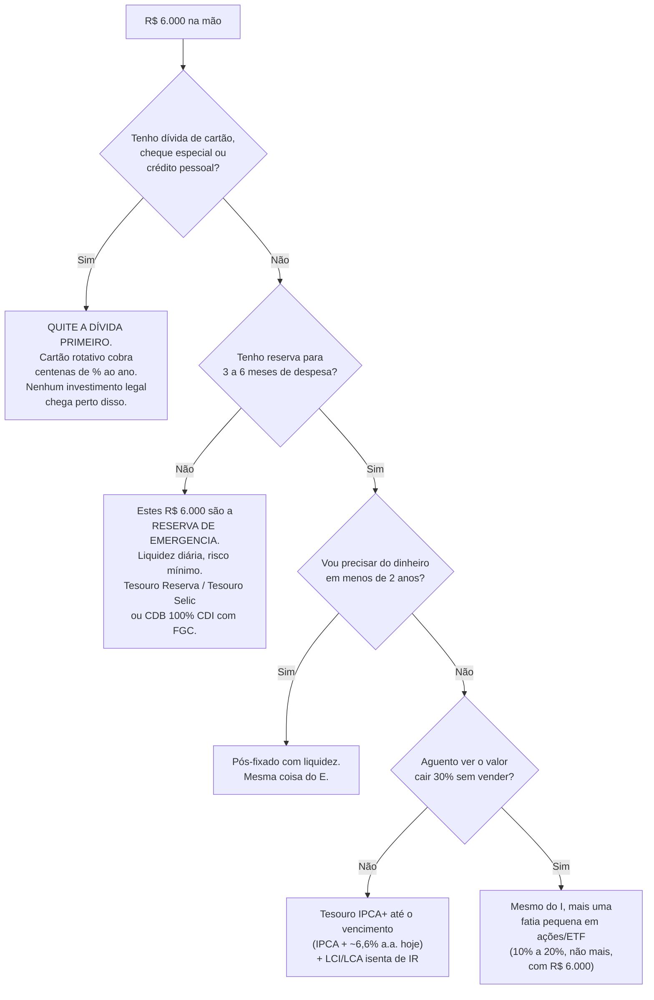

# 01 · O que é investir — explicado para quem nunca investiu

**Nível: iniciante** · *Dados de mercado desta página: 20/08/2026*

> **Aviso obrigatório, e leia até o fim.** Este material é **educacional**. Não é
> recomendação personalizada de investimento. Quem faz recomendação personalizada no
> Brasil precisa de registro na CVM (Resolução CVM 19/2021 para consultores,
> Resolução CVM 178/2023 para assessores). Eu não sou registrado, não conheço sua
> renda, suas dívidas, seu emprego nem seus planos. O que este curso faz é te ensinar
> a **decidir sozinho** — inclusive a desconfiar de mim. Todo número aqui tem data e
> fonte; confira antes de agir, porque preço e lei mudam.

---

## 1. A pergunta que traz quase todo mundo aqui

> *"Tenho R$ 6.000 parados. Qual é o jeito mais seguro e mais lucrativo de investir?"*

A resposta honesta tem duas partes, e a primeira decepciona:

**"Mais seguro" e "mais lucrativo" são, em geral, direções opostas.** Se existisse um
lugar que pagasse mais que todos os outros *e* fosse mais seguro que todos os outros,
todo mundo colocaria o dinheiro lá. A demanda derrubaria o retorno até ele voltar a
ficar igual ao dos outros. Isso não é opinião: é a mecânica de qualquer mercado com
gente prestando atenção. Quem te promete os dois ao mesmo tempo está errado,
está te vendendo algo, ou está mentindo.

**Mas** — e aqui vem a segunda parte — o Brasil de agosto de 2026 é um caso raro em
que o ativo **mais seguro do país** paga um retorno que na maioria dos países só se
consegue correndo risco alto. A taxa básica de juros (Selic) está em **14,00% ao ano**
(Copom, 05/08/2026) e a inflação dos últimos 12 meses foi de **4,44%** (IPCA de julho,
IBGE). Emprestar dinheiro para o governo brasileiro está pagando, hoje, cerca de
**9% ao ano acima da inflação**. Isso é altíssimo. Nos Estados Unidos, o mesmo tipo de
título paga em torno de 2% acima da inflação.

Ou seja: **hoje você não precisa escolher entre segurança e retorno tão fortemente
quanto de costume.** Essa é a resposta curta à sua pergunta, e o resto do curso é o
"por quê" e o "como".

---

## 2. O que é investir, sem nenhuma palavra difícil

Imagine que você tem uma vaca leiteira.

- Se você **come a vaca**, você jantou bem uma vez e acabou.
- Se você **guarda a vaca viva**, ela te dá leite todo dia. Você não ficou sem nada:
  transformou um bem que se consome de uma vez num bem que produz.

Investir é isso. Você pega dinheiro que **poderia gastar hoje** e o entrega a alguém
que vai usá-lo para produzir algo. Em troca, essa pessoa te devolve o dinheiro depois
**com um pedaço a mais**. Esse pedaço a mais é o **rendimento** (ou *retorno*).

**Quem é "alguém"?** Só existem, no fundo, quatro destinos possíveis para o seu dinheiro:

| Você empresta para… | O nome disso no mercado | O que você recebe |
|---|---|---|
| o **governo** | título público (Tesouro Direto) | juros combinados |
| um **banco** | CDB, LCI, LCA, poupança | juros combinados |
| uma **empresa**, emprestando | debênture, CRI, CRA | juros combinados |
| uma **empresa**, virando sócio | ação, fundo imobiliário | parte do lucro dela — se houver |

As três primeiras linhas são **renda fixa**: você empresta e a regra do quanto vai
receber é combinada na hora. A última é **renda variável**: você vira dono de um
pedaço, e ganha se o negócio for bem — ou perde se for mal.

Guarde essa tabela. Todo produto financeiro que te oferecerem, por mais nome
complicado que tenha, é uma dessas quatro coisas embrulhada de algum jeito. Quando
alguém te apresentar um investimento e você não souber dizer **para quem o seu dinheiro
está indo** e **de onde sai o lucro**, não invista. Essa única regra te protege de
90% das fraudes.

---

## 3. Por que alguém pagaria para usar o seu dinheiro?

Porque dinheiro hoje vale mais que dinheiro amanhã, por três motivos independentes:

1. **Impaciência.** Você prefere o sorvete hoje ao sorvete daqui a um ano. Para abrir
   mão do hoje, você exige compensação.
2. **Inflação.** Se os preços sobem 4,44% ao ano, os mesmos R$ 100 compram menos daqui
   a um ano. Só empatar já exige receber 4,44%.
3. **Risco.** Existe a chance de você não receber de volta. Quanto maior essa chance,
   maior o "a mais" que você exige.

O rendimento que você recebe é a soma dessas três compensações. E é por isso que
**quem paga mais está, quase sempre, te dizendo que é mais arriscado** — mesmo quando
não fala isso em voz alta. Um banco pequeno que oferece 120% do CDI não está sendo
generoso: está sendo caro porque poucos querem emprestar para ele.

> **Regra prática de sobrevivência:** quando a taxa oferecida for muito acima da dos
> outros, sua primeira pergunta não é "quanto vou ganhar?" — é **"qual é o risco que
> os outros estão vendo e eu não estou?"**

---

## 4. O inimigo silencioso: inflação

Muita gente acha que o oposto de ganhar dinheiro é perder dinheiro. Não é. O oposto é
**ficar parado enquanto os preços sobem**.

Se você guarda R$ 6.000 embaixo do colchão e a inflação é 4,44% ao ano:

| Ano | Você tem | Compra o equivalente a (em poder de compra de hoje) |
|---|---|---|
| 0 | R$ 6.000 | R$ 6.000 |
| 1 | R$ 6.000 | R$ 5.745 |
| 5 | R$ 6.000 | R$ 4.829 |
| 10 | R$ 6.000 | R$ 3.886 |

Você não foi roubado, ninguém tirou nada da sua conta — e mesmo assim **perdeu 35% em
dez anos**. Por isso a frase "não invisto porque tenho medo de perder" é uma escolha
que também perde; só perde devagar e sem barulho.

Daí vem a distinção mais importante deste curso inteiro:

- **Retorno nominal** — o número que aparece na tela. "Rendeu 13,9%."
- **Retorno real** — o que sobrou depois de descontar a inflação. "Rendeu 9,1% de verdade."

**Sempre pense em real.** Em 1993, uma aplicação rendia 2.000% ao ano no Brasil e o
investidor **empobrecia**, porque a inflação era maior que isso. Número grande não é
sinônimo de bom negócio ([ver história](11-historia.md)).

---

## 5. Os juros compostos, que são o ponto inteiro da coisa

Juro **simples**: você ganha sempre sobre o valor inicial.
Juro **composto**: você passa a ganhar também sobre os juros que já ganhou.

Com R$ 6.000 a 11,5% ao ano (que é, aproximadamente, o que rende hoje um título
público depois do imposto — a conta está em [06-exemplos](06-exemplos.md)):

| Anos | Juro simples | Juro composto | Diferença |
|---|---|---|---|
| 1 | R$ 6.690 | R$ 6.690 | — |
| 5 | R$ 9.450 | R$ 10.340 | R$ 890 |
| 10 | R$ 12.900 | R$ 17.820 | R$ 4.920 |
| 20 | R$ 19.800 | R$ 52.924 | R$ 33.124 |
| 30 | R$ 26.700 | R$ 157.180 | R$ 130.480 |

Em 30 anos o composto entrega **quase 6 vezes** o simples. O motivo é que juro composto
é uma **função exponencial**, e o cérebro humano é ruim com exponenciais — a curva
parece plana por muito tempo e depois dispara. É por isso que "comecei cedo" bate
"acertei o investimento" na maior parte das histórias reais de patrimônio.

**Regra dos 72** (truque de mesa de bar, mas funciona): divida 72 pela taxa anual e
você tem, aproximadamente, quantos anos leva para dobrar o dinheiro.
72 ÷ 11,5 ≈ **6,3 anos** para os seus R$ 6.000 virarem R$ 12.000. Na poupança
(8,3% a.a. hoje): 72 ÷ 8,3 ≈ 8,7 anos. Quase dois anos e meio de diferença, pela
mesma ausência de risco.

---

## 6. O tripé: não dá para ter os três

Todo investimento se descreve por três características, e **você só consegue duas
boas ao mesmo tempo**:

```
              SEGURANÇA
             (chance de
           receber de volta)
                 /\
                /  \
               /    \
              /      \
             /        \
    LIQUIDEZ ---------- RENTABILIDADE
   (rapidez para        (quanto paga)
   virar dinheiro
   sem perder valor)
```

- **Poupança**: segura ✔ · líquida ✔ · rende mal ✘
- **Tesouro Selic / CDB de banco grande**: seguro ✔ · líquido ✔ · rende razoável ✔ ← *a anomalia brasileira de 2026*
- **CDB de banco pequeno com 3 anos de prazo**: rende alto ✔ · coberto pelo FGC ✔ · sem liquidez ✘
- **Ação**: pode render muito ✔ · líquida ✔ · segura ✘
- **Imóvel**: relativamente seguro ✔ · pode render ✔ · líquido ✘ (leva meses para vender)

Repare que o Brasil de hoje quase quebra o triângulo no segundo item. É temporário —
é consequência de a Selic estar em 14% — e é a razão pela qual a resposta à sua
pergunta hoje é **mais simples** do que seria em 2020, quando a Selic estava em 2%.

---

## 7. A resposta curta à sua pergunta

Você tem R$ 6.000. Antes de qualquer produto, a ordem correta é esta — e ela não é
negociável, é a sequência que evita que você perca dinheiro por motivos que não têm
nada a ver com investimento:



Para a maioria absoluta das pessoas com R$ 6.000, a resposta cai nos quadros **E** ou
**G**: pós-fixado, líquido, garantido. E a boa notícia de 2026 é que esse quadro,
o mais seguro de todos, está pagando **cerca de 11,5% líquidos ao ano** — quase
**7% acima da inflação**. Não existe, hoje no Brasil, um "seguro e lucrativo" melhor
que esse para esse valor. Qualquer coisa que prometa muito mais está aumentando o
risco, e você precisa saber exatamente qual.

Os números, as contas e o passo a passo para executar estão em
[04-como-comecar.md](04-como-comecar.md) e [06-exemplos.md](06-exemplos.md).

---

## 8. Cinco frases que você vai ouvir, e o que elas realmente significam

| O que dizem | O que significa |
|---|---|
| "Rende 120% do CDI!" | O banco emissor é pequeno e precisa pagar caro para captar. Confira o FGC e o limite de R$ 250 mil. |
| "É garantido pelo governo." | Só título público é. CDB é coberto pelo **FGC**, que é um fundo privado mantido pelos bancos, não o Tesouro. |
| "Rentabilidade passada de 30% no ano!" | Rentabilidade passada não se repete. E 30% num ano de Selic 14% pode ter vindo de risco altíssimo. |
| "Esse produto é exclusivo para você." | Você está falando com um vendedor comissionado, não com um consultor. Pergunte quanto ele ganha na venda. |
| "Renda passiva garantida de 3% ao mês." | 3% ao mês = 42,6% ao ano. Nenhum ativo legal paga isso com garantia. É pirâmide ou fraude. Denuncie à CVM. |

---

## 9. O que você já sabe depois desta página

- Investir é emprestar (renda fixa) ou virar sócio (renda variável). Só isso.
- O rendimento paga impaciência + inflação + risco.
- O que importa é o **retorno real**, depois da inflação — e do imposto.
- Juros compostos são exponenciais; tempo importa mais que esperteza.
- Segurança, liquidez e rentabilidade formam um tripé: escolha dois.
- Em agosto de 2026 o Brasil paga juro real perto de 9% no ativo mais seguro que existe.
- Dívida cara vem antes de qualquer investimento. Reserva de emergência vem depois.

---

## Autoteste

1. Explique, sem usar a palavra "juros", por que alguém paga para usar seu dinheiro.
2. Um investimento rendeu 12% num ano em que a inflação foi 14%. Você ganhou ou perdeu?
   Em quanto, em termos reais?
3. Cite os quatro destinos possíveis do seu dinheiro e diga qual deles é renda variável.
4. Pela regra dos 72, quantos anos leva para dobrar o capital a 9% ao ano?
5. Um amigo te oferece um investimento que paga 2% ao mês, com garantia e resgate a
   qualquer momento. Escreva as três perguntas que você faz antes de responder.
6. Por que a poupança pode ser uma péssima escolha mesmo "nunca perdendo dinheiro"?
7. Você tem R$ 6.000 e uma fatura de cartão de R$ 3.000 rolando. O que faz primeiro, e por quê?

*(Respostas comentadas em [70-pratica.md](70-pratica.md).)*

---

**Fontes desta página** (consultadas em 20/08/2026): Banco Central do Brasil — decisão
do Copom de 05/08/2026 (Selic 14,00% a.a.); IBGE — IPCA de julho/2026, 4,44% em 12 meses;
Banco Central — CDI 13,90% a.a. em 18/08/2026. Detalhes e links em
[95-referencias.md](95-referencias.md).

**Próximo:** [02-pre-requisitos.md](02-pre-requisitos.md)
