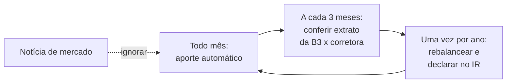

# 04 · Como começar — do ambiente pronto aos R$ 6.000 aplicados

**Nível: iniciante** · *Atualizado em 20/08/2026*

Este arquivo assume que você já fez o [03-instalacao.md](03-instalacao.md): conta
aberta, 2FA ativo, adesão ao Tesouro Direto feita, Pix de teste confirmado.
**Não repetimos a instalação aqui.**

Objetivo: em cerca de 30 minutos, sair de "dinheiro parado" para "dinheiro aplicado,
rendendo, e você sabendo exatamente onde ele está e como tirar".

---

## Passo 0 — os dois números que decidem tudo

Antes de abrir qualquer app, escreva:

```
Despesa média mensal (últimos 3 meses) ....... R$ __________
Prazo em que vou precisar deste dinheiro ..... __________ meses (ou "não sei")
```

**Se você respondeu "não sei" ao prazo**, a resposta é: *pós-fixado com liquidez
diária*. Isso não é preguiça, é a decisão correta sob incerteza — é o único produto
que não te pune por mudar de ideia. Você pode migrar depois sem custo relevante.

Rode, se quiser a conta pronta:

```bash
cd 07-projeto-modelo
python3 carteira.py plano --valor 6000 --despesa-mensal 2500
```

---

## Passo 1 — o "hello world" do investidor: R$ 100 no Tesouro

Não comece com R$ 6.000. Comece com **R$ 100**, para provar que o mecanismo funciona
antes de confiar nele. O objetivo deste passo não é rendimento, é **eliminar o medo
por evidência**.

1. Transfira R$ 100 por Pix para a sua conta na corretora.
2. Menu **Tesouro Direto** → **Tesouro Selic 2031** (ou **Tesouro Reserva**, se a sua
   instituição já oferecer).
3. Digite **R$ 100** e confirme. O sistema comprará uma **fração** do título — você
   verá algo como `0,53 título`. Isso é normal: o Tesouro Direto vende a partir de 1%
   de um título.
4. Confirme a ordem.

**Verificação — o que você deve ver:**

```
Status da ordem: Confirmada / Liquidada
Posição: Tesouro Selic 2031 — 0,53 título — R$ 100,00
Rentabilidade: SELIC + 0,0x% a.a.
```

A liquidação (o dinheiro sair da conta e virar título) ocorre em **D+1 útil** para o
Tesouro Selic. Se você comprou às 20h de uma sexta, a ordem executa na segunda.
No **Tesouro Reserva**, a compra é imediata, 24×7.

**Verificação independente:** um dia útil depois, entre na
[Área do Investidor da B3](https://www.b3.com.br/pt_br/produtos-e-servicos/central-depositaria/canal-com-investidores/area-do-investidor/)
e confira que a posição aparece lá também. Se aparece na B3, existe de verdade — não
depende da corretora dizer que existe.

---

## Passo 2 — resgate R$ 50 antes de aplicar o resto

Este é o passo que quase todo tutorial pula, e é o mais importante para você dormir
tranquilo: **teste a saída antes de precisar dela.**

1. Menu Tesouro Direto → sua posição → **Resgatar** → R$ 50.
2. Confirme.

**Verificação:**

| Título | Quando o dinheiro cai na conta da corretora |
|---|---|
| Tesouro Selic | mesmo dia útil, se a ordem for até as 13h; senão, D+1 |
| Tesouro Reserva | imediato, 24×7 |
| Demais títulos | D+1 útil |

3. Faça um Pix da corretora **para a sua conta bancária**. Confirme que caiu.

Agora você sabe, por experiência própria e não por promessa, quanto tempo leva do
"quero meu dinheiro" ao "dinheiro na conta". **Esse número é a sua verdadeira
liquidez.** Para uma reserva de emergência ele importa mais do que a taxa.

> Observação sobre o IOF: resgatando em menos de 30 dias, o IOF come de 96% (dia 1) a
> 3% (dia 29) do **rendimento** — nunca do principal. Nos R$ 50 do teste, isso são
> centavos. Você não perdeu dinheiro; pagou o preço de aprender.

---

## Passo 3 — aplicar os R$ 6.000

Agora com convicção. Três caminhos, conforme a resposta do Passo 0:

### Caminho A — "é a minha reserva de emergência" ou "não sei o prazo"

**O que fazer:** 100% em pós-fixado com liquidez diária.

| Ordem de preferência | Produto | Por quê |
|---|---|---|
| 1º | **Tesouro Reserva** (se disponível) | 100% da Selic, 24×7, sem oscilação de preço, mínimo de R$ 1 |
| 2º | **Tesouro Selic** | mesma coisa, com oscilação minúscula; disponível em todas as corretoras; **custódia zero até R$ 10 mil** |
| 3º | **CDB de liquidez diária a 100% do CDI ou mais**, em banco sólido | cobertura do FGC até R$ 250 mil; alguns pagam 100–110% do CDI |
| **evite** | poupança e fundo DI com taxa acima de 0,3% | rendem menos pelo mesmo risco — as contas estão em [06-exemplos.md](06-exemplos.md) |

**Números reais, executados pelo simulador deste curso** (R$ 6.000, cenário de
20/08/2026, 365 dias):

| Produto | Líquido em 12 meses | % a.a. líquido | % a.a. real |
|---|---|---|---|
| CDB 110% CDI | R$ 756,86 | 12,61% | 7,83% |
| LCI 88% CDI (isenta, carência 6 meses) | R$ 733,92 | 12,23% | 7,46% |
| Tesouro Selic | R$ 690,03 | 11,50% | 6,76% |
| Tesouro Reserva / CDB 100% CDI | R$ 688,05 | 11,47% | 6,73% |
| Fundo DI com taxa de 0,50% | R$ 656,89 | 10,95% | 6,23% |
| Fundo DI com taxa de 2,00% | R$ 575,10 | 9,58% | 4,93% |
| **Poupança** | **R$ 500,58** | **8,34%** | **3,74%** |

A diferença entre a poupança e o topo da lista é de **R$ 256 em um ano** sobre
R$ 6.000, com o mesmo risco. Em dez anos, com aportes, essa diferença vira dinheiro
de verdade.

### Caminho B — "vou precisar em 2 a 5 anos" (entrada de carro, viagem, curso)

- **50% a 70%** em LCI/LCA isenta de IR com vencimento compatível — hoje a isenção
  vale muito, porque a alíquota que você deixa de pagar é sobre um rendimento alto.
- **30% a 50%** em pós-fixado líquido, para não ficar refém do prazo.
- **Cuidado com a carência:** desde a Resolução CMN 5.215 (22/05/2025), LCI e LCA
  sem indexação a índice de preços têm carência mínima de **6 meses**; as indexadas
  a índice de preços continuam com 36 meses (LCI) e 12 meses (LCA).

### Caminho C — "é dinheiro de 10 anos ou mais" (aposentadoria, filho pequeno)

- **Trave o juro real** com **Tesouro IPCA+** de vencimento longo. Hoje, em torno de
  **IPCA + 6,65% ao ano** (14/08/2026) — historicamente, um patamar alto.
- Só depois disso, e com no máximo 10% a 20% do valor, pense em renda variável
  ([ver 20-renda-variavel.md](20-renda-variavel.md)). Com R$ 6.000, a diversificação
  em ações individuais é ruim; se for entrar, use **ETF de índice**.
- **Regra dura:** o dinheiro do Tesouro IPCA+ precisa ficar até o vencimento. Antes
  disso, o preço oscila — pode cair 20% e voltar. Quem vende no susto transforma
  oscilação em prejuízo.

---

## Passo 4 — o ciclo de trabalho do dia a dia

O ciclo correto é **entediante de propósito**:



| Frequência | O que fazer | O que NÃO fazer |
|---|---|---|
| **Diário** | nada | olhar a cotação. Sério: olhar todo dia aumenta a chance de você vender no pior momento |
| **Mensal** | aportar (programe débito automático), conferir se o aporte entrou | mudar de produto |
| **Trimestral** | conferir a Área do Investidor da B3 contra o app da corretora | reagir a manchete |
| **Anual** | rebalancear a alocação, revisar taxas, declarar no IR | "melhorar" a carteira por tédio |
| **Quando a vida mudar** | revisar objetivo e prazo (casou, mudou de emprego, teve filho) | — |

**Aporte automático é a única "técnica" com evidência sólida de funcionar** para o
investidor comum: ele remove a decisão, e a decisão é onde a maioria erra.

---

## Passo 5 — declarar no Imposto de Renda

Você vai receber, entre fevereiro e março, um **informe de rendimentos** de cada
instituição. Ele traz tudo pronto.

| O que você tem | Onde declarar | Observação |
|---|---|---|
| Saldo em CDB, LCI, LCA, Tesouro em 31/12 | ficha **Bens e Direitos**, grupo 04 (Aplicações e Investimentos) | valor do informe, não o que você acha |
| Rendimento de CDB, Tesouro, fundo | **Rendimentos Sujeitos à Tributação Exclusiva/Definitiva** | o IR já foi retido na fonte; você só informa |
| Rendimento de LCI, LCA, poupança | **Rendimentos Isentos e Não Tributáveis** | isento, mas **declarável** |
| Saldo em conta corrente acima de R$ 140 | Bens e Direitos, grupo 06 | limite vigente na declaração de 2026 |

**Você é obrigado a declarar** se, entre outras hipóteses, tiver bens acima do limite
da instrução normativa do ano ou rendimentos tributáveis acima do piso. Investir não
cria obrigação nova por si só, mas os bancos informam tudo à Receita pela e-Financeira —
**divergência cai em malha**. Confira os limites do ano na
[Receita Federal](https://www.gov.br/receitafederal) antes de declarar.

> **Não confunda:** o IR da renda fixa é **retido na fonte** e a alíquota é definitiva.
> Você não paga de novo na declaração e não pode compensar com outras rendas.

---

## Os cinco primeiros erros de uso (não de instalação)

| Erro | O que acontece | Como sair |
|---|---|---|
| **1. Resgatar antes de 30 dias** | IOF come até 96% do rendimento | não é fatal, mas planeje: deixe pelo menos 30 dias, e prefira produtos sem carência para o dinheiro incerto |
| **2. Resgatar a poupança um dia antes do "aniversário"** | perde o mês inteiro de rendimento | se estiver na poupança, resgate sempre **depois** da data do aniversário mensal |
| **3. Ver o Tesouro IPCA+ cair e vender** | transforma oscilação (marcação a mercado) em prejuízo real | se comprou para levar ao vencimento, a queda não te afeta. Ver [12-renda-fixa.md](12-renda-fixa.md) |
| **4. Comprar CDB de prazo longo com o dinheiro da emergência** | quando a emergência chegar, você não consegue sacar | separe fisicamente: reserva num produto líquido, objetivo noutro |
| **5. Espalhar R$ 6.000 em 8 produtos "para diversificar"** | multiplica trabalho e imposto sem reduzir risco relevante | com R$ 6.000, **um** produto pós-fixado bom já está certo. Diversificação começa a importar depois, e entre **classes**, não entre produtos iguais |

---

## Verificação final — você terminou este arquivo quando…

- [ ] Você aplicou um valor pequeno e viu a posição aparecer **na B3**, não só no app
- [ ] Você resgatou um valor pequeno e cronometrou quanto tempo levou até cair na conta
- [ ] Os R$ 6.000 estão aplicados, e você sabe dizer em uma frase **por que ali**
- [ ] Você sabe qual é a carência e qual é a liquidez do que comprou
- [ ] Você programou um lembrete trimestral para conferir o extrato da B3
- [ ] Você guardou onde encontrar o informe de rendimentos em fevereiro

---

## Autoteste

1. Por que começar com R$ 100 em vez dos R$ 6.000?
2. Qual a diferença entre "liquidez diária" e "resgate imediato"? Qual dos dois o
   Tesouro Selic oferece?
3. Você resgatou no 12º dia e o rendimento sumiu quase todo. O que aconteceu, e sobre
   qual base incidiu?
4. Qual é a única "técnica" de investimento com evidência sólida de funcionar para o
   investidor comum?
5. Rendimento de LCI é isento — então não precisa declarar? Justifique.
6. Você comprou Tesouro IPCA+ 2035 e três meses depois a posição mostra −8%. O que
   você faz, e por quê?
7. Com R$ 6.000, quantos produtos diferentes fazem sentido? Por quê?

---

**Fontes desta página** (consultadas em 20/08/2026): valores da tabela produzidos pelo
[07-projeto-modelo](07-projeto-modelo/) deste curso, com indicadores do BCB, IBGE e B3
de agosto/2026; Resolução CMN 5.215, de 22/05/2025, sobre carência de LCI/LCA;
Tesouro Direto — regras de liquidação e horários; taxas do Tesouro IPCA+ conforme
noticiado em 14/08/2026. Links em [95-referencias.md](95-referencias.md).

**Próximo:** [05-manual-de-uso.md](05-manual-de-uso.md)
