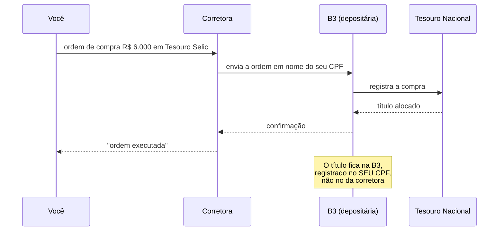

# 12 · Renda fixa por dentro — como o título funciona de verdade

**Nível: intermediário a avançado** · *Atualizado em 20/08/2026*

Aqui abrimos a caixa-preta. Ao final você deve conseguir calcular no papel o preço de
um título público, explicar por que ele oscila e dizer quanto o banco ganha quando te
vende um CDB.

---

## 1. Renda fixa é um empréstimo com regra combinada

"Fixa" não quer dizer que o valor não muda — quer dizer que **a regra de remuneração é
definida na emissão**. Existem três regras possíveis:

| Regra | O que é combinado | Você conhece o valor final? |
|---|---|---|
| **Prefixada** | a taxa | **sim**, se levar ao vencimento |
| **Pós-fixada** | o indexador (Selic, CDI) | não — depende do que o indexador fizer |
| **Híbrida** | índice de preços + taxa real | não em reais, **sim em poder de compra** |

---

## 2. O título prefixado: uma promessa de R$ 1.000

O **Tesouro Prefixado (LTN)** é o objeto financeiro mais simples que existe: uma
promessa de pagar **R$ 1.000,00 na data de vencimento**. Nada antes disso.

Se ele promete R$ 1.000 daqui a `n` anos e o mercado exige uma taxa `i`, o preço hoje é:

```
        1000
P =  -----------
      (1 + i)^n
```

Com a taxa de 14,20% ao ano vista em 14/08/2026 para o Prefixado 2029 (cerca de 2,4 anos):

```python
preco = 1000 / (1.1420 ** 2.4)
print(round(preco, 2))    # 727.11
```

Você paga R$ 727,11 e recebe R$ 1.000 em 2029. A "taxa" que aparece na tela **é a taxa
interna de retorno** dessa operação — não é um juro creditado mensalmente.

**Consequência número 1:** o preço e a taxa são a **mesma informação**, invertida.
Preço sobe ⇔ taxa cai. Sempre.

**Consequência número 2:** se amanhã o mercado passar a exigir 15,20% para o mesmo
papel, o preço vira `1000 / 1,152^2,4 = R$ 712,06` — queda de 2,07%. Quem comprou ontem
vê prejuízo **no extrato**, mas continuará recebendo R$ 1.000 em 2029 se segurar.
Isso é **marcação a mercado**.

---

## 3. Marcação a mercado e duration

**Definição.** Marcação a mercado é a reavaliação diária do título pelo preço que ele
valeria se fosse vendido hoje. É **obrigatória** — o Tesouro Direto e os fundos são
obrigados a mostrar o valor de mercado, não o valor "de carrego".

**Duration (duração de Macaulay)** é o prazo médio ponderado dos fluxos do título. Para
um título sem cupom (LTN, NTN-B Principal), duration = prazo até o vencimento.

A sensibilidade do preço a variações de taxa é aproximadamente:

```
ΔP/P  ≈  − Duration_modificada × Δtaxa,      com  D_mod = D / (1 + i)
```

Medido exatamente, no cenário de agosto/2026:

| Título | Prazo | Taxa +1 p.p. | Taxa −1 p.p. |
|---|---|---|---|
| Tesouro IPCA+ 2035 | ~9 anos | **−8,1%** | **+8,8%** |
| Tesouro IPCA+ 2045 | ~19 anos | **−16,2%** | **+19,6%** |
| Tesouro Selic 2031 | duration ≈ 0 | ~0% | ~0% |

**Por que o Tesouro Selic não oscila?** Porque a remuneração dele se ajusta diariamente
à Selic. Ele é, em essência, um título que se "reprecifica sozinho" todo dia — a
duration efetiva é próxima de um dia. É exatamente isso que o torna o único título
público adequado para reserva de emergência.

> **Assimetria que quase ninguém nota:** a queda de taxa gera ganho **maior** que a
> perda de uma alta equivalente (+19,6% contra −16,2% no exemplo de 19 anos). Isso se
> chama **convexidade**, e é um presente matemático para quem carrega título longo.

---

## 4. O título indexado: NTN-B (Tesouro IPCA+)

O IPCA+ paga, no vencimento, o **valor nominal corrigido pelo IPCA acumulado desde a
emissão**, mais a taxa real contratada.

```
Valor no vencimento = 1000 × (IPCA acumulado desde a data-base) 
Preço hoje = Valor corrigido / (1 + taxa_real)^n
```

**A garantia real que ele oferece:** se você comprar a IPCA + 6,65% e segurar até o
vencimento, seu **poder de compra** cresce 6,65% ao ano, independentemente da inflação
ter sido 3% ou 30%. Essa é a única promessa desse tipo disponível ao investidor comum
no Brasil — e ela vale mais do que parece, porque a inflação é justamente o risco que
não se pode diversificar dentro do país.

**A pegadinha tributária.** O IR incide sobre o **rendimento nominal**, ou seja,
**sobre a correção da inflação também**. Se a inflação for 5% e a taxa real 6,65%, o
rendimento nominal é 12,00%; o IR de 15% leva 1,80 p.p., e a taxa real efetiva cai
para cerca de **4,9%**. Quanto maior a inflação, maior a mordida sobre o principal
corrigido. É o argumento mais forte a favor de LCI/LCA e debêntures incentivadas
indexadas à inflação, que são isentas.

---

## 5. Cupom semestral: por que quase sempre é pior para você

Títulos "com juros semestrais" (NTN-F, NTN-B) pagam parte do rendimento a cada 6 meses.

| | Sem cupom (Principal) | Com cupom semestral |
|---|---|---|
| Fluxo | tudo no vencimento | 6% a.a. em duas parcelas + principal |
| IR | uma vez, na menor alíquota (15%) | **a cada cupom**, na alíquota do prazo decorrido |
| Reinvestimento | automático, na taxa contratada | **por sua conta**, na taxa que existir na hora |
| Serve para | acumular patrimônio | **viver de renda** |

**Conclusão profissional:** na fase de acumulação, títulos com cupom são inferiores —
você paga imposto mais cedo e assume risco de reinvestimento. Eles fazem sentido quando
o objetivo é fluxo de caixa, e não crescimento. Boa parte das vendas de NTN-B com cupom
para pessoas em fase de acumulação é resultado de venda ruim, não de análise.

---

## 6. Como o banco precifica o seu CDB

Quando você compra um CDB de 110% do CDI, o banco está **captando funding**. A conta
interna dele é aproximadamente:

```
taxa que ele empresta (crédito)      ex.: CDI + 8%
− taxa que ele te paga (captação)    ex.: 110% do CDI
− inadimplência esperada
− custo operacional e compulsório
= margem
```

Três consequências práticas:

1. **Quanto pior o acesso do banco a funding barato, mais ele te paga.** Bancos grandes
   têm depósitos à vista (que custam zero) e por isso oferecem CDBs a 80%–95% do CDI.
   Bancos pequenos, sem agência e sem depósito à vista, precisam pagar 110%–130%.
   **A taxa alta é o preço da fragilidade da estrutura de funding, não generosidade.**
2. **Existe rebate.** Quando você compra por corretora, parte da taxa fica com o
   distribuidor. A taxa que chega a você já é líquida dessa comissão — é por isso que
   o mesmo CDB do mesmo banco aparece com taxas diferentes em corretoras diferentes.
3. **A liquidez diária custa caro para o banco**, porque ele não pode planejar o uso do
   dinheiro. Por isso CDB de liquidez diária paga menos que CDB de 2 anos do mesmo
   emissor — a diferença é o **prêmio de liquidez** que você recebe por abrir mão do saque.

---

## 7. O mercado secundário e o spread

Você compra Tesouro Direto do **Tesouro Nacional**, que é sempre contraparte — há
garantia de recompra diária. Mas repare no detalhe: existe uma **taxa de compra** e uma
**taxa de venda**, e elas são diferentes.

```
Tesouro IPCA+ 2035    Taxa de compra: IPCA + 6,65%    Taxa de venda: IPCA + 6,73%
                      (você compra a 6,65%)           (você vende a 6,73%)
```

Essa diferença é o **spread**, e ele é o custo implícito de entrar e sair. Ele é pequeno
no Tesouro Direto e **grande** em debêntures, CRI e CRA — onde o mercado secundário é
raso e o deságio para vender antes do vencimento pode chegar a vários pontos percentuais.

**Regra prática:** quanto mais exótico o papel, maior o custo de mudar de ideia.
Compre papel ilíquido apenas com dinheiro cujo prazo você tem certeza.

---

## 8. Anatomia de uma ordem, do clique à custódia



**Por que isso importa:** se a corretora quebrar, o título continua seu, registrado na
B3. A corretora é um **canal**, não a dona. É o mesmo princípio para ações, FIIs e
ETFs. Já para **CDB**, quem deve é o banco emissor — a corretora só distribuiu; se o
banco quebrar, o FGC entra, como no caso descrito em [06-exemplos.md](06-exemplos.md),
exemplo 12.

---

## 9. Riscos específicos da renda fixa que ninguém menciona na venda

| Risco | Como se manifesta | Como mitigar |
|---|---|---|
| **Marcação a mercado** | prejuízo no extrato antes do vencimento | casar prazo do título com prazo do objetivo |
| **Reinvestimento** | seu CDB de 2 anos vence com a Selic em 8% | escalonar vencimentos ("escada de títulos") |
| **Crédito** | o emissor não paga | respeitar o FGC; evitar concentração; desconfiar de taxa fora da curva |
| **Liquidez do secundário** | ninguém compra o seu CRI | só comprar ilíquido com dinheiro de prazo certo |
| **Come-cotas** | fundo perde juro composto | preferir CDB/Tesouro/LCI no longo prazo |
| **Tributário** | a isenção de LCI/LCA acaba | acompanhar o Congresso; diversificar entre isento e tributado |
| **Chamada antecipada** | alguns papéis podem ser recomprados pelo emissor quando ele quiser | ler a escritura da emissão |

---

## 10. Escada de títulos (bond ladder) — a técnica que resolve dois riscos de uma vez

Em vez de aplicar tudo num vencimento, distribua:

```
R$ 1.500 vencendo em 2027
R$ 1.500 vencendo em 2028
R$ 1.500 vencendo em 2029
R$ 1.500 vencendo em 2030
```

Toda vez que uma parcela vence, você reaplica no prazo mais longo da escada. O que
isso resolve:

- **Risco de reinvestimento:** você nunca reaplica tudo na mesma taxa.
- **Risco de liquidez:** todo ano tem dinheiro vencendo.
- **Erro de previsão:** você deixa de precisar acertar o topo dos juros.

Com R$ 6.000 é cedo para montar uma escada de quatro degraus, mas a ideia é a base do
que você fará com R$ 60.000.

---

## Autoteste

1. Um prefixado promete R$ 1.000 em 3 anos e o mercado exige 13%. Qual o preço hoje?
2. A taxa desse mesmo papel sobe para 14%. O preço sobe ou cai? Em quanto?
3. Explique por que o Tesouro Selic praticamente não oscila.
4. O que é convexidade e por que ela favorece quem carrega título longo?
5. Um Tesouro IPCA+ paga 6,65% reais; a inflação foi 5%. Qual a taxa real **depois do
   IR**? Por que ela é menor que 6,65%?
6. Por que um banco pequeno paga 130% do CDI e o Itaú paga 90%?
7. Você vai viver de renda daqui a 20 anos. Deve comprar NTN-B com cupom agora? Por quê?
8. O que acontece com seus títulos se a corretora falir? E se o banco emissor do seu CDB falir?
9. Monte uma escada de títulos com R$ 40 mil e explique que riscos ela reduz.

---

**Próximo:** [14-tributacao.md](14-tributacao.md)
