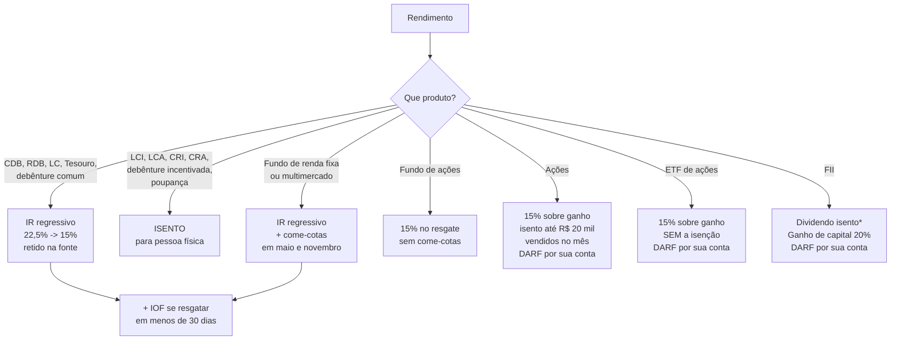

# 14 · Tributação — onde vai um quinto do seu rendimento

**Nível: intermediário** · *Atualizado em 20/08/2026 · **conteúdo que envelhece rápido***

O imposto é a maior "taxa" que você paga em renda fixa: 15% a 22,5% do rendimento,
contra 0,20% de custódia. Escolher o produto pela rentabilidade bruta é, portanto,
escolher pelo número errado.

> **Aviso.** Este arquivo descreve a legislação vigente em **agosto de 2026**.
> Tributação de investimento é o tema que mais muda no Brasil. Confira antes de agir e
> reveja este arquivo a cada semestre.

---

## 1. O mapa completo

*\* Dividendo de FII é isento se o fundo tiver ao menos 50 cotistas, as cotas forem
negociadas em bolsa e você detiver menos de 10% do fundo (Lei 11.033/2004).*

---

## 2. A tabela regressiva e por que ela existe

| Prazo | Alíquota |
|---|---|
| até 180 dias | 22,5% |
| 181 a 360 dias | 20,0% |
| 361 a 720 dias | 17,5% |
| acima de 720 dias | 15,0% |

**Por que regressiva?** (aplicando os cinco porquês)

1. *Por que quem fica mais tempo paga menos?* Para incentivar aplicação longa.
2. *Por que o governo quer aplicação longa?* Porque financiamento de prazo longo é
   escasso no Brasil, e capital de curto prazo é volátil.
3. *Por que é escasso?* Herança da hiperinflação: por décadas, ninguém emprestava
   longo em moeda que derretia. A cultura de prazo curto permaneceu depois da
   estabilização ([ver 11-historia](11-historia.md)).
4. *Por que a estrutura da tabela é essa, com esses quatro degraus?* Foi uma **decisão
   legislativa** da Lei 11.033/2004, no contexto do pacote de mudanças do mercado de
   capitais daquele ano. Os degraus e os prazos são **convenção**: não há teoria que
   diga que 180 dias é a fronteira certa.
5. *Por que nunca mudou desde 2004?* Porque mexer nisso cria perdedores identificáveis
   e é politicamente caro — a tentativa mais recente, a **MP 1.303/2025** (alíquota
   única de 17,5% e tributação de 5% sobre LCI/LCA/CRI/CRA), foi retirada de pauta na
   Câmara e **caducou em outubro de 2025** sem virar lei.

**Parada legítima:** decisão legislativa documentada + convenção arbitrária nos degraus.

---

## 3. IOF: a punição do resgate rápido

Tabela completa em [05-manual-de-uso.md](05-manual-de-uso.md), seção 3.2. O essencial:

- Incide **antes** do IR e **reduz a base** dele.
- Vai de 96% do rendimento (dia 1) a 0% (dia 30).
- **Nunca toca o principal.**
- Não incide sobre LCI, LCA, poupança, ações, FIIs nem fundos de ações.

---

## 4. Come-cotas: o imposto que chega sem você pedir

**O que é:** nos fundos de renda fixa e multimercado, a Receita antecipa parte do IR
duas vezes ao ano — no último dia útil de **maio** e de **novembro** — "comendo" cotas
do investidor.

| | Fundo de longo prazo | Fundo de curto prazo |
|---|---|---|
| Definição | carteira com prazo médio **> 365 dias** | prazo médio ≤ 365 dias |
| Alíquota do come-cotas | 15% | 20% |
| No resgate | paga-se a diferença até a alíquota da tabela | idem |

**O custo real, medido** (R$ 6.000, taxa de administração zero, mesma taxa bruta do CDB):

| Prazo | Custo do come-cotas |
|---|---|
| 1 ano | R$ 3,38 |
| 5 anos | R$ 216,77 |
| 10 anos | R$ 1.406,87 |

Não é o imposto: é o **juro sobre o imposto antecipado**. Ver [06-exemplos.md](06-exemplos.md),
exemplo 7.

**Não têm come-cotas:** Tesouro Direto, CDB, LCI, LCA, debêntures, ações, ETFs, FIIs,
fundos de ações, ETFs de renda fixa (regra própria), previdência (PGBL/VGBL).

---

## 5. Isenções vigentes — e por que elas existem

| Isento | Base legal | Por que existe |
|---|---|---|
| **LCI / LCA** | Leis 11.033/2004 e 11.076/2004 | direcionar poupança privada para habitação e agronegócio sem subsídio orçamentário direto |
| **CRI / CRA** | Lei 11.033/2004 | idem, via securitização |
| **Debênture incentivada** | Lei 12.431/2011 | atrair capital privado para infraestrutura de longo prazo |
| **Poupança** | Lei 8.981/1995 | funding do crédito imobiliário; e proteção de pequeno poupador |
| **Dividendo de FII** | Lei 11.033/2004 | fomentar o mercado de fundos imobiliários |
| **Até R$ 20 mil/mês em ações** | Lei 11.033/2004 | simplificação: evita que o Fisco processe milhões de DARFs de valor irrisório |

**A leitura econômica honesta:** isenção tributária é **gasto público indireto**. O
governo abre mão de arrecadação para direcionar capital. Quem se beneficia não é só o
investidor — é o setor que recebe o funding barato. Isso torna essas isenções
politicamente resilientes (têm lobby forte) e ao mesmo tempo eternamente ameaçadas
(são "gasto tributário" na conta fiscal). Espere esse tema voltar ao Congresso.

---

## 6. O que mudou em 2026: a Lei 15.270/2025

Sancionada em dezembro de 2025, com vigência a partir de janeiro de 2026:

| Mudança | Detalhe | Afeta você com R$ 6.000? |
|---|---|---|
| **Isenção do IRPF até R$ 5.000/mês** | ampliação da faixa de isenção da tabela do IRPF | sim, se essa for sua renda — mas não muda o IR do investimento |
| **IRPF Mínimo (IRPFM) para altas rendas** | tributação mínima para rendas muito altas | não |
| **Retenção de 10% na fonte sobre dividendos** | quando uma mesma empresa paga **mais de R$ 50 mil por mês** a uma mesma pessoa física | não |
| **Regra de transição** | dividendos aprovados até 31/12/2025 sobre lucros até 2025 seguem isentos se pagos até 2028 | não |

**Importante não confundir:** essa lei **não** alterou o IR da renda fixa nem
tributou LCI/LCA. Quem fez essa confusão em 2026 estava misturando a Lei 15.270/2025
com a MP 1.303/2025, que caducou.

---

## 7. Renda variável: aqui o imposto é por sua conta

Esta é a diferença operacional mais importante entre renda fixa e variável:

| | Renda fixa | Renda variável |
|---|---|---|
| Quem calcula | a instituição | **você** |
| Quem recolhe | retido na fonte | **você**, via DARF |
| Quando | no resgate | **até o último dia útil do mês seguinte** |
| Se atrasar | não se aplica | multa de 0,33% ao dia (teto 20%) + juros Selic |
| Compensação de prejuízo | não existe | **existe**, e você deve controlar |

**Regras essenciais de ações:**

- Vendas de até **R$ 20.000 por mês** (soma de todas as vendas de ações, não o lucro):
  o lucro é **isento**. Não vale para ETF, FII, day trade.
- Acima disso: **15%** sobre o lucro (preço de venda − preço médio de compra − custos).
- **Day trade:** 20%, com retenção de 1% na fonte ("dedo-duro"), que serve para a
  Receita cruzar dados.
- **Prejuízo compensa lucro futuro** da mesma modalidade, sem prazo de validade — mas
  só se você tiver declarado o prejuízo mês a mês. Prejuízo não declarado se perde.
- **FII:** ganho de capital a 20%, sem isenção; dividendos isentos (com os requisitos).

**Como recolher o DARF:** use o programa **Sicalc** ou o e-CAC, código de receita
**6015** para ganhos líquidos em renda variável (pessoa física). Valor mínimo de DARF:
R$ 10 — abaixo disso, acumula-se para o mês seguinte.

---

## 8. Declaração anual: onde cada coisa entra

| Item | Ficha | Detalhe |
|---|---|---|
| Saldo de CDB/LCI/LCA/Tesouro em 31/12 | **Bens e Direitos**, grupo 04 | use o valor do informe |
| Ações, ETFs, FIIs | Bens e Direitos, grupo 07 (ações) / 03 (fundos) | pelo **custo de aquisição**, não pelo valor de mercado |
| Rendimento de CDB, Tesouro, fundos | **Rendimentos Sujeitos à Tributação Exclusiva** | já retido |
| Rendimento de LCI/LCA/poupança/dividendos de FII | **Rendimentos Isentos e Não Tributáveis** | isento, mas declarável |
| Lucro com ações acima do limite | **Renda Variável** | mês a mês, com os DARFs pagos |
| Prejuízo acumulado | Renda Variável | para compensar no futuro |

**Cuidado clássico:** ações e fundos vão na declaração pelo **custo**, não pelo valor
de mercado. Declarar pelo valor de mercado gera "acréscimo patrimonial a descoberto" e
chama a atenção da malha.

---

## 9. Erros tributários que custam caro

1. **Escolher produto pela taxa bruta.** É o erro nº 1, e o mais caro no agregado.
2. **Resgatar no dia 180 em vez do 181.** R$ 25 por R$ 1.000 de rendimento.
3. **Não declarar prejuízo em ações.** Perde-se o direito de compensar.
4. **Esquecer o DARF do mês.** Multa e juros, e a Receita cruza com a nota de corretagem.
5. **Achar que "isento" significa "não precisa declarar".** Isento é declarável.
6. **Vender R$ 20.001 em ações no mês.** Passou R$ 1 do limite, o lucro **inteiro** é
   tributado — não só o excedente.
7. **Acreditar que houve mudança de lei porque saiu no noticiário.** Em 2025 e 2026,
   milhares de pessoas venderam LCI achando que seriam tributadas por uma MP que
   caducou.

---

## Autoteste

1. Você resgata um CDB no 200º dia com R$ 1.000 de rendimento. Quanto de IR? E se fosse
   no dia 180?
2. Por que o IOF reduz o IR devido?
3. Explique, em uma frase, por que o come-cotas custa mais em 10 anos do que em 1.
4. Uma LCI é isenta. Você precisa declará-la? Onde?
5. Você vendeu R$ 19.000 em ações num mês com R$ 4.000 de lucro. Quanto de imposto?
   E se tivesse vendido R$ 21.000?
6. Qual é a diferença prática, para você, entre tributação retida na fonte e apurada
   por você?
7. A MP 1.303/2025 mudou a tributação da LCI? O que aconteceu com ela?
8. Percorra os cinco porquês da tabela regressiva e diga onde a cadeia para.

---

**Fontes consultadas em 20/08/2026:** Lei 11.033/2004; Lei 11.076/2004; Lei 12.431/2011;
Decreto 6.306/2007; IN RFB 1.585/2015; Lei 15.270/2025 (sancionada em dezembro de 2025);
Câmara dos Deputados — retirada de pauta e perda de eficácia da MP 1.303/2025 em
outubro de 2025. Links em [95-referencias.md](95-referencias.md).

**Próximo:** [16-risco-e-garantias.md](16-risco-e-garantias.md)
