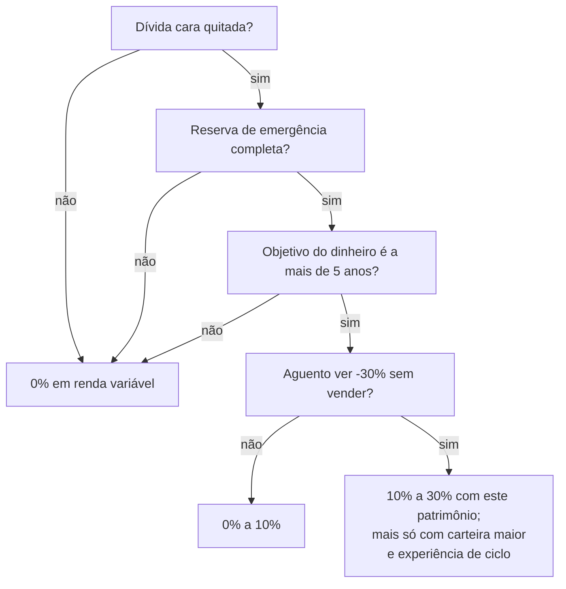

# 20 · Renda variável — ações, FIIs, ETFs e exterior

**Nível: intermediário** · *Atualizado em 20/08/2026*

Este arquivo existe por completude e por honestidade: com R$ 6.000 em 2026, renda
variável **não é** a resposta principal. Mas você precisa saber o que é, para decidir
com informação e para o dia em que o cenário mudar.

**Contexto de mercado em 19/08/2026:** Ibovespa em torno de **167 mil a 169 mil
pontos**, dólar perto de **R$ 5,18**, depois de uma sequência de quedas em agosto.
Selic em 14,00%.

---

## 1. O que é ser sócio

Comprar uma ação é comprar uma fração da propriedade de uma empresa. Você passa a ter
direito a:

- **parte do lucro distribuído** (dividendos e juros sobre capital próprio);
- **voto** (nas ações ordinárias, ON);
- **parte do que sobrar** se a empresa for liquidada — depois de todos os credores.

Essa última linha é a definição de risco: **o acionista é o último da fila.** É por
isso que ele exige retorno maior que o credor. Não é opinião, é a estrutura de capital.

| Sigla | O que é |
|---|---|
| **ON** (final 3) | ordinária: dá voto |
| **PN** (final 4) | preferencial: prioridade em dividendo, em geral sem voto |
| **UNIT** (final 11) | pacote de ON + PN |
| **BDR** | recibo de ação estrangeira negociado na B3 |
| **ETF** (final 11) | fundo de índice negociado em bolsa |
| **FII** (final 11) | fundo imobiliário |

---

## 2. De onde vem o retorno de uma ação

```
Retorno total = dividendos recebidos + variação do preço
```

E o preço, no longo prazo, segue o lucro. Um jeito útil de decompor:

```
Retorno ≈ crescimento do lucro + dividend yield ± mudança do múltiplo (P/L)
```

- **Crescimento do lucro**: fundamento real, o que a empresa produz.
- **Dividend yield**: o que ela distribui, sobre o preço.
- **Múltiplo**: quanto o mercado está disposto a pagar por R$ 1 de lucro. É a parte
  que oscila mais e a que produz as manchetes.

**Por que juros altos derrubam a bolsa** (mecanismo, não narrativa): o valor de uma
ação é o valor presente dos lucros futuros. Com a taxa de desconto em 14%, os lucros
distantes valem muito menos hoje. Além disso, o investidor tem a alternativa de 14%
sem risco — o que exige que a ação prometa mais para ser escolhida. Ver a conta do
"sarrafo" em [06-exemplos.md](06-exemplos.md), exemplo 11: hoje a bolsa precisa render
cerca de **13% ao ano bruto só para empatar** com o pós-fixado, e mais o prêmio de
risco por cima para justificar-se.

---

## 3. ETF: a forma correta de começar

Um **ETF** (Exchange Traded Fund) é um fundo que replica um índice e é negociado como
ação. Com uma ordem você compra dezenas ou centenas de empresas.

| ETF (B3) | Segue | Para que serve |
|---|---|---|
| **BOVA11** | Ibovespa | bolsa brasileira, o mais líquido |
| **IVVB11** | S&P 500 (em reais) | 500 maiores empresas dos EUA, com exposição cambial |
| **SMAL11** | índice de small caps | empresas menores brasileiras |
| **IMAB11** | IMA-B (cesta de NTN-B) | renda fixa indexada à inflação, via bolsa |

**Por que ETF e não ações escolhidas a dedo, com R$ 6.000:**

1. **Diversificação instantânea.** Com R$ 500 você tem 80 empresas; com R$ 500 em ações
   individuais você tem uma, e nenhuma proteção.
2. **Custo baixo.** Taxas de administração de ETFs de índice ficam tipicamente entre
   0,1% e 0,5% ao ano — muito abaixo de fundos de ações ativos.
3. **Evidência.** A literatura é consistente há décadas: a maioria dos gestores
   profissionais não supera o índice de forma persistente **depois de custos**. Se o
   profissional em tempo integral não consegue, a chance de você conseguir nas horas
   vagas é pequena.

**Contra:** o ETF **não tem** a isenção de R$ 20 mil/mês que as ações têm. Sobre o
ganho, 15% sempre, com DARF por sua conta.

---

## 4. Fundos imobiliários (FII)

Um FII compra imóveis (ou papéis lastreados em imóveis) e distribui o resultado.

| Tipo | O que tem na carteira | Comportamento |
|---|---|---|
| **Tijolo** | galpões, shoppings, lajes corporativas, agências | renda de aluguel; sensível a vacância e a juros |
| **Papel** | CRI (recebíveis imobiliários) | renda de juros; sensível a crédito e a índice (CDI ou IPCA) |
| **Fundo de fundos (FOF)** | cotas de outros FIIs | dupla camada de taxa |

**A vantagem tributária:** os **dividendos são isentos** de IR para pessoa física,
desde que o fundo tenha ao menos 50 cotistas, seja negociado em bolsa e você tenha
menos de 10% das cotas. O **ganho de capital na venda**, porém, é tributado em 20%,
sem faixa de isenção.

**O erro clássico:** comprar FII olhando só o *dividend yield*. Yield alto pode
significar (a) o imóvel está esvaziando, (b) o contrato está vencendo, (c) o fundo está
distribuindo lucro não recorrente da venda de um ativo. Rendimento de FII não é
garantido nem contratual — é o que sobrou depois de vacância, inadimplência e custos.

**Contexto de 2026:** com a Selic em 14%, um FII precisa entregar bem mais que isso
para competir com um título público isento de risco. Muitos negociam abaixo do valor
patrimonial justamente por isso.

---

## 5. Investir no exterior

Três caminhos, do mais simples ao mais completo:

| Caminho | Como | Custo/atrito | Tributação |
|---|---|---|---|
| **ETF na B3** (IVVB11, e afins) | ordem comum na sua corretora | mais simples; taxa do ETF | 15% sobre ganho, DARF |
| **BDR** | recibo de ação estrangeira na B3 | fácil; liquidez variável | 15% sobre ganho; dividendos tributados na tabela progressiva |
| **Conta no exterior** | corretora internacional, remessa de câmbio | IOF de câmbio, custo de remessa, declaração adicional | regras próprias; obrigações acessórias (e, acima de certos limites, declaração de capitais brasileiros no exterior ao BCB) |

**Por que considerar:** o Brasil é cerca de 1% a 2% do valor de mercado das bolsas
globais e tem moeda volátil. Toda a sua renda, sua carreira e seu imóvel já estão em
reais — concentração relevante.

**Por que não com R$ 6.000:** os custos fixos e a complexidade tributária comem o
benefício. Se quiser exposição cambial nesse valor, o ETF na B3 resolve com uma ordem.

---

## 6. Quanto de renda variável faz sentido

Não existe percentual universal. Existe uma sequência:



**Regra de calibragem honesta:** escolha o percentual que você conseguiria manter numa
queda de 40% — que já aconteceu no Ibovespa mais de uma vez e vai acontecer de novo.
Se a resposta for "nenhum", a resposta certa é zero, e não há vergonha nisso: com juro
real de 9% na renda fixa, você não precisa de risco para atingir a maioria dos objetivos.

---

## 7. O que não fazer

| Não faça | Por quê |
|---|---|
| Day trade | os estudos brasileiros disponíveis mostram que a esmagadora maioria dos day traders individuais perde dinheiro de forma consistente |
| Alavancagem, opções vendidas | perda pode superar o capital aplicado |
| Comprar por dica de rede social | você é a liquidez de saída de quem falou antes |
| Concentrar em uma ação "que você conhece" | a empresa que te emprega já concentra sua vida; comprar a ação dela dobra a aposta |
| Perseguir dividend yield alto | yield alto costuma ser preço caindo |
| Vender na queda para "recomprar mais barato" | requer acertar duas decisões seguidas; ninguém acerta consistentemente |

---

## Autoteste

1. Por que o acionista exige retorno maior que o credor da mesma empresa?
2. Decomponha o retorno de uma ação em três componentes.
3. Explique, pelo mecanismo do valor presente, por que a Selic a 14% pressiona a bolsa.
4. Qual a vantagem tributária de ações sobre ETFs, e qual a vantagem prática de ETFs
   sobre ações?
5. Um FII paga 14% de dividend yield. Cite três motivos possíveis, e por que nenhum
   deles é necessariamente bom.
6. Com R$ 6.000, qual a forma mais eficiente de ter exposição ao S&P 500 e por quê?
7. Como você calibraria o percentual de renda variável da sua carteira, na prática?
8. Por que "comprar ação da empresa onde trabalho" é uma concentração dupla?

---

**Próximo:** [24-carteira-e-alocacao.md](24-carteira-e-alocacao.md)

**Fontes consultadas em 20/08/2026:** cotações do Ibovespa e do dólar em 19/08/2026
(fechamento em torno de 167–169 mil pontos e R$ 5,18); Lei 11.033/2004 (isenções de
FII e de ações); regras de tributação de ETF e BDR. Links em
[95-referencias.md](95-referencias.md).
