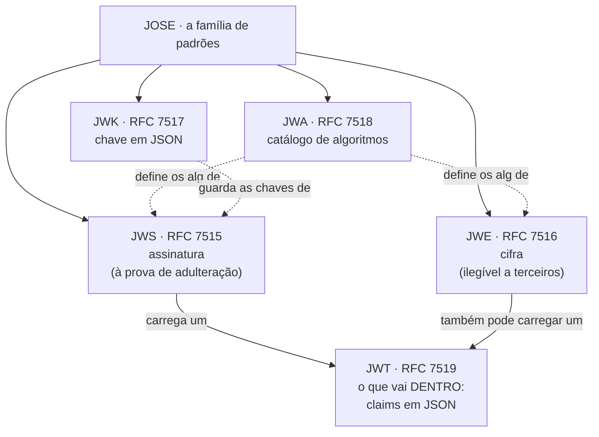
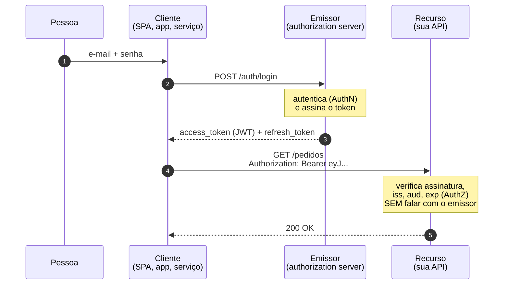

# 10 · Fundamentos

> Nível: iniciante a intermediário · Atualizado em 14/08/2026
> Aqui todo termo é definido antes de ser usado. Este é o vocabulário do assunto
> inteiro.

---

## 10.1 · O problema formal

O HTTP é **sem estado** (*stateless*): cada requisição é independente e o servidor
não guarda memória entre elas. Isso não é limitação acidental — é o que permite que
qualquer servidor da frota atenda qualquer requisição, e é a razão de a web escalar.

O problema que decorre: **como um servidor sabe, na requisição nº 2, quem fez a
requisição nº 1?**

Só existem duas respostas possíveis, e todo mecanismo de autenticação da web é uma
delas ou uma combinação:

| Resposta | Nome | Como funciona |
|---|---|---|
| O servidor guarda | **por referência** | o cliente carrega um identificador opaco; o servidor consulta seu próprio armazenamento |
| O cliente carrega | **por valor** | o cliente carrega os dados; o servidor confere se foram adulterados |

O JWT é a segunda. A sessão com cookie é a primeira. **Todo o resto deste material é
consequência dessa escolha.**

---

## 10.2 · Autenticação, autorização, sessão

Três palavras que muita gente usa como sinônimo. Não são.

**Autenticação** (*authentication*, abreviada **AuthN**) — provar **quem** você é.
Responde "você é mesmo a Ana?". Acontece uma vez, no login, e é cara: senha, segundo
fator, biometria.

**Autorização** (*authorization*, **AuthZ**) — decidir **o que** você pode fazer.
Responde "a Ana pode apagar este pedido?". Acontece em toda requisição e precisa ser
barata.

**Sessão** — o período entre a autenticação e o seu fim (logout, expiração,
revogação). É o mecanismo que evita pedir a senha a cada clique.

> Onde o JWT entra: ele é o **carregador do resultado da autenticação**, para que a
> autorização possa ser feita em toda requisição sem repetir a autenticação. Ele não
> autentica ninguém — a autenticação já aconteceu quando o token foi emitido.

Confundir os dois causa erros práticos: responder 401 (autenticação falhou) quando
o caso é 403 (autorização negada) faz o cliente entrar em laço de renovação de token.

---

## 10.3 · Token: por valor e por referência

**Token** = um objeto que representa uma credencial ou uma afirmação.

**Token por referência** (*reference token*, ou opaco): não significa nada por si.
`a7f3c9e1b2d4` é só um ponteiro; toda a informação está no servidor.

```
Cliente ──[a7f3c9e1]──> Serviço ──consulta──> Armazenamento ──> "é a Ana, admin, válido"
```

**Token por valor** (*value token*, ou autocontido): carrega a informação. O serviço
verifica a integridade e usa o conteúdo, sem consultar ninguém.

```
Cliente ──[{"sub":"ana","papel":"admin","exp":...} + assinatura]──> Serviço ──verifica──> usa
```

| Propriedade | Por referência | Por valor (JWT) |
|---|---|---|
| Verificar custa | uma consulta (rede/banco) | uma operação de CPU, local |
| Revogar | imediato: apague o registro | difícil: o token já está no cliente |
| Tamanho | ~30 bytes | 200 B a 2 KB |
| Conteúdo visível a quem tem o token | nada | **tudo** |
| Vários serviços verificarem | cada um precisa de acesso ao armazenamento | cada um precisa só da chave pública |
| Dado desatualizado | impossível | **inevitável**, até o token expirar |

Essa última linha é a mais subestimada. Quando você promove alguém a admin, o token
que essa pessoa já tem continua dizendo "usuario" até expirar. Quando você
**rebaixa** alguém, o token continua dizendo "admin". Um JWT é uma **fotografia**, e
fotografias envelhecem.

---

## 10.4 · A família JOSE

**JOSE** = *JavaScript Object Signing and Encryption*. É o guarda-chuva de
especificações que o JWT usa. Confundir as siglas é o primeiro obstáculo real do
assunto, então aqui está o mapa:



A relação essencial, e a fonte de metade da confusão:

> **JWT não é um formato de serialização — é um conjunto de regras sobre o conteúdo.**
> O que você vê com dois pontos e três segmentos é um **JWS**. O JWT é o payload
> dentro dele.

Na prática, "JWT" quase sempre significa "JWS compacto cujo payload é um conjunto de
claims JSON". Quando alguém disser "JWT criptografado", o que existe é um **JWE**, e
ele tem **cinco** segmentos, não três.

| Sigla | Nome | O que é | Segmentos na forma compacta |
|---|---|---|---|
| **JWS** | JSON Web Signature | assinatura | **3** |
| **JWE** | JSON Web Encryption | cifra | **5** |
| **JWK** | JSON Web Key | uma chave, como objeto JSON | — |
| **JWKS** | JWK Set | conjunto de chaves públicas publicado | — |
| **JWA** | JSON Web Algorithms | os nomes: `HS256`, `ES256`, `A256GCM`… | — |
| **JWT** | JSON Web Token | as claims que vão dentro | — |

Conte os pontos. Dois pontos → JWS. Quatro pontos → JWE.

---

## 10.5 · A estrutura de um JWS compacto

```
eyJhbGciOiJFUzI1NiJ9 . eyJzdWIiOiI0MiJ9 . MEUCIQDx...
└──── header ────┘   └─── payload ───┘  └─ signature ┘
```

Cada segmento é **base64url** (base64 com `-` e `_` no lugar de `+` e `/`, e sem o
`=` de preenchimento — porque o token precisa sobreviver dentro de uma URL, de um
cabeçalho HTTP e de um cookie).

1. **Cabeçalho JOSE protegido** — metadados: qual algoritmo (`alg`), qual chave
   (`kid`), que tipo de token (`typ`).
2. **Payload** — as *claims*. Num JWT, é um objeto JSON. (Num JWS genérico pode ser
   qualquer coisa, inclusive um PDF.)
3. **Assinatura** — o resultado de aplicar `alg` sobre a string
   `base64url(cabeçalho) + "." + base64url(payload)`.

**Detalhe que confunde todo mundo na primeira vez:** a assinatura cobre os segmentos
**já codificados em base64url, com o ponto entre eles** — não o JSON original. Isso é
deliberado e resolve um problema que quase afundou o XML Signature: se a assinatura
cobrisse o JSON, seria preciso concordar sobre ordem de chaves, espaços em branco e
escapes Unicode (*canonicalização*), e qualquer divergência quebraria a verificação.
Assinando o texto já codificado, não há o que canonicalizar — assina-se exatamente
os bytes que trafegam. Ver [12-anatomia-do-token.md](12-anatomia-do-token.md).

---

## 10.6 · Claim

**Claim** (afirmação) = um par nome/valor no payload. `"sub": "42"` é uma claim que
afirma "o sujeito deste token é o 42".

Três categorias:

- **Registradas** — as sete da RFC 7519 (`iss`, `sub`, `aud`, `exp`, `nbf`, `iat`,
  `jti`). Nomes curtos, significado fixo.
- **Públicas** — registradas na IANA por quem quiser: `email`, `name`, `scope`.
- **Privadas** — as suas: `departamento`, `plano`, `papeis`. Risco de colisão, por
  isso a RFC sugere prefixo de namespace.

Uma claim é uma **afirmação de quem emitiu**, não um fato. `"papel":"admin"` significa
"o emissor afirma que esta pessoa é admin". Se você não confia no emissor, a claim não
vale nada — e é por isso que verificar `iss` importa tanto.

Detalhamento completo em [13-claims-registradas.md](13-claims-registradas.md).

---

## 10.7 · Assinar não é cifrar

A distinção mais importante do assunto, e a que mais gente erra.

| | Assinatura (JWS) | Cifra (JWE) |
|---|---|---|
| Garante | **integridade** e **autenticidade** | **confidencialidade** |
| Responde | "isto foi mesmo emitido por X e não foi alterado?" | "quem não tem a chave consegue ler?" |
| Conteúdo | **legível por qualquer um** | ilegível sem a chave |
| Analogia | envelope lacrado e transparente | envelope opaco |

Um JWT comum é **assinado, não cifrado**. Escreva isso na parede:

> **Tudo que você põe no payload de um JWT é público para quem tiver o token.**

E "quem tem o token" inclui: o navegador da pessoa, qualquer extensão instalada nele,
o log do balanceador de carga, o log do proxy corporativo, a ferramenta de APM, e o
sistema de tíquetes onde alguém colou um `curl -v` para pedir ajuda.

Nunca coloque num JWT: senha, CPF, dado de saúde, número de cartão, chave de API,
resposta de pergunta secreta.

---

## 10.8 · As três garantias — e as três que faltam

**O que uma assinatura JWS garante:**

1. **Integridade** — o conteúdo não foi alterado desde a assinatura.
2. **Autenticidade** — foi assinado por quem detém a chave.
3. **Não repúdio** — *só com algoritmo assimétrico* (ES256, RS256, EdDSA). Com HMAC
   não há não repúdio, porque quem verifica também poderia ter assinado.

**O que ela não garante:**

1. **Confidencialidade** — o conteúdo é legível. Já dissemos, e vale repetir.
2. **Que quem apresenta o token é a pessoa certa.** Um JWT comum é um *bearer token*
   (token ao portador): quem o tem, é. Como uma nota de R$ 50 — ela não pergunta seu
   nome. Amarrar o token a quem o recebeu exige DPoP (RFC 9449) ou mTLS (RFC 8705),
   ver [65-estado-da-arte.md](65-estado-da-arte.md).
3. **Que o token ainda deveria valer.** A assinatura continua válida depois do
   logout, depois da demissão, depois de a conta ser desativada. Só o `exp` e uma
   lista de revogação resolvem, ver
   [17-ciclo-de-vida-sessao.md](17-ciclo-de-vida-sessao.md).

Esta terceira é a fonte da maioria dos incidentes reais com JWT.

---

## 10.9 · Os quatro papéis



| Papel | Nome no OAuth | Responsabilidade |
|---|---|---|
| **Emissor** | *authorization server* | autentica, decide o conteúdo, **assina**, publica a chave pública |
| **Cliente** | *client* | obtém, guarda e apresenta o token. **Nunca o valida para decidir segurança** |
| **Recurso** | *resource server* | **verifica** e autoriza |
| **Sujeito** | *resource owner* | a pessoa ou serviço sobre quem o token fala |

**A separação que importa:** o emissor detém a chave privada; o recurso só precisa da
pública. Isso é o que permite 40 microsserviços validarem tokens sem que nenhum deles
possa emitir. Com HMAC essa separação desaparece — e é por isso que a
[escolha de algoritmo](05-manual-de-uso.md#c--algoritmos-qual-escolher) é uma decisão
de arquitetura, não de configuração.

---

## 10.10 · Access token e refresh token

Duas credenciais com propriedades deliberadamente opostas.

| | Access token | Refresh token |
|---|---|---|
| Formato típico | JWT | **string opaca** |
| Vida | 5–15 min | dias a meses |
| Enviado em | toda requisição à API | só ao emissor, só para renovar |
| Verificado | localmente, sem I/O | sempre no banco |
| Revogável na hora | não (só com lista de negação) | **sim** |
| Se vazar | estrago limitado ao `exp` | estrago até alguém revogar |

**Por que dois em vez de um?** Porque as propriedades desejadas são contraditórias.
Você quer verificação barata (→ sem banco → sem revogação) **e** quer poder deslogar
alguém (→ banco). Um token só teria de escolher. Dois tokens resolvem: o barato é
curto, o revogável é raro.

**Por que o refresh token não é um JWT?** Porque não haveria vantagem. Ele consulta o
banco em todo uso — então a auto-suficiência do JWT não serve para nada — e seria
mais longo e legível. O [projeto-modelo](07-projeto-modelo/) usa 32 bytes aleatórios,
guardados como SHA-256.

---

## 10.11 · Os cinco porquês: por que a assinatura cobre o texto base64, e não o JSON?

Aplicando a [regra dos cinco porquês](../CLAUDE.md):

**1. Por que a entrada da assinatura é `base64url(header) + "." + base64url(payload)`?**
Porque é exatamente o que trafega. Assinar o que trafega elimina toda ambiguidade
entre assinar e verificar.

**2. Por que a ambiguidade seria um problema?**
Porque JSON não tem forma única. `{"a":1,"b":2}` e `{"b":2,"a":1}` são o mesmo objeto
e bytes diferentes. Espaços, ordem de chaves, `é` vs. `é`, `1.0` vs. `1` — tudo
varia entre bibliotecas. Se a assinatura cobrisse "o JSON", seria preciso um
algoritmo de **canonicalização** que todos implementassem identicamente.

**3. Por que canonicalização é um problema tão grande?**
Porque a história já mostrou. O **XML Signature** (padrão da era SAML) exigia
canonicalização XML, e ela gerou uma família inteira de vulnerabilidades de
*XML Signature Wrapping*: o atacante reorganizava o documento de modo que o
verificador validasse uma parte e o processador lesse outra. A causa raiz é sempre a
mesma — **o que foi verificado não é o que foi usado**.

**4. Por que "verificar uma coisa e usar outra" é tão fatal?**
Porque toda a segurança da assinatura repousa na identidade entre o objeto
verificado e o objeto consumido. Se há uma transformação entre os dois passos, o
atacante ataca a transformação, não a criptografia — que continua intacta e inútil.

**5. Por que a escolha do JOSE resolve isso definitivamente?**
Porque não há transformação. Verifica-se os bytes recebidos; decodifica-se **os
mesmos** bytes. A decodificação acontece *depois* da verificação e sobre exatamente o
material verificado.

**Parada legítima:** é uma decisão de projeto documentada, tomada pelo grupo JOSE do
IETF entre 2011 e 2015 com a experiência do XML Signature à vista. O preço pago é
real — o token fica ~33% maior que os dados brutos, por causa do base64 — e foi
aceito conscientemente em troca de eliminar uma classe inteira de ataques.

Curiosidade que confirma o argumento: existe uma extensão (RFC 7797, *unencoded
payload*) que permite JWS sem base64, para poupar bytes. Ela é raríssima em JWT, e o
motivo é exatamente este — reintroduz o problema.

---

## 10.12 · Vocabulário mínimo

| Termo | Definição de uma linha |
|---|---|
| **claim** | par nome/valor no payload; uma afirmação do emissor |
| **base64url** | base64 com `-`/`_` e sem `=`, seguro em URL |
| **NumericDate** | segundos (não ms) desde 01/01/1970 UTC |
| **bearer token** | token ao portador: quem tem, é |
| **kid** | identificador da chave que assinou |
| **JWKS** | documento com as chaves públicas do emissor |
| **thumbprint** | *hash* canônico de uma chave (RFC 7638), usado como `kid` |
| **nested JWT** | um JWT assinado, dentro de um JWE |
| **leeway / clock skew** | tolerância de relógio na validação de tempo |
| **denylist** | lista de `jti` revogados antes do `exp` |
| **rotação** | trocar a chave de assinatura, ou o refresh token, sem interromper |
| **PoP** (*proof of possession*) | token amarrado a uma chave do cliente (DPoP, mTLS) |

Glossário completo: [GLOSSARIO.md](GLOSSARIO.md).

---

## Autoteste

1. Existem só duas maneiras de um servidor sem estado saber quem você é. Quais, e a
   qual delas o JWT pertence?
2. Qual a diferença entre autenticação e autorização? Em qual das duas o JWT
   participa de toda requisição?
3. Um token compacto tem 4 pontos. É JWS ou JWE? E o que isso muda?
4. Por que a assinatura cobre o texto base64url e não o JSON original? Cite o padrão
   histórico que sofreu por não fazer assim.
5. Cite as três garantias de uma assinatura JWS e as três que ela **não** dá.
6. Por que o não repúdio existe com ES256 e não existe com HS256?
7. Por que um refresh token não deveria ser um JWT?
8. Você promove alguém a admin no banco. Quando o JWT dessa pessoa passa a refletir
   isso, e por quê?
9. O que significa dizer que um JWT é uma "fotografia"?
