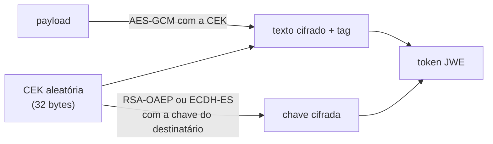

# 15 · JWE — quando o token precisa ser ilegível

> Nível: avançado · Atualizado em 14/08/2026
> **Resumo antecipado: você provavelmente não precisa disto.** Leia a seção 15.9
> antes de implementar.

---

## 15.1 · O que o JWE é

**JWE** (*JSON Web Encryption*, RFC 7516) cifra o conteúdo. Enquanto o JWS lacra um
envelope transparente, o JWE usa um envelope opaco.

```
JWS (3 segmentos, 2 pontos):
  cabeçalho . payload . assinatura
              └─ legível por qualquer um ─┘

JWE (5 segmentos, 4 pontos):
  cabeçalho . chave cifrada . IV . texto cifrado . tag de autenticação
                                   └─ ilegível ─┘
```

```bash
echo "$TOKEN" | tr -cd '.' | wc -c
# 2 → JWS    4 → JWE
```

---

## 15.2 · Os cinco segmentos

| # | Nome | O que é |
|---|---|---|
| 1 | **Cabeçalho protegido** | `{"alg":"ECDH-ES+A256KW","enc":"A256GCM"}` — em texto claro, autenticado |
| 2 | **Chave cifrada** | a chave de conteúdo (CEK), cifrada para o destinatário |
| 3 | **IV** | vetor de inicialização, aleatório, público |
| 4 | **Texto cifrado** | o payload, cifrado |
| 5 | **Tag de autenticação** | prova que nada foi alterado |

**Dois `alg` diferentes, e é aqui que todo mundo se perde:**

- `alg` no JWE = como a **chave de conteúdo** é protegida (gestão de chave);
- `enc` = como o **conteúdo** é cifrado.

Isso se chama **cifra híbrida**, e existe por um motivo prático: cifra assimétrica é
lenta e limitada em tamanho (RSA-2048 cifra no máximo ~190 bytes). Então gera-se uma
chave simétrica aleatória (a CEK), cifra-se o conteúdo com ela — rápido, sem limite
de tamanho — e cifra-se **só a CEK** com a chave assimétrica do destinatário.



---

## 15.3 · Algoritmos de gestão de chave (`alg`)

| `alg` | Como funciona | Veredito |
|---|---|---|
| `RSA-OAEP-256` | cifra a CEK com a pública RSA do destinatário | **use este**, se RSA |
| `RSA-OAEP` | idem, com SHA-1 | evite (SHA-1) |
| `RSA1_5` | PKCS#1 v1.5 | ❌ **nunca** — vulnerável ao ataque de Bleichenbacher |
| `ECDH-ES` | acordo de chave por curva elíptica; a CEK é derivada | **melhor opção**: chaves menores, sem cifra direta |
| `ECDH-ES+A256KW` | ECDH-ES e depois embrulha a CEK | permite vários destinatários |
| `A256KW` | embrulha com AES, chave simétrica pré-compartilhada | quando os dois lados já compartilham segredo |
| `A256GCMKW` | idem, com GCM | — |
| `dir` | **sem** gestão: a chave compartilhada É a CEK | mais simples; só serve com segredo pré-compartilhado |
| `PBES2-HS256+A128KW` | deriva a chave de uma senha | só para cifrar com senha humana; lento de propósito |

> `RSA1_5` merece a proibição. O ataque de Bleichenbacher (1998) usa o servidor como
> oráculo de padding: mandando milhares de textos cifrados manipulados e observando
> quais são aceitos, o atacante recupera a chave da sessão. Reapareceu em 2017 como
> **ROBOT**, atingindo produtos de Facebook, Cisco e F5 — dezenove anos depois. A
> RFC 8725 §3.5 desaconselha explicitamente.

---

## 15.4 · Algoritmos de cifra de conteúdo (`enc`)

| `enc` | Cifra | Nota |
|---|---|---|
| `A256GCM` | AES-256 em modo GCM | **padrão recomendado**: cifra e autentica de uma vez |
| `A128GCM` | AES-128 GCM | suficiente na prática |
| `A256CBC-HS512` | AES-CBC + HMAC separado | mais antigo; encrypt-then-MAC feito à mão |
| `A128CBC-HS256` | idem | — |
| `XC20P` | XChaCha20-Poly1305 | rápido sem aceleração de hardware; suporte irregular |

Todos são **AEAD** (*Authenticated Encryption with Associated Data*): cifram e
autenticam. Isso não é luxo — cifra sem autenticação permite que o atacante altere
bits do texto cifrado e produza alterações previsíveis no texto claro. O cabeçalho
entra como "dado associado": ele não é cifrado, mas é autenticado.

**A regra do IV em GCM:** um par (chave, IV) **nunca** pode se repetir. Repetir em
GCM não vaza só uma mensagem — permite recuperar a chave de autenticação e forjar
tags para qualquer mensagem. Bibliotecas sérias geram o IV aleatoriamente por token;
não force um IV fixo por "determinismo".

---

## 15.5 · Nested JWT — assinar e cifrar

Cifrar **não** autentica quem escreveu, apesar do AEAD. A tag de autenticação prova
que quem tinha a chave de cifra produziu aquilo — e, num JWE assimétrico, qualquer um
com a chave **pública** do destinatário pode produzir um JWE válido.

Ou seja: **um JWE sozinho não diz quem o emitiu.**

Quando você precisa de confidencialidade **e** autenticidade, aninha:

```
1. assine:   JWS = sign(claims, chave_privada_do_emissor)
2. cifre:    JWE = encrypt(JWS, chave_publica_do_destinatario)
```

O cabeçalho do JWE externo leva `cty: "JWT"` para avisar que o conteúdo é outro JWT.

**A ordem importa: assine primeiro, cifre depois.** Cifrar-depois-assinar deixa a
assinatura por fora, revelando quem falou com quem — e permite que um intermediário
retire a assinatura e ponha a dele sobre o mesmo texto cifrado.

```js
import { SignJWT, CompactEncrypt, compactDecrypt, jwtVerify } from 'jose';

// --- emissor ---
const jws = await new SignJWT({ cpf: '000.000.000-00' })
  .setProtectedHeader({ alg: 'ES256', kid: kidEmissor })
  .setIssuer('https://auth.exemplo.com').setAudience('api-rh')
  .setExpirationTime('15m').setIssuedAt()
  .sign(privadaDoEmissor);

const jwe = await new CompactEncrypt(new TextEncoder().encode(jws))
  .setProtectedHeader({ alg: 'ECDH-ES+A256KW', enc: 'A256GCM', cty: 'JWT' })
  .encrypt(publicaDoDestinatario);

// --- destinatário ---
const { plaintext } = await compactDecrypt(jwe, privadaDoDestinatario);
const { payload } = await jwtVerify(new TextDecoder().decode(plaintext), publicaDoEmissor, {
  algorithms: ['ES256'],
  issuer: 'https://auth.exemplo.com',
  audience: 'api-rh',
});
```

Repare: **duas** operações de verificação. Decifrar não é verificar.

---

## 15.6 · O custo real

| Aspecto | JWS | JWE aninhado |
|---|---|---|
| Tamanho | ~300 B | **~900 B a 1,5 KB** |
| Operações por verificação | 1 | 3 (decifrar chave, decifrar conteúdo, verificar assinatura) |
| Chaves a gerenciar | 1 par (do emissor) | **2 pares** (emissor + cada destinatário) |
| Rotação | 1 fluxo | 2 fluxos independentes |
| Depuração | `jwt.io` mostra tudo | opaco: sem a chave, ninguém vê nada |
| Novos destinatários | publicar JWKS | **reemitir** o token para cada um |

Aquele último ponto é o que mata o JWE na prática de microsserviços: um JWE é cifrado
**para um destinatário específico**. Se três serviços precisam ler, ou você cifra três
vezes, ou compartilha a chave de decifra entre eles — e aí a confidencialidade vira
teatro.

---

## 15.7 · Quando o JWE se justifica

Casos reais, não hipotéticos:

**1. O token atravessa um intermediário não confiável.** Um agregador, um parceiro,
um gateway de terceiro que roteia mas não deve ler.

**2. Exigência regulatória explícita.** Alguns perfis de saúde e de finanças exigem
dado cifrado em trânsito **fim a fim**, e TLS não basta porque termina no
balanceador. Se está escrito na norma, não há discussão.

**3. Token persistido em lugar menos confiável.** Um token que fica num cartão, num
QR Code impresso, num arquivo compartilhado.

**4. O conteúdo é intrinsecamente sensível e não pode ser referência.** Raro: quase
sempre dá para pôr um identificador e consultar o dado.

---

## 15.8 · Quando **não** se justifica — a maioria dos casos

**"Nosso token tem o e-mail do usuário, precisa ser cifrado."**
Não. Tire o e-mail do token. Ponha `sub`, e consulte o perfil quando for exibir.
Cifrar o token custa 3× em tamanho, dobra a gestão de chaves e cria um caminho de
depuração cego — para esconder um dado que não precisava estar ali.

**"Queremos que ninguém veja os papéis do usuário."**
Isso é **segurança por obscuridade**. A autorização acontece no servidor; saber que
existe um papel chamado `admin` não dá acesso a nada. E quem tem o token é a própria
pessoa, que já sabe o que pode fazer.

**"É mais seguro."**
Não é mais seguro contra o atacante que importa. Um JWE roubado funciona
exatamente como um JWS roubado — quem o apresenta é aceito. O JWE protege contra
*leitura*, não contra *uso*. Contra uso indevido, a resposta é vida curta, DPoP ou
mTLS (ver [65](65-estado-da-arte.md)).

---

## 15.9 · A recomendação, sem rodeios

> **Antes de implementar JWE, responda:** *que dado exatamente precisa estar no token
> e não pode ser lido?*
>
> Em 9 de 10 casos, a resposta correta é **tirar esse dado do token** — não cifrá-lo.
> Um `sub` opaco mais uma consulta ao perfil resolve o mesmo problema com menos
> código, menos chave e menos superfície.

Opinião profissional declarada como opinião: em mais de uma década, os projetos que
vi adotarem JWE por decisão própria (não por exigência regulatória) se arrependeram —
não por falha de segurança, mas por custo de operação: chave que expirou sem ninguém
perceber, incidente que ninguém conseguiu depurar porque o token era opaco, e um novo
consumidor que exigiu reemissão de tudo.

Se a exigência vier de fora (auditoria, norma setorial, contrato), implemente com
`ECDH-ES+A256KW` + `A256GCM`, sempre aninhado sobre um JWS, e **use uma biblioteca
auditada**. Este é o ponto do assunto em que escrever criptografia própria é
inaceitável — muito mais do que no JWS.

---

## 15.10 · Alternativas ao JWE

| Necessidade | Alternativa mais simples |
|---|---|
| Esconder dado do usuário final | tire do token; use `sub` + consulta |
| Esconder do intermediário | token por referência (opaco) + *introspection* no destino |
| Confidencialidade em trânsito | TLS, com mTLS entre serviços internos |
| Revelar só parte das claims | **SD-JWT** (RFC 9901) — ver [65](65-estado-da-arte.md) |
| Dado sensível em token de longa duração | não faça isso; use referência |

O SD-JWT merece destaque: ele resolve "mostrar só o necessário" **sem cifrar**, por
meio de hashes salgados. Para o caso de uso de carteira de identidade — provar que se
tem mais de 18 anos sem revelar a data de nascimento — é a ferramenta certa, e o JWE
não é.

---

## Autoteste

1. Quantos segmentos tem um JWE, e como distingui-lo de um JWS num segundo?
2. Qual a diferença entre `alg` e `enc` num JWE?
3. Por que se usa cifra híbrida em vez de cifrar o payload direto com RSA?
4. Por que `RSA1_5` é proibido? O que foi o ROBOT?
5. Um JWE prova quem o emitiu? Justifique, e diga o que fazer quando você precisa
   dessa prova.
6. Em que ordem se assina e se cifra, e o que dá errado na ordem inversa?
7. Cite três custos concretos de adotar JWE aninhado.
8. Seu time quer cifrar o token porque ele contém o e-mail do usuário. Qual é a sua
   resposta?
9. Um JWE roubado é mais seguro que um JWS roubado? Explique.
10. Que tecnologia resolve "revelar só parte das claims" sem cifrar?
