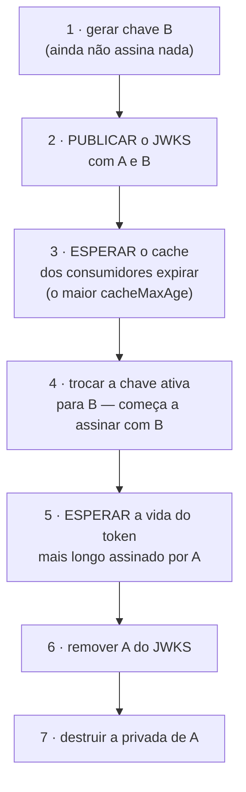

# 16 · Chaves — JWK, JWKS, `kid` e rotação

> Nível: intermediário a avançado · Atualizado em 14/08/2026
> Vetor de teste da RFC 7638 reproduzido e verificado no
> [projeto-modelo](07-projeto-modelo/test/jwt.test.js).

A criptografia do JWT é sólida. **A gestão de chaves é onde os sistemas quebram.**
Este arquivo trata do que quase todo tutorial pula.

---

## 16.1 · JWK — uma chave como objeto JSON

**JWK** (*JSON Web Key*, RFC 7517) representa uma chave criptográfica em JSON, em vez
de PEM.

```json
{
  "kty": "EC",
  "crv": "P-256",
  "x": "vwOLTBr2pU9mWWAxHljSRVdEbC4lDixchVzr9BcomOc",
  "y": "AySQSnhkzHm5RyJi_uzPMilpRmVhVziH9fP8OHqg8Q4",
  "kid": "E54wgNtjf8S0GLiPk_sVbt3epcuwkqG0EHSICTA2WNU",
  "use": "sig",
  "alg": "ES256"
}
```

**Por que JSON e não PEM?** Porque uma API JSON serve JSON. PEM é base64 de DER, que
é ASN.1 — três camadas de codificação, difíceis de analisar sem biblioteca
específica. Um JWK é lido por `JSON.parse`.

### Campos comuns

| Campo | Significado | Nota |
|---|---|---|
| `kty` | tipo: `EC`, `RSA`, `oct`, `OKP` | **obrigatório** |
| `use` | `sig` (assinatura) ou `enc` (cifra) | uma chave deve fazer **uma coisa só** |
| `key_ops` | operações permitidas | alternativa mais granular a `use` |
| `alg` | algoritmo pretendido | ajuda, mas **não substitui** sua lista de aceitos |
| `kid` | identificador | ver [16.3](#163--kid--o-identificador) |
| `x5c`, `x5t` | cadeia de certificados X.509 | raro em JWT puro |

### Campos por tipo

| `kty` | Públicos | Privados (**nunca publique**) |
|---|---|---|
| `EC` | `crv`, `x`, `y` | `d` |
| `RSA` | `n`, `e` | `d`, `p`, `q`, `dp`, `dq`, `qi` |
| `OKP` (Ed25519) | `crv`, `x` | `d` |
| `oct` (HMAC) | — | `k` — **a chave inteira é secreta** |

> **A verificação que salva carreira:** antes de publicar um JWKS, confira que
> nenhuma chave tem `d`, `p`, `q` ou `k`. O
> [projeto-modelo tem um teste exatamente para isso](07-projeto-modelo/test/api.test.js).
> Publicar `d` por acidente entrega a chave privada de assinatura ao mundo — e
> significa que qualquer pessoa pode emitir tokens como você.

```bash
# a checagem manual, se você publica JWKS gerado à mão
curl -s https://auth.exemplo.com/.well-known/jwks.json | jq '.keys[] | keys' \
  | grep -E '"d"|"p"|"q"|"k"' && echo "🚨 CHAVE PRIVADA EXPOSTA" || echo "ok"
```

---

## 16.2 · JWKS — o conjunto publicado

**JWKS** (*JWK Set*) é um documento com as chaves **públicas** do emissor:

```json
{
  "keys": [
    { "kty": "EC", "crv": "P-256", "x": "...", "y": "...", "kid": "E54wgN...", "use": "sig", "alg": "ES256" },
    { "kty": "EC", "crv": "P-256", "x": "...", "y": "...", "kid": "OrC9jr...", "use": "sig", "alg": "ES256" }
  ]
}
```

Publicado em uma URL, por convenção `/.well-known/jwks.json`. O OIDC declara a URL
real no documento de descoberta:

```bash
curl -s https://accounts.google.com/.well-known/openid-configuration | jq -r .jwks_uri
# esperado: https://www.googleapis.com/oauth2/v3/certs
```

**O que o JWKS resolve:** o consumidor não precisa de configuração manual de chave.
Ele busca, cacheia, e quando aparece um `kid` que não conhece, busca de novo. A
rotação de chave vira invisível.

**Regras do lado de quem publica:**

| Regra | Por quê |
|---|---|
| Sirva por HTTPS, sempre | trocar o JWKS por HTTP simples é trocar a chave que valida tudo |
| `Cache-Control: public, max-age=300..3600` | reduz carga sem travar a rotação |
| Mantenha a chave antiga por, no mínimo, a vida do token mais longo | senão você invalida tokens vivos |
| **Publique a chave nova antes de assinar com ela** | ver [16.5](#165--rotação-a-sequência-correta) |
| Nunca inclua componente privado | ver acima |

**Regras do lado de quem consome:**

| Regra | Por quê |
|---|---|
| Crie o cliente JWKS **uma vez por processo** | criar por requisição = uma chamada de rede por requisição |
| Cacheie | idem |
| Rebusque quando aparecer `kid` desconhecido — **com limite** | senão um atacante manda mil `kid` falsos e derruba seu emissor |
| Não deixe a busca ser o caminho crítico | se o JWKS cair, seu cache ainda deve servir |
| Fixe `algorithms` você mesmo | não confie no `alg` do JWK |

```js
import { createRemoteJWKSet } from 'jose';

// UMA vez, no início do processo.
const jwks = createRemoteJWKSet(new URL(process.env.JWKS_URL), {
  cacheMaxAge: 600_000,      // 10 min de cache
  cooldownDuration: 30_000,  // no máximo uma rebusca a cada 30 s
  timeoutDuration: 5_000,
});
```

O `cooldownDuration` é a defesa contra a **tempestade de rebusca**: sem ele, mil
requisições com `kid` inventado geram mil chamadas HTTP ao emissor — negação de
serviço amplificada, disparada por qualquer pessoa na internet.

---

## 16.3 · `kid` — o identificador

Diz **qual chave** assinou, para o verificador escolher a certa entre várias.

**A regra de segurança, em uma frase:**

> `kid` é um **rótulo**, nunca um **endereço**.

Ele pode ser usado como chave de um mapa local. Não pode virar caminho de arquivo,
consulta SQL montada por concatenação, nem URL.

```js
// ✅ certo
const chave = chaveiro.get(cabecalho.kid) ?? null;

// ❌ leitura arbitrária de arquivo
const chave = fs.readFileSync(`/chaves/${cabecalho.kid}.pem`);
//   kid = "../../etc/passwd"

// ❌ injeção de SQL na verificação da autenticação
db.query(`SELECT chave FROM chaves WHERE kid = '${cabecalho.kid}'`);
//   kid = "' UNION SELECT 'chave-do-atacante' --"
```

O segundo caso é especialmente cruel: em sistemas Unix há arquivos de conteúdo
previsível (`/dev/null` — vazio, `/proc/sys/kernel/ostype` — "Linux"). Se o atacante
consegue apontar o `kid` para um arquivo cujo conteúdo ele conhece, ele assina o
token com aquele conteúdo como chave HMAC e o token é aceito.

### Como escolher o valor do `kid`

| Estratégia | Exemplo | Veredito |
|---|---|---|
| **Thumbprint RFC 7638** | `E54wgNtjf8S0...` | **recomendado**: derivado da própria chave, sem coordenação |
| Data | `2026-08` | funciona, mas exige combinação humana |
| UUID | `a3f9...` | funciona; não tem relação com a chave |
| Sequencial | `1`, `2` | evite: colide entre ambientes |

### Thumbprint (RFC 7638)

SHA-256 do JSON canônico contendo **apenas** os membros obrigatórios da família, em
ordem lexicográfica, sem espaço nenhum:

| `kty` | Membros, em ordem |
|---|---|
| `EC` | `crv`, `kty`, `x`, `y` |
| `RSA` | `e`, `kty`, `n` |
| `oct` | `k`, `kty` |
| `OKP` | `crv`, `kty`, `x` |

```js
const canonico = { crv: jwk.crv, kty: jwk.kty, x: jwk.x, y: jwk.y };
const kid = createHash('sha256').update(JSON.stringify(canonico), 'utf8').digest('base64url');
```

Qualquer desvio — um espaço, outra ordem, um campo a mais — muda o resultado e quebra
a interoperabilidade. O
[projeto-modelo reproduz o vetor de teste oficial da RFC](07-projeto-modelo/test/jwt.test.js):
a chave de exemplo da RFC 7638 §3.1 produz
`NzbLsXh8uDCcd-6MNwXF4W_7noWXFZAfHkxZsRGC9Xs`, e o teste confere isso.

**Por que o thumbprint é melhor:** duas partes que nunca se falaram chegam ao mesmo
`kid` para a mesma chave. Não há registro a manter, não há convenção a combinar, e o
`kid` prova ser daquela chave — o que elimina a categoria de bug "o `kid` diz uma
coisa e a chave é outra".

---

## 16.4 · Onde a chave privada mora

Em ordem crescente de segurança:

| Onde | Risco | Quando aceitar |
|---|---|---|
| Codificada no fonte | 🔴 **catastrófico** | nunca. Está no Git, no histórico, no fork |
| Arquivo `.env` no repositório | 🔴 catastrófico | nunca |
| Variável de ambiente | 🟠 alto | desenvolvimento; produção só com ressalva |
| Arquivo com permissão 600, fora do repositório | 🟡 médio | aceitável em servidor único |
| Secret do orquestrador (K8s, Swarm) | 🟡 médio | comum e razoável |
| Cofre (Vault, AWS/GCP Secrets Manager) | 🟢 bom | **recomendado** |
| KMS: a chave **nunca sai** — você manda assinar | 🟢 ótimo | quando a criticidade justifica |
| HSM / módulo dedicado | 🟢 máximo | regulação, alto valor |

**Por que variável de ambiente é pior do que parece.** Ela vaza em: `docker inspect`,
`/proc/<pid>/environ` (legível por processos do mesmo usuário), *crash dump*, página
de erro de framework em modo debug, log de deploy, e ferramenta de APM que coleta
ambiente. É conveniente, e é o padrão da indústria — mas trate como "aceitável", não
como "seguro".

**O modelo de KMS/HSM muda o jogo.** Em vez de carregar a chave, você envia a entrada
da assinatura para o serviço e recebe a assinatura. A chave nunca existe na memória
do seu processo. Um comprometimento total do servidor permite **usar** a chave
enquanto o acesso durar, mas não **roubá-la** — e o log do KMS registra cada uso.

**Se a chave privada vazar:** ver [22-operacao-em-producao.md](22-operacao-em-producao.md),
seção de resposta a incidente. Resumo: rotacione imediatamente, aposente a chave
comprometida **na hora** (não espere os tokens expirarem — o estrago de invalidar
sessões é menor que o de aceitar tokens forjados), e invalide todos os refresh
tokens.

---

## 16.5 · Rotação: a sequência correta

Rotacionar = trocar a chave de assinatura sem interromper ninguém. A ordem é
contraintuitiva e errar dói.



**Os dois erros clássicos:**

**Erro 1 — assinar com B antes de publicar B.** Tokens com `kid` desconhecido começam
a circular. Cada consumidor rebusca o JWKS; os que têm *cooldown* (e devem ter)
recusam tokens legítimos durante alguns minutos. Sintoma: onda de 401 logo após o
deploy, que some sozinha. Diagnóstico difícil justamente porque se resolve sozinho.

**Erro 2 — remover A no mesmo instante da troca.** Todo token vivo assinado por A
morre. Com access token de 15 minutos, você tem 15 minutos de "fui deslogado do
nada", em volume proporcional ao seu tráfego.

**Quanto esperar em cada passo:**

| Passo | Espera mínima | Cálculo |
|---|---|---|
| 2 → 4 | o maior `max-age` que você serve, mais folga | se `max-age=300`, espere ≥ 10 min |
| 4 → 6 | a vida do token mais longo assinado por A | access de 15 min → espere ≥ 20 min |

**Com que frequência rotacionar?** Opinião profissional: a rotação periódica de chave
de assinatura é menos importante do que se prega — uma chave assimétrica não se
"desgasta". O que importa de verdade é **ter o procedimento testado**, porque o dia
em que você vai precisar dele é o dia do incidente. Rotacionar a cada 90 dias em
produção é bom, não por si, mas porque mantém o procedimento vivo e exercitado.

```bash
# no projeto-modelo, a rotação inteira:
node src/ferramenta-chaves.js listar
node src/ferramenta-chaves.js rotacionar
node src/ferramenta-chaves.js jwks          # publique isto
# ... espere ...
node src/ferramenta-chaves.js aposentar <kid-antigo>
```

---

## 16.6 · Múltiplos emissores

Quando sua API aceita tokens de mais de um emissor (um Keycloak interno e o Google,
por exemplo), a regra é:

> **Um conjunto de chaves por emissor.** Nunca um pote comum.

```js
const EMISSORES = {
  'https://kc.exemplo.com/realms/producao': {
    jwks: createRemoteJWKSet(new URL('https://kc.exemplo.com/realms/producao/protocol/openid-connect/certs')),
    algoritmos: ['RS256'],
    audiencia: 'api-pedidos',
  },
  'https://accounts.google.com': {
    jwks: createRemoteJWKSet(new URL('https://www.googleapis.com/oauth2/v3/certs')),
    algoritmos: ['RS256'],
    audiencia: '1234-abc.apps.googleusercontent.com',
  },
};

async function verificarMultiEmissor(token) {
  // Lê o `iss` SEM verificar, só para escolher a configuração.
  // Isso é seguro porque a escolha errada leva a uma chave que não valida.
  const { iss } = decodeJwt(token);
  const config = EMISSORES[iss];
  if (!config) throw new Error('emissor não reconhecido');

  return jwtVerify(token, config.jwks, {
    algorithms: config.algoritmos,
    issuer: iss,               // conferido de novo, agora sob a assinatura
    audience: config.audiencia,
  });
}
```

**Por que ler `iss` antes de verificar é seguro aqui:** se o atacante mentir no `iss`,
ele apenas seleciona um conjunto de chaves com o qual o token dele não valida. A
verificação subsequente confere `iss` de novo, agora coberto pela assinatura. O que
**não** pode acontecer é o `iss` não verificado influenciar qualquer decisão além da
escolha de configuração — nada de consulta ao banco, nada de log estruturado que
confie no campo.

**O erro fatal:** juntar todas as chaves de todos os emissores num único `keys[]` e
resolver só por `kid`. Aí um token do Google, com `kid` do Google, é validado como se
fosse do seu Keycloak — e o `sub` do Google pode colidir com um ID interno seu.

---

## 16.7 · Chaves simétricas (HS256), que não têm JWKS

Com HMAC não há chave pública, logo não há o que publicar. A gestão é diferente:

| Aspecto | Como fazer |
|---|---|
| Geração | `openssl rand -base64 32` — **nunca** uma senha digitada |
| Distribuição | cofre; nunca por e-mail, chat ou commit |
| Rotação | precisa de **período de sobreposição**: aceite os dois segredos por um tempo |
| `kid` | use mesmo assim, para saber qual segredo aplicar |
| Vazamento | qualquer serviço com o segredo pode forjar; a auditoria não distingue quem |

```js
// rotação de segredo HMAC: aceite os dois durante a transição
const SEGREDOS = { 's-2026-08': segredoNovo, 's-2026-05': segredoAntigo };
const chave = SEGREDOS[cabecalho.kid];
```

Isso funciona, mas é mais frágil que a rotação assimétrica — mais um argumento a
favor de começar com ES256.

---

## 16.8 · Checklist de gestão de chaves

```
[ ] Chave privada NÃO está no repositório (verifique o histórico, não só o HEAD)
[ ] Chave privada com permissão 600, ou em cofre/KMS
[ ] JWKS servido por HTTPS
[ ] JWKS não contém `d`, `p`, `q` nem `k`   (teste automatizado)
[ ] `kid` é thumbprint RFC 7638, ou tem convenção documentada
[ ] `kid` nunca vira caminho, URL ou SQL    (teste automatizado)
[ ] Cliente JWKS criado uma vez por processo, com cache e cooldown
[ ] Procedimento de rotação escrito e EXECUTADO ao menos uma vez em homologação
[ ] Alarme se o JWKS ficar inacessível
[ ] Alarme se aparecer `kid` desconhecido acima de um limiar
[ ] Plano de resposta a vazamento de chave, escrito antes de precisar
```

---

## Autoteste

1. O que precisa ser conferido antes de publicar um JWKS, e qual o custo de errar?
2. Por que `kid` deve ser rótulo e nunca endereço? Dê dois exemplos de exploração.
3. Por que um `kid` que aponta para `/dev/null` pode ser perigoso?
4. O que é o thumbprint RFC 7638 e por que ele é melhor que `kid: "2026-08"`?
5. Descreva a sequência correta de rotação, com as duas esperas e o motivo de cada.
6. O que acontece se você assinar com a chave nova antes de publicá-la?
7. Para que serve o `cooldownDuration` do cliente JWKS?
8. Sua API aceita tokens de dois emissores. Qual é o erro fatal de organização de
   chaves, e por quê?
9. Por que ler `iss` sem verificar, para escolher a configuração, é seguro — e qual é
   o limite dessa segurança?
10. Por que rotação com HS256 é mais frágil do que com ES256?
