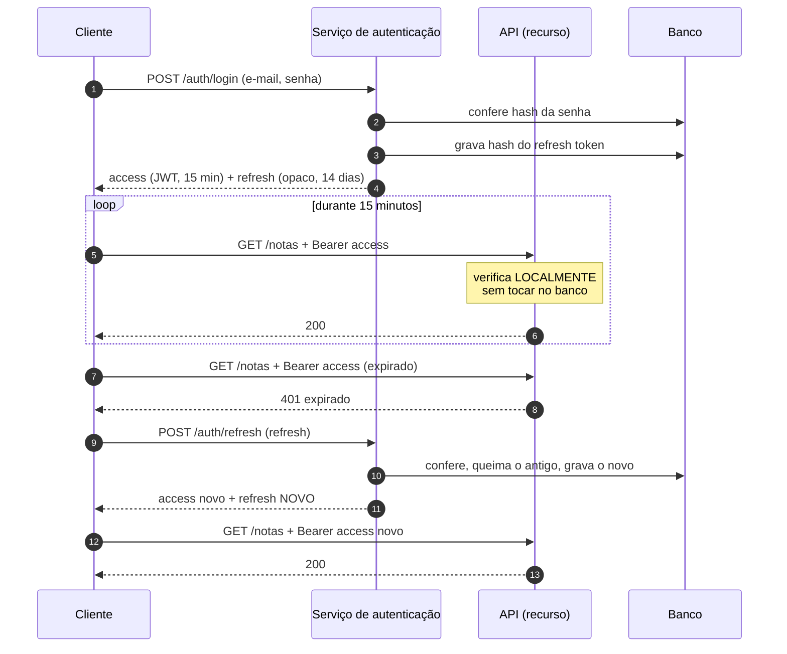
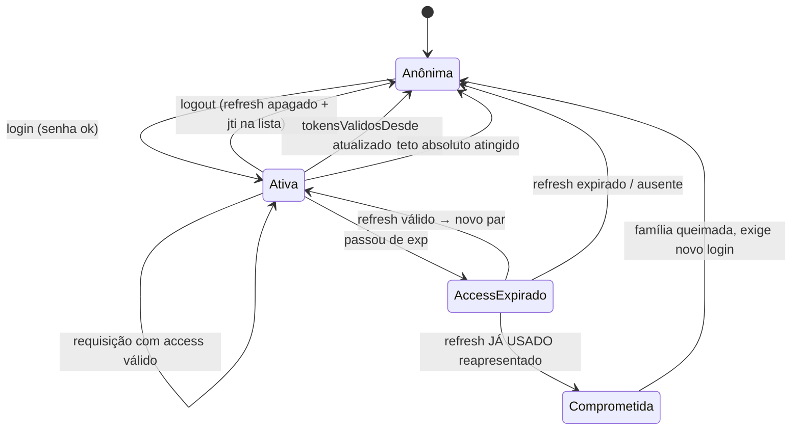

# 17 · Ciclo de vida da sessão — renovação, rotação, revogação, logout

> Nível: intermediário a avançado · Atualizado em 14/08/2026
> Todo comportamento descrito aqui está implementado e testado no
> [projeto-modelo](07-projeto-modelo/).

Este é o arquivo que separa quem "usa JWT" de quem "opera autenticação com JWT".

---

## 17.1 · O problema central

Um JWT é **autocontido**. Uma vez emitido, ele vale até `exp`, e o emissor não tem
como pedir de volta. Isso gera quatro perguntas que todo sistema precisa responder:

1. Como manter a pessoa logada sem pedir a senha a cada 15 minutos?
2. Como deslogar de verdade?
3. Como derrubar uma sessão que foi roubada?
4. Como refletir uma mudança de permissão que aconteceu agora?

O padrão de dois tokens responde às quatro — com custos, todos explícitos aqui.

---

## 17.2 · O padrão de dois tokens



**Por que dois tokens e não um.** As propriedades desejadas são contraditórias:

|  | Quero verificação barata | Quero poder revogar |
|---|---|---|
| Implica | sem consulta ao banco | consulta ao banco |

Um token só teria de escolher. Dois resolvem por divisão de trabalho:

| | Access token | Refresh token |
|---|---|---|
| Usado em | toda requisição (milhares/min) | só na renovação (1× a cada 15 min) |
| Verificação | local, sem I/O | sempre no banco |
| Revogável na hora | não (só com lista) | **sim** |
| Vida | curta, porque é irrevogável | longa, porque é revogável |
| Formato | JWT | **opaco** |

A frase que resume: **o token caro de verificar é raro; o token barato é curto.**

---

## 17.3 · Por que o refresh token não é um JWT

Ele **sempre** consulta o banco. Logo:

- a auto-suficiência do JWT não serve para nada aqui;
- o payload legível só acrescenta exposição;
- o token fica maior sem ganho nenhum.

32 bytes aleatórios bastam. E guarde apenas o **hash** deles:

```js
const segredo = randomBytes(32).toString('base64url');
armazem.set(sha256(segredo), { usuarioId, familiaId, expEm, usado: false });
// devolve `segredo` ao cliente; guarda só o hash
```

**Por que hash?** Mesmo raciocínio de senha: se o banco vazar, quem vazou tem hashes
inúteis, não credenciais vivas. SHA-256 puro basta aqui porque a entrada tem 256 bits
de entropia real — não há dicionário a testar. (Para senha humana, seria
imperdoável; ver [07-projeto-modelo/src/senha.js](07-projeto-modelo/src/senha.js).)

---

## 17.4 · Rotação de refresh com detecção de reuso

**O padrão recomendado pela RFC 9700 (jan/2025) para clientes públicos** (SPA,
aplicativo móvel).

**A regra:** cada uso do refresh o consome e emite um novo. O antigo morre.

**Por que isso é poderoso.** Suponha que alguém roube o refresh token da vítima. Só
há dois desfechos, e nos dois você detecta:

```
Caso A — o ladrão usa primeiro
  ladrão → refresh R1 → recebe R2 (R1 morto)
  vítima → refresh R1 → 🚨 R1 já foi usado → REUSO DETECTADO

Caso B — a vítima usa primeiro
  vítima → refresh R1 → recebe R2 (R1 morto)
  ladrão → refresh R1 → 🚨 R1 já foi usado → REUSO DETECTADO
```

Em qualquer ordem, a segunda apresentação de um token já gasto é o sinal. Sem
rotação, o ladrão renova em silêncio para sempre, em paralelo com a vítima, e
**nada** revela o roubo.

**A resposta ao reuso: queimar a família inteira.**

Família = todos os refresh descendentes de um mesmo login. Ao detectar reuso, apague
todos. Consequência honesta: **a sessão legítima também cai**. É deliberado — não há
como saber qual das duas apresentações era do ladrão.

```js
if (registro.usado) {
  armazem.queimarFamilia(registro.familiaId);
  throw new ErroSessao('reuso_detectado', 'sessão encerrada por suspeita de roubo');
}
```

**O falso positivo que você vai encontrar em produção.** Não é ataque — é
concorrência. Uma tela dispara 10 chamadas em paralelo, todas recebem 401, todas
chamam `/auth/refresh` com o mesmo token, e a segunda em diante dispara a detecção.
A sessão da pessoa cai sem motivo.

Duas defesas, e você precisa das duas:

**1. No cliente: deduplique.** Uma única renovação em voo por vez.

```js
let renovacaoEmCurso = null;
async function renovar() {
  renovacaoEmCurso ??= fazerRenovacao().finally(() => { renovacaoEmCurso = null; });
  return renovacaoEmCurso;
}
```

**2. No servidor: janela de graça.** Aceite a reapresentação do mesmo token dentro de
alguns segundos, devolvendo o **mesmo** par já emitido, sem queimar a família.

```js
const GRACA = 10; // segundos
if (registro.usado) {
  if (agora - registro.usadoEm <= GRACA && registro.parEmitido) {
    return registro.parEmitido;      // repetição benigna: devolve o mesmo resultado
  }
  armazem.queimarFamilia(registro.familiaId);
  throw new ErroSessao('reuso_detectado', '...');
}
```

> **Ressalva honesta:** a janela de graça enfraquece a detecção — um ladrão que ataca
> dentro dela passa. É um trade-off real entre falso positivo (usuário irritado) e
> falso negativo (roubo não detectado). 10 segundos é um valor defensável; 5 minutos
> não é. O [projeto-modelo](07-projeto-modelo/) implementa a versão **estrita**, sem
> graça, e o teste mostra o efeito colateral explicitamente.

---

## 17.5 · Logout de verdade

"Com JWT não dá para deslogar" é falso. O que existe é **custo**, e ele é menor do
que a fama sugere.

Logout completo mata **as duas** credenciais:

```js
async function logout(req) {
  // 1. o refresh: apagar do armazém — imediato, sem custo
  const registro = armazem.buscarRefresh(refreshRecebido);
  if (registro) armazem.queimarFamilia(registro.familiaId);

  // 2. o access: lista de negação por `jti`, até o `exp`
  const { payload } = verificar(accessRecebido, opcoes);
  armazem.revogarJti(payload.jti, payload.exp);
}
```

**Sem o passo 2**, o access token continua valendo pelos minutos que faltam. É esse o
"JWT não desloga" — na verdade, "logout mal implementado não desloga".

### O custo real da lista de negação

Uma entrada só precisa viver até o `exp` do token. Com access token de 15 minutos, a
lista guarda **no máximo 15 minutos de logouts**.

| Escala | Logouts/dia | Pico de entradas (15 min) | Memória (~100 B/entrada) |
|---|---|---|---|
| Pequena | 1.000 | ~10 | 1 KB |
| Média | 100.000 | ~1.000 | 100 KB |
| Grande | 10.000.000 | ~100.000 | 10 MB |

**10 MB de Redis para uma operação de dez milhões de logouts por dia.** O argumento
"não dá para revogar JWT porque a lista fica gigante" não sobrevive à aritmética.

O que ele custa de verdade é uma **consulta a mais por requisição** — o que reintroduz
parte do acoplamento que o JWT prometia eliminar. Esse é o custo honesto, e ele é de
latência, não de memória. Mitigações: cache local com TTL curto em cada instância;
ou consultar a lista só em rotas sensíveis.

---

## 17.6 · Invalidação em massa sem lista

O truque mais custo-benefício do assunto, e o menos divulgado.

Guarde no usuário um campo `tokensValidosDesde` (um NumericDate). Na verificação:

```js
if (payload.iat < usuario.tokensValidosDesde) throw new Error('token invalidado');
```

Para derrubar **todos** os tokens de alguém — troca de senha, comprometimento
detectado, saída da empresa — basta:

```js
usuario.tokensValidosDesde = agoraEmSegundos();
```

**Um campo, um `UPDATE`, todos os tokens daquela pessoa mortos.** Sem lista, sem
Redis, sem crescimento.

**A ressalva:** exige carregar o usuário na verificação — a mesma consulta que a lista
de negação exige. Se você já carrega o usuário (e a maioria das APIs carrega, para
autorização de recurso), sai de graça.

**Combinação recomendada:**

| Necessidade | Mecanismo |
|---|---|
| Logout de uma sessão | apagar o refresh + `jti` na lista de negação |
| Derrubar todas as sessões de uma pessoa | `tokensValidosDesde` |
| Derrubar todo mundo (chave comprometida) | rotacionar e **aposentar** a chave na hora |

---

## 17.7 · Escolhendo os tempos de vida

```
vida do access token  ⇄  janela de estrago de um token roubado
vida do access token  ⇄  frequência de renovação (carga no serviço de auth)
vida do refresh token ⇄  quanto tempo a pessoa fica logada sem digitar a senha
```

| Contexto | Access | Refresh | Racional |
|---|---|---|---|
| Banco / saúde | 5 min | 8 h (ou sessão) | risco alto; a pessoa está na frente da tela |
| SaaS comum | **15 min** | **14–30 dias** | o consenso do mercado |
| App móvel | 15 min | 30–90 dias | reautenticar no celular é caro em UX |
| Serviço↔serviço, rede fechada | 5–60 min | não usa | renova com a própria chave |
| Painel administrativo | 5 min | 8 h | privilégio alto |

**A conta que ninguém faz:** com access token de 15 min e 100.000 pessoas ativas,
o serviço de autenticação recebe ~110.000 renovações por hora — cerca de 30 por
segundo. É pouco, mas não é zero, e concentra num único serviço. Dimensione.

**Renovação proativa.** Renovar aos 80% da vida, em vez de esperar o 401, elimina
uma classe inteira de erros intermitentes causados por desvio de relógio:

```js
const renovarEm = expEm - Math.floor(vida * 0.2);
if (agora >= renovarEm) await renovar();
```

---

## 17.8 · Sessão deslizante vs. absoluta

**Deslizante:** cada uso estende o prazo. Quem usa todo dia nunca precisa logar de
novo.

**Absoluta:** existe um teto. Depois de N dias desde o login, a senha é pedida de
novo, use ou não use.

**Faça as duas.** Deslizante para conveniência, absoluta como teto de segurança:

```js
const registro = armazem.buscarRefresh(recebido);
const LIMITE_ABSOLUTO = 90 * 86400;
if (agora - registro.familiaCriadaEm > LIMITE_ABSOLUTO) {
  throw new ErroSessao('sessao_muito_antiga', 'faça login novamente');
}
// senão, emite refresh novo com prazo deslizante
```

Sem o teto absoluto, uma sessão roubada e mantida ativa por um script dura para
sempre. Com ele, o roubo tem prazo de validade.

---

## 17.9 · O problema da permissão desatualizada

Você rebaixa alguém de `admin` para `usuario`. O token que essa pessoa tem continua
dizendo `admin` até expirar.

**Este é o custo estrutural do JWT, e não tem solução gratuita.** As opções:

| Estratégia | Atraso | Custo |
|---|---|---|
| Aceitar e usar access token curto | até 15 min | zero — **na maioria dos casos, a resposta certa** |
| `tokensValidosDesde` ao mudar permissão | imediato | uma consulta ao usuário por requisição |
| Não pôr permissão no token; consultar sempre | imediato | uma consulta por requisição — e aí, por que JWT? |
| Notificar os serviços por evento (pub/sub) | segundos | complexidade alta, consistência eventual |

**Recomendação:** para 95% dos sistemas, access token de 15 minutos é resposta
suficiente. Alguém rebaixado continuar administrador por até 15 minutos é aceitável
na maioria dos negócios. Para os 5% em que não é (financeiro, saúde, controle
industrial), use `tokensValidosDesde` — e reconheça que você reintroduziu a consulta
por requisição.

Se a sua resposta a "quanto atraso é aceitável?" for "zero", a conclusão honesta é que
**você não deveria estar usando JWT para esta decisão**. Ver
[21-quando-nao-usar.md](21-quando-nao-usar.md).

---

## 17.10 · Máquina de estados da sessão



Cada transição do diagrama tem um teste correspondente em
[test/api.test.js](07-projeto-modelo/test/api.test.js).

---

## 17.11 · Checklist de implementação

```
[ ] Access token com vida ≤ 15 min
[ ] Refresh token opaco, guardado como hash
[ ] Rotação do refresh a cada uso
[ ] Detecção de reuso, com queima de família
[ ] Deduplicação de renovação no cliente
[ ] Teto absoluto de sessão, além do prazo deslizante
[ ] Logout mata refresh E access (jti na lista de negação)
[ ] Faxina periódica da lista de negação
[ ] `tokensValidosDesde` ao trocar senha e ao rebaixar permissão
[ ] Renovação proativa aos 80% da vida
[ ] Métrica: renovações/min, reusos detectados/dia, tamanho da lista
[ ] Alarme se reusos detectados subir de patamar
```

---

## Autoteste

1. Por que dois tokens em vez de um? Qual contradição isso resolve?
2. Por que o refresh token não deveria ser um JWT?
3. Por que guardar o hash do refresh, e por que SHA-256 puro basta aqui mas não
   bastaria para senha?
4. Descreva os dois desfechos possíveis de um roubo de refresh sob rotação. Por que
   você detecta nos dois?
5. Por que queimar a família inteira, se isso derruba a sessão legítima também?
6. Qual falso positivo você vai encontrar em produção, e quais são as duas defesas?
7. Faça a conta: 10 milhões de logouts por dia, access de 15 min. Qual o tamanho da
   lista de negação? Qual é o custo **real** dela, então?
8. Como derrubar todos os tokens de uma pessoa sem lista de negação?
9. Por que combinar sessão deslizante com teto absoluto?
10. Alguém pergunta "e se eu precisar de zero atraso na mudança de permissão?". Qual
    é a sua resposta honesta?
