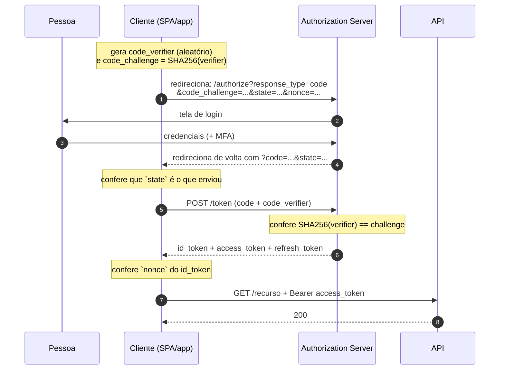

# 19 · JWT no OAuth 2.0 e no OpenID Connect

> Nível: intermediário a avançado · Atualizado em 14/08/2026
> Referências: RFC 6749, RFC 6750, RFC 9068, RFC 9700, OpenID Connect Core 1.0

É aqui que o JWT aparece na maior parte da vida real. E é aqui que moram os erros de
integração mais caros.

---

## 19.1 · O que cada sigla é

Confusão de vocabulário custa dias de trabalho. O mapa:

| Sigla | O que resolve | O que **não** é |
|---|---|---|
| **OAuth 2.0** (RFC 6749) | **delegação de acesso**: dar a um app permissão de agir em seu nome | não é autenticação; não define o formato do token |
| **OpenID Connect** (2014) | **autenticação**: provar quem é a pessoa | uma camada *sobre* o OAuth, não um substituto |
| **JWT** (RFC 7519) | um formato de token | não é protocolo |
| **SAML** | autenticação e federação, em XML | alternativa ao OIDC, não complementar |

**A frase que evita metade dos erros de arquitetura:**

> **OAuth 2.0 é sobre autorização; OpenID Connect é sobre autenticação.**

Usar OAuth puro para login ("entrar com X" implementado só com access token) é um
erro clássico e conhecido: um access token prova que *alguém autorizou o app a
acessar um recurso*, e não *quem é a pessoa*. O OIDC existe justamente porque o
mercado passou anos fazendo isso errado.

**Detalhe importante:** a RFC 6749 **não diz** qual é o formato do access token. Ele
pode ser opaco, e em muitos provedores é. O JWT como access token só foi padronizado
em 2021, pela RFC 9068.

---

## 19.2 · Os três tokens do OIDC

| Token | Formato | Para quem | Para quê | Vida |
|---|---|---|---|---|
| **`id_token`** | **sempre JWT** | o **cliente** | provar quem é a pessoa | curta; consumido uma vez |
| **`access_token`** | JWT **ou** opaco | a **API** | autorizar chamadas | 5–15 min |
| **`refresh_token`** | opaco | o **emissor** | renovar | dias a meses |

**O erro de integração nº 1 do assunto inteiro:** mandar o `id_token` para a API no
`Authorization: Bearer`.

Por que é errado, mesmo que "funcione":

1. A `aud` do `id_token` é o **cliente** (o `client_id` da sua aplicação), não a API.
   Se a API aceita, é porque não valida `aud` — e aí ela aceitaria também o token de
   qualquer outro serviço.
2. O `id_token` não carrega `scope`. A API perde a capacidade de autorizar por
   escopo.
3. Ele carrega dados pessoais (nome, e-mail, foto) que agora circulam em toda
   requisição e em todo log.
4. Ele foi feito para ser consumido **uma vez**, no login.

**A regra:** `id_token` → o cliente lê, extrai a identidade, e **descarta**.
`access_token` → vai para a API.

A defesa técnica é `typ: "at+jwt"` (RFC 9068) verificado pela API: um `id_token`
apresentado ali é recusado pelo tipo, antes de qualquer outra checagem.

---

## 19.3 · O fluxo que você deve usar: *authorization code* + PKCE

**Todos** os clientes devem usá-lo em 2026 — SPA, móvel e servidor. A RFC 9700
(jan/2025) formaliza isso.



### PKCE, explicado

**PKCE** (*Proof Key for Code Exchange*, RFC 7636, pronuncia-se "pixie") resolve o
**roubo do código de autorização**.

O código volta pela barra de endereços. Num aplicativo móvel, ele chega por um
esquema de URL personalizado (`meuapp://callback`) que **outro aplicativo malicioso
pode registrar**. Sem PKCE, quem intercepta o código o troca por tokens.

Com PKCE:

1. o cliente sorteia um `code_verifier` (43–128 caracteres aleatórios) e guarda;
2. envia só o `code_challenge = base64url(SHA256(verifier))`;
3. ao trocar o código, apresenta o `verifier` original;
4. o servidor confere. Quem roubou só o código não tem o `verifier` e não troca nada.

```js
const verifier = base64url(crypto.getRandomValues(new Uint8Array(32)));
const challenge = base64url(await crypto.subtle.digest('SHA-256', new TextEncoder().encode(verifier)));
// envie challenge no /authorize; guarde verifier em sessionStorage; envie-o no /token
```

> **Use sempre `S256`, nunca `plain`.** O método `plain` envia o verifier em claro e
> não protege contra nada.

### `state` e `nonce`

Dois valores aleatórios, com papéis diferentes, ambos obrigatórios:

| Parâmetro | Protege contra | Como se verifica |
|---|---|---|
| `state` | **CSRF no fluxo**: alguém induz seu navegador a completar um login com a conta do atacante | você guarda antes de redirecionar e confere na volta |
| `nonce` | **repetição de `id_token`**: reapresentar um `id_token` antigo | você envia no `/authorize` e confere que voltou igual **dentro do `id_token`** |

Esquecer o `nonce` é comum porque "funciona sem ele". O que ele impede é sutil: um
`id_token` legítimo capturado antes pode ser reinjetado num novo fluxo.

---

## 19.4 · Fluxos obsoletos e proibidos

| Fluxo | Status em 2026 | Por quê |
|---|---|---|
| **Implicit** (`response_type=token`) | ❌ **proibido** (RFC 9700) | o token volta na URL: vai para o histórico, para o `Referer`, para o log do servidor |
| **Resource Owner Password Credentials** | ❌ **proibido** (RFC 9700) | o app vê a senha da pessoa; impede MFA e login federado |
| Authorization code **sem** PKCE | ❌ desaconselhado | vulnerável a interceptação de código |
| **Client Credentials** | ✅ válido | serviço↔serviço, sem usuário envolvido |
| **Device Authorization** (RFC 8628) | ✅ válido | TV, console, dispositivo sem teclado |
| **Authorization code + PKCE** | ✅ **use este** | — |

Se você encontrar um tutorial ensinando *implicit*, ele é anterior a 2019. Se
encontrar um SDK que só oferece *password grant*, o fornecedor está dez anos
atrasado.

---

## 19.5 · Descoberta: `/.well-known/openid-configuration`

Todo provedor OIDC publica um documento com sua configuração:

```bash
curl -s https://accounts.google.com/.well-known/openid-configuration | jq '{
  issuer, authorization_endpoint, token_endpoint, jwks_uri,
  id_token_signing_alg_values_supported, code_challenge_methods_supported
}'
```

```json
{
  "issuer": "https://accounts.google.com",
  "authorization_endpoint": "https://accounts.google.com/o/oauth2/v2/auth",
  "token_endpoint": "https://oauth2.googleapis.com/token",
  "jwks_uri": "https://www.googleapis.com/oauth2/v3/certs",
  "id_token_signing_alg_values_supported": ["RS256"],
  "code_challenge_methods_supported": ["plain", "S256"]
}
```

**Use a descoberta em vez de codificar URLs.** Provedores mudam endpoints; o `issuer`
e a URL de descoberta são o contrato estável.

**A verificação que quase ninguém faz:** confira que o `issuer` **declarado no
documento** é igual ao que você configurou. Se alguém trocar sua variável de ambiente
para apontar a um provedor falso, essa checagem é o que percebe.

---

## 19.6 · Validando um `id_token` — a lista completa

A especificação do OIDC (Core §3.1.3.7) define onze passos. Os que importam na
prática:

```js
const { payload } = await jwtVerify(idToken, jwks, {
  algorithms: ['RS256'],                 // o que o provedor declara — fixado por você
  issuer: metadados.issuer,              // exato, byte a byte
  audience: MEU_CLIENT_ID,               // a aud do id_token é o CLIENTE
  clockTolerance: '60s',
  maxTokenAge: '10m',
});

// depois da biblioteca:
if (payload.nonce !== nonceQueEuEnviei) throw new Error('nonce divergente');
if (payload.azp && payload.azp !== MEU_CLIENT_ID) throw new Error('azp divergente');
if (payload.email && payload.email_verified !== true) {
  // não use o e-mail para casar contas
}
// se veio access token junto, confira at_hash (opcional, mas recomendado)
```

**A armadilha do `aud` no `id_token`:** é o `client_id`, **não** a URL da sua API.
Confundir isso é o que faz a integração falhar com "audiência inválida" no primeiro
dia.

---

## 19.7 · Access token: JWT ou opaco?

O OAuth não decide por você. Os dois modelos existem e coexistem.

| | JWT (auto-suficiente) | Opaco + *introspection* (RFC 7662) |
|---|---|---|
| Validação | local, sem rede | uma chamada HTTP ao emissor por requisição |
| Latência | ~0,1 ms | 5–50 ms |
| Revogação | atrasada até `exp` | **imediata** |
| Conteúdo visível ao cliente | **sim** | não |
| Acoplamento | só o JWKS | forte com o emissor |
| Emissor fora do ar | a API continua funcionando | **a API para** |

**O híbrido, que é o que os provedores maduros fazem:** access token opaco para
fora (clientes públicos), convertido em JWT pelo gateway na borda, e JWT internamente
entre os serviços. Ganha revogação imediata na fronteira e validação local por dentro.

**Recomendação:** se a sua exigência de revogação for "imediata, sem exceção",
introspecção é a resposta honesta — e aceite o custo. Se "até 15 minutos" for
aceitável, JWT com access token curto é melhor em tudo o mais.

---

## 19.8 · Escopos e permissões

**Escopo** (`scope`) é o que o **cliente** pediu permissão para fazer, não o que a
pessoa pode fazer.

```
"scope": "openid profile email pedidos:leitura"
```

Uma string separada por **espaço** (não vírgula, não array — erro comum).

**A distinção que confunde:**

| | `scope` | papéis / permissões |
|---|---|---|
| Responde | "o que este **app** pode fazer em nome da pessoa" | "o que esta **pessoa** pode fazer" |
| Quem define | o cliente pede, a pessoa consente | o administrador do sistema |
| Onde vive | no token OAuth | no seu banco (ou no token, se couber) |

**A regra de autorização:** a permissão efetiva é a **interseção**.

```js
const podeEscrever =
  escopos.includes('pedidos:escrita') &&      // o app foi autorizado a isso
  usuario.papeis.includes('editor');           // e a pessoa tem o direito
```

Um app com escopo total operando para um usuário sem permissão não pode nada. Um
usuário administrador usando um app com escopo de leitura não escreve. Verificar só
um dos dois lados é um furo de autorização.

**Escopos do OIDC:**

| Escopo | Efeito |
|---|---|
| `openid` | **obrigatório** para receber `id_token`. Sem ele, é OAuth puro, não OIDC |
| `profile` | acrescenta `name`, `picture`, `locale`… |
| `email` | acrescenta `email` e `email_verified` |
| `offline_access` | pede `refresh_token` |

---

## 19.9 · Erros de integração mais comuns

| Sintoma | Causa provável |
|---|---|
| `invalid_audience` ao validar `id_token` | usou a URL da API em vez do `client_id` |
| Token válido recusado pela API | `aud` do access token não configurada no provedor |
| `invalid_grant` na troca do código | código já usado (só serve uma vez), expirado (~60 s), ou `redirect_uri` diferente da usada no `/authorize` |
| Funciona local, falha em produção | `redirect_uri` não cadastrada; comparação é **exata**, inclusive barra final |
| `nonce` ausente no `id_token` | não foi enviado no `/authorize` |
| 401 intermitente | desvio de relógio; ajuste NTP e use tolerância de 60 s |
| Não recebe `refresh_token` | faltou `offline_access`, ou o provedor exige `prompt=consent` |
| Falha só para alguns usuários | token grande demais por causa de muitos grupos — ver [12.10](12-anatomia-do-token.md#1210--tamanho-por-que-importa-mais-do-que-parece) |
| Login em laço infinito | API devolve 401 onde deveria devolver 403; o cliente renova para sempre |

---

## 19.10 · Quando você precisa de OAuth/OIDC — e quando não

**Precisa:**

- login com Google/Microsoft/GitHub;
- SSO corporativo;
- sua API é usada por aplicações de terceiros;
- exigência de conformidade que pede padrão reconhecido.

**Provavelmente não precisa:**

- uma aplicação, um banco de usuários, sem terceiros. Um login próprio com sessão ou
  com o padrão de dois tokens do [projeto-modelo](07-projeto-modelo/) resolve, com
  uma fração da complexidade.

**Opinião profissional:** montar um servidor OAuth próprio quase nunca compensa. É um
protocolo grande, cheio de detalhes de segurança, e as implementações prontas
(Keycloak, Zitadel, Ory Hydra — todas open source e gratuitas) são melhores do que o
que a maioria dos times escreveria. Escrever o **cliente** é razoável; escrever o
**servidor** é um projeto de meses, com risco alto.

---

## Autoteste

1. Qual a diferença entre OAuth 2.0 e OpenID Connect, em uma frase?
2. Cite quatro razões concretas para não mandar o `id_token` à API.
3. Explique o PKCE em quatro passos. Que ataque específico ele bloqueia?
4. Qual a diferença entre `state` e `nonce`? O que cada um protege?
5. Por que o fluxo *implicit* foi proibido?
6. Qual é o valor correto de `aud` num `id_token`? E num access token?
7. Compare JWT e token opaco com introspecção. Quando cada um é a escolha certa?
8. `scope` é array ou string? Qual o separador?
9. Por que a permissão efetiva é a interseção entre escopo e papel? Dê um exemplo de
   furo ao verificar só um lado.
10. Você recebe `invalid_grant` na troca do código. Cite três causas possíveis.
