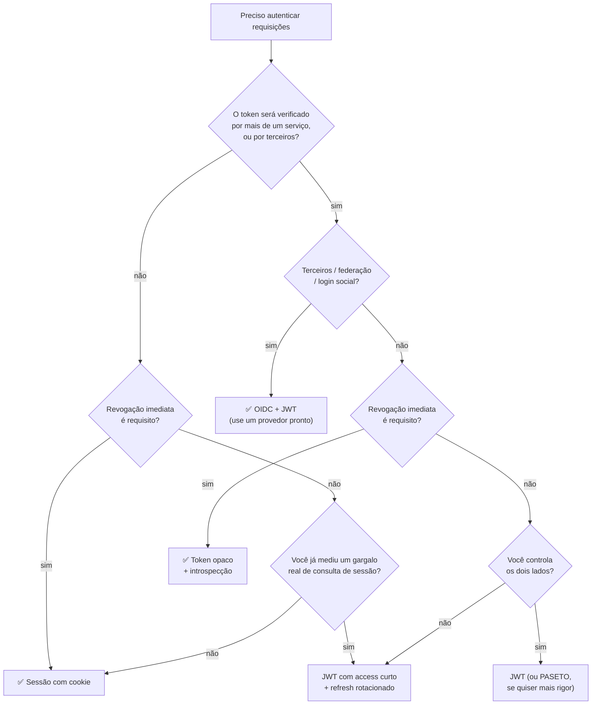

# 21 · Quando **não** usar JWT

> Nível: intermediário · Atualizado em 14/08/2026
> O arquivo mais útil deste material, e o que menos se escreve.

---

## 21.1 · A tese

> **Para a maioria das aplicações web, um cookie de sessão comum é a escolha certa, e
> o JWT é complexidade sem contrapartida.**

Isto é opinião profissional, declarada como opinião. Mas é uma opinião com
argumento, e ela é hoje a posição de boa parte da comunidade de segurança — inclusive
de pessoas que ajudaram a padronizar o JWT.

O JWT resolve um problema específico: **verificação distribuída sem estado
compartilhado**. Se você não tem esse problema, está pagando o custo sem receber o
benefício.

---

## 21.2 · A pergunta que decide

Uma só:

> **Quem precisa verificar este token, e o que acontece se ele não puder ser
> revogado na hora?**

| Sua resposta | Escolha |
|---|---|
| "Só o meu servidor, e revogação imediata é requisito" | **sessão com cookie** |
| "Vários serviços meus, atraso de minutos é aceitável" | **JWT** |
| "Serviços de terceiros, ou federação" | **JWT** (dentro de OAuth/OIDC) |
| "Só o meu servidor, mas escala demais para consultar sessão" | **meça antes** — quase certamente não é o caso |

---

## 21.3 · Caso 1 — aplicação web monolítica com login próprio

**O cenário:** um servidor (ou uma frota atrás de um balanceador), um banco, um
front. Sem terceiros.

**Por que sessão vence:**

| | Sessão com cookie | JWT |
|---|---|---|
| Logout | apagar a linha. Imediato | lista de negação, faxina, consulta extra |
| Trocar permissão | vale na próxima requisição | espera o `exp` |
| Trocar senha e derrubar tudo | `DELETE ... WHERE usuario_id` | `tokensValidosDesde` + consulta |
| Ver quem está logado | `SELECT` | precisa de estado paralelo |
| Tamanho por requisição | ~30 bytes | 300 B a 2 KB |
| XSS | cookie `HttpOnly` protege | precisa do mesmo cuidado, e é mais fácil errar |
| Código de autenticação | ~50 linhas | ~300 linhas + gestão de chave |
| Rotação de chave | não existe | procedimento a manter |

**O contra-argumento e a resposta.** "Mas sessão não escala." Faça a conta: uma
consulta a Redis por requisição custa 0,2–1 ms e um Redis modesto entrega 100 mil
operações por segundo. Para chegar a um gargalo de sessão você precisa de um volume
que 99% dos sistemas nunca verá — e, quando chegar lá, você terá equipe para
migrar.

**A pergunta desconfortável:** você já mediu, ou está otimizando para uma escala
imaginária? Otimização prematura com custo de segurança é o pior tipo.

---

## 21.4 · Caso 2 — quando revogação imediata é requisito

Se a resposta a "quanto tempo alguém demitido pode continuar acessando?" for
**"zero"**, o JWT autocontido está errado por construção.

Contextos onde isso costuma ser inegociável:

- sistemas bancários e de pagamento;
- prontuário eletrônico e sistemas de saúde;
- controle industrial e infraestrutura crítica;
- qualquer sistema sob norma que exija revogação comprovável.

**As saídas, e por que cada uma decepciona:**

| Saída | Problema |
|---|---|
| Access token de 1 minuto | 60× mais renovações; o serviço de auth vira o gargalo que você queria evitar |
| Lista de negação consultada sempre | é uma sessão, com passos a mais |
| Token opaco + introspecção | é a resposta correta — e não é JWT |

Se você chegou à conclusão de que precisa consultar um armazenamento central a cada
requisição, **você quer uma sessão**. Chamá-la de JWT não muda a natureza.

---

## 21.5 · Caso 3 — JWT como identificador de sessão de site tradicional

O antipadrão mais comum: um site renderizado no servidor que guarda um JWT em cookie
e o usa exatamente como um `session_id`.

Aqui você tem **todos** os custos do JWT e **nenhum** benefício:

- o servidor que verifica é o mesmo que emite (então HMAC bastaria, e nem isso é
  preciso);
- não há distribuição (então a auto-suficiência não serve);
- e você ganhou de brinde a dificuldade de revogar.

Se o token nunca sai do seu servidor, ele podia ser um número aleatório.

---

## 21.6 · Caso 4 — dado que muda dentro da vida do token

Se a decisão depende de algo que muda em segundos, não coloque no token.

| Dado | Muda | No token? |
|---|---|---|
| ID do usuário | nunca | ✅ |
| Papel/permissão | raramente | 🟡 aceite o atraso, ou consulte |
| Saldo, cota, limite de uso | a cada operação | ❌ **nunca** |
| Estado de assinatura (pagou/não pagou) | a qualquer momento | ❌ consulte |
| Ativo/bloqueado | a qualquer momento | ❌ consulte |

**A cilada da cota.** Colocar `creditosRestantes: 100` no token e decrementar no
cliente é convite a fraude: a pessoa guarda o token antigo e o reapresenta. Cota é
estado do servidor, sempre.

---

## 21.7 · Caso 5 — dado sensível

Já dito, e repetido porque continua acontecendo: o payload é **público** para quem
tem o token. Se o dado não pode aparecer num log de proxy, ele não pode ir no JWT.

E a resposta não é cifrar (ver [15-criptografia-jwe.md](15-criptografia-jwe.md)) — é
**tirar do token**.

---

## 21.8 · Caso 6 — quando o token fica grande demais

Um `id_token` do Entra ID com muitos grupos passa de 8 KB. Consequências:

- estoura o limite de cabeçalho do nginx → **400 sem explicação**;
- estoura o limite de cookie do navegador → **cookie silenciosamente descartado**;
- 8 KB por requisição × 200 requisições por tela = 1,6 MB de tráfego por tela.

Quando o token cresce, a solução é **parar de carregar o dado por valor** — voltar
para referência. Ou seja: parar de usar o JWT como o JWT foi vendido.

---

## 21.9 · Comparação honesta das alternativas

| Mecanismo | Verificação | Revogação | Distribuído | Tamanho | Complexidade |
|---|---|---|---|---|---|
| **Cookie de sessão** | consulta | imediata | ruim | ~30 B | **baixa** |
| **JWT** | local | atrasada | **ótima** | 300 B–2 KB | média |
| **Token opaco + introspecção** | consulta ao emissor | imediata | boa | ~40 B | média |
| **PASETO** | local | atrasada | ótima | ~300 B | média |
| **Macaroons** | local | por atenuação | ótima | variável | alta |
| **Biscuit** | local | por atenuação | ótima | ~500 B | alta |
| **mTLS** | handshake | por CRL/OCSP | boa | — | **alta** |

### PASETO

*Platform-Agnostic Security Tokens*. Nasceu como crítica direta ao JOSE: **sem
negociação de algoritmo**. A versão do token determina o algoritmo, ponto. `v4.public`
é sempre Ed25519; `v4.local` é sempre XChaCha20-Poly1305.

Elimina por construção a família inteira de ataques de confusão de algoritmo.

**Por que não é o padrão:** não é RFC do IETF, o ecossistema é uma fração do JOSE, e
nenhum provedor de identidade grande o emite. Tecnicamente melhor; praticamente
isolado.

**Recomendação:** se o token é 100% interno e você controla os dois lados, PASETO é
defensável e mais seguro. Se o token cruza fronteiras organizacionais, JWT é a
escolha pragmática.

### Macaroons e Biscuit

Tokens com **atenuação**: quem tem o token pode criar uma versão *mais restrita* dele
sem falar com o emissor. Um token de leitura total vira um token de leitura de um
único arquivo, por 5 minutos, sem consultar ninguém.

É elegante e resolve o problema da delegação com privilégio mínimo. Usado em produção
por Cloudflare (Macaroons) e Fly.io (Biscuit). Curva de aprendizado alta e ecossistema
pequeno.

---

## 21.10 · Árvore de decisão

---

## 21.11 · Os quatro sinais de que você escolheu errado

**1. Você está construindo uma lista de negação consultada em toda requisição.**
Você reinventou a sessão, com passos a mais.

**2. Seu access token dura 1 minuto.** Você quer revogação imediata e está tentando
aproximá-la por força bruta. Use sessão ou introspecção.

**3. Seu token passa de 2 KB.** Você está carregando por valor o que deveria ser
referência.

**4. Você tem um serviço, um banco, e três arquivos de código só para gerir JWT.**
O custo é real e o benefício é hipotético.

---

## 21.12 · Quando o JWT é claramente a escolha certa

Para equilibrar — os casos em que ele brilha e nada mais serve tão bem:

- **Login federado.** "Entrar com Google/Microsoft/GitHub" é JWT, e não há
  alternativa prática.
- **API pública consumida por terceiros.** Eles precisam validar sem acesso ao seu
  banco.
- **Microsserviços de verdade** (dezenas de serviços, times diferentes, times que não
  se falam).
- **Verificação na borda.** CDN e *edge workers* não têm acesso ao seu banco;
  verificar localmente é a única opção.
- **Tokens de propósito único e vida curta:** redefinição de senha, convite,
  confirmação de e-mail, link assinado. O `exp` embutido é exatamente o que se quer, e
  não há estado a manter.
- **Serviço↔serviço com privilégio mínimo**, com escopo e vida curta.

Nesses casos o JWT não é moda: é a ferramenta certa.

---

## 21.13 · O caminho de migração, se você errou

Não precisa reescrever tudo.

**De JWT para sessão:**
1. emita os dois em paralelo (cookie de sessão + JWT);
2. o servidor aceita ambos, preferindo a sessão;
3. quando os JWTs em circulação expirarem (dias), pare de emiti-los;
4. remova o código do JWT.

**De sessão para JWT:** o inverso, com o cuidado de resolver revogação **antes** de
migrar — não depois.

**Do JWT caseiro para um provedor pronto** (Keycloak, Zitadel, Auth0): quase sempre
vale a pena. Ver [80-custos-e-licencas.md](80-custos-e-licencas.md).

---

## Autoteste

1. Enuncie a tese deste arquivo e o argumento que a sustenta.
2. Qual é a pergunta única que decide entre sessão e JWT?
3. Responda ao argumento "sessão não escala" com números.
4. Por que usar JWT como `session_id` num site tradicional é o pior dos mundos?
5. Cite três dados que nunca devem ir no token, e por quê.
6. O que o PASETO faz de diferente, e por que ele não virou padrão?
7. O que é atenuação, e qual token a oferece?
8. Cite os quatro sinais de que você escolheu errado.
9. Cite três casos em que o JWT é claramente a escolha certa.
10. Descreva o caminho de migração de JWT para sessão sem downtime.
