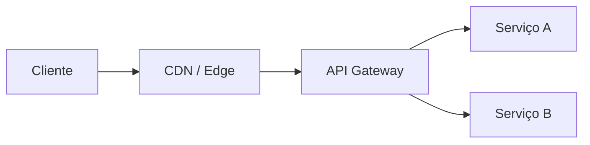

# 22 · Operação em produção

> Nível: avançado · Atualizado em 14/08/2026
> O que ninguém conta até o primeiro incidente às 3 da manhã.

---

## 22.1 · Relógio: a causa raiz mais subestimada

`exp`, `nbf` e `iat` são absolutos. Se as máquinas discordam sobre que horas são,
tokens legítimos são recusados e tokens mortos são aceitos.

**Sintoma típico:** 401 intermitente, ~0,1% das requisições, some sozinho, ninguém
reproduz. Quase sempre é uma instância com relógio à deriva.

```bash
# deriva do relógio local (Linux)
timedatectl status | grep -E 'synchronized|NTP'
# esperado: System clock synchronized: yes / NTP service: active

chronyc tracking | grep -E 'System time|Last offset'
# esperado: offset abaixo de 50 ms

# comparação com uma referência externa
curl -sI https://google.com | grep -i '^date:'
date -u
```

**Regras:**

| Regra | Valor |
|---|---|
| NTP ativo em **toda** máquina que emite ou verifica | obrigatório |
| Tolerância de relógio | **60 s** |
| Alarme de deriva | acima de 5 s |
| Em contêiner | o relógio é do **host** — corrija no host |
| Em VM | atenção à deriva após *suspend/resume* |

**A armadilha do fuso horário.** NumericDate é **sempre UTC**. Se alguém calcular
`exp` com hora local, o token nasce com 3 horas de erro (no Brasil) — expirado ao
nascer, ou válido três horas a mais. Use sempre a função de epoch da linguagem, nunca
formate e reanalise data.

---

## 22.2 · O que monitorar

| Métrica | Por que importa | Alarme |
|---|---|---|
| `jwt.verificacao.falha` por código | o sinal mais rico do sistema | ver abaixo |
| `jwt.expirado` | rotina; mede a saúde da renovação | pico repentino |
| **`jwt.assinatura_invalida`** | **quase nunca é acidente** | **qualquer volume acima da linha de base** |
| `jwt.kid_desconhecido` | rotação falhando, ou sondagem | > 0 fora de janela de rotação |
| `jwt.aud_invalida` | serviço mandando token para o lugar errado | > 0 |
| `refresh.reuso_detectado` | roubo de token, ou bug de concorrência no cliente | mudança de patamar |
| `jwks.busca.falha` | o emissor está inacessível | > 0 |
| `jwks.busca.taxa` | cache não está funcionando | acima de 1/min por instância |
| `token.tamanho.p99` | caminho para o limite do nginx | > 4 KB |
| `auth.renovacoes/min` | carga no serviço de autenticação | capacidade |
| `denylist.tamanho` | crescimento anômalo = faxina quebrada | crescimento monotônico |

**A distinção que dá o maior retorno:** separe `expirado` de `assinatura_invalida`.
O primeiro acontece milhares de vezes por dia e é normal. O segundo quase nunca
acontece por acidente — é alguém forjando. Se os dois viram a mesma linha de log,
você perdeu o único sinal de ataque que tinha.

```js
catch (e) {
  metricas.incrementar('jwt.verificacao.falha', { codigo: e.codigo });
  if (e.codigo === 'assinatura_invalida' || e.codigo === 'alg_nao_permitido') {
    log.warn({ evento: 'jwt_suspeito', codigo: e.codigo, ip: req.ip, jti: null });
  }
}
```

---

## 22.3 · O que registrar em log — e o que nunca

| Registre | Nunca registre |
|---|---|
| `jti` | o token inteiro |
| `sub` | o cabeçalho `Authorization` |
| `kid` | qualquer segmento do token |
| `iss`, `aud` | o refresh token |
| código do erro | a chave privada, obviamente |
| IP e user-agent | nome, e-mail, se puder evitar |

O `jti` é o herói silencioso: permite ligar uma requisição a uma sessão, e uma sessão
a um incidente, sem que o log vire um repositório de credenciais vivas. Logs são
copiados para ferramentas de terceiros, compartilhados em tíquetes e guardados por
anos — um token ali é uma credencial ativa em um lugar onde ninguém a procura.

```js
// filtro que deve existir no seu logger, não como boa intenção
const SENSIVEIS = /authorization|cookie|token|secret|senha|password/i;
```

---

## 22.4 · Onde verificar: borda, gateway ou serviço



| Lugar | Vantagem | Risco |
|---|---|---|
| **Borda (CDN/Worker)** | rejeita lixo antes de gastar recurso | a origem precisa estar isolada |
| **Gateway** | um lugar só; política uniforme | ponto único de falha e de erro de configuração |
| **Cada serviço** | defesa em profundidade | política duplicada; divergência com o tempo |

**Recomendação:** verifique na borda **e** no serviço. A borda descarta o volume; o
serviço não confia em ninguém. Custa ~0,1 ms de ECDSA por requisição — barato demais
para abrir mão da defesa em profundidade.

**O erro que transforma isso em desastre:** a borda verifica, remove o
`Authorization` e injeta `x-usuario-id`. O serviço confia nesse cabeçalho. Se alguém
alcançar o serviço sem passar pela borda — uma migração de rede, um *port-forward*
de depuração esquecido, um serviço exposto por engano —, a autenticação inteira vira
"escreva seu ID num cabeçalho".

**Se você usar esse padrão:**

1. a origem precisa ser inalcançável de fora (rede privada, mTLS, ou segredo
   compartilhado com a borda);
2. a borda precisa **remover** os cabeçalhos de identidade vindos do cliente antes de
   injetar os seus;
3. o serviço deve, ao menos, verificar um segredo que só a borda conhece.

---

## 22.5 · Desempenho

Números de ordem de grandeza, em hardware de servidor comum:

| Operação | Custo |
|---|---|
| Verificar HS256 | ~0,01 ms |
| Verificar ES256 | ~0,1 ms |
| Verificar RS256 (2048) | ~0,05 ms (verificar RSA é **rápido**) |
| **Assinar** RS256 (2048) | ~1,5 ms (assinar RSA é **lento**) |
| Assinar ES256 | ~0,1 ms |
| Consulta a Redis (mesma rede) | 0,2–1 ms |
| Consulta a Postgres | 1–5 ms |

**A assimetria do RSA importa na arquitetura:** verificar é ~30× mais barato que
assinar. Como você verifica milhares de vezes e assina poucas, RS256 é menos ruim em
desempenho do que parece. O problema do RSA em JWT é **tamanho**, não velocidade.

**Onde o custo realmente está:** não é a criptografia. É a busca do JWKS (rede), a
consulta à lista de negação (rede) e o tamanho do token (banda). Otimize esses três
antes de trocar de algoritmo.

**Cache de verificação** — útil em rota de altíssimo volume, com cuidado:

```js
// cacheia o resultado da verificação por poucos segundos
// SEMPRE reconferindo exp: sem isso, você estende a vida do token
const cache = new Map();
function verificarComCache(token, agora) {
  const guardado = cache.get(token);
  if (guardado && guardado.exp > agora && guardado.cacheadoEm > agora - 5) return guardado.payload;
  const payload = verificar(token);
  cache.set(token, { payload, exp: payload.exp, cacheadoEm: agora });
  return payload;
}
```

Use a hash do token como chave, não o token — senão o cache vira um repositório de
credenciais em memória, visível em qualquer *heap dump*.

---

## 22.6 · Onde a chave privada mora, em produção

Resumo da [seção 16.4](16-chaves-jwk-jwks.md#164--onde-a-chave-privada-mora), em
ordem de preferência:

1. **KMS/HSM** — a chave nunca sai; você envia o dado e recebe a assinatura. Todo uso
   fica auditado. Custo: uma chamada de rede por assinatura (aceitável, porque você
   assina raramente).
2. **Cofre** (Vault, Secrets Manager) — a chave é carregada na inicialização e fica em
   memória.
3. **Secret do orquestrador** — comum, razoável.
4. **Arquivo 600 fora do repositório** — aceitável em servidor único.
5. **Variável de ambiente** — vaza em `docker inspect`, `/proc/<pid>/environ`, crash
   dump e log de deploy. Aceitável, não seguro.
6. **No código** — nunca.

---

## 22.7 · Multi-ambiente

**Regra inegociável:** chaves e emissores diferentes por ambiente.

```
produção:    iss = https://auth.exemplo.com          kid = <chave de produção>
homologação: iss = https://auth.hml.exemplo.com      kid = <chave de homologação>
local:       iss = http://localhost:3000             kid = <chave efêmera>
```

Se produção e homologação compartilham a chave, um token de homologação — emitido por
qualquer pessoa com acesso ao ambiente de teste — vale em produção. Já vi acontecer;
o incidente é constrangedor e caro.

O `iss` diferente é a segunda barreira: mesmo que a chave vazasse entre ambientes, a
validação de `iss` recusa.

**Corolário:** nunca copie o dump de configuração de produção para a máquina de
desenvolvimento.

---

## 22.8 · Resposta a incidente

### A chave privada vazou

```
1. ROTACIONE agora: gere a chave nova e publique o JWKS com as duas
2. APOSENTE a comprometida IMEDIATAMENTE — não espere os tokens expirarem
   (o custo de deslogar todo mundo é menor que o de aceitar tokens forjados)
3. INVALIDE todos os refresh tokens (limpe a tabela)
4. FORCE novo login para todo mundo
5. AUDITE: procure `jti` desconhecidos, `iat` fora do padrão, acessos anômalos
6. INVESTIGUE como vazou — o vazamento raramente é um evento isolado
```

### Um token específico foi roubado

```
1. `jti` na lista de negação
2. queime a família do refresh correspondente
3. `tokensValidosDesde` do usuário = agora (derruba tudo daquela pessoa)
4. verifique se outras contas foram afetadas pelo mesmo vetor
```

### `assinatura_invalida` subiu de patamar

```
1. NÃO é rotina. Trate como incidente até prova em contrário
2. agrupe por IP, user-agent e rota
3. se for concentrado: bloqueio e limite de taxa
4. se for distribuído: verifique se sua chave pública mudou sem aviso
   (rotação não anunciada de um provedor externo produz o mesmo sintoma)
```

---

## 22.9 · Migrações sem downtime

### Trocar de algoritmo (RS256 → ES256)

```
1. gere a chave EC e acrescente-a ao JWKS (as duas chaves convivem)
2. faça TODOS os verificadores aceitarem ['RS256','ES256']
3. espere o deploy chegar a todos — confirme por métrica, não por suposição
4. troque o emissor para assinar com ES256
5. espere a vida do token mais longo
6. remova RS256 da lista aceita e a chave RSA do JWKS
```

O passo 3 é o que quebra: se um serviço ficou para trás, ele recusa todos os tokens
novos. Confirme com uma métrica por versão antes de avançar.

### Trocar de emissor

Aceite os dois `iss` durante a transição, cada um com seu próprio conjunto de chaves
(ver [16.6](16-chaves-jwk-jwks.md#166--múltiplos-emissores)). Nunca junte as chaves
num pote comum.

### Mudar o formato das claims

Emita **as duas** formas durante a transição; os verificadores leem a nova e caem
para a antiga; depois de um ciclo completo de expiração, remova a antiga.

---

## 22.10 · Testes que valem a pena no CI

```js
// 1. o token não pode crescer sem alguém perceber
test('token cabe no limite do gateway', async () => {
  const token = await emitirTokenTipico();
  assert.ok(token.length < 1500, `token com ${token.length} bytes — perto do limite`);
});

// 2. o JWKS não pode vazar componente privado
test('JWKS não contém chave privada', async () => {
  const jwks = await buscarJwks();
  for (const k of jwks.keys) {
    for (const proibido of ['d', 'p', 'q', 'dp', 'dq', 'qi', 'k']) {
      assert.equal(k[proibido], undefined, `JWKS expõe ${proibido}`);
    }
  }
});

// 3. os ataques clássicos continuam sendo recusados
test('alg: none é recusado', /* ... */);
test('confusão de algoritmo é recusada', /* ... */);
test('kid com travessia de caminho não resolve chave', /* ... */);

// 4. a configuração de produção é sã
test('vida do access token está dentro do limite', () => {
  assert.ok(config.vidaAccessSegundos <= 900);
});
```

Os quatro estão implementados no
[projeto-modelo](07-projeto-modelo/test/) e rodam com `node --test`.

---

## 22.11 · Runbook de plantão

Cole na wiki do time.

| Sintoma | Primeira verificação | Causa provável |
|---|---|---|
| 401 em massa, súbito | o JWKS está acessível? | rotação de chave sem publicar antes |
| 401 intermitente ~0,1% | deriva de relógio (`chronyc tracking`) | NTP parado numa instância |
| 401 só para alguns usuários | tamanho do token deles | muitos grupos/permissões |
| 401 após deploy | lista de `algorithms` mudou? | configuração divergente entre serviços |
| Laço de renovação no cliente | a API devolve 401 onde deveria 403? | código de status errado |
| `reuso_detectado` em alta | mudou algo no cliente? | falta de deduplicação de renovação |
| Latência subiu no gateway | taxa de busca do JWKS | cache do JWKS quebrado |
| `assinatura_invalida` em alta | concentrado num IP? | ataque, ou rotação externa não anunciada |
| Serviço de auth sobrecarregado | renovações/min | vida do access token curta demais |

---

## 22.12 · Checklist de produção

```
RELÓGIO
[ ] NTP ativo e monitorado em toda máquina
[ ] Tolerância de 60 s configurada
[ ] Alarme de deriva > 5 s

CHAVES
[ ] Privada em cofre ou KMS
[ ] Chaves e `iss` DIFERENTES por ambiente
[ ] Rotação testada em homologação
[ ] JWKS servido por HTTPS, com cache
[ ] Teste automatizado: JWKS sem componente privado

OBSERVABILIDADE
[ ] Falhas separadas por código
[ ] Alarme em `assinatura_invalida`
[ ] Alarme em `kid_desconhecido`
[ ] Alarme em `reuso_detectado`
[ ] `jti` no log; token NUNCA no log
[ ] Redação de `Authorization` no APM

RESILIÊNCIA
[ ] Cliente JWKS com cache, cooldown e timeout
[ ] Emissor fora do ar não derruba a verificação (cache serve)
[ ] Limite de tamanho de token antes da análise
[ ] Faxina periódica da lista de negação

PROCESSO
[ ] Runbook de plantão escrito
[ ] Procedimento de resposta a vazamento de chave, escrito
[ ] Testes de ataque no CI
[ ] Teste de tamanho de token no CI
```

---

## Autoteste

1. Qual o sintoma típico de deriva de relógio, e por que ele é difícil de
   diagnosticar?
2. Por que separar `expirado` de `assinatura_invalida` nas métricas é o que dá maior
   retorno?
3. O que registrar em log em vez do token, e por quê?
4. Qual é o risco do padrão "borda verifica e injeta `x-usuario-id`", e as três
   defesas?
5. Verificar RS256 é rápido ou lento? E assinar? O que isso muda na arquitetura?
6. Onde está o custo real de verificação em produção — a criptografia?
7. Por que produção e homologação nunca podem compartilhar a chave? E qual é a
   segunda barreira?
8. A chave privada vazou. Liste os seis passos, na ordem.
9. Descreva a migração RS256 → ES256 sem downtime. Qual passo costuma quebrar?
10. Cite quatro testes de JWT que valem a pena no CI.
