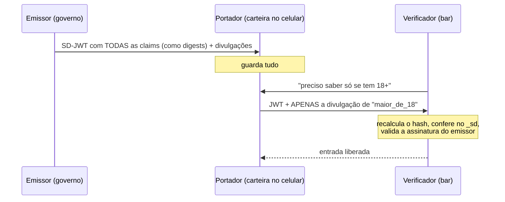

# 65 · Estado da arte — agosto de 2026

> Nível: pesquisa · **Pesquisado na web em 14/08/2026**
> Conteúdo que envelhece rápido. Reavalie a cada seis meses.

---

## 65.1 · Panorama em uma página

| Tema | Situação em ago/2026 |
|---|---|
| JWT/JWS/JWE (RFC 7515–7519) | estáveis desde 2015; sem revisão prevista |
| Boas práticas (RFC 8725) | estável; **é o documento que você deve seguir** |
| Access token JWT (RFC 9068) | estável; adoção crescente de `typ: at+jwt` |
| OAuth Security BCP (RFC 9700) | **RFC desde jan/2025**; *implicit* e *password grant* proibidos |
| **OAuth 2.1** | **ainda Internet-Draft** (`draft-ietf-oauth-v2-1-15`, mar/2026) |
| DPoP (RFC 9449) | estável; adoção acelerando |
| mTLS (RFC 8705) | estável; nicho corporativo/financeiro |
| **SD-JWT (RFC 9901)** | **RFC desde 19/11/2025** — a novidade mais relevante |
| SD-JWT VC | ainda Internet-Draft |
| **ML-DSA para JOSE (RFC 9964)** | **RFC desde mai/2026** |
| Transaction Tokens | Internet-Draft ativo |
| Identity Chaining | Internet-Draft ativo |
| PASETO | estável, nicho, fora do IETF |

---

## 65.2 · SD-JWT — divulgação seletiva (RFC 9901)

**A mudança conceitual mais interessante em dez anos.** Publicada como RFC em
19 de novembro de 2025.

### O problema que resolve

Num JWT comum, apresentar o token revela **todas** as claims. Se sua carteira digital
tem um documento com nome, endereço, CPF e data de nascimento, e o bar da esquina só
precisa saber se você tem mais de 18 anos, você entrega tudo.

### Como funciona

O emissor substitui cada claim divulgável por um **hash salgado**:

```
1. Para a claim ("data_nascimento", "1990-05-12"):
     sal = aleatório
     divulgação = base64url(JSON([sal, "data_nascimento", "1990-05-12"]))
     digest = SHA-256(divulgação)

2. O JWT assinado contém apenas:
     { "_sd": [ "<digest1>", "<digest2>", ... ], "_sd_alg": "sha-256" }

3. O portador guarda todas as divulgações.
```

Ao apresentar, o portador envia o JWT **mais apenas as divulgações que quer revelar**:

```
<JWT>~<divulgação1>~<divulgação3>~
```

O verificador recalcula o hash de cada divulgação recebida, confirma que está no
`_sd`, e conclui: aquela claim foi mesmo emitida pelo emissor — sem que as outras
tenham sido reveladas.

**A elegância:** o sal impede adivinhar valores. Sem ele, um digest de `"maior18":
true` seria trivialmente reversível — só há dois valores possíveis.

### Três papéis, não dois



Repare: o verificador **nunca fala com o emissor**. É o mesmo benefício do JWT comum,
agora com privacidade.

### Onde está sendo usado

- **Carteira de identidade digital europeia (EUDI Wallet)** — o principal motor da
  padronização;
- credenciais verificáveis em geral (SD-JWT VC, ainda em rascunho);
- casos de KYC em que revelar menos é exigência regulatória.

### A limitação honesta

**Correlação.** A assinatura do emissor é a **mesma** em todas as apresentações. Dois
verificadores que comparem notas identificam que atenderam à mesma pessoa, mesmo sem
ver claim nenhuma em comum. Resolver isso exige provas de conhecimento zero (BBS+ e
sucessores), com custo computacional ainda alto para celular. É problema em aberto —
ver [60.10](60-teoria-avancada.md#6010--problemas-em-aberto).

---

## 65.3 · DPoP — matando o *bearer token* (RFC 9449)

O maior defeito estrutural do JWT: quem tem o token, é. Como uma nota de R$ 50.

**DPoP** (*Demonstrating Proof-of-Possession*) amarra o token a uma chave que o
cliente possui:

```
1. O cliente gera um par de chaves, local, e o mantém.
2. Ao pedir o token, envia a chave pública no cabeçalho DPoP.
3. O emissor põe o thumbprint dela na claim `cnf` do access token:
      "cnf": { "jkt": "<thumbprint da chave do cliente>" }
4. Em CADA requisição, o cliente envia uma prova DPoP assinada, contendo
   o método HTTP, a URL, um timestamp e um valor único.
5. O recurso confere: a prova é válida, a chave bate com o `cnf`,
   e a prova não foi repetida.
```

```http
GET /pedidos HTTP/1.1
Authorization: DPoP eyJhbGciOiJFUzI1NiIsInR5cCI6ImF0K2p3dCJ9...
DPoP: eyJhbGciOiJFUzI1NiIsInR5cCI6ImRwb3Arand0IiwiandrIjp7Li4ufX0...
```

**Um token DPoP roubado é inútil** sem a chave privada, que nunca sai do cliente.

**Custo:**

| Aspecto | Impacto |
|---|---|
| Uma assinatura extra por requisição, no cliente | ~1 ms |
| Uma verificação extra no servidor | ~0,1 ms |
| Estado no servidor para detectar repetição (`jti` da prova) | pequeno, TTL curto |
| Complexidade do cliente | **alta** — gerar, guardar e usar uma chave |
| Suporte nas bibliotecas | irregular fora do ecossistema JavaScript e Java |

**Onde compensa hoje:** APIs de alto valor (financeiro, saúde), aplicativos móveis
(onde guardar a chave no Keychain/Keystore é natural), e sistemas sob regulação que
exigem prova de posse.

**Alternativa:** **mTLS** (RFC 8705) faz o mesmo com certificado de cliente. É mais
maduro e mais pesado de operar — emissão, distribuição e renovação de certificados.
Padrão em *open banking* e no setor financeiro.

**Previsão, declarada como previsão:** DPoP se tornará o padrão para aplicativos
móveis e APIs sensíveis até 2028, e continuará ausente na maioria das aplicações web
comuns, onde o custo de complexidade não se paga.

---

## 65.4 · Pós-quântico: ML-DSA chega ao JOSE (RFC 9964)

**Publicada em maio de 2026.** Define os identificadores JOSE e COSE para o ML-DSA
(FIPS 204, derivado do CRYSTALS-Dilithium). Os identificadores de algoritmo foram
registrados na IANA em julho de 2025.

Rascunhos irmãos, ainda em andamento:

- **SLH-DSA** (FIPS 205, ex-SPHINCS+) para JOSE/COSE — baseado só em hash, portanto
  com hipótese mais conservadora, ao custo de assinaturas enormes;
- **FN-DSA** (FIPS 206, ex-Falcon) — assinaturas menores, implementação delicada
  (aritmética de ponto flutuante);
- **`draft-ietf-jose-pq-composite-sigs`** — assinaturas **híbridas**: clássica **e**
  pós-quântica juntas, válidas só se as duas verificarem.

### Por que híbrido importa

Os esquemas pós-quânticos são novos. Ninguém quer descobrir em 2030 que ML-DSA tem
uma falha estrutural e que todos os sistemas migraram só para ele. A assinatura
composta exige que **ambas** verifiquem: você só perde se as duas caírem.

O custo é somar os tamanhos — e eles já são o obstáculo:

| Esquema | Assinatura | Token JWT resultante |
|---|---|---|
| ES256 | 64 B | ~300 B |
| ML-DSA-44 | ~2.420 B | **~3,5 KB** |
| Híbrido ES256+ML-DSA-44 | ~2.484 B | ~3,6 KB |

Um token de 3,5 KB em `Authorization` está perto do limite de cookie (~4 KB) e a
caminho do limite de cabeçalho do nginx (8 KB no total).

**Adoção prática em 2026:** experimental. Há protótipos de YubiKey com ML-DSA. Nenhum
provedor de identidade grande emite JWT pós-quântico em produção.

**O que fazer hoje**, na minha recomendação:

1. **Não migre ainda.** O risco real para tokens de 15 minutos é próximo de zero.
2. **Torne o algoritmo configurável.** A lista de algoritmos aceitos deve ser
   configuração, não constante espalhada pelo código.
3. **Exercite a rotação.** O dia da migração PQ vai exigir exatamente o procedimento
   de rotação que você deveria ter testado.
4. **Meça o tamanho dos seus tokens.** Saber a folga que você tem hoje é o que dirá,
   quando chegar a hora, se a migração cabe.

---

## 65.5 · Transaction Tokens e Identity Chaining

Dois rascunhos ativos do grupo OAuth do IETF que atacam um problema real de
arquitetura de microsserviços.

### Transaction Tokens (`draft-ietf-oauth-transaction-tokens`)

**O problema:** a requisição externa entra no serviço A, que chama B, que chama C. Se
A repassar o token do usuário adiante, C não sabe se a chamada é legítima ou se B foi
comprometido. Se A não repassar, C perde a identidade do usuário.

**A proposta:** na borda, o access token externo é trocado por um **transaction
token** — um JWT de vida muito curta, assinado internamente, que carrega a identidade
do usuário, a identidade do *workload* e o contexto de autorização daquela
transação específica. Ele se propaga pela cadeia inteira.

Cada serviço verifica de forma independente quem iniciou a chamada externa, e o token
é amarrado a uma transação — o que limita repetição.

Há uma extensão em rascunho, **Transaction Tokens for Agents**, com dois campos novos:
`actor` (o agente que executa) e `principal` (o humano ou sistema que originou a ação).
É o padrão se movendo para acomodar agentes de IA na cadeia de chamadas.

### Identity Chaining (`draft-ietf-oauth-identity-chaining`)

Preserva identidade e autorização **entre domínios de confiança**: uma concessão JWT
obtida por troca de token intradomínio (RFC 8693) é usada para obter um access token
no domínio seguinte.

**Ambos ainda são rascunhos.** Não implemente em produção contando com estabilidade —
mas o problema que eles atacam é real, e é a direção em que a arquitetura está indo.

---

## 65.6 · OAuth 2.1: ainda a caminho

Em agosto de 2026, o `draft-ietf-oauth-v2-1-15` (março de 2026) segue como
Internet-Draft. A intenção é substituir e tornar obsoletas a RFC 6749 e a RFC 6750,
consolidando o que já é boa prática.

O que ele consolida:

- PKCE **obrigatório** para todos os clientes;
- fluxo *implicit* **removido**;
- *password grant* **removido**;
- `redirect_uri` com comparação exata de string;
- refresh token para cliente público exige rotação ou prova de posse.

**A leitura prática:** o conteúdo do OAuth 2.1 já é obrigatório desde a RFC 9700
(jan/2025). Se você segue a BCP, já está em conformidade com o OAuth 2.1 antes de ele
ser publicado. Não espere a RFC para adotar.

---

## 65.7 · Segurança de bibliotecas: o padrão que se repete

2026 foi mais um ano de CVEs de *bypass* de autenticação em bibliotecas JWT:

| CVE | Alvo | Natureza |
|---|---|---|
| **CVE-2026-34950** | `fast-jwt` (CVSS 9,1, 06/04/2026) | confusão de algoritmo reaberta: espaço em branco derrota a regex de detecção de chave pública |
| **CVE-2026-48526** | PyJWT < 2.13.0 | confusão de algoritmo com JWK cru e famílias mistas |
| **CVE-2026-29000** | `pac4j-jwt` (CVSS 10,0) | falha crítica em biblioteca Java de autenticação |

Também foram documentadas falhas em middlewares que derivam o algoritmo de
verificação do `alg` do token sem fixá-lo (o caso do Hono foi citado publicamente).

**A leitura:** onze anos depois de 2015, a mesma classe de falha continua produzindo
CVEs críticas. Isso não é incompetência dos mantenedores — é o custo permanente de um
formato que deixa o remetente declarar como será verificado.

**Ação concreta:** `npm audit` / `pip-audit` no CI, com política de correção rápida
para biblioteca de autenticação. As três CVEs acima são de **bypass de autenticação**:
quem não atualizou ficou com a porta aberta.

---

## 65.8 · O que observar nos próximos anos

**Alta confiança:**

1. **SD-JWT vira infraestrutura de identidade digital.** A carteira europeia é um
   mandato regulatório com prazo; a tecnologia vai junto.
2. **DPoP se espalha em móvel e em API de alto valor**, e não em web comum.
3. **CVEs de confusão de algoritmo continuam saindo.** Aposte nisso.

**Confiança média:**

4. **OAuth 2.1 vira RFC**, sem mudar nada de prático para quem segue a RFC 9700.
5. **Transaction Tokens ganham tração** em arquiteturas grandes.
6. **Contexto de agente de IA entra nos tokens** — o rascunho de Transaction Tokens
   for Agents é o primeiro sinal, e é uma resposta a um problema real: quando um
   agente age em nome de alguém, quem é responsável?

**Especulação, declarada como especulação:**

7. **O tamanho da assinatura pós-quântica força uma reavaliação do JWT em cabeçalho
   HTTP.** As saídas possíveis: limites maiores, volta ao token por referência na
   fronteira, ou um esquema PQ compacto. Considero a segunda a mais provável, e ela
   seria uma ironia elegante — a indústria voltaria ao token opaco por uma razão
   puramente física.

---

## 65.9 · Fontes consultadas

Pesquisado na web em **14/08/2026**:

- [RFC 9901 — Selective Disclosure for JWTs](https://www.rfc-editor.org/info/rfc9901/) · publicada em 19/11/2025
- [Análise da RFC 9901, por Nat Sakimura](https://www.sakimura.org/en/2025/11/7764/)
- [draft-ietf-oauth-sd-jwt-vc](https://datatracker.ietf.org/doc/draft-ietf-oauth-sd-jwt-vc/)
- [RFC 9964 — ML-DSA para JOSE e COSE](https://datatracker.ietf.org/doc/rfc9964/) · mai/2026
- [draft-ietf-cose-dilithium-11](https://www.ietf.org/archive/id/draft-ietf-cose-dilithium-11.html)
- [draft-ietf-jose-pq-composite-sigs](https://datatracker.ietf.org/doc/draft-ietf-jose-pq-composite-sigs/)
- [draft-ietf-cose-falcon](https://datatracker.ietf.org/doc/draft-ietf-cose-falcon/)
- [draft-ietf-oauth-v2-1-15](https://datatracker.ietf.org/doc/html/draft-ietf-oauth-v2-1-15) · mar/2026
- [draft-ietf-oauth-transaction-tokens](https://drafts.oauth.net/oauth-transaction-tokens/draft-ietf-oauth-transaction-tokens.html)
- [draft-oauth-transaction-tokens-for-agents](https://www.ietf.org/archive/id/draft-oauth-transaction-tokens-for-agents-04.html)
- [draft-ietf-oauth-identity-chaining](https://datatracker.ietf.org/doc/draft-ietf-oauth-identity-chaining/)
- [CVE-2026-34950 (fast-jwt)](https://securityonline.info/fast-jwt-authentication-bypass-cve-2026-34950-whitespace/)
- [CVE-2026-48526 (PyJWT)](https://cvereports.com/reports/CVE-2026-48526)
- [Panorama de vulnerabilidades JWT em 2026](https://redsentry.com/resources/blog/jwt-vulnerabilities-list-2026-security-risks-mitigation-guide)

---

## Autoteste

1. O que o SD-JWT permite que nenhuma versão anterior permitia? Explique o mecanismo
   do hash salgado.
2. Por que o sal é indispensável no SD-JWT? O que aconteceria sem ele numa claim
   booleana?
3. Qual limitação de privacidade o SD-JWT **não** resolve, e o que seria preciso para
   resolvê-la?
4. Como o DPoP transforma um *bearer token* em *proof-of-possession*? Quais são os
   quatro custos?
5. Por que assinaturas híbridas (clássica + pós-quântica) são preferidas hoje?
6. Por que o tamanho do ML-DSA é um problema estrutural para JWT, e não apenas um
   inconveniente?
7. Qual é a situação do OAuth 2.1 em agosto de 2026, e por que isso não deveria mudar
   o que você faz hoje?
8. O que os Transaction Tokens resolvem que o repasse do token do usuário não
   resolve?
9. Por que CVEs de confusão de algoritmo continuam saindo onze anos depois?
10. Qual é a previsão especulativa deste arquivo sobre o futuro do JWT em cabeçalho
    HTTP?
