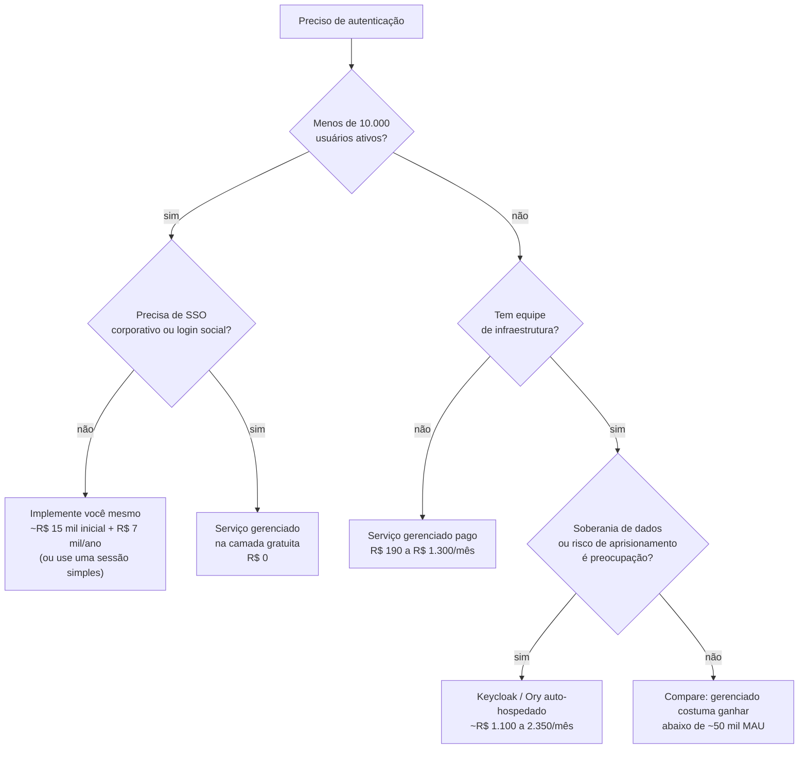

# 80 · Custos e licenças

> Nível: todos · **Preços pesquisados na web em 14/08/2026**
> Câmbio de referência: **US$ 1,00 ≈ R$ 5,40** (aproximado; use a cotação do dia para
> qualquer decisão real).
> Preço sem data é desinformação — por isso a data está no topo e ao lado de cada
> valor.

---

## 80.1 · O JWT em si é gratuito

**Na primeira linha, para não haver dúvida:** o JWT é um **padrão aberto** do IETF.
Não há licença, não há royalty, não há taxa. As RFCs 7515–7519 são de leitura livre e
implementação livre por qualquer pessoa.

**Quem paga a conta?** O IETF é mantido pela Internet Society e por contribuições de
empresas. O trabalho de padronização foi feito por pessoas empregadas por Microsoft,
Ping Identity, NRI e outras — que tinham interesse comercial direto em um padrão de
identidade interoperável. O padrão é gratuito porque a interoperabilidade valia mais,
para elas, do que a cobrança pelo formato.

O custo do JWT, portanto, **não é de licença**. É de:

1. **tempo de engenharia** para implementar e operar;
2. **serviço de identidade**, se você não quiser implementar;
3. **infraestrutura** para o que a implementação exige.

---

## 80.2 · Licenças das bibliotecas

Todas permissivas. Uso comercial livre, sem *copyleft*.

| Biblioteca | Linguagem | Licença | Permite uso comercial fechado? |
|---|---|---|---|
| `jose` | JS/TS | MIT | ✅ |
| `jsonwebtoken` | JS | MIT | ✅ |
| `fast-jwt` | JS | MIT | ✅ |
| PyJWT | Python | MIT | ✅ |
| `python-jose` | Python | MIT | ✅ |
| JJWT | Java | Apache 2.0 | ✅ |
| Nimbus JOSE+JWT | Java | Apache 2.0 | ✅ |
| `golang-jwt/jwt` | Go | MIT | ✅ |
| `jose-jwt` | .NET | MIT | ✅ |
| `firebase/php-jwt` | PHP | BSD-3 | ✅ |
| `ruby-jwt` | Ruby | MIT | ✅ |

**MIT e Apache 2.0, em uma linha cada:**

- **MIT** — faça o que quiser; mantenha o aviso de copyright; sem garantia.
- **Apache 2.0** — igual, mais uma **concessão explícita de patente** e a exigência de
  documentar modificações.

**A diferença que importa numa avaliação jurídica corporativa:** a Apache 2.0 protege
você contra alguém que contribuiu com o projeto e depois processa por patente. A MIT
é silenciosa sobre patentes. Para JWT, o risco é teórico — o padrão é aberto e antigo
—, mas em auditoria de conformidade a Apache 2.0 costuma passar mais fácil.

**Nenhuma delas é GPL ou AGPL.** Você pode usar em software proprietário fechado sem
obrigação de abrir código.

---

## 80.3 · Custo real de implementar você mesmo

O que ninguém orça. Estimativas para uma pessoa desenvolvedora sênior, com base em
projetos que acompanhei — é estimativa, não medição.

| Item | Esforço inicial | Manutenção anual |
|---|---|---|
| Emitir e verificar JWT | 1–2 dias | — |
| Refresh com rotação e detecção de reuso | 2–3 dias | — |
| Lista de negação e logout completo | 1–2 dias | — |
| Gestão de chaves, JWKS, rotação | 2–3 dias | 1 dia |
| Testes, incluindo os de ataque | 2–3 dias | 1 dia |
| Observabilidade e alarmes | 1–2 dias | 1 dia |
| Acompanhar CVEs e atualizar | — | **2–4 dias** |
| Documentação e runbook | 1 dia | 0,5 dia |
| **Total** | **~2 a 3 semanas** | **~5 a 7 dias/ano** |

A um custo de R$ 25.000/mês (custo total de uma pessoa sênior no Brasil em 2026,
incluindo encargos — estimativa), isso dá aproximadamente:

- **implantação: R$ 12.000 a R$ 19.000**
- **manutenção: R$ 6.000 a R$ 9.000 por ano**

**A conta que muda a decisão:** se um serviço gerenciado custa R$ 500/mês
(R$ 6.000/ano) e cobre o que você precisa, ele **empata com a manutenção** e você
economiza a implantação inteira.

**A ressalva honesta:** essa conta favorece o serviço gerenciado no papel e ignora
dois custos reais dele — aprisionamento de fornecedor e a complexidade de integrar um
sistema externo. Ver 80.7.

---

## 80.4 · Serviços gerenciados de identidade

Preços consultados na web em **14/08/2026**. Confira antes de decidir: estes valores
mudam com frequência e há divergência entre fontes.

| Serviço | Camada gratuita | Primeiro plano pago | Observação |
|---|---|---|---|
| **Auth0** (Okta) | até **25.000 MAU** | Essentials a partir de **US$ 35/mês** (~R$ 190) | Professional a partir de US$ 240/mês (~R$ 1.300); B2B a partir de US$ 800/mês |
| **Clerk** | até **50.000 MRU** (ampliada em 05/02/2026) | Pro a partir de **US$ 25/mês** (~R$ 135) | Business a US$ 300/mês. Cobra **MRU**, unidade mais estreita que MAU |
| **AWS Cognito** | **10.000 MAU** (Lite/Essentials) | Essentials a **US$ 0,015/MAU** acima da franquia | federação SAML/OIDC tem franquia de **apenas 50 MAU** — atenção |
| **Firebase Auth** | generosa para login simples | por MAU acima da franquia | integra bem com o ecossistema Google |
| **Okta Customer Identity** | avaliação | sob consulta | foco corporativo |
| **Microsoft Entra External ID** | franquia por MAU | por MAU | natural se você já é Microsoft |
| **Ory Network** | limitada | **US$ 29/mês** por 1.000 DAU | depois US$ 30 por 1.000 DAU; Scale a US$ 690/mês por 20.000 DAU |

**A armadilha da unidade de cobrança.** MAU, MRU e DAU **não são comparáveis**:

- **MAU** (*monthly active user*) — quem se autenticou no mês;
- **MRU** (*monthly retained user*) — definição mais estreita, do Clerk;
- **DAU** (*daily active user*) — usado pela Ory.

Comparar "50.000 MRU grátis" com "25.000 MAU grátis" sem ler as definições leva a
conclusão errada. **Leia a definição do fornecedor antes de comparar.**

**A armadilha do Cognito.** A franquia de 10.000 MAU é boa, mas usuários federados
via SAML ou OIDC têm franquia de **50 MAU**. Se o seu caso é SSO corporativo, você
sai da camada gratuita no primeiro dia.

---

## 80.5 · Alternativas open source auto-hospedadas

| Solução | Licença | O que é | Custo |
|---|---|---|---|
| **Keycloak** | **Apache 2.0** | servidor OIDC/SAML completo, mantido pela Red Hat | software: **R$ 0** |
| **Ory** (Hydra, Kratos, Oathkeeper, Keto) | Apache 2.0 | componentes separados, modulares | R$ 0 |
| **SuperTokens** | Apache 2.0 | foco em experiência de desenvolvimento | R$ 0 |
| **Zitadel** | ⚠️ **verifique** | multi-tenant, moderno | R$ 0 (auto-hospedado) |
| **Authentik** | verifique | IdP com boa interface | R$ 0 |
| **Casdoor** | Apache 2.0 | leve | R$ 0 |

> ⚠️ **Sobre a licença do Zitadel:** as fontes consultadas em 14/08/2026 divergem
> entre **Apache 2.0** e **AGPL-3.0**. A diferença é grande: a AGPL exige liberar o
> código-fonte de serviços em rede derivados. **Confira no repositório oficial antes
> de qualquer decisão jurídica.** Não afirmo qual é a correta.

### O custo real de auto-hospedar

Software gratuito ≠ operação gratuita.

| Item | Custo mensal estimado |
|---|---|
| VM (2 vCPU, 4 GB) × 2, para alta disponibilidade | R$ 250–500 |
| Banco gerenciado (Postgres) | R$ 150–400 |
| Balanceador e certificado | R$ 50–150 |
| Backup e retenção | R$ 30–100 |
| **Infraestrutura** | **R$ 500–1.150/mês** |
| **Tempo de operação** (0,5–1 dia/mês) | **R$ 600–1.200/mês** |
| **Total** | **~R$ 1.100 a R$ 2.350/mês** |

**A conclusão desconfortável:** para menos de ~20.000 usuários ativos, um serviço
gerenciado costuma sair **mais barato** que auto-hospedar Keycloak — porque o custo
dominante é tempo de pessoa, não licença nem servidor.

Auto-hospedar compensa quando: você já tem equipe de infraestrutura; há exigência de
soberania de dados; o volume é grande o bastante para o preço por MAU doer; ou o
aprisionamento de fornecedor é risco estratégico.

---

## 80.6 · O custo de infraestrutura do próprio JWT

Se você implementa por conta própria, o que a implementação exige:

| Item | Quando | Custo |
|---|---|---|
| Redis/Valkey para lista de negação e refresh | quase sempre | R$ 100–400/mês (gerenciado pequeno) |
| KMS para a chave de assinatura | recomendado | AWS KMS: ~US$ 1/chave/mês + US$ 0,03 por 10.000 operações |
| Banda extra do token | sempre | ver abaixo |
| Serviço de auth para renovações | sempre | proporcional ao volume |

**A conta da banda**, que quase ninguém faz:

```
token de 800 B × 200 requisições por sessão × 100.000 sessões/dia
  = 16 GB/dia = ~480 GB/mês só de cabeçalho Authorization
```

A um custo típico de egresso de US$ 0,09/GB (AWS, fora da franquia), são
**~US$ 43/mês (~R$ 230)** só para carregar tokens. Trocar RS256 por ES256 corta ~300
bytes por token e economiza cerca de **40% disso**.

Parece pouco — e é, nessa escala. Multiplique por dez e vira um item de orçamento.

---

## 80.7 · Custos ocultos

| Custo | Onde aparece | Como reduzir |
|---|---|---|
| **Aprisionamento de fornecedor** | migrar de IdP exige remigrar usuários e refazer integrações | use OIDC padrão; evite recursos proprietários; exija exportação de usuários no contrato |
| **Migração de senha** | hashes não são portáveis entre fornecedores | migração progressiva: reidratar no próximo login |
| **Suporte** | plano com SLA é caro | avalie se você precisa de SLA de verdade |
| **Treinamento** | a equipe precisa aprender o produto | some 1–2 semanas por pessoa |
| **Egresso** | dados saindo da nuvem | ver 80.6 |
| **Auditoria e conformidade** | SOC 2, ISO 27001 costumam estar em planos caros | verifique **antes** de escolher o plano |
| **Crescimento de preço** | fornecedores reprecificam | negocie teto contratual plurianual |
| **Custo de incidente** | um bypass de autenticação custa muito mais que qualquer plano | é o argumento para não implementar sozinho |

**O custo oculto mais caro é o último.** Um vazamento por falha de autenticação
custa, além do dano direto, notificação de titulares, possível sanção da LGPD (até 2%
do faturamento, limitada a R$ 50 milhões por infração) e dano reputacional. Isso
torna a comparação "R$ 500/mês de serviço × 2 semanas de implementação própria"
enganosa: as duas opções não têm o mesmo perfil de risco.

---

## 80.8 · Ferramentas de estudo — todas gratuitas

| Ferramenta | Licença | Custo |
|---|---|---|
| `jwt.io` | uso gratuito | R$ 0 |
| `jwt-cli` | MIT | R$ 0 |
| `jwt_tool` | GPL-3.0 | R$ 0 |
| `hashcat` | MIT | R$ 0 |
| OpenSSL | Apache 2.0 (desde a 3.0) | R$ 0 |
| Node.js | MIT | R$ 0 |
| Keycloak (para laboratório) | Apache 2.0 | R$ 0 |
| **O [projeto-modelo](07-projeto-modelo/) deste curso** | MIT, zero dependências | R$ 0 |
| PortSwigger Web Security Academy | gratuito | R$ 0 |
| Burp Suite Community | gratuito | R$ 0 (Professional: US$ 475/ano) |

**Para estudar JWT do zero ao avançado, o custo é R$ 0,00.** Nenhuma conta paga,
nenhum cartão de crédito. Este material inteiro foi produzido e verificado com
ferramentas gratuitas.

---

## 80.9 · Árvore de decisão de custo



---

## 80.10 · Recomendação por perfil

| Perfil | Recomendação | Custo estimado |
|---|---|---|
| Estudando | projeto-modelo + Keycloak local | **R$ 0** |
| Projeto pessoal / MVP | camada gratuita de Clerk ou Auth0 | R$ 0 |
| Startup até 10 mil usuários | camada gratuita, ou implementação própria simples | R$ 0 a R$ 200/mês |
| SaaS 10–100 mil usuários | gerenciado pago | R$ 190 a R$ 2.500/mês |
| Empresa com equipe de infra | Keycloak auto-hospedado | R$ 1.100 a R$ 2.350/mês |
| Setor regulado, soberania exigida | auto-hospedado, com auditoria | acima disso |
| Só API interna, sem terceiros | **sessão ou JWT próprio** | quase R$ 0 |

---

## Autoteste

1. Quanto custa a licença do JWT? Quem paga a conta do padrão, e por quê?
2. Qual a diferença prática entre MIT e Apache 2.0 numa avaliação corporativa?
3. Estime o custo de implementar autenticação com JWT do zero, em reais.
4. Por que MAU, MRU e DAU não são comparáveis? Cite um fornecedor de cada.
5. Qual é a armadilha da camada gratuita do AWS Cognito para SSO corporativo?
6. Por que auto-hospedar Keycloak costuma sair mais caro que um serviço gerenciado
   abaixo de 20 mil usuários?
7. Calcule a banda mensal gasta com tokens de 800 B em 100 mil sessões/dia com 200
   requisições cada.
8. Cite quatro custos ocultos e como reduzir cada um.
9. Qual é o custo oculto mais caro, e por que ele torna a comparação simples
   enganosa?
10. Quanto custa estudar este material inteiro?

---

### Fontes consultadas

Pesquisado na web em **14/08/2026**:

- [Auth0 — planos e preços](https://auth0.com/pricing) · via [Auth0 Pricing 2026](https://auth0pricing.com/) e [IDSync](https://idsync.com/guides/auth0-pricing)
- [Clerk — preços](https://clerk.com/pricing) · [ampliação da camada gratuita em 05/02/2026](https://saasprices.net/blog/clerk-free-plan-changes)
- [Amazon Cognito — preços](https://aws.amazon.com/cognito/pricing/) · [guia Frontegg](https://frontegg.com/guides/aws-cognito-pricing)
- [Keycloak — custo e licença](https://www.siriusopensource.com/en-us/blog/how-much-does-keycloak-cost) · [custos ocultos](https://www.unidy.io/blog/hidden-costs-of-keycloak)
- [Comparativo de CIAM open source, 2026](https://startwithidentity.com/articles/top-8-open-source-ciam-platforms/) · [Skycloak](https://skycloak.io/blog/open-source-authentication-comparison-2026/)
- [Ory — preços](https://skycloak.io/blog/auth0-alternatives-open-source-managed/)

Valores em reais convertidos a US$ 1,00 ≈ R$ 5,40, aproximados, para ordem de
grandeza. **Confirme preços e licenças na fonte oficial antes de decidir.**
