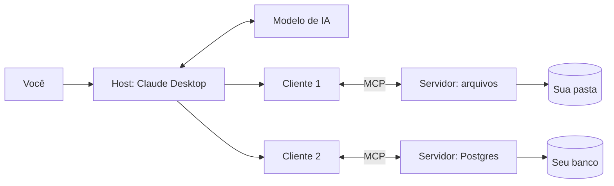

# 01 · O que é MCP, para quem nunca ouviu falar

`Nível: iniciante` · `Escrito em 01/09/2026`

---

## 1. A analogia: o estagiário trancado na sala

Imagine que você contratou um assistente extraordinário. Ele leu praticamente tudo
que já foi escrito, escreve bem, raciocina bem, programa bem. Mas ele trabalha
trancado numa sala sem janela, sem telefone, sem computador e sem chave.

Você entra na sala, fala com ele, ele responde. Ele não pode:

- abrir o arquivo do seu projeto;
- consultar o banco de dados da empresa;
- ver o ticket que o cliente abriu ontem;
- mandar um e-mail;
- olhar o extrato de vendas de hoje.

Tudo que ele sabe é o que você **carregou na cabeça dele** antes (o treinamento) e o
que você **falou agora** (a conversa). É um cérebro sem mãos e sem olhos.

Esse assistente é um **LLM** — *Large Language Model*, "modelo de linguagem de grande
porte", o tipo de sistema por trás do Claude, do ChatGPT, do Gemini. Para ele deixar
de ser inútil no seu trabalho real, alguém precisa **abrir portas** naquela sala.

**MCP é o formato padrão dessas portas.**

MCP quer dizer **Model Context Protocol** — "Protocolo de Contexto para Modelos".
É um acordo escrito, público e gratuito sobre **como um programa de IA pede coisas
para um sistema externo, e como esse sistema responde**.

---

## 2. Por que isso precisou de um padrão

Antes do MCP, cada integração era artesanal.

Você tinha 4 aplicativos de IA (Claude Desktop, um chat interno, um agente de
suporte, uma extensão de editor) e 6 sistemas para conectar (Postgres, GitHub,
Google Drive, Jira, Slack, o ERP da casa). Quantos conectores você escrevia?

**4 × 6 = 24.** E cada um do seu jeito, com o seu bug, no seu ritmo de manutenção.
Quando entrava o quinto aplicativo, entravam mais 6 conectores.

```
SEM padrão — cada par precisa do seu conector
   App A ─┬─ Postgres      App B ─┬─ Postgres
          ├─ GitHub               ├─ GitHub
          ├─ Drive                ├─ Drive
          └─ ...                  └─ ...        (M × N conectores)

COM padrão — cada lado fala o protocolo uma vez
   App A ─┐                    ┌─ Postgres
   App B ─┼──── [ MCP ] ───────┼─ GitHub
   App C ─┘                    └─ Drive         (M + N implementações)
```

O nome técnico disso é **problema M×N**: com M clientes e N serviços você tem M×N
integrações; com um protocolo no meio, você tem M+N. É exatamente o mesmo raciocínio
que levou à existência de USB, de HTTP, de SQL e de drivers de impressora.

> A analogia que o próprio projeto usa é **"USB-C para aplicações de IA"**: um
> conector só, que serve para energia, vídeo, dados e rede, em vez de um cabo
> diferente por finalidade.
>
> A analogia é boa para explicar o *encaixe*. Ela é ruim em um ponto: USB-C é um
> conector físico com garantias elétricas; MCP é um protocolo de texto sem nenhuma
> garantia sobre **o que tem do outro lado**. Um servidor MCP pode mentir para o
> modelo. Isso muda tudo em segurança, e o [arquivo 19](19-seguranca.md) trata só
> disso.

---

## 3. Os três papéis, sem jargão

MCP tem exatamente três papéis. Guarde esses três nomes, porque tudo depois se apoia
neles.

| Papel | O que é, em português claro | Exemplo real |
|---|---|---|
| **Host** (anfitrião) | O aplicativo com que **você** conversa. É ele que fala com o modelo de IA e decide o que autorizar. | Claude Desktop, Claude Code, VS Code, ChatGPT Desktop, Cursor |
| **Client** (cliente) | Um "ramal" que o host cria **para cada** servidor. Um cliente conversa com um servidor e só com ele. | invisível ao usuário; vive dentro do host |
| **Server** (servidor) | O programa que **abre uma porta** para um sistema: um banco, uma API, uma pasta de arquivos. | `postgres-mcp`, `github-mcp`, um servidor que você escreve em 20 linhas |

Repare no ponto que quase todo texto introdutório erra: **quem fala com o modelo de IA
é o host, não o servidor**. O servidor nunca vê a sua conversa. Ele recebe um pedido
("execute a ferramenta `consultar_pedido` com `id=4711`") e devolve um resultado.
Isso é uma decisão de projeto deliberada e é o que impede que um servidor bisbilhote o
que você conversou com outro.



---

## 4. As três coisas que um servidor oferece

Um servidor MCP pode oferecer três tipos de coisa. A diferença entre elas **não é
técnica, é sobre quem decide usá-las**:

| Primitiva | Quem decide usar | Analogia | Exemplo |
|---|---|---|---|
| **Tool** (ferramenta) | **o modelo** decide, o usuário aprova | um verbo, um botão que faz algo | `criar_issue`, `executar_sql`, `enviar_email` |
| **Resource** (recurso) | **a aplicação/o usuário** escolhe | um substantivo, um arquivo anexado | `file:///projeto/README.md`, `db://schema` |
| **Prompt** (roteiro) | **o usuário** escolhe explicitamente | um comando de barra, um modelo de documento | `/revisar-pr`, `/gerar-relatorio` |

Na prática, em 2026, **a esmagadora maioria dos servidores só implementa tools**.
Recursos e prompts são muito menos suportados pelos clientes. Isso é fato observável,
não opinião — e o [arquivo 15](15-primitivas-do-servidor.md) explica por que aconteceu.

---

## 5. Um exemplo do começo ao fim

Você digita no Claude Desktop:

> "Quantos pedidos entraram hoje?"

O que acontece, em ordem:

1. O **host** já perguntou antes ao servidor `vendas`: *"que ferramentas você tem?"*
   O servidor respondeu com uma lista, incluindo `contar_pedidos(data)`.
2. O host manda para o **modelo** a sua pergunta **junto com** a descrição das
   ferramentas disponíveis.
3. O modelo responde: *"quero chamar `contar_pedidos` com `data=2026-09-01`"*.
4. O host **mostra isso para você** e pede aprovação (num cliente bem feito).
5. Você aprova. O host manda ao servidor: `tools/call` com `name=contar_pedidos`.
6. O servidor executa um `SELECT COUNT(*)` no banco e devolve `{"total": 143}`.
7. O host entrega esse resultado ao modelo, que escreve: *"Entraram 143 pedidos hoje."*

O passo 4 é o coração da coisa e o que muita implementação relaxa. **Um servidor MCP
executa código de verdade no seu ambiente.** Aprovar às cegas é a mesma coisa que
executar um script que você não leu.

Na fita, esse pedido é literalmente este texto — foi capturado de um servidor real
rodando nesta máquina em 01/09/2026:

```json
{"jsonrpc":"2.0","id":3,"method":"tools/call",
 "params":{"name":"somar","arguments":{"a":2,"b":40},
 "_meta":{"io.modelcontextprotocol/protocolVersion":"2026-07-28",
          "io.modelcontextprotocol/clientCapabilities":{}}}}
```

E a resposta:

```json
{"jsonrpc":"2.0","id":3,"result":{
  "content":[{"text":"42.0","type":"text"}],
  "isError":false,"resultType":"complete",
  "structuredContent":{"result":42.0},
  "_meta":{"io.modelcontextprotocol/serverInfo":{"name":"demo","version":"1.0.0"}}}}
```

É só isso. JSON de ida, JSON de volta. Não há mágica em MCP; há um vocabulário
combinado. Toda a dificuldade real está em **projetar bem as ferramentas** e em
**não se machucar com a segurança**.

---

## 6. O que MCP **não** é

Esta seção economiza semanas de confusão.

| MCP **não** é | Por quê |
|---|---|
| **um modelo de IA** | MCP não gera texto. Ele conecta um app de IA a sistemas. |
| **uma substituição de API REST** | Servidores MCP normalmente *chamam* APIs REST por dentro. MCP é a camada de cima, desenhada para um consumidor não-determinístico (o modelo). |
| **um framework de agentes** | MCP não orquestra passos, não tem memória de tarefa, não decide nada. LangGraph, CrewAI e afins operam em outra camada — e usam MCP como fonte de ferramentas. |
| **um mecanismo de segurança** | MCP define *como* pedir autorização (OAuth), não *se* você deve confiar no servidor. A confiança é problema seu. |
| **exclusivo da Anthropic** | Desde 09/12/2025 o MCP pertence à **Agentic AI Foundation**, da Linux Foundation, cofundada por Anthropic, Block e OpenAI. |
| **RAG** | RAG busca documentos e os cola no prompt. MCP dá ao modelo a capacidade de *agir*. Um servidor MCP pode implementar RAG; são coisas diferentes. |
| **função de "function calling"** | *Function calling* é o mecanismo de um provedor de LLM para o modelo pedir uma função. MCP é o padrão de **onde essas funções vêm** e como são descobertas em tempo de execução, entre processos diferentes. |

---

## 7. Quando **não** usar MCP

Opinião profissional, declarada como opinião:

- **Se só o seu próprio aplicativo vai chamar a ferramenta**, e você controla os dois
  lados, MCP é overhead. Chame a função direto. MCP paga o seu custo quando há
  **mais de um consumidor** ou quando o consumidor é de terceiros.
- **Se a tarefa é determinística e você sabe a sequência**, escreva um script.
  Colocar um modelo no meio para decidir o que já está decidido é caro, lento e
  não-determinístico.
- **Se o dado é enorme.** Ferramentas devolvem texto que entra no contexto do modelo.
  Devolver 50 mil linhas de um `SELECT *` custa dinheiro em tokens e piora o resultado.
  Prefira devolver um resumo e um `resource_link`.
- **Se você não pode auditar o servidor.** Servidor MCP de terceiro rodando local é
  código arbitrário na sua máquina, com os seus privilégios.

---

## 8. Por que isso pegou (e tão rápido)

Cronologia curta — detalhes em [11-historia](11-historia.md):

- **25/11/2024**: Anthropic publica o MCP em código aberto. Spec `2024-11-05`.
- **Março de 2025**: OpenAI adota. Deixa de ser "coisa da Anthropic".
- **Abril de 2025**: Google DeepMind confirma suporte no Gemini.
- **09/12/2025**: Anthropic doa o MCP à **Agentic AI Foundation** (Linux Foundation),
  cofundada com Block e OpenAI, com apoio de Google, Microsoft, AWS, Cloudflare e
  Bloomberg. Mais de 10.000 servidores MCP ativos na época.
- **28/07/2026**: revisão `2026-07-28`, a maior reescrita até hoje — o protocolo
  virou **sem estado** (*stateless*). Ver [17-versionamento](17-versionamento-e-compatibilidade.md).

A adoção foi rápida por três motivos, nesta ordem de importância:

1. **O problema era real e doía.** Todo mundo estava escrevendo o mesmo conector pela
   quinta vez.
2. **A barreira de entrada é ridiculamente baixa.** Um servidor útil cabe em 20 linhas
   de Python. Compare com escrever um driver ODBC.
3. **Um concorrente adotou cedo.** Quando a OpenAI adotou, MCP deixou de ser uma aposta
   e virou o caminho seguro. Padrões vencem por rede, não por mérito técnico.

---

## 9. Autoteste

1. Em uma frase, que problema o MCP resolve? Quantas integrações você escreve com e sem ele, para 4 apps e 6 sistemas?
2. Quais são os três papéis do MCP e qual deles conversa com o modelo de IA?
3. Um servidor MCP consegue ler a sua conversa com o modelo? Por que sim ou por que não?
4. Qual a diferença de **quem decide** entre uma *tool*, um *resource* e um *prompt*?
5. Cite dois casos em que usar MCP é a escolha errada.
6. Por que a analogia do "USB-C" é boa para o encaixe e ruim para a segurança?
7. Quem é o dono do MCP hoje, e desde quando?

---

**Próximo:** [02 · Pré-requisitos](02-pre-requisitos.md) · **Índice:** [00-MAPA](00-MAPA.md)

*Fontes: [Especificação MCP 2026-07-28](https://modelcontextprotocol.io/specification/2026-07-28),
[Anthropic — doação do MCP à AAIF (09/12/2025)](https://www.anthropic.com/news/donating-the-model-context-protocol-and-establishing-of-the-agentic-ai-foundation),
[Linux Foundation — formação da AAIF](https://www.linuxfoundation.org/press/linux-foundation-announces-the-formation-of-the-agentic-ai-foundation).
JSON da seção 5 capturado de um servidor real (`mcp` 2.1.1, Python 3.12.14) em 01/09/2026.
Consultas feitas em 01/09/2026.*
