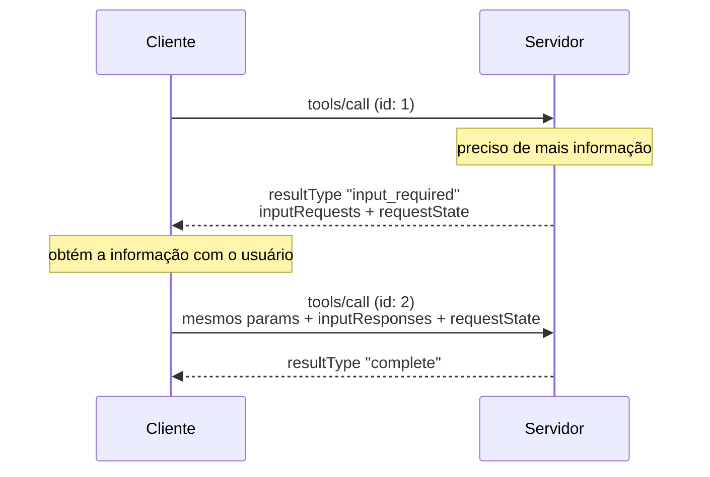

# 10 · Fundamentos — vocabulário e modelos mentais

`Nível: iniciante → intermediário` · `Escrito em 01/09/2026` · `Protocolo 2026-07-28`

Aqui todo termo do resto do curso é definido com precisão. Se um arquivo adiante usa
uma palavra que você não reconhece, ela está definida aqui ou no [GLOSSARIO](GLOSSARIO.md).

---

## 1. A definição formal

> **MCP (Model Context Protocol)** é um protocolo aberto, baseado em **JSON-RPC 2.0**,
> que padroniza como uma aplicação de IA descobre e invoca capacidades oferecidas por
> programas externos, e como esses programas devolvem contexto e resultados.

Desmontando a definição, palavra por palavra:

| Trecho | O que significa exatamente |
|---|---|
| **protocolo aberto** | especificação pública, licença MIT, governança na Agentic AI Foundation (Linux Foundation) |
| **baseado em JSON-RPC 2.0** | toda mensagem é um objeto JSON com `jsonrpc`, `id`, `method`/`result`/`error` |
| **aplicação de IA** | o *host*: o programa que fala com o modelo de linguagem |
| **descobre** | em tempo de execução: `server/discover` e `tools/list` dizem o que existe **agora** |
| **invoca capacidades** | `tools/call`, `resources/read`, `prompts/get` |
| **programas externos** | os *servidores*: processos locais ou serviços remotos |

**O que a definição deliberadamente não diz:** nada sobre modelos, sobre inferência,
sobre agentes, sobre memória, sobre orquestração. MCP é uma camada de **transporte de
capacidade**, não de inteligência.

---

## 2. Os papéis, com precisão

### 2.1 Host

O processo que contém tudo. Responsabilidades, exatamente como a spec lista:

- cria e gerencia várias instâncias de cliente;
- controla permissões de conexão e o ciclo de vida delas;
- **aplica as políticas de segurança e o requisito de consentimento**;
- decide as autorizações do usuário;
- coordena a integração com o LLM;
- agrega o contexto vindo de vários clientes.

Exemplos: Claude Desktop, Claude Code, VS Code, Cursor, ChatGPT Desktop, o MCP Inspector.

### 2.2 Client (cliente)

Criado pelo host, **um por servidor**, relação 1:1. Responsabilidades:

- conversa com exatamente um servidor;
- **anexa a versão do protocolo e as capacidades a cada requisição** (mudança de 2026-07-28);
- roteia mensagens nas duas direções;
- gerencia assinaturas e notificações;
- **mantém a fronteira de segurança entre servidores**.

O cliente é invisível ao usuário. Ele existe no modelo conceitual para que a fronteira
de isolamento tenha um nome.

### 2.3 Server (servidor)

Expõe capacidades. Responsabilidades:

- expõe recursos, ferramentas e prompts;
- opera de forma independente, com responsabilidade estreita;
- pede entrada do cliente (elicitação, amostragem, roots) **dentro de uma resposta**,
  via `InputRequiredResult`;
- respeita as restrições de segurança;
- pode ser processo local ou serviço remoto.

---

## 3. Os quatro princípios de projeto

Estes princípios explicam quase toda decisão estranha do protocolo. Vale decorá-los.

### 3.1 "Servidores devem ser extremamente fáceis de escrever"

O host carrega a complexidade de orquestração. O servidor só declara e executa.
**Consequência prática:** um servidor útil cabe em 20 linhas — e é por isso que existem
mais de 10.000 deles. Também é por isso que o protocolo não tem, por exemplo,
negociação de conteúdo elaborada: complicaria o lado que se quis manter simples.

### 3.2 "Servidores devem ser altamente componíveis"

Cada servidor faz uma coisa. Vários combinam. **Consequência:** não há como um servidor
depender de outro, nem descobrir outro. A composição é sempre responsabilidade do host.

### 3.3 "Servidores não podem ler a conversa inteira, nem enxergar dentro de outros servidores"

- o servidor recebe só a informação contextual necessária;
- o histórico completo fica com o host;
- cada servidor fica isolado;
- interações entre servidores são controladas pelo host;
- **o processo host aplica as fronteiras de segurança**.

**Consequência forte:** um servidor MCP malicioso não consegue ler a sua conversa nem
os dados de outro servidor **por meio do protocolo**. Ele pode, porém, tentar
*manipular o modelo* pelo texto que devolve, e isso não é impedido por nada. Ver
[19-seguranca](19-seguranca.md).

### 3.4 "Recursos podem ser acrescentados progressivamente"

Núcleo mínimo; o resto é negociado por capacidades e extensões.
**Consequência:** você precisa sempre perguntar "esta capacidade está declarada?"
antes de usá-la — e implementar a degradação graciosa quando não estiver.

---

## 4. As primitivas, e por que são três

O eixo que separa as três primitivas **não é técnico, é de controle**: quem decide usar.

| Primitiva | Controlada por | Analogia | Exemplo |
|---|---|---|---|
| **Tool** | **modelo** (com aprovação humana) | função, verbo, botão | `criar_issue`, `buscar_pedido` |
| **Resource** | **aplicação** / usuário | arquivo, substantivo, anexo | `file:///README.md` |
| **Prompt** | **usuário** | comando de barra, formulário | `/revisar-pr` |

Por que não uma só primitiva ("chame uma função e pronto")? Porque cada uma exige um
tratamento de **interface e de consentimento** diferente:

- ferramenta precisa de **aprovação** — o modelo pode errar e a ação tem efeito;
- recurso precisa de **seleção** — o usuário escolhe o que anexar;
- prompt precisa de **descoberta** — o usuário precisa saber que ele existe.

Empacotar as três numa só transferiria essa decisão para o servidor, que é justamente
quem não deveria decidir.

### 4.1 A realidade de 2026

Fato observável, não opinião: **tools dominam**. A maior parte dos servidores só as
implementa, e a maior parte dos clientes só as suporta bem. Recursos e prompts são
subutilizados. Motivos, em ordem de peso:

1. **Ferramenta funciona em qualquer host**; recurso e prompt dependem de UI que muitos
   hosts não construíram.
2. **Ferramenta é o que o modelo já sabia fazer** — mapeia direto em *function calling*.
3. **Recurso e prompt exigem que o usuário aja**, e o usuário não sabe que eles existem.

Opinião profissional: essa assimetria é um problema de ecossistema, não de projeto.
Recursos resolveriam bem o problema de contexto grande (devolver um link em vez do
conteúdo), mas não pegaram por falta de suporte nos clientes. Se você precisa que
funcione em todo lugar, exponha como ferramenta — e ofereça o recurso também.

---

## 5. Capacidades (*capabilities*)

Cliente e servidor declaram o que sabem fazer. Nada pode ser usado sem declaração.

**Servidor** declara na resposta de `server/discover`:

```json
{
  "capabilities": {
    "tools":     { "listChanged": true },
    "resources": { "listChanged": true, "subscribe": true },
    "prompts":   { "listChanged": true },
    "extensions": { "io.modelcontextprotocol/tasks": {} }
  }
}
```

**Cliente** declara em `_meta` de **cada requisição**:

```json
{
  "_meta": {
    "io.modelcontextprotocol/protocolVersion": "2026-07-28",
    "io.modelcontextprotocol/clientCapabilities": {
      "elicitation": { "form": {}, "url": {} }
    }
  }
}
```

Regra dura: **o servidor não pode contar com capacidade que o cliente não declarou.**
Se precisar de uma, devolve `MissingRequiredClientCapabilityError` (`-32021`) com
`data.requiredCapabilities` listando o que falta.

Saída real do projeto-modelo desta pasta (`server/discover`, 01/09/2026):

```json
"capabilities": {
  "prompts":   {"listChanged": true},
  "resources": {"listChanged": true, "subscribe": true},
  "tools":     {"listChanged": true}
}
```

---

## 6. Os três padrões de mensagem

MCP tem exatamente três. Todo o comportamento se reduz a eles.

### 6.1 Requisição e resposta

O básico. Cliente pergunta, servidor responde com `result` ou `error`.

### 6.2 MRTR — Multi Round-Trip Requests

Quando o servidor precisa de algo do usuário ou do modelo.



Pontos que a spec exige e que erram muito:

- o `id` da retentativa **tem de ser diferente** do original;
- o cliente **tem de devolver `requestState` idêntico**, sem inspecionar nem alterar;
- o servidor **tem de tratar `requestState` como entrada de atacante** — assinar (HMAC)
  ou cifrar (AEAD), e rejeitar o que não verificar;
- só `tools/call`, `resources/read` e `prompts/get` aceitam `input_required`.

### 6.3 Assinar e notificar

Um `subscriptions/listen` abre um fluxo longo. O cliente escolhe o que quer receber
(`toolsListChanged`, `promptsListChanged`, `resourcesListChanged`, `resourceSubscriptions`),
o servidor confirma e depois envia notificações marcadas com `subscriptionId`.

---

## 7. Sem estado (*stateless*) — o conceito central de 2026-07-28

> **Toda informação necessária para processar uma requisição está na própria requisição.**

O que a spec exige:

- servidores **NÃO PODEM** depender de requisições anteriores na mesma conexão para
  estabelecer contexto (capacidades, versão, identidade). Tudo vem no `_meta`;
- servidores **DEVEM** estar preparados para requisições de várias tarefas, threads ou
  conversas ao mesmo tempo;
- servidores **NÃO DEVERIAM** exigir que o cliente reutilize a mesma conexão para
  operações relacionadas;
- clientes **NÃO DEVERIAM** usar uma tarefa ou conversa como limite de vida do processo stdio;
- estado que atravessa requisições **DEVE** ser referenciado por identificador explícito
  passado a cada requisição.

**A frase que resume tudo:** *uma conexão aberta não é uma conversa.* Um processo stdio
pode carregar requisições de conversas diferentes, intercaladas.

Por que fizeram isso — os cinco porquês em [17](17-versionamento-e-compatibilidade.md).
Em uma linha: **sessão de protocolo obrigava balanceamento com afinidade de sessão**,
o que impede rodar servidor MCP como um serviço HTTP comum, atrás de um balanceador
comum, com escala horizontal comum.

---

## 8. Transporte × protocolo

Distinção que muita gente mistura.

| Camada | O que define | Muda com o transporte? |
|---|---|---|
| **Protocolo** | métodos, formas de mensagem, padrões, capacidades | **não** |
| **Transporte (binding)** | enquadramento, entrega, onde vive o metadado, como se cancela | sim |

Os dois transportes padrão:

| | **stdio** | **Streamable HTTP** |
|---|---|---|
| Como funciona | subprocesso; JSON por linha em `stdin`/`stdout` | um endpoint; cada mensagem é um POST |
| Log | `stderr`, livre | log do servidor |
| Metadado | só no corpo (`_meta`) | corpo **e** espelhado em cabeçalhos |
| Cancelamento | `notifications/cancelled` | fechar o fluxo da resposta |
| Rede | **nenhuma** | HTTP |
| Autorização | do ambiente (variáveis) | OAuth 2.1 |
| Quando usar | local, dados na máquina, sem rede | remoto, multiusuário, escala |

Você pode implementar transporte próprio (Unix socket, TCP). A spec recomenda
**reutilizar o enquadramento do stdio** — JSON delimitado por nova linha — porque só as
partes de ciclo de vida de processo são específicas dos fluxos padrão.

---

## 9. Modelos mentais úteis

### 9.1 "MCP é o driver de dispositivo do LLM"

Um driver expõe uma interface padronizada (`open`, `read`, `write`) para hardware
específico. O sistema operacional não sabe nada sobre a impressora; sabe sobre drivers.
MCP faz o mesmo entre host e sistemas. E, como driver, ele **roda com os seus
privilégios** — daí o cuidado com a origem.

### 9.2 "O modelo é o usuário da sua API"

Este é o modelo mental mais produtivo, e o mais ignorado. O consumidor da sua ferramenta
não é um programador que lê documentação: é um sistema estatístico que decide pelo nome,
pela descrição e pelo schema, e que **não vê o seu código**.

Consequências que mudam o projeto:

- nome ambíguo causa chamada errada — e não há compilador que reclame;
- descrição incompleta causa argumento inventado;
- mensagem de erro sem instrução causa laço infinito de tentativas;
- resultado enorme envenena o próprio raciocínio do modelo.

Ver [23-projeto-de-ferramentas](23-projeto-de-ferramentas.md).

### 9.3 "Contexto é orçamento, não infinito"

Tudo que a ferramenta devolve ocupa a janela de contexto, custa tokens e concorre com
o resto. Uma ferramenta bem projetada devolve **o mínimo suficiente**. É a diferença
entre `SELECT *` e `SELECT nome, status LIMIT 20`.

### 9.4 "O protocolo dá vocabulário, não confiança"

MCP padroniza a conversa. Não diz nada sobre o servidor ser honesto. Um servidor pode
descrever a ferramenta como "lista arquivos" e enviar o conteúdo para fora. Esse é o
espaço em que vivem *tool poisoning*, *line jumping* e *rug pull* — ver [19](19-seguranca.md).

---

## 10. Anatomia de uma mensagem

Requisição real, capturada nesta máquina:

```json
{
  "jsonrpc": "2.0",
  "id": 3,
  "method": "tools/call",
  "params": {
    "name": "somar",
    "arguments": { "a": 2, "b": 40 },
    "_meta": {
      "io.modelcontextprotocol/protocolVersion": "2026-07-28",
      "io.modelcontextprotocol/clientCapabilities": {}
    }
  }
}
```

| Campo | Obrigatório | O que é |
|---|---|---|
| `jsonrpc` | sim | sempre `"2.0"` |
| `id` | sim | string ou número, **nunca `null`**, único entre as pendentes |
| `method` | sim | o nome do método |
| `params.name` | depende | nome da ferramenta |
| `params.arguments` | depende | conforme o `inputSchema` |
| `params._meta.…/protocolVersion` | **sim** | versão desta requisição |
| `params._meta.…/clientCapabilities` | **sim** | o que o cliente sabe fazer |

Resposta real:

```json
{
  "jsonrpc": "2.0",
  "id": 3,
  "result": {
    "content": [{ "text": "42.0", "type": "text" }],
    "isError": false,
    "resultType": "complete",
    "structuredContent": { "result": 42.0 },
    "_meta": {
      "io.modelcontextprotocol/serverInfo": { "name": "demo", "version": "1.0.0" }
    }
  }
}
```

`resultType` é obrigatório desde `2026-07-28`. Ausente (servidor antigo), o cliente
**deve** tratar como `"complete"`.

---

## 11. Autoteste

1. Escreva a definição formal de MCP e explique cada uma das seis partes.
2. Quais são os quatro princípios de projeto? Dê uma consequência prática de cada um.
3. O que separa *tool*, *resource* e *prompt* — e por que não bastaria uma primitiva só?
4. O que a spec exige de servidores no modelo sem estado? Cite três regras.
5. Explique "uma conexão aberta não é uma conversa".
6. Qual a diferença entre protocolo e transporte (*binding*)? O que muda entre stdio e HTTP?
7. Em MRTR, quem repete a requisição, e por que o `id` precisa mudar?
8. Por que o servidor deve tratar `requestState` como entrada hostil?
9. Explique o modelo mental "o modelo é o usuário da sua API" e três consequências de projeto.
10. Por que o protocolo não protege contra um servidor mentiroso?

---

**Anterior:** [07 · Projeto-modelo](07-projeto-modelo/README.md) · **Próximo:** [11 · História](11-historia.md) · **Índice:** [00-MAPA](00-MAPA.md)

*Fontes: [Arquitetura](https://modelcontextprotocol.io/specification/2026-07-28/architecture),
[Base](https://modelcontextprotocol.io/specification/2026-07-28/basic),
[Transportes](https://modelcontextprotocol.io/specification/2026-07-28/basic/transports),
[MRTR](https://modelcontextprotocol.io/specification/2026-07-28/basic/patterns/mrtr).
JSON e capacidades capturados de servidores reais nesta máquina em 01/09/2026.*
