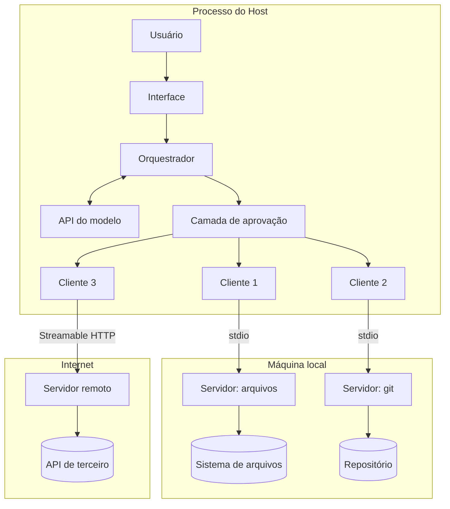
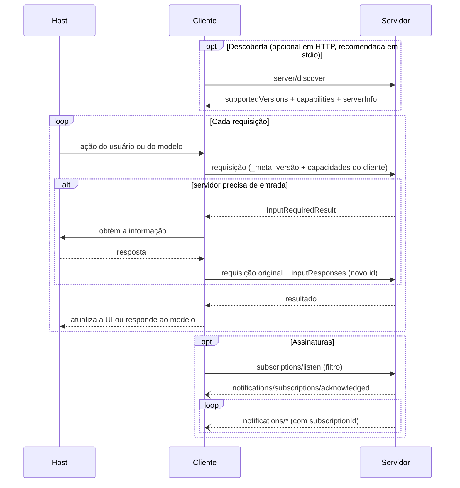

# 12 · Arquitetura — as camadas, as fronteiras e quem confia em quem

`Nível: intermediário` · `Escrito em 01/09/2026` · `Protocolo 2026-07-28`

---

## 1. O desenho de cima



Duas coisas que esse desenho torna óbvias e que a maioria dos textos deixa implícitas:

1. **O modelo está dentro do host, não do lado do servidor.** O servidor nunca fala com
   o modelo. Sampling — que parecia a exceção — está depreciado justamente por embaralhar
   essa fronteira.
2. **A camada de aprovação fica entre o orquestrador e os clientes.** É o único ponto do
   sistema onde um humano pode dizer não. Se o host não a implementa, ela não existe em
   lugar nenhum: o protocolo não a impõe.

---

## 2. As camadas

| Camada | O que define | Exemplos |
|---|---|---|
| **Aplicação** | primitivas: tools, resources, prompts, elicitação | `tools/call` |
| **Padrões de mensagem** | requisição/resposta, MRTR, assinar/notificar | `InputRequiredResult` |
| **Base** | JSON-RPC 2.0, `_meta`, capacidades, códigos de erro, versionamento | `-32022` |
| **Transporte (binding)** | enquadramento, entrega, metadado, cancelamento | stdio, Streamable HTTP |

Regra de ouro: **a semântica é idêntica em todo transporte**. O binding só define
*como os bytes andam*. Quando você lê "isso depende do transporte", o assunto é
enquadramento, cancelamento ou onde o metadado viaja — nunca o significado da mensagem.

---

## 3. Quem inicia o quê

Esta tabela mudou por completo em `2026-07-28` e é fonte constante de confusão.

| Tipo de mensagem | Cliente → Servidor | Servidor → Cliente |
|---|---|---|
| **Requisição** | ✅ sim | ❌ **nunca** |
| **Resposta** | ❌ nunca | ✅ sim |
| **Notificação** | ✅ (só `notifications/cancelled`, só em stdio) | ✅ sim |

> "Não existe outra direção de mensagem: pelos padrões de mensagem, servidores não
> iniciam requisições JSON-RPC e clientes não enviam respostas."

Isso simplifica brutalmente a implementação de um cliente: **você nunca precisa de um
roteador de requisições de entrada.** E explica por que `NoBackChannelError` aparece
quando alguém tenta `ctx.elicit()` direto.

---

## 4. Negociação de capacidades — sem handshake



Note o que sumiu do diagrama comparado a 2025: **não há passo de `initialize`.**
`server/discover` é opcional para o cliente chamar (obrigatório para o servidor
implementar) e serve para escolher versão antecipadamente e para sondar a "era" do
servidor no stdio.

---

## 5. As fronteiras de confiança

Este é o desenho que decide se você vai ou não se machucar.

```
 ┌──────────────────────────────────────────────────────────┐
 │  Confiável: o processo do HOST                           │
 │  · a conversa completa                                   │
 │  · as credenciais do usuário                             │
 │  · a decisão de aprovar ou não                           │
 └───────────────┬──────────────────────────────────────────┘
                 │  FRONTEIRA 1 — o host decide o que passa
 ┌───────────────▼──────────────────────────────────────────┐
 │  Semiconfiável: o CLIENTE (um por servidor)              │
 │  · vê só o que o host mandou para ESTE servidor          │
 └───────────────┬──────────────────────────────────────────┘
                 │  FRONTEIRA 2 — isolamento entre servidores
 ┌───────────────▼──────────────────────────────────────────┐
 │  NÃO confiável: o SERVIDOR                               │
 │  · descrições de ferramenta: TEXTO ARBITRÁRIO            │
 │  · resultados: TEXTO ARBITRÁRIO                          │
 │  · anotações: "clientes DEVEM considerar não confiáveis  │
 │    a menos que venham de servidores confiáveis"          │
 └───────────────┬──────────────────────────────────────────┘
                 │  FRONTEIRA 3 — o servidor autoriza o acesso
 ┌───────────────▼──────────────────────────────────────────┐
 │  O sistema por trás: banco, API, arquivos                │
 └──────────────────────────────────────────────────────────┘
```

### O que cada fronteira garante — e o que **não** garante

| Fronteira | Garante | **Não** garante |
|---|---|---|
| 1 (host↔cliente) | o servidor não vê a conversa nem o histórico | que o usuário leia o que está aprovando |
| 2 (entre clientes) | o servidor A não vê os dados do servidor B **pelo protocolo** | que o servidor A não influencie o modelo a chamar B e vazar o resultado |
| 3 (servidor↔sistema) | o que o servidor decidir garantir | nada, se o servidor for mal escrito ou malicioso |

**A frase que resume o modelo de ameaça do MCP:** *o protocolo isola dados, não isola
influência.* Tudo que o servidor devolve entra no contexto do modelo como texto — e o
modelo não distingue com segurança "dado" de "instrução". Ver [19](19-seguranca.md).

---

## 6. O ciclo de vida de uma conexão

### 6.1 stdio

```
1. O host lê a configuração e decide lançar o servidor.
2. O host cria um cliente e lança o subprocesso.
3. (Recomendado) O cliente envia `server/discover` para sondar a era e a versão.
4. O cliente envia `tools/list`, `resources/list`, `prompts/list`.
5. Uso normal: requisições intercaladas, de conversas possivelmente diferentes.
6. Encerramento: o host fecha o stdin do filho; o servidor sai.
7. Se não sair a tempo: SIGTERM, depois SIGKILL (POSIX);
   TerminateProcess ou Job Objects (Windows).
8. Se o servidor morrer sozinho: o cliente DEVE reiniciá-lo.
   Como o protocolo é sem estado, as requisições em voo simplesmente se perdem
   e podem ser reemitidas contra o processo novo. Assinaturas precisam ser refeitas.
```

O item 8 é uma vantagem direta do modelo sem estado: reiniciar um servidor stdio deixou
de ser um evento traumático.

### 6.2 Streamable HTTP

Não há "conexão" no sentido de sessão. Há requisições.

```
1. O cliente tem uma URL.
2. Cada mensagem é um POST ao endpoint MCP, com os cabeçalhos obrigatórios.
3. A resposta é um JSON, ou um fluxo SSE daquela requisição.
4. Se quiser notificações de mudança, o cliente abre UM `subscriptions/listen`,
   cuja resposta é um fluxo que fica aberto.
5. Cancelar = fechar o fluxo da resposta.
6. Não há término de sessão, porque não há sessão. Não há DELETE.
```

---

## 7. Como o host junta tudo

O host tem responsabilidades que **não estão no protocolo** e que separam um host bom
de um ruim:

| Responsabilidade | O que um host bom faz | O que um host ruim faz |
|---|---|---|
| **Aprovação** | mostra ferramenta, argumentos e servidor, e espera | aprova tudo, ou pede "permitir sempre" no primeiro uso |
| **Nomes colidindo** | prefixa por servidor (`github__search`) | deixa duas ferramentas `search` competirem |
| **Orçamento de contexto** | limita, resume, pagina | injeta 200 ferramentas e reclama do custo |
| **Isolamento** | um cliente por servidor, sem vazamento cruzado | um pote só |
| **Segredos** | guarda fora do contexto do modelo | põe token na descrição da ferramenta |
| **Auditoria** | registra toda chamada com argumentos | nada |
| **Sandbox** | container, restrição de FS e rede para servidor local | executa o comando da config sem mostrar |

> A spec fala explicitamente sobre colisão de nomes: a unicidade é **por servidor**;
> clientes e proxies que agregam vários servidores **DEVEM** implementar uma estratégia
> de desambiguação, e **NÃO DEVEM** usar o `name` do `serverInfo` para isso, porque
> ele não é garantidamente único.

---

## 8. Topologias reais

### 8.1 Local, um usuário (o caso mais comum)

```
Claude Desktop ──stdio──> servidor de arquivos ──> ~/Documentos
               ──stdio──> servidor de git      ──> ~/projeto
```
Sem rede, sem OAuth. Credenciais vêm de variáveis de ambiente. **Comece aqui.**

### 8.2 Remoto, multiusuário

```
Host ──HTTPS──> balanceador ──> réplicas do servidor MCP ──> API/banco
                                        ▲
                                        └── validação de token (audiência!)
```
Exige OAuth 2.1, PRM (RFC 9728), validação de audiência e um plano para `requestState`.
**Sem sessão, qualquer réplica atende qualquer requisição** — que é o ponto inteiro
da reescrita de 2026.

### 8.3 Gateway / agregador

```
Host ──> Gateway MCP ──> servidor A
                    ──> servidor B
                    ──> servidor C
```
O gateway é cliente dos servidores e servidor do host. Ganha-se ponto único de política,
auditoria e limite de taxa. **Perde-se** a fronteira 2: o gateway vê tudo. Um gateway
comprometido é a pior falha possível na arquitetura.

⚠️ Se o gateway repassar o token do cliente adiante sem trocar, isso é **token
passthrough**, explicitamente proibido pela spec. Ver [18](18-autorizacao.md).

### 8.4 Servidor MCP embarcado na aplicação

```
Sua API ──> monta o handler MCP em /mcp (mesmo processo)
```
Reaproveita autenticação, log, métricas e deploy que você já tem. É o caminho mais
sensato para quem já tem uma API em produção. Nos dois SDKs isso é uma linha
(`streamable_http_app()` em Python; `createMcpHandler` em TypeScript).

---

## 9. Extensões

Desde `2026-07-28`, o núcleo é pequeno e o resto vira **extensão**, negociada pelo campo
`extensions` das capacidades.

| Extensão oficial | Identificador | Para quê |
|---|---|---|
| **MCP Apps** | `io.modelcontextprotocol/ui` | UI interativa (gráfico, formulário, player) dentro da conversa |
| **Tasks** | `io.modelcontextprotocol/tasks` | trabalho longo, com polling, entrada no meio e handle durável |
| **OAuth Client Credentials** | `io.modelcontextprotocol/oauth-client-credentials` | autenticação máquina-a-máquina |
| **Enterprise-Managed Authorization** | — | controle centralizado em ambiente corporativo |

Regras: identificador com prefixo obrigatório (use DNS reverso do seu domínio);
**sempre desativadas por padrão**, com opt-in explícito do desenvolvedor; se um lado
não suporta, o outro **deve** cair para o comportamento do núcleo ou recusar com erro.

Extensões experimentais vivem em repositórios `experimental-ext-` na organização do MCP
e precisam de um Working Group por trás.

---

## 10. Autoteste

1. Desenhe as três fronteiras de confiança e diga o que cada uma garante e não garante.
2. Explique "o protocolo isola dados, não isola influência".
3. Em `2026-07-28`, quem pode iniciar uma requisição JSON-RPC? E uma notificação?
4. Por que um cliente MCP moderno não precisa de roteador de requisições de entrada?
5. O que acontece com as requisições em voo quando um servidor stdio morre? Por que isso deixou de ser traumático?
6. Como se cancela uma requisição em stdio? E em Streamable HTTP? Por que a diferença?
7. Duas ferramentas chamadas `search`, de servidores diferentes. De quem é o problema e o que a spec manda fazer?
8. Cite três responsabilidades do host que o protocolo **não** impõe.
9. O que se ganha e o que se perde com um gateway MCP?
10. Como uma extensão é negociada, e o que acontece se só um lado a suporta?

---

**Anterior:** [11 · História](11-historia.md) · **Próximo:** [13 · JSON-RPC e a camada base](13-json-rpc-e-a-camada-base.md) · **Índice:** [00-MAPA](00-MAPA.md)

*Fontes: [Arquitetura](https://modelcontextprotocol.io/specification/2026-07-28/architecture),
[Transportes](https://modelcontextprotocol.io/specification/2026-07-28/basic/transports),
[stdio](https://modelcontextprotocol.io/specification/2026-07-28/basic/transports/stdio),
[Tools — colisão de nomes](https://modelcontextprotocol.io/specification/2026-07-28/server/tools),
[Extensões](https://modelcontextprotocol.io/extensions/overview). Consultas em 01/09/2026.*
