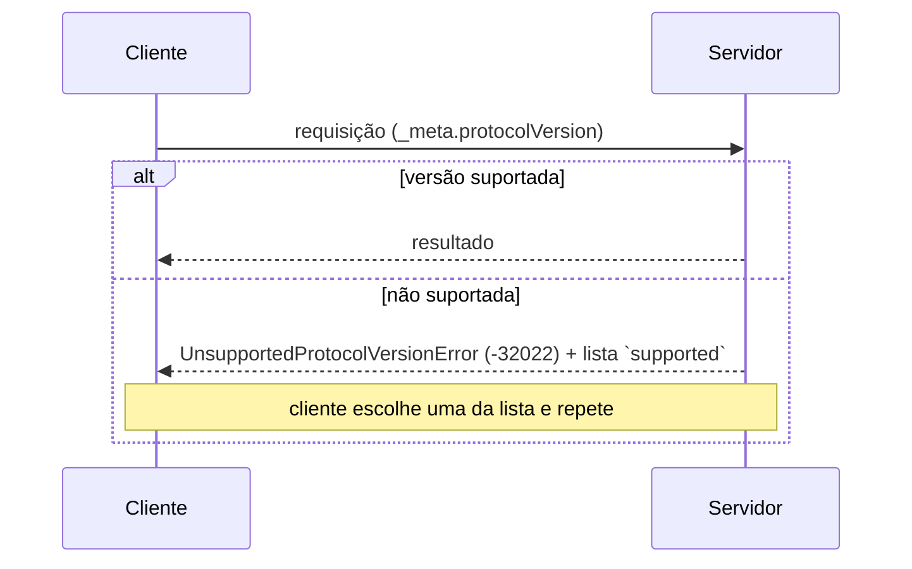

# 13 · JSON-RPC e a camada base — a mecânica, byte a byte

`Nível: intermediário → avançado` · `Escrito em 01/09/2026` · `Protocolo 2026-07-28`

Este arquivo abre a caixa-preta. Ao fim, você lê e escreve mensagens MCP à mão.
Toda mensagem aqui foi capturada de servidores reais nesta máquina.

---

## 1. JSON-RPC 2.0 em cinco minutos

JSON-RPC é uma convenção mínima de chamada remota. Especificação de 2010, três páginas.

Ela define **três** formas de mensagem, e mais nada:

**Requisição** — pede algo e espera resposta:
```json
{ "jsonrpc": "2.0", "id": 1, "method": "tools/list", "params": { } }
```

**Resposta** — devolve `result` **ou** `error`, nunca os dois:
```json
{ "jsonrpc": "2.0", "id": 1, "result": { } }
{ "jsonrpc": "2.0", "id": 1, "error": { "code": -32601, "message": "Method not found" } }
```

**Notificação** — dispara e esquece; sem `id`, **sem resposta**:
```json
{ "jsonrpc": "2.0", "method": "notifications/progress", "params": { } }
```

O que o JSON-RPC deliberadamente **não** define: transporte, autenticação, descoberta,
tipos, versionamento. Tudo isso o MCP acrescenta por cima. É por isso que "MCP é
JSON-RPC" é verdade e é inútil ao mesmo tempo.

### 1.1 Por que JSON-RPC, e não REST/gRPC/GraphQL?

Os cinco porquês, com parada legítima:

1. **Por que não REST?** Porque REST modela recursos e verbos HTTP; MCP precisa de
   chamada de procedimento com nome arbitrário (`tools/call`) e de **mensagens nos dois
   sentidos sobre o mesmo canal** — inclusive sobre stdio, onde não há HTTP.
2. **Por que não gRPC?** Porque exige geração de código, HTTP/2 e Protobuf. Isso mata o
   princípio de projeto nº 1 ("servidores devem ser extremamente fáceis de escrever").
   Um servidor MCP em shell script é possível; em gRPC, não.
3. **Por que não GraphQL?** Porque o problema não é "buscar exatamente os campos que
   quero". É "invocar um procedimento cujo esquema eu descobri em tempo de execução".
4. **Por que JSON e não binário?** Porque o consumidor final é um LLM, que já lida com
   texto, e porque depurar é ler. Ganho de desempenho binário é irrelevante quando cada
   chamada espera centenas de milissegundos por uma inferência.
5. **Por que JSON-RPC especificamente?** **Decisão histórica documentada:** o MCP foi
   modelado no **LSP**, que usa JSON-RPC desde 2016 e provou funcionar em escala com o
   mesmo formato de problema (M editores × N linguagens). Copiar uma solução testada em
   dez anos de produção é engenharia, não preguiça.

---

## 2. As regras que o MCP acrescenta ao JSON-RPC

| Regra | Valor no MCP | Por quê |
|---|---|---|
| Codificação | **UTF-8 obrigatório** | interoperabilidade |
| `id` | string ou número, **nunca `null`** | `null` é ambíguo em JSON-RPC |
| `id` | **não** pode repetir um `id` pendente do mesmo emissor | correlação sem ambiguidade |
| Batching | **proibido** | acrescentado em 2025-03-26, removido em 2025-06-18 |
| `result` | **deve** conter `resultType` | polimorfismo de resultado (MRTR) |
| Direção | servidor **nunca** envia requisição | não há canal de volta |

### `resultType`

```typescript
{ jsonrpc: "2.0"; id: string|number; result: { resultType: string; [k: string]: unknown } }
```

| Valor | Significado |
|---|---|
| `"complete"` | terminou; o resultado é final |
| `"input_required"` | preciso de mais informação — o corpo é um `InputRequiredResult` |
| definido por extensão | só válido se a extensão estiver anunciada nas capacidades |
| **ausente** | servidor de revisão anterior → o cliente **DEVE** tratar como `"complete"` |
| desconhecido | **inválido** |

---

## 3. `_meta` — o porta-malas do protocolo

Todo o metadado de protocolo viaja em `_meta`. Isso é o que torna cada requisição
autossuficiente.

### 3.1 Regras de nome de chave

Duas partes: um **prefixo** opcional e um **nome**.

**Prefixo:**
- se houver, é uma série de rótulos separados por ponto, seguida de `/`;
- rótulo começa com letra e termina com letra ou dígito; no meio, letras, dígitos, hífen;
- use **DNS reverso**: `com.exemplo/`, não `exemplo.com/`;
- **qualquer prefixo cujo segundo rótulo seja `modelcontextprotocol` ou `mcp` é reservado**.
  Reservados: `io.modelcontextprotocol/`, `dev.mcp/`, `org.modelcontextprotocol.api/`,
  `com.mcp.tools/`. **Não** reservado: `com.exemplo.mcp/` — o segundo rótulo é `exemplo`.

**Nome:** começa e termina com alfanumérico; no meio pode ter `-`, `_`, `.`.

### 3.2 Chaves reservadas

| Chave | Onde | O que é |
|---|---|---|
| `progressToken` | requisição | opta por receber `notifications/progress` |
| `io.modelcontextprotocol/protocolVersion` | requisição, **obrigatório** | versão desta requisição |
| `io.modelcontextprotocol/clientCapabilities` | requisição, **obrigatório** | capacidades relevantes |
| `io.modelcontextprotocol/clientInfo` | requisição, SHOULD | nome e versão do cliente |
| `io.modelcontextprotocol/logLevel` | requisição | nível mínimo de log para **esta** requisição |
| `io.modelcontextprotocol/serverInfo` | resultado, SHOULD | nome e versão do servidor |
| `io.modelcontextprotocol/subscriptionId` | notificação, **MUST** no fluxo de listen | correlaciona com a assinatura |
| `traceparent`, `tracestate`, `baggage` | requisição | contexto de trace do OpenTelemetry (W3C) |

`traceparent`/`tracestate`/`baggage` são a **exceção explícita** à regra de prefixo,
para compatibilidade com as convenções semânticas de OpenTelemetry.

```json
{
  "jsonrpc": "2.0", "id": 2, "method": "tools/call",
  "params": {
    "name": "get_weather", "arguments": { "location": "New York" },
    "_meta": { "traceparent": "00-0af7651916cd43dd8448eb211c80319c-00f067aa0ba902b7-01" }
  }
}
```

### 3.3 Requisição malformada

Faltando campo obrigatório do `_meta`: erro `-32602` (Invalid params); em HTTP,
status **400**.

Faltando **capacidade** que o servidor precisa: `MissingRequiredClientCapabilityError`
(`-32021`), com `data.requiredCapabilities` listando o que falta; em HTTP, **400**.

### 3.4 `clientInfo`/`serverInfo` não são segurança

> "São autodeclarados pelo emissor e não verificados pelo protocolo. Destinam-se a
> exibição, log e depuração. Implementações **NÃO DEVERIAM** usá-los para mudar o
> comportamento, nem confiar neles para decisões de segurança."

Qualquer um pode dizer que é o `github-mcp-server` versão 3.

---

## 4. `server/discover` — a sonda universal

Todo servidor **DEVE** implementar. O cliente **PODE** chamar antes de qualquer coisa.

Requisição real (stdio, capturada nesta máquina):

```json
{"jsonrpc":"2.0","id":1,"method":"server/discover","params":{"_meta":{
  "io.modelcontextprotocol/protocolVersion":"2026-07-28",
  "io.modelcontextprotocol/clientCapabilities":{}}}}
```

Resposta real:

```json
{
  "jsonrpc": "2.0",
  "id": 1,
  "result": {
    "cacheScope": "private",
    "capabilities": {
      "prompts":   { "listChanged": true },
      "resources": { "listChanged": true, "subscribe": true },
      "tools":     { "listChanged": true }
    },
    "resultType": "complete",
    "supportedVersions": ["2026-07-28"],
    "ttlMs": 0,
    "_meta": {
      "io.modelcontextprotocol/serverInfo": { "name": "demo", "version": "1.0.0" }
    }
  }
}
```

Uma requisição, e você sabe: quais versões o servidor fala, o que ele oferece, quem ele
diz ser, e por quanto tempo pode cachear a resposta. **É a melhor sonda de saúde para
servidor MCP remoto** — melhor que um `/health` genérico, porque exercita o caminho real.

---

## 5. Negociação de versão — sem handshake

Cada requisição declara a sua versão. O servidor aceita ou rejeita, requisição a requisição.



Erro real capturado nesta máquina, pedindo a versão `1999-01-01`:

```json
{
  "jsonrpc": "2.0", "id": 5,
  "error": {
    "code": -32022,
    "message": "Unsupported protocol version",
    "data": { "supported": ["2026-07-28"], "requested": "1999-01-01" }
  }
}
```

O cliente **DEVERIA** escolher uma versão mutuamente suportada de `data.supported` e
repetir, ou mostrar erro ao usuário se não houver nenhuma.

---

## 6. Códigos de erro e a política de faixas

| Código | Nome | Quando |
|---|---|---|
| `-32700` | Parse error | JSON inválido |
| `-32600` | Invalid Request | não é JSON-RPC válido |
| `-32601` | Method not found | método desconhecido (HTTP: 404) |
| `-32602` | Invalid params | parâmetro inválido; `_meta` faltando; **recurso não encontrado** |
| `-32603` | Internal error | erro interno |
| `-32020` | `HeaderMismatch` | cabeçalho HTTP diverge do corpo, ou falta |
| `-32021` | `MissingRequiredClientCapability` | capacidade não declarada |
| `-32022` | `UnsupportedProtocolVersion` | versão não suportada |

**Política de alocação** (nova em `2026-07-28`, e você deveria copiá-la em qualquer
protocolo seu):

- **`-32000` a `-32019` — legado.** Alocados por implementações antes da política.
  Novos códigos **NÃO PODEM** ser alocados aqui, e novas implementações **NÃO DEVERIAM**
  usá-los. Fora `-32002`, nenhum significado pode ser assumido.
- **`-32020` a `-32099` — reservado à especificação.** Só a spec define. Implementações
  **NÃO PODEM** emitir código dessa faixa que a spec não defina.
- Códigos **seus** vão fora de `-32768..-32000`.

Aposentados, nunca reutilizados:

| Código | Era | Nota |
|---|---|---|
| `-32002` | recurso não encontrado, até `2025-11-25` | clientes **DEVERIAM** continuar aceitando de servidores antigos |
| `-32042` | elicitação por URL, só em `2025-11-25` | |

Erros **locais** (timeout dentro do SDK, por exemplo) não têm código atribuído pela
spec. Se você os expuser em formato JSON-RPC, garanta que não sejam confundidos com
erro vindo do outro lado.

---

## 7. JSON Schema no MCP

### 7.1 Dialeto

- sem `$schema`, o padrão é **JSON Schema 2020-12**;
- `$schema` explícito escolhe outro dialeto;
- implementações **DEVEM** suportar ao menos 2020-12, e **DEVERIAM** documentar quais mais;
- dialeto não suportado → erro claro, não silêncio.

### 7.2 `$ref` — e um vetor de SSRF

> Implementações **NÃO PODEM** dereferenciar automaticamente `$ref` que resolva para
> uma URI de rede.

Um modo opcional pode buscar `$ref` externos, mas **desativado por padrão**, e
**deveria** ter allowlist de hosts — ou, no mínimo, rejeitar loopback, link-local e
redes privadas — com timeout, limite de tamanho e log.

Schema que falha por `$ref` externo não resolvido **deveria** ser rejeitado, nunca
tratado como permissivo.

**Por que isso está na spec:** um servidor malicioso poderia pôr
`$ref: "http://169.254.169.254/latest/meta-data/"` no `inputSchema`, e um cliente
ingênuo buscaria — vazando credenciais de instância na nuvem.

### 7.3 Palavras-chave de composição

`anyOf`, `oneOf`, `allOf`, `if`/`then`/`else` e `$defs` são expressivos e caros de
validar. Implementações **DEVERIAM** aplicar limites — profundidade máxima, teto de
subesquemas, orçamento de tempo por validação — para que um schema malicioso não vire
**negação de serviço contra o validador**.

---

## 8. Ícones

Servidores podem anexar ícones a `Implementation`, `Tool`, `Prompt`, `Resource`.

```json
{ "src": "https://exemplo.com/icone.png", "mimeType": "image/png",
  "sizes": ["48x48"], "theme": "light" }
```

Clientes que renderizam ícones **DEVEM** suportar `image/png` e `image/jpeg`, e
**DEVERIAM** suportar `image/svg+xml` e `image/webp`.

As precauções de segurança são longas e valem como estudo de caso de "campo aparentemente
inocente que abre cinco vetores":

- só `https:` ou `data:`. **Rejeitar** `javascript:`, `file:`, `ftp:`, `ws:` e esquemas
  de aplicativo local; proibir mudança de esquema e redirecionamento para outra origem;
- resistir a exaustão de recursos: imagem enorme, dimensões absurdas, GIF com milhares
  de quadros;
- **buscar sem credenciais** — nada de cookie, nada de `Authorization`;
- verificar que a URI é da **mesma origem** do servidor, para não vazar rastreamento a
  terceiros;
- SVG **pode conter JavaScript** — sanitizar ou recusar;
- validar o tipo pelos **bytes mágicos**, não pelo `mimeType` declarado, e manter
  allowlist estrita.

---

## 9. Lendo a fita — a técnica mais subestimada

Você não precisa de ferramenta nenhuma para falar MCP. Precisa de um `printf` e um pipe.

```bash
printf '%s\n' '{"jsonrpc":"2.0","id":1,"method":"server/discover","params":{"_meta":{"io.modelcontextprotocol/protocolVersion":"2026-07-28","io.modelcontextprotocol/clientCapabilities":{}}}}' \
  | uv run python servidor.py 2>/dev/null | jq .
```

Para várias mensagens em sequência, um driver que mantém o processo vivo:

```python
# fita.py — envia mensagens e imprime as respostas, uma a uma
import json, subprocess, sys

META = {
    "io.modelcontextprotocol/protocolVersion": "2026-07-28",
    "io.modelcontextprotocol/clientCapabilities": {},
}
mensagens = [
    {"jsonrpc": "2.0", "id": 1, "method": "tools/list", "params": {"_meta": META}},
    {"jsonrpc": "2.0", "id": 2, "method": "tools/call",
     "params": {"name": "somar", "arguments": {"a": 2, "b": 40}, "_meta": META}},
    {"jsonrpc": "2.0", "id": 3, "method": "tools/call",
     "params": {"name": "nao_existe", "arguments": {}, "_meta": META}},
]

p = subprocess.Popen([sys.executable, "servidor.py"], stdin=subprocess.PIPE,
                     stdout=subprocess.PIPE, stderr=subprocess.DEVNULL, text=True)
for m in mensagens:
    p.stdin.write(json.dumps(m) + "\n")
    p.stdin.flush()
    print(json.dumps(json.loads(p.stdout.readline()), indent=2, ensure_ascii=False))
p.stdin.close()
p.wait(timeout=10)
```

**Saídas reais desta máquina, 01/09/2026.**

Chamada bem-sucedida:

```json
{
  "jsonrpc": "2.0", "id": 2,
  "result": {
    "content": [{ "text": "42.0", "type": "text" }],
    "isError": false,
    "resultType": "complete",
    "structuredContent": { "result": 42.0 },
    "_meta": { "io.modelcontextprotocol/serverInfo": { "name": "demo", "version": "1.0.0" } }
  }
}
```

Ferramenta inexistente — repare que **não** é erro de protocolo:

```json
{
  "jsonrpc": "2.0", "id": 3,
  "result": {
    "content": [{ "text": "Unknown tool: nao_existe", "type": "text" }],
    "isError": true,
    "resultType": "complete",
    "_meta": { "io.modelcontextprotocol/serverInfo": { "name": "demo", "version": "1.0.0" } }
  }
}
```

> **Observação de campo.** A spec lista "ferramenta desconhecida" como **erro de
> protocolo**; o SDK Python 2.1.1 devolve **erro de execução** (`isError: true`).
> Divergência real, medida aqui. Na prática o comportamento do SDK é defensável — o
> modelo lê "Unknown tool: nao_existe" e pode chamar `tools/list` para se corrigir,
> que é justamente a intenção da categoria "erro de execução". Um cliente robusto
> **trata as duas formas**.

Por que essa técnica importa: quando um SDK esconde algo, a fita não esconde. Toda
depuração séria de MCP acaba aqui.

---

## 10. Autoteste

1. Quais são as três formas de mensagem do JSON-RPC? Qual não tem `id` e por quê?
2. Cinco porquês: por que JSON-RPC e não gRPC? Onde está a parada legítima?
3. O que um cliente deve fazer com um resultado **sem** `resultType`?
4. `com.exemplo.mcp/minha-chave` é um `_meta` válido? E `dev.mcp/x`? Justifique pela regra.
5. Por que `clientInfo` e `serverInfo` não servem para decisão de segurança?
6. Descreva a política de faixas de código de erro. Onde vai um código seu?
7. Qual ataque a proibição de dereferenciar `$ref` de rede evita? Dê a URL clássica.
8. Como um schema com `anyOf` pode virar negação de serviço, e o que a spec manda fazer?
9. Cite quatro precauções obrigatórias ao renderizar um ícone de servidor.
10. Escreva à mão, do zero, uma requisição `tools/call` válida em `2026-07-28`.

---

**Anterior:** [12 · Arquitetura](12-arquitetura.md) · **Próximo:** [14 · Transportes](14-transportes.md) · **Índice:** [00-MAPA](00-MAPA.md)

*Fontes: [Base do protocolo](https://modelcontextprotocol.io/specification/2026-07-28/basic),
[Versionamento](https://modelcontextprotocol.io/specification/2026-07-28/basic/versioning),
[JSON-RPC 2.0](https://www.jsonrpc.org/specification). Todas as mensagens JSON foram
capturadas de servidores reais (`mcp` 2.1.1, Python 3.12.14) nesta máquina em 01/09/2026.*
