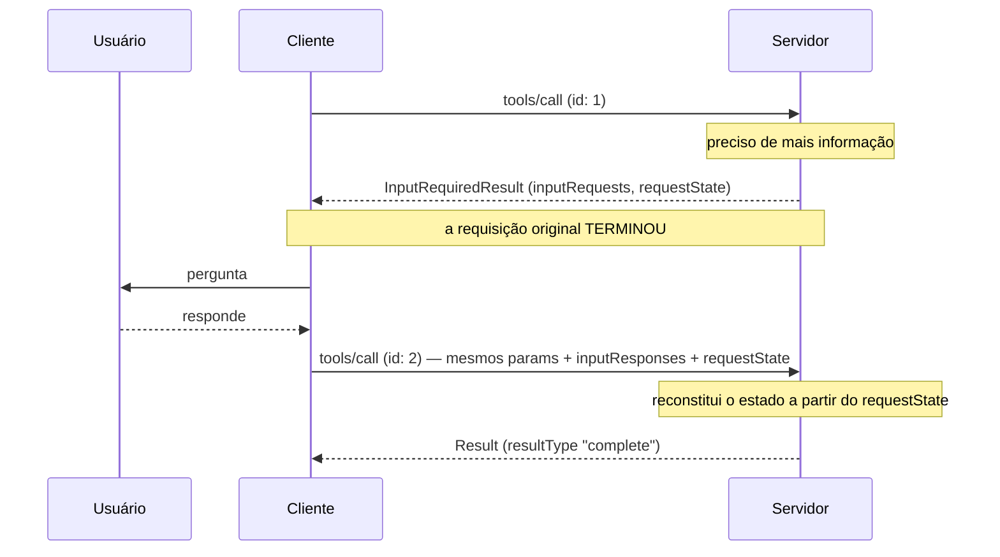

# 16 · Primitivas do cliente — MRTR, elicitação, sampling e roots

`Nível: avançado` · `Escrito em 01/09/2026` · `Protocolo 2026-07-28`

> **Aviso de estado do campo.** Das três primitivas de cliente originais, **duas estão
> depreciadas** desde `2026-07-28`: *Sampling* e *Roots*. Só **Elicitação** segue ativa.
> Este arquivo trata as três, porque você vai encontrar as depreciadas em código real
> pelos próximos anos — a janela de depreciação é de no mínimo doze meses.

---

## 1. MRTR — a mudança que reorganiza tudo

Nas revisões até `2025-11-25`, quando o servidor precisava de algo do usuário ou do
modelo, ele **iniciava uma requisição** JSON-RPC no sentido inverso: `elicitation/create`,
`sampling/createMessage`, `roots/list`.

Em `2026-07-28` isso **acabou**. A spec é direta:

> Servidores **DEVEM** enviar requisições servidor-para-cliente usando o padrão MRTR.
> O padrão anterior não é mais suportado. **Isto é uma mudança que quebra.**

### 1.1 O fluxo



**A propriedade central:** as duas requisições são **completamente independentes**. O
servidor que processa a retentativa não precisa de nada além do que está na própria
retentativa. Nenhuma memória compartilhada, nenhum balanceamento com afinidade.

### 1.2 Os três tipos

**`InputRequests`** — mapa de identificadores atribuídos pelo servidor para requisições:

```json
{
  "github_login": {
    "method": "elicitation/create",
    "params": { "mode": "form", "message": "Informe seu usuário do GitHub",
      "requestedSchema": { "type":"object","properties":{"name":{"type":"string"}},
                           "required":["name"] } }
  },
  "capital_of_france": {
    "method": "sampling/createMessage",
    "params": { "messages":[{"role":"user","content":{"type":"text",
                "text":"Qual é a capital da França?"}}],
                "systemPrompt":"Você é um assistente prestativo.","maxTokens":100 }
  }
}
```

**`InputResponses`** — mapa com as **mesmas chaves** e os resultados do cliente:

```json
{
  "github_login": { "action": "accept", "content": { "name": "octocat" } },
  "capital_of_france": { "role":"assistant",
    "content": {"type":"text","text":"A capital da França é Paris."},
    "model":"claude-3-sonnet-20240307","stopReason":"endTurn" }
}
```

**`InputRequiredResult`**:

```json
{ "jsonrpc":"2.0","id":1,
  "result": { "resultType":"input_required",
              "inputRequests": { },
              "requestState": "blob protegido por AEAD" } }
```

### 1.3 Onde vale

| Requisição | Aceita `input_required`? |
|---|---|
| `tools/call` | ✅ |
| `resources/read` | ✅ |
| `prompts/get` | ✅ |
| qualquer outra | ❌ **NÃO PODE** |

### 1.4 Obrigações do servidor

1. **PODE** responder com `InputRequiredResult` a qualquer das três requisições acima.
2. As chaves de `inputRequests` são atribuídas pelo servidor e **DEVEM** ser únicas no
   escopo da requisição; os valores **DEVEM** ser `ElicitRequest`, `CreateMessageRequest`
   ou `ListRootsRequest`.
3. `requestState` é **opaco**, em qualquer formato que o servidor queira (JSON em base64,
   JWT cifrado, binário serializado).
4. Se um pedido do cliente trouxer `requestState`, o servidor **DEVE tratá-lo como
   entrada controlada por atacante**. Se ele influencia autorização, acesso a recurso ou
   lógica de negócio, o servidor **DEVE** proteger a integridade (HMAC ou AEAD) e
   **DEVE** rejeitar o que não verificar. Integridade só pode ser omitida se adulterar
   não puder causar nada pior que a requisição falhar.
5. Contra **replay**, o servidor **DEVERIA** incluir dentro do payload protegido, e
   verificar na chegada:
   - o **principal autenticado**, rejeitando estado apresentado por outro;
   - uma **expiração curta** (TTL);
   - um **identificador da requisição de origem** — nome do método e um resumo dos
     parâmetros relevantes — rejeitando estado apresentado em requisição que não bata.

   ⚠️ Essas medidas **limitam a janela** de replay e impedem reuso entre usuários e
   entre requisições, mas **não garantem uso único**. Se o seu `requestState` tem de ser
   consumido no máximo uma vez (resgate único, por exemplo), você **DEVE** garantir isso
   do lado do servidor.
6. **DEVE** incluir ao menos um entre `inputRequests` e `requestState`.
7. **NÃO PODE** enviar `inputRequests` de um tipo que o cliente não declarou nas
   capacidades. Sem `elicitation` declarada, nada de `elicitation/create`.
8. **NÃO PODE** supor que o cliente vá atender ou repetir. **PODE** responder
   `InputRequiredResult` várias vezes seguidas, para insistir.

### 1.5 Obrigações do cliente

1. Recebeu `inputRequests` → **DEVE** obter as entradas antes de repetir. Sem
   `inputRequests`, **PODE** repetir imediatamente.
2. Recebeu `requestState` → **DEVE** ecoar o valor **exato** na retentativa, e
   **NÃO PODE** inspecionar, analisar, alterar ou supor nada sobre o conteúdo. Se não
   veio `requestState`, **NÃO PODE** inventar um.
3. O `id` JSON-RPC **DEVE** ser diferente entre a original e a retentativa.
4. `inputRequests` e `requestState` afetam **só** a retentativa daquela requisição.
   **NÃO PODEM** ser usados em nenhuma outra requisição em paralelo.

### 1.6 Tratamento de erro

Servidores **DEVERIAM** validar o `InputResponses` recebido. Erro de protocolo (JSON
malformado, schema inválido, erro interno) → erro JSON-RPC. Parâmetros inesperados a mais
→ **ignorar** o que não reconhecer.

Se o cliente **não** mandou tudo que foi pedido e a informação faltante é necessária, o
servidor **DEVERIA responder com um novo `InputRequiredResult`** pedindo de novo — não
com erro.

---

## 2. Elicitação

A única primitiva de cliente **ativa**. Dois modos.

### 2.1 Capacidade

```json
{ "_meta": { "io.modelcontextprotocol/clientCapabilities": {
    "elicitation": { "form": {}, "url": {} } } } }
```

Objeto vazio (`"elicitation": {}`) equivale, por compatibilidade, a declarar **só `form`**.
Cliente que declara `elicitation` **DEVE** suportar ao menos um modo. Servidor **NÃO PODE**
mandar modo não suportado.

### 2.2 Modo formulário

Parâmetros: `mode` (`"form"`, ou omitido), `message`, `requestedSchema`.

O schema é um **subconjunto restrito** de JSON Schema: **objeto plano, só propriedades
primitivas**. Nada de aninhamento, nada de array de objetos. A restrição é deliberada —
para o cliente conseguir gerar um formulário simples sem interpretar JSON Schema inteiro.

| Tipo | Campos aceitos |
|---|---|
| String | `title`, `description`, `minLength`, `maxLength`, `format`, `default` |
| Número | `type: number\|integer`, `minimum`, `maximum`, `default` |
| Booleano | `default` |
| Enum (única, sem títulos) | `enum: [...]` |
| Enum (única, com títulos) | `oneOf: [{const, title}, ...]` |
| Enum (múltipla, sem títulos) | `type: array`, `items.enum`, `minItems`, `maxItems` |
| Enum (múltipla, com títulos) | `type: array`, `items.anyOf: [{const, title}, ...]` |

Formatos de string aceitos: `email`, `uri`, `date`, `date-time`.

Todos os tipos primitivos aceitam `default`; clientes que suportam **DEVERIAM**
pré-preencher.

### 2.3 As três ações da resposta

```json
{ "action": "accept", "content": { "propriedade": "valor" } }
```

| Ação | Significado | `content` |
|---|---|---|
| `accept` | o usuário aprovou e enviou | presente no modo formulário; ausente no modo URL |
| `decline` | o usuário **recusou explicitamente** | normalmente ausente |
| `cancel` | o usuário **dispensou sem escolher** (fechou, Esc, clicou fora, a página não carregou) | normalmente ausente |

A distinção entre `decline` e `cancel` importa: recusa é uma decisão ("ofereça
alternativa"); dispensa é ausência de decisão ("pergunte de novo depois").

### 2.4 Modo URL

```json
{ "method": "elicitation/create",
  "params": { "mode":"url", "url":"https://mcp.exemplo.com/ui/definir_chave",
              "message":"Informe sua chave de API para continuar." } }
```

Resposta do cliente: `{ "action": "accept" }` — **sem conteúdo**.

`accept` significa apenas que **o usuário consentiu em abrir a URL**. Não significa que
a interação terminou. Ela acontece **fora de banda**, e o cliente não é informado do
resultado. Ao repetir a requisição original, o servidor decide — pelo `requestState`
ecoado ou pelo seu próprio estado — se já terminou, e devolve o resultado final ou outro
`InputRequiredResult`. Clientes **DEVERIAM** oferecer controles manuais para o usuário
repetir ou cancelar.

### 2.5 A regra que não se negocia

> Servidores **NÃO PODEM** usar elicitação em **modo formulário** para pedir informação
> sensível como senhas, chaves de API, tokens de acesso ou credenciais de pagamento.
> Servidores **DEVEM** usar o **modo URL** para interações que envolvam tal informação.

"Sensível" aqui significa **segredos e credenciais que dão acesso ou autorizam
transação**. Nome, e-mail e nome de usuário não estão categoricamente proibidos — fica
a critério do servidor, sujeito à revisão e à recusa do usuário.

**Por que a proibição existe:** no modo formulário o dado passa pelo cliente MCP e pode
acabar em log, em telemetria, ou no próprio contexto do modelo. No modo URL, o segredo
vai direto do navegador do usuário ao servidor.

### 2.6 URLs seguras

**Servidores:**

1. **NÃO PODEM** pôr informação sensível do usuário (credencial, dado pessoal) na URL;
2. **NÃO PODEM** fornecer URL pré-autenticada para recurso protegido — um cliente
   malicioso a usaria para se passar pelo usuário;
3. **NÃO DEVERIAM** pôr URL clicável em nenhum campo de elicitação de formulário;
4. **DEVERIAM** usar HTTPS fora de desenvolvimento.

**Clientes:**

1. **NÃO PODEM** pré-buscar a URL nem seus metadados;
2. **NÃO PODEM** abrir sem consentimento explícito;
3. **DEVEM** mostrar a URL **completa** antes do consentimento;
4. **DEVEM** abrir de forma que nem o cliente nem o LLM possam inspecionar o conteúdo ou
   o que o usuário digitar. Exemplo da spec: no iOS, `SFSafariViewController` serve;
   `WKWebView` **não**;
5. **DEVERIAM** destacar o domínio, para mitigar falsificação por subdomínio;
6. **DEVERIAM** avisar sobre URI ambígua ou suspeita (Punycode, por exemplo);
7. **NÃO DEVERIAM** renderizar URL como clicável em nenhum campo, **exceto** o campo
   `url` de uma elicitação em modo URL.

### 2.7 O ataque de phishing por elicitação de URL

Vale reproduzir inteiro, porque é sutil e a defesa não é óbvia:

1. Alice, usuária **maliciosa** de um servidor **benigno**, dispara uma elicitação.
2. O servidor gera uma URL de autorização, agindo como cliente OAuth de um terceiro.
3. O cliente de Alice mostra a URL e pede consentimento.
4. Em vez de clicar, Alice engana **Bob** — usuário do mesmo servidor benigno — para clicar.
5. Bob abre e completa a autorização, achando que está autorizando a **sua** conexão.
6. O servidor recebe o *callback* e **supõe que é a requisição de Alice**.
7. Os tokens do terceiro ficam ligados à sessão e à identidade de **Alice** — não à de
   Bob. **Tomada de conta.**

**Defesa:** o servidor **DEVE** garantir que quem **abriu** a URL é o mesmo que
**iniciou** a elicitação. O padrão recomendado é não mandar o usuário direto ao
autorizador do terceiro, e sim a uma rota própria (`https://mcp.exemplo.com/connect?...`)
que compara o `sub` da sessão do navegador com o `sub` do token MCP que gerou a
elicitação; só então redireciona.

### 2.8 Identidade do usuário

> Servidores **NÃO PODEM** confiar em identificação de usuário fornecida pelo cliente
> sem verificação, porque pode ser forjada.

- ❌ tratar "eu sou joe@example.com" digitado pelo usuário como autoritativo;
- ✅ derivar a identidade da **autorização** (a claim `sub` do token verificado).

### 2.9 No SDK Python

O padrão correto sob `2026-07-28` é o **resolver**:

```python
from typing import Annotated
from pydantic import BaseModel, Field
from mcp.server.mcpserver import (MCPServer, Resolve, Elicit,
                                  ElicitationResult, AcceptedElicitation)

class Confirmacao(BaseModel):
    confirmar: bool = Field(description="Confirma a exclusão?")

def pedir_confirmacao(caminho: str):
    return Elicit(f"Apagar {caminho}? Isto não pode ser desfeito.", Confirmacao)

@server.tool()
def apagar(caminho: str,
           ok: Annotated[ElicitationResult[Confirmacao], Resolve(pedir_confirmacao)]) -> str:
    """Apaga um arquivo. Pede confirmação ao usuário antes."""
    if isinstance(ok, AcceptedElicitation) and ok.data.confirmar:
        return f"{caminho} apagado"
    return "cancelado pelo usuário"
```

Duas propriedades verificadas nesta máquina:

- o parâmetro resolvido **não entra no `inputSchema`**: `{'properties': {'caminho': ...}}`.
  O modelo não sabe que existe e **não pode forjá-lo**;
- o SDK escolhe o mecanismo pela versão negociada: MRTR em `2026-07-28`, requisição
  direta em `2025-11-25` e anteriores.

⚠️ `await ctx.elicit(...)` dentro da ferramenta levanta
`NoBackChannelError: Cannot send 'elicitation/create': this transport context has no
back-channel for server-initiated requests.` — porque, sob esta revisão, **não há canal
de volta**.

---

## 3. Sampling ⚠️ depreciado

**O que é:** o servidor pede ao **host** uma inferência do LLM, sem ter chave de API
própria. `sampling/createMessage` com `messages`, `systemPrompt`, `maxTokens`,
`modelPreferences` (com `hints`, `intelligencePriority`, `speedPriority`).

Em `2025-11-25` ganhou **tool calling** (`tools`, `toolChoice`), permitindo ao servidor
pedir uma inferência que ela própria chama ferramentas.

**Por que era atraente:** um servidor de resumo podia resumir sem pagar por LLM. O
usuário paga, com o modelo dele, sob o controle do host dele.

**Por que foi depreciado em `2026-07-28`:** a migração sugerida pela spec é *"integre
diretamente com as APIs do provedor de LLM"*. Opinião profissional sobre os motivos de
fundo:

1. **Adoção quase nula.** Poucos clientes implementaram. Servidor que dependia de
   sampling não funcionava em lugar nenhum.
2. **É um canal de volta.** Exige o servidor iniciar requisição — exatamente o que a
   reescrita sem estado eliminou. Sob MRTR, sampling fica desajeitado.
3. **Modelo de custo confuso.** O servidor gasta os tokens do usuário. Quem limita? Como
   se audita? Ninguém respondeu bem.
4. **`includeContext: "thisServer"`/`"allServers"`** — que deixava o servidor pedir
   contexto da conversa — feria o princípio nº 3 (servidor não vê a conversa). Foi
   depreciado antes do resto e sairá **no máximo junto** com o sampling.

**O que fazer hoje:** se o seu servidor precisa de um LLM, chame a API do provedor
diretamente, com a sua própria chave e o seu próprio orçamento. É mais simples, mais
audível e funciona em qualquer cliente.

---

## 4. Roots ⚠️ depreciado

**O que era:** o cliente informava os diretórios ou URIs em que o servidor pode operar —
uma fronteira declarada, não imposta. `roots/list` e
`notifications/roots/list_changed` (esta já **removida**).

**Por que foi depreciado:** migrações sugeridas pela spec — passar diretórios ou arquivos
por **parâmetro de ferramenta**, por **URI de recurso** ou por **configuração do servidor**.

Opinião: roots prometia mais do que entregava. Nunca foi controle de acesso — era uma
dica que um servidor malicioso ignorava. Confinamento de verdade se faz com sandbox de
processo, permissão de sistema de arquivos ou container, não com um campo no protocolo.
Melhor não ter um mecanismo do que ter um que **parece** segurança e não é.

**O que fazer hoje:** parâmetro explícito (`diretorio: str`), validado contra uma
allowlist **do lado do servidor**, e o servidor rodando com privilégio mínimo.

---

## 5. Cliente robusto — lista de verificação

O que separa um cliente MCP sério de um exemplo de tutorial:

| Item | Por quê |
|---|---|
| **Aprovação humana com argumentos visíveis** | é o único ponto do sistema onde alguém pode dizer não |
| **Desambiguação de nomes** entre servidores | duas ferramentas `search` são inevitáveis |
| **Timeout por chamada** | servidor pode travar |
| **Teto de rodadas de MRTR** | senão um servidor malicioso mantém o cliente em laço |
| **Nunca inspecionar `requestState`** | a spec proíbe; e supor formato quebra na próxima versão |
| **Tratar resultado sem `resultType` como `complete`** | compatibilidade com servidor antigo |
| **Aceitar `-32002` como "não encontrado"** | compatibilidade |
| **Validar contra `outputSchema`** com as regras de `$ref` | schema malicioso é vetor de SSRF e de DoS |
| **Rejeitar `x-mcp-header` inválido**, excluindo só aquela ferramenta | uma definição ruim não pode matar as outras |
| **Orçamento de contexto** | truncar resultado gigante antes de dar ao modelo |
| **Auditoria** de toda chamada com argumentos | incidente sem log é incidente sem investigação |
| **Isolamento entre servidores** | um cliente por servidor, sem estado compartilhado |

---

## 6. Autoteste

1. Por que MRTR substituiu as requisições iniciadas pelo servidor? Qual propriedade isso preserva?
2. Quais três requisições aceitam `input_required`?
3. O que o cliente **não pode** fazer com `requestState`, e por que o `id` precisa mudar?
4. Cite três coisas que o servidor **deveria** pôr dentro do `requestState` protegido e verificar.
5. Por que essas medidas não garantem uso único, e o que fazer quando ele é obrigatório?
6. Diferencie `decline` de `cancel`. Por que a diferença importa para o servidor?
7. Por que não se pode pedir chave de API por elicitação de formulário?
8. Descreva o ataque de phishing por elicitação de URL e a defesa.
9. Por que Sampling foi depreciado? Dê o motivo estrutural, não só o de adoção.
10. Por que Roots "parecia segurança e não era"? O que usar no lugar?

---

**Anterior:** [15 · Primitivas do servidor](15-primitivas-do-servidor.md) · **Próximo:** [17 · Versionamento](17-versionamento-e-compatibilidade.md) · **Índice:** [00-MAPA](00-MAPA.md)

*Fontes: [MRTR](https://modelcontextprotocol.io/specification/2026-07-28/basic/patterns/mrtr),
[Elicitação](https://modelcontextprotocol.io/specification/2026-07-28/client/elicitation),
[Changelog 2026-07-28](https://modelcontextprotocol.io/specification/2026-07-28/changelog),
[Boas práticas de segurança](https://modelcontextprotocol.io/docs/2026-07-28/tutorials/security/security_best_practices).
Comportamento do `Resolve`/`Elicit` e o `NoBackChannelError` medidos nesta máquina
(`mcp` 2.1.1) em 01/09/2026.*
