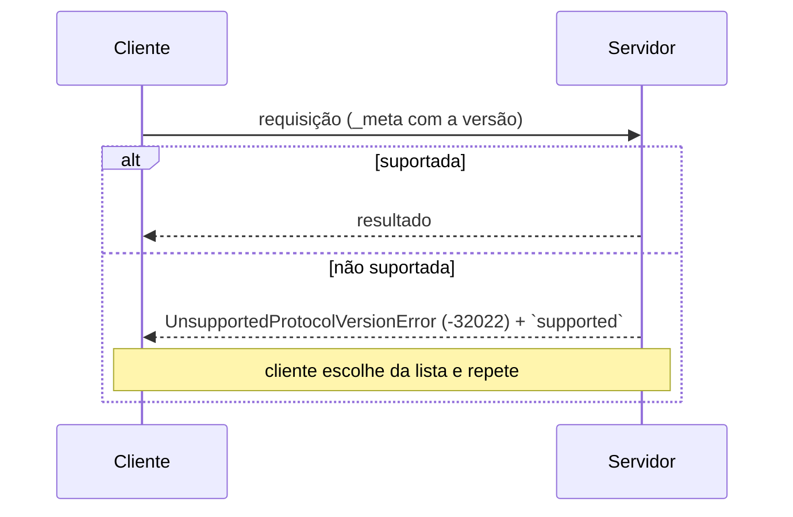

# 17 · Versionamento e compatibilidade — as duas eras

`Nível: avançado` · `Escrito em 01/09/2026` · `Protocolo 2026-07-28`

---

## 1. Como o MCP versiona

Não usa SemVer. Usa **data**: `AAAA-MM-DD`, a data em que a revisão foi finalizada.

| Revisão | Marco |
|---|---|
| `2024-11-05` | inicial |
| `2025-03-26` | OAuth 2.1, Streamable HTTP, anotações de ferramenta, batching |
| `2025-06-18` | saída estruturada, elicitação, PRM (RFC 9728), RFC 8707, sem batching |
| `2025-11-25` | OIDC Discovery, ícones, escopo incremental, elicitação por URL, CIMD, tasks experimentais |
| `2026-07-28` | **sem estado**: sem sessão, sem `initialize`, MRTR, `server/discover` |

Por que data e não SemVer: uma revisão de protocolo não é uma biblioteca. Não há
"patch"; toda mudança é potencialmente observável no fio. E a data ordena sem discussão
sobre o que é "maior".

---

## 2. As duas eras

Vocabulário oficial da spec:

| Termo | Definição |
|---|---|
| **Moderna** | versões que levam versão, identidade e capacidades como metadado **por requisição** — `2026-07-28` em diante |
| **Legada** | versões que estabelecem sessão com o handshake `initialize` — `2025-11-25` e anteriores |
| **Dual-era** | implementação que suporta as duas |

Esta é a divisória que importa em 2026. Não é "versão nova × versão velha": é **modelo
de interação diferente**.

---

## 3. Negociação — sem handshake

Cada requisição declara a sua versão em `_meta.io.modelcontextprotocol/protocolVersion`
(e, em HTTP, no cabeçalho `MCP-Protocol-Version`). O servidor aceita ou rejeita, uma a uma.



Erro real capturado nesta máquina:

```json
{ "jsonrpc":"2.0","id":5,
  "error": { "code":-32022, "message":"Unsupported protocol version",
             "data": { "supported":["2026-07-28"], "requested":"1999-01-01" } } }
```

Todo servidor **DEVE** implementar `server/discover`. O cliente **PODE** chamá-lo antes
de tudo para descobrir versões antecipadamente, mas **não é obrigado**: pode invocar
qualquer RPC direto e tratar o `-32022` se der.

---

## 4. Detecção de era

O mecanismo é **específico do transporte** — de propósito, porque os sinais disponíveis
são diferentes.

### 4.1 stdio — sondar com `server/discover`

O cliente dual-era **DEVERIA** sondar antes de qualquer outra requisição, com a sua
versão moderna preferida no `_meta`. Três desfechos:

| Resposta | Conclusão | Ação |
|---|---|---|
| `DiscoverResult` | servidor **moderno** | escolher versão de `supportedVersions` e seguir |
| erro moderno reconhecido (ex.: `-32022`) | servidor **moderno**, sem a versão pedida | usar uma da lista `supported`. **Não** recuar |
| qualquer outro erro, ou timeout | servidor **legado** | recuar para `initialize` |

> O recuo **NÃO PODE** ser atrelado a um código de erro específico: servidores legados
> respondem a método desconhecido antes do `initialize` com erros definidos pela
> implementação (comumente `-32601` ou `-32602`) — ou não respondem nada.

**Por que sondar mesmo sendo cliente só-moderno?** A spec **RECOMENDA**, e a razão é
excelente: alguns servidores legados **não validam** se a requisição chegou depois do
`initialize`, e processariam um método ambíguo entre eras (como `tools/call`) sob
semântica legada. Sondar produz uma falha determinística em vez de comportamento
silenciosamente errado.

### 4.2 Streamable HTTP — tentar e inspecionar o `400`

O cliente **PODE** tentar uma requisição moderna primeiro. Ao receber `400 Bad Request`,
**DEVERIA inspecionar o corpo antes de recuar** — porque servidores modernos também usam
`400` para `UnsupportedProtocolVersionError`, `MissingRequiredClientCapabilityError` e
falha de validação de cabeçalho.

- corpo com erro JSON-RPC moderno reconhecido → **servidor moderno**: repita com versão
  suportada, ou corrija a requisição. **Não** recue;
- corpo vazio ou não reconhecido → recue para `initialize`, e possivelmente ainda mais
  para o HTTP+SSE depreciado.

### 4.3 Cachear o resultado

A era é propriedade **do servidor**, não da requisição. Clientes **DEVERIAM** cachear
pelo tempo de vida do processo (stdio) ou da origem (HTTP), e **PODEM** persistir entre
reinícios da mesma configuração, resondando se a suposição falhar depois.

---

## 5. A matriz de compatibilidade

| Cliente | Servidor | Resultado |
|---|---|---|
| Moderno | Moderno | **Funciona.** `server/discover` é opcional; incompatibilidade vira `-32022` e o cliente repete |
| Moderno | Legado | **Falha.** O servidor pode devolver erro próprio, ficar em silêncio, ou até processar sob semântica legada. Em stdio, sondar com `server/discover` dá falha determinística e erro acionável |
| Dual-era | Moderno | **Funciona.** A sonda devolve `DiscoverResult` (ou `-32022`); o cliente fica moderno |
| Dual-era | Legado | **Funciona.** stdio: a sonda dá erro não-moderno ou timeout → `initialize`. HTTP: `4xx` sem corpo moderno reconhecido → `initialize` (e possivelmente HTTP+SSE) |
| Legado | Moderno | **Falha.** stdio: `initialize` é método desconhecido **e** faltam os `_meta` obrigatórios — código definido pela implementação. HTTP: faltam os cabeçalhos → `400`. **Clientes legados não têm como avançar** |
| Legado | Dual-era | **Funciona.** O servidor atende `initialize` e serve na revisão legada negociada |
| Legado | Legado | Funciona pela revisão legada; fora do escopo |

**A linha que dói:** *Legado → Moderno falha, e não há remédio do lado do cliente.*
Por isso a spec diz que servidor só-moderno **DEVERIA** nomear as versões que suporta em
qualquer erro devolvido a um `initialize`, em qualquer transporte: essa mensagem pode ser
o único diagnóstico que o usuário do cliente antigo vai ver.

Se você opera um servidor MCP com clientes de terceiros, **isto é uma decisão de negócio,
não técnica**: quando você remove a era legada, alguns clientes param de funcionar sem
recurso. A resposta profissional é ser **dual-era** enquanto houver tráfego legado, e
medir esse tráfego.

### 5.1 Como um servidor dual-era decide

Pela forma como o cliente abre:

- requisição com `_meta` moderno por requisição → atendida **sem estado**, por esta revisão;
- requisição `initialize` → semântica **legada**, com escopo no processo (stdio) ou na
  sessão (HTTP), conforme a versão legada negociada.

Um servidor dual-era **PODE** servir as duas eras ao mesmo tempo, no mesmo endpoint ou
processo.

---

## 6. Negociação de extensões

Extensões são negociadas pelo campo `extensions` das capacidades: um mapa de
identificador para objeto de configuração. Identificadores seguem as regras de chave de
`_meta`, com **prefixo obrigatório**.

Cliente:

```json
{ "capabilities": { "roots": {},
  "extensions": { "io.modelcontextprotocol/ui": { "mimeTypes": ["text/html;profile=mcp-app"] } } } }
```

Servidor (em `server/discover`):

```json
{ "capabilities": { "tools": {},
  "extensions": { "io.modelcontextprotocol/tasks": {} } } }
```

Se um lado suporta e o outro não, o lado que suporta **DEVE** ou voltar ao comportamento
do núcleo, ou recusar a requisição com erro apropriado. Extensões **DEVERIAM** documentar
o comportamento de degradação esperado.

Evolução de extensão: prefira **flag de capacidade ou versão dentro do objeto de
configuração** a criar identificador novo. Se a quebra for inevitável, use novo
identificador (`...-v2`). Extensões são **sempre desativadas por padrão**.

---

## 7. Política de ciclo de vida — a resposta à instabilidade

Adotada em `2026-07-28` ([SEP-2596](https://github.com/modelcontextprotocol/modelcontextprotocol/pull/2596)).
Define três estados e uma janela.

| Estado | Significado |
|---|---|
| **Active** | parte normal da spec |
| **Deprecated** | funciona, mas **novas implementações não devem adotar**; elegível para remoção |
| **Removed** | fora da spec |

**Janela mínima de doze meses** entre depreciação e remoção. Há um
[registro de recursos depreciados](https://modelcontextprotocol.io/specification/2026-07-28/deprecated)
que rastreia tudo que está nesse estado.

Isto é uma resposta institucional direta à queixa mais comum de 2025: cinco revisões em
vinte meses, com remoções. **Consequência prática:** você agora tem um ano de aviso, o
que torna planejável a manutenção de um servidor MCP.

### 7.1 O que está depreciado hoje (01/09/2026)

| Recurso | Migração recomendada |
|---|---|
| **Roots** | diretórios como parâmetro de ferramenta, URI de recurso, ou configuração do servidor |
| **Sampling** | integrar direto com a API do provedor de LLM |
| **Logging** (`logging/setLevel`, `notifications/message`) | `stderr` no stdio, ou OpenTelemetry |
| **HTTP+SSE** (`2024-11-05`) | Streamable HTTP |
| **DCR (RFC 7591)** | Client ID Metadata Documents |
| `includeContext: "thisServer"` / `"allServers"` | omitir, ou `"none"` |

---

## 8. Migrando de 1.x/legado para 2.x/moderno

### 8.1 Checklist de servidor

| Item | Antes | Agora |
|---|---|---|
| `initialize` | obrigatório | **removido**. Implemente `server/discover` |
| Sessão | `Mcp-Session-Id` | **removida**. Handles explícitos como argumento |
| Estado entre chamadas | variável do processo | handle opaco, validado contra o chamador |
| Requisição ao cliente | direta (`elicitation/create`) | **MRTR**: `InputRequiredResult` + `requestState` |
| Endpoint GET | fluxo SSE autônomo | **removido**. `subscriptions/listen` |
| `resources/subscribe` | método próprio | filtro em `subscriptions/listen` |
| `ping`, `logging/setLevel` | existiam | **removidos** |
| Retomada SSE | `Last-Event-ID` | **removida**. Reemitir com novo `id` |
| Resultados | `result` livre | `resultType` obrigatório |
| Cabeçalhos HTTP | `MCP-Protocol-Version` | \+ `Mcp-Method`, `Mcp-Name`, validação contra o corpo |
| Listagens | sem dica de cache | `ttlMs` e `cacheScope` obrigatórios |
| Erro de recurso | `-32002` | `-32602` (aceite `-32002` de servidor antigo) |
| Log | `logging/setLevel` | `_meta.io.modelcontextprotocol/logLevel` **por requisição** |

### 8.2 Checklist de cliente

- pare de mandar `initialize` para servidor moderno;
- ponha `protocolVersion` e `clientCapabilities` no `_meta` de **toda** requisição;
- em HTTP, acrescente `MCP-Protocol-Version`, `Mcp-Method` e `Mcp-Name`, garantindo que
  **batem com o corpo**;
- implemente o laço de MRTR, com **teto de rodadas**;
- **nunca** inspecione `requestState`; ecoe idêntico, com `id` novo;
- trate ausência de `resultType` como `"complete"`;
- aceite `-32002` como "não encontrado", de servidor antigo;
- pare de esperar requisições do servidor: elas não existem;
- para receber log, mande `io.modelcontextprotocol/logLevel` — um callback de log
  **não é** opt-in;
- suporte `x-mcp-header`, excluindo do `tools/list` a ferramenta com anotação inválida.

### 8.3 SDK Python: 1.x → 2.x

| v1 | v2 |
|---|---|
| `from mcp.server.fastmcp import FastMCP` | `from mcp.server.mcpserver import MCPServer` |
| `FastMCP("nome")` | `MCPServer("nome")` |
| `resultado.structuredContent` | `resultado.structured_content` |
| `tool.inputSchema` | `tool.input_schema` |
| `raise ValueError("msg")` entrega a mensagem | **só `ToolError`/`ResourceError` entregam**; o resto vira `Error executing tool <nome>` |
| `await ctx.elicit(...)` na ferramenta | `Annotated[..., Resolve(fn)]` com `Elicit(...)` |

Importar `mcp.server.fastmcp` no v2 levanta `ModuleNotFoundError` **com a mensagem de
migração** — o módulo existe só para dar essa dica. Para ficar no v1: `mcp>=1.28,<2`.

> **Regra geral do JSON × Python no SDK v2:** o fio é `camelCase`; o objeto Python é
> `snake_case`. Erre isso uma vez e você não erra mais.

### 8.4 SDK TypeScript: v1 → v2

| v1 | v2 |
|---|---|
| `@modelcontextprotocol/sdk` (monolítico, hoje 1.30.0) | `@modelcontextprotocol/server` **e** `@modelcontextprotocol/client` (2.0.0) |
| `import { McpServer } from ".../server/mcp.js"` | `import { McpServer } from "@modelcontextprotocol/server"` |

Os pacotes têm **nomes diferentes** e podem coexistir no mesmo `package.json` — útil
durante a migração.

---

## 9. Autoteste

1. Por que o MCP versiona por data e não por SemVer?
2. Defina "moderna", "legada" e "dual-era". Qual é a divisória real?
3. Como um cliente dual-era detecta a era em stdio? E em HTTP? Por que os mecanismos diferem?
4. Por que o recuo não pode ser atrelado a um código de erro específico?
5. Por que um cliente **só-moderno** deveria sondar mesmo assim?
6. Qual linha da matriz de compatibilidade não tem remédio, e o que a spec pede ao servidor nesse caso?
7. Como um servidor dual-era decide qual semântica aplicar?
8. O que a política de ciclo de vida define, e qual é a janela mínima?
9. Cite quatro coisas removidas em `2026-07-28` e o substituto de cada uma.
10. No SDK Python v2, por que `raise ValueError("mensagem")` some com a mensagem?

---

**Anterior:** [16 · Primitivas do cliente](16-primitivas-do-cliente.md) · **Próximo:** [18 · Autorização](18-autorizacao.md) · **Índice:** [00-MAPA](00-MAPA.md)

*Fontes: [Versionamento e compatibilidade](https://modelcontextprotocol.io/specification/2026-07-28/basic/versioning),
[stdio · compatibilidade](https://modelcontextprotocol.io/specification/2026-07-28/basic/transports/stdio),
[Streamable HTTP · compatibilidade](https://modelcontextprotocol.io/specification/2026-07-28/basic/transports/streamable-http),
[Ciclo de vida de recursos](https://modelcontextprotocol.io/community/feature-lifecycle),
[Changelog 2026-07-28](https://modelcontextprotocol.io/specification/2026-07-28/changelog).
Diferenças de SDK medidas nesta máquina (`mcp` 2.1.1, `@modelcontextprotocol/server` 2.0.0)
em 01/09/2026.*
