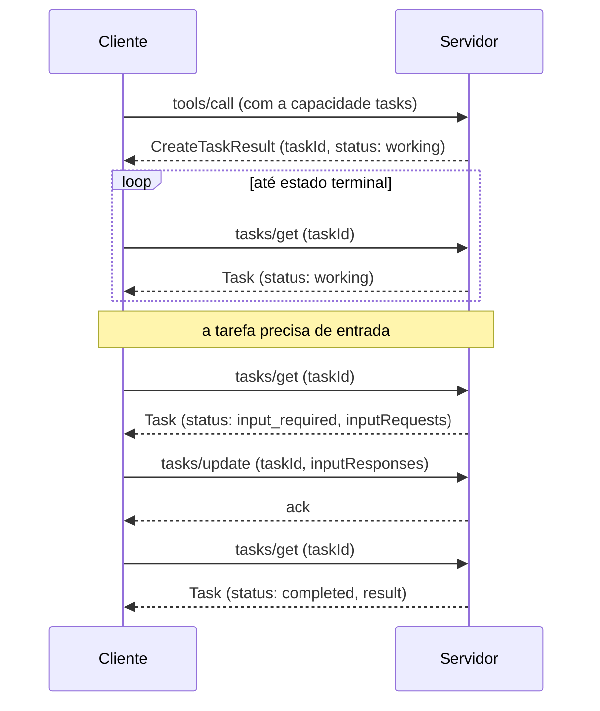

# 22 · Extensões — Tasks, MCP Apps e as de autorização

`Nível: avançado` · `Escrito em 01/09/2026` · `Protocolo 2026-07-28`

---

## 1. O modelo de extensões

Desde `2026-07-28`, o núcleo do MCP é pequeno de propósito, e tudo que não é essencial
vira **extensão**. Extensões cobrem três casos: **modular** (autenticação),
**especializado** (lógica de um setor), **experimental** (recurso em incubação para
possível inclusão no núcleo).

### 1.1 Identificadores

Formato: `{prefixo-do-fornecedor}/{nome}`, seguindo as regras de chave de `_meta`, com
**prefixo obrigatório**. Extensões oficiais usam `io.modelcontextprotocol`.

Se você faz uma extensão de terceiro, use o **DNS reverso do domínio que você possui**:
quem tem `exemplo.com` usa `com.exemplo/minha-extensao`.

### 1.2 Negociação

Cliente, no `_meta` de **cada requisição**:

```json
{ "_meta": { "io.modelcontextprotocol/clientCapabilities": {
    "extensions": { "io.modelcontextprotocol/ui": {
        "mimeTypes": ["text/html;profile=mcp-app"] } } } } }
```

Servidor, na resposta de `server/discover`:

```json
{ "capabilities": { "tools": {},
    "extensions": { "io.modelcontextprotocol/tasks": {} } } }
```

Objeto vazio significa "suporto, sem configuração adicional".

### 1.3 Degradação graciosa

Se um lado suporta e o outro não, o lado que suporta **DEVE** ou voltar ao comportamento
do núcleo, ou recusar com erro apropriado. Extensões **DEVERIAM** documentar a degradação
esperada.

Exemplo bom: um servidor com ferramentas enriquecidas por UI **continua devolvendo texto
significativo** para cliente sem a extensão. Exemplo legítimo do outro lado: um servidor
que exige uma extensão de autenticação **recusa** clientes que não a suportam.

> **Extensões são sempre desativadas por padrão** e exigem opt-in explícito do
> desenvolvedor.

### 1.4 Ciclo de vida

1. **Propor** — um SEP no repositório principal, do tipo *Extensions Track*.
2. **Implementar** — ao menos uma implementação de referência num SDK oficial;
   isso é **pré-requisito** para o SEP ser revisado.
3. **Revisar** — os Core Maintainers têm autoridade final.
4. **Publicar** — PR acrescentando a extensão ao repositório de extensões.
5. **Adotar** — outros clientes, servidores e SDKs implementam.

Requisitos: linguagem RFC 2119 (MUST/SHOULD/MAY) e um Working Group ou Interest Group
associado.

SDKs **podem** implementar extensões, mas não é exigido para conformidade. Cada SDK
decide o que suportar e **deveria** documentar isso.

### 1.5 Evolução

Prefira **flag de capacidade ou versão dentro do objeto de configuração** a criar
identificador novo. Se a quebra for inevitável, use novo identificador (`...-v2`).

Conta como **mudança que quebra**: remover ou renomear campo; mudar tipo; alterar a
semântica de comportamento existente; acrescentar campo obrigatório novo.

Extensões evoluem **independentemente** do núcleo; a atualização é dos mantenedores da
extensão, sem revisão dos Core Maintainers.

### 1.6 Experimentais

Repositórios com prefixo `experimental-ext-` na organização do MCP. Cada uma precisa de
um WG/IG associado; repositórios e pacotes publicados **precisam indicar claramente** o
status experimental; os Core Maintainers mantêm supervisão, inclusive para arquivar ou
remover. Promoção a oficial passa pelo processo de SEP.

---

## 2. Tasks — `io.modelcontextprotocol/tasks`

### 2.1 O problema

Nem toda chamada de ferramenta responde na hora: *pipeline* de CI, processamento em lote,
aprovação humana levam segundos, minutos ou horas.

**Por que não simplesmente bloquear?** Quatro razões que o bloqueio não resolve:

1. **Sem conexão longa.** Bloquear prende uma conexão pelo tempo da operação; clientes e
   intermediários impõem timeouts que tornam isso impraticável além de poucos segundos.
2. **Resiliência a queda.** O `taskId` é um handle **durável**: se o cliente cair, ele
   retoma o polling com o mesmo id.
3. **Visibilidade de progresso.** A tarefa carrega estado e mensagem de status.
4. **Interação no meio do voo.** Precisando de entrada, a tarefa vai para
   `input_required`; o cliente responde por `tasks/update` — sem segunda conexão e sem
   mensagem não solicitada do servidor para o cliente.

E é **dirigida pelo servidor**: ele decide, requisição a requisição, se cria tarefa. O
cliente opta uma vez pela capacidade e trata a forma de resultado que chegar.

### 2.2 O fluxo



1. **Negociação.** O cliente inclui `io.modelcontextprotocol/tasks` nas capacidades
   por requisição; o servidor anuncia a mesma extensão em `server/discover`.
2. **Criação.** O servidor devolve `CreateTaskResult` (`resultType: "task"`) com
   `taskId`, status inicial, `ttlMs` e `pollIntervalMs` sugerido. **A tarefa é criada de
   forma durável antes de a resposta sair.**
3. **Polling.** O cliente chama `tasks/get` com o `taskId`.
4. **Entrada no meio.** Em `input_required`, a resposta de `tasks/get` traz
   `inputRequests`; o cliente responde por `tasks/update`.
5. **Conclusão.** Em `completed`, `result` traz o que a requisição original devolveria.
   Em `failed`, `error` traz o erro JSON-RPC.
6. **Cancelamento.** `tasks/cancel` a qualquer momento — **cooperativo**: o servidor
   reconhece a intenção, mas não é obrigado a parar.

### 2.3 Estados

| Status | Significado |
|---|---|
| `working` | em andamento |
| `input_required` | precisa de entrada do cliente; ver `inputRequests` |
| `completed` | terminou; `result` tem a saída |
| `failed` | erro JSON-RPC durante a execução; `error` tem os detalhes |
| `cancelled` | cancelada (nem sempre honrado) |

`completed`, `failed` e `cancelled` são **terminais**.

### 2.4 Notificações

O servidor pode empurrar atualizações por `notifications/tasks`, e o cliente opta por
elas via `subscriptions/listen`. Cada notificação carrega o **estado completo** da tarefa,
eliminando uma ida a `tasks/get`. **Polling é o padrão**; se o servidor suporta
notificação, o cliente pode confiar nela.

### 2.5 Quando usar

Operações longas (CI, lote, treino); fluxos com humano no laço (aprovação, revisão);
sistemas de job externos que já têm id próprio (deploy em nuvem, API assíncrona, fila);
conexões instáveis (cliente móvel, rede intermitente); processamento em lote com progresso
parcial significativo.

### 2.6 Regras que erram

**Servidor:** verifique a capacidade do cliente **antes** de devolver `CreateTaskResult` —
**nunca** devolva tarefa a cliente que não declarou suporte. Aceite `inputResponses`
chaveadas às `inputRequests` pendentes, responda com resultado vazio, e **ignore**
respostas de chave desconhecida ou já satisfeita. Reconheça `tasks/cancel` com resultado
vazio; honre quando possível.

**Cliente:** esteja preparado para resultado polimórfico (o padrão **ou**
`resultType: "task"`); respeite `pollIntervalMs`; **persista os `taskId` de forma durável**,
para retomar após reinício.

### 2.7 História

Tasks nasceu **experimental dentro do núcleo** em `2025-11-25` e foi **movida para
extensão oficial** em `2026-07-28`, redesenhada: `tasks/result` bloqueante virou polling
por `tasks/get`; `tasks/update` foi criado para entrada do cliente; `tasks/list` foi
removido; e o servidor passou a poder devolver handle **sem opt-in por requisição**.

O roadmap prevê trabalho continuado ([SEP-2663](https://modelcontextprotocol.io/seps/2663-tasks-extension))
rumo à eventual inclusão no núcleo.

---

## 3. MCP Apps — `io.modelcontextprotocol/ui`

### 3.1 O que é

Permite ao servidor devolver **interface HTML interativa** — gráfico, formulário, painel,
visualizador — renderizada **dentro da conversa**.

### 3.2 Por que não um site à parte

Quatro vantagens que uma página separada não tem:

1. **Preservação de contexto.** O app vive na conversa; o usuário não troca de aba nem
   se perde em qual thread estava o painel.
2. **Fluxo bidirecional.** O app pode chamar qualquer ferramenta do servidor MCP, e o
   host empurra resultados novos para o app. Um site à parte precisaria de API,
   autenticação e estado próprios.
3. **Integração com as capacidades do host.** O app pode delegar ações ao host, que as
   roteia pelas integrações que o usuário já conectou (sujeito a consentimento). Em vez
   de cada app manter integração com provedor de e-mail, ele pede um **resultado**
   ("agende esta reunião") e o host resolve.
4. **Garantias de segurança.** O app roda em **iframe isolado** controlado pelo host.
   Não acessa a página pai, não lê cookies, não escapa do contêiner — por isso o host
   pode renderizar app de terceiro sem confiar plenamente no autor.

> Se o seu caso não se beneficia dessas propriedades, um site comum é mais simples.

### 3.3 Como funciona

1. **Pré-carregamento.** A descrição da ferramenta traz `_meta.ui.resourceUri` apontando
   para um recurso `ui://`. O host pode carregá-lo **antes** de a ferramenta ser chamada.
2. **Busca do recurso.** O host busca o recurso: uma página HTML, normalmente com JS e
   CSS embutidos. O app pode carregar scripts externos das origens listadas em
   `_meta.ui.csp`.
3. **Renderização isolada.** Hosts web renderizam num **iframe sandbox** dentro da
   conversa. O objeto `_meta.ui` pode declarar `permissions` (microfone, câmera) e `csp`.
4. **Comunicação bidirecional.** App e host conversam por um dialeto JSON-RPC do MCP
   sobre **postMessage**: alguns métodos são compartilhados (`tools/call`), outros são
   próprios, com prefixo `ui/` (`ui/initialize`).

### 3.4 Quando usar

Explorar dado complexo (mapa clicável em vez de lista de números); configurar com muitas
opções (formulário com validação em vez de dez perguntas em sequência); mídia rica (PDF,
modelo 3D, prévia de imagem); monitoramento em tempo real; fluxo de várias etapas
(aprovar despesas, revisar mudanças, triar issues).

### 3.5 Segurança

O sandbox impede o app de acessar o DOM da janela pai, ler cookies ou `localStorage` do
host, navegar a página pai, ou executar script no contexto pai. Toda comunicação passa
por `postMessage`. **O host controla quais capacidades o app acessa** — pode restringir
quais ferramentas ele chama, ou desativar `sendOpenLink`.

### 3.6 Implementação

O transporte é `postMessage`; são primitivas web padrão, então qualquer framework serve —
ou nenhum. A classe `App` de `@modelcontextprotocol/ext-apps` é conveniência, não
obrigação. Há modelos iniciais para React, Vue, Svelte, Preact, Solid e JavaScript puro.

Para **hosts** que querem suportar: usar `@mcp-ui/client` (componentes React), ou construir
sobre o módulo **App Bridge** do SDK, que cuida de renderizar em iframe isolado, passar
mensagens, encaminhar chamadas de ferramenta e aplicar a política de segurança.

### 3.7 Suporte

Claude, Claude Desktop, VS Code GitHub Copilot, Microsoft 365 Copilot, Goose, Postman,
MCPJam e Archestra.AI. A lista completa e atual está na
[matriz de clientes](https://modelcontextprotocol.io/extensions/client-matrix).

> Ferramenta útil: `mcp-inspector --cli <servidor> --method tools/list --app-info`
> reporta, **sem chamar a ferramenta**, se ela traz UI, com `resourceUri`, `csp` e
> `permissions`. Saída em NDJSON, uma linha por ferramenta.

---

## 4. Extensões de autorização

No repositório [`modelcontextprotocol/ext-auth`](https://github.com/modelcontextprotocol/ext-auth).
São **opcionais**, **aditivas**, **componíveis** e **versionadas independentemente**.

| Extensão | Para quê |
|---|---|
| **OAuth Client Credentials** | fluxo máquina-a-máquina, sem usuário presente. O caso de agente autônomo e job agendado |
| **Enterprise-Managed Authorization** | controle de acesso centralizado em ambiente corporativo; usa ID-JAG (*Identity Assertion JWT Authorization Grant*) |

---

## 5. Como decidir usar uma extensão

| Pergunta | Se "não" |
|---|---|
| Os clientes que me importam suportam? | não use; consulte a matriz antes |
| O meu servidor degrada graciosamente sem ela? | **projete a degradação primeiro** |
| A operação passa de poucos segundos? | não precisa de Tasks |
| O resultado é melhor **interativo** que em texto? | não precisa de Apps |
| Preciso mesmo de autenticação máquina-a-máquina? | fique no núcleo |

**Opinião profissional:** extensão é um compromisso de manutenção. Cada uma acrescenta
uma dimensão de compatibilidade que você vai testar para sempre. Adote quando a ausência
dela estiver custando algo mensurável — não porque existe.

---

## 6. Autoteste

1. Qual é o formato de um identificador de extensão, e que prefixo você deve usar na sua?
2. Onde o cliente anuncia extensões? E o servidor?
3. O que a spec exige quando só um dos lados suporta uma extensão?
4. Cite quatro problemas que Tasks resolve e que bloquear a conexão não resolve.
5. Quais são os cinco estados de uma tarefa? Quais são terminais?
6. Que verificação o servidor **tem** de fazer antes de devolver `CreateTaskResult`?
7. Por que o cliente precisa persistir o `taskId` de forma durável?
8. Cite quatro vantagens de um MCP App sobre um site à parte.
9. O que o sandbox de um MCP App impede, exatamente?
10. Que pergunta você faz antes de adotar qualquer extensão?

---

**Anterior:** [21 · Registro e distribuição](21-registro-e-distribuicao.md) · **Próximo:** [23 · Projeto de ferramentas](23-projeto-de-ferramentas.md) · **Índice:** [00-MAPA](00-MAPA.md)

*Fontes: [Visão geral de extensões](https://modelcontextprotocol.io/extensions/overview),
[Tasks](https://modelcontextprotocol.io/extensions/tasks/overview),
[MCP Apps](https://modelcontextprotocol.io/extensions/apps/overview),
[Extensões de autorização](https://modelcontextprotocol.io/extensions/auth/overview),
[Matriz de clientes](https://modelcontextprotocol.io/extensions/client-matrix),
[Inspector CLI](https://modelcontextprotocol.io/docs/2026-07-28/tools/inspector/cli).
Consultas em 01/09/2026.*
