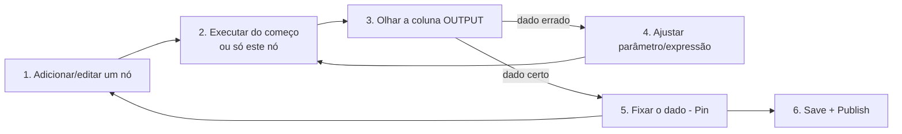

# 04 · Como começar — do ambiente pronto ao primeiro resultado

`Nível: iniciante` · `Testado em: n8n 2.36.9, em 01/09/2026`

---

Este arquivo assume que você já concluiu o [checklist do 03](03-instalacao.md#14-checklist-ambiente-pronto)
e tem o n8n respondendo em <http://localhost:5678>. Nada de instalação aqui.

Objetivo: em **30 minutos**, um webhook seu recebendo dados, validando e respondendo.
E, mais importante, entender o **ciclo de trabalho** que você vai repetir milhares de vezes.

---

## 1. Primeiro acesso — criar o dono da instância

Abra <http://localhost:5678>. Na primeira vez, aparece a tela **Set up owner account**.

Preencha e-mail, nome, sobrenome e senha.

> **Isso não é uma conta n8n.io.** É um usuário no **seu** banco de dados. Ninguém
> além de você vê. Se esquecer a senha, dá para resetar pela linha de comando:
> `n8n user-management:reset` (⚠️ isso remove os usuários e devolve a instância ao
> estado inicial — os workflows ficam).

Verificação de que deu certo:

```bash
curl -s http://localhost:5678/healthz
# esperado: {"status":"ok"}
```
E, na tela, você cai no **Overview**, com a lista (vazia) de workflows.

---

## 2. O tour de 60 segundos pela interface

```
┌────────────────────────────────────────────────────────────────┐
│  [Overview]  Personal   Projects          [+ Create Workflow]  │  ← navegação
├───────────┬────────────────────────────────────────────────────┤
│ Workflows │                                                    │
│ Creden-   │        C A N V A S                                 │
│  tials    │        (aqui você arrasta os nós)                  │
│ Executions│                                                    │
│ Data      │                                                    │
│  tables   │                                                    │
├───────────┴────────────────────────────────────────────────────┤
│  Painel inferior: INPUT | parâmetros do nó | OUTPUT            │  ← ao abrir um nó
└────────────────────────────────────────────────────────────────┘
```

Cinco lugares que importam:

| Onde | Para quê |
|---|---|
| **Workflows** | Seus fluxos |
| **Credentials** | Segredos, criados uma vez e reusados |
| **Executions** | O histórico. **É aqui que você depura.** |
| **Canvas** | O desenho |
| **Painel do nó** (duplo clique em um nó) | Três colunas: dados que **entram**, o que o nó **faz**, dados que **saem** |

**A tela de três colunas do nó é o coração da ferramenta.** Você vê o dado real
entrando à esquerda e o dado real saindo à direita, a cada teste. Aprenda a
confiar nela em vez de adivinhar.

---

## 3. Hello World significativo em 6 passos

Não vamos fazer um "hello world" inútil. Vamos fazer um endpoint HTTP que recebe
um pedido, valida e responde — que é literalmente o esqueleto de metade dos fluxos
de produção.

### Passo 1 — criar o workflow

**Overview → Create Workflow**. Dê um nome no topo: `Eco de pedidos`.

### Passo 2 — o gatilho

Clique no `+` grande → busque **Webhook** → selecione.
No painel do nó:

| Campo | Valor |
|---|---|
| HTTP Method | `POST` |
| Path | `eco` |
| Respond | `Using 'Respond to Webhook' Node` |

Feche o painel (`←` no canto ou `Esc`).

> **Duas URLs.** O painel mostra *Test URL* e *Production URL*. A de teste
> (`/webhook-test/eco`) só escuta enquanto você está com o editor esperando; a de
> produção (`/webhook/eco`) só funciona com o workflow **publicado/ativo**. Confundir
> as duas é o erro nº 1 de todo iniciante.

### Passo 3 — validar com o nó Code

`+` depois do Webhook → busque **Code** → modo **Run Once for All Items**.
Apague o exemplo e cole:

```javascript
// $json aqui é o item de saída do Webhook: { headers, params, query, body, webhookUrl, executionMode }
const body = $json.body ?? {};
const erros = [];

if (!body.cliente)              erros.push('cliente obrigatorio');
if (typeof body.valor !== 'number') erros.push('valor deve ser numero');

return [{
  json: {
    ok: erros.length === 0,
    erros,
    recebido: body,
  },
}];
```

> Três coisas para notar:
> 1. **`return` devolve sempre um array de itens**, e cada item é `{ json: {...} }`.
> 2. O corpo da requisição fica em **`$json.body`**, não em `$json` — o webhook
>    entrega o envelope HTTP inteiro.
> 3. Nada de `require('fs')` nem de chamadas HTTP aqui: o Code node não acessa
>    disco nem rede. Para isso existem os nós próprios ([17](17-code-node-e-task-runners.md)).

### Passo 4 — responder

`+` → busque **Respond to Webhook**.

| Campo | Valor |
|---|---|
| Respond With | `JSON` |
| Response Body | `{{ JSON.stringify($json) }}` (ligue o modo *Expression* no campo) |

### Passo 5 — testar

1. Clique em **Execute workflow** (ou *Test workflow*). O nó Webhook fica
   *aguardando* — é a URL de **teste** escutando.
2. Em outro terminal:

```bash
curl -s -X POST http://localhost:5678/webhook-test/eco \
  -H 'Content-Type: application/json' \
  -d '{"cliente":"Ana","valor":150}'
```

**Saída esperada** (esta é uma saída real, obtida em n8n 2.36.9):

```json
{"ok":true,"erros":[],"recebido":{"cliente":"Ana","valor":150}}
```

Na tela, os três nós ficam com um ✅ e você pode clicar em cada um para ver o que
entrou e o que saiu.

### Passo 6 — publicar e testar em produção

Clique em **Save** e depois em **Publish** (no n8n 2.x são dois atos distintos —
veja [10-fundamentos.md](10-fundamentos.md#63-save--publish-mudança-do-n8n-20)).
Agora a URL de produção está no ar, e funciona **sem** o editor aberto:

```bash
curl -s -X POST http://localhost:5678/webhook/eco \
  -H 'Content-Type: application/json' \
  -d '{"cliente":"Ana","valor":150}'
# saída real: {"ok":true,"erros":[],"recebido":{"cliente":"Ana","valor":150}}

curl -s -X POST http://localhost:5678/webhook/eco \
  -H 'Content-Type: application/json' \
  -d '{"valor":"muito"}'
# saída real: {"ok":false,"erros":["cliente obrigatorio","valor deve ser numero"],"recebido":{"valor":"muito"}}
```

Pronto. Você tem uma API. Em seis passos.

---

## 4. O ciclo de trabalho do dia a dia

Este é o loop que você vai repetir para sempre. Vale mais que qualquer tutorial:



Quatro atalhos que multiplicam sua velocidade:

| Recurso | Onde | Por que importa |
|---|---|---|
| **Execute step / Test step** | Botão no painel do nó | Roda **só aquele nó** com o dado que já está na entrada. Você não refaz o fluxo inteiro a cada tentativa |
| **Pin data** (📌) | Painel de OUTPUT de um nó | Congela o dado de saída. O nó deixa de chamar a API de verdade e devolve sempre aquele dado. **Desenvolver integração sem gastar chamada** |
| **Arrastar e soltar campo** | Da coluna INPUT para um parâmetro | Cria a expressão `{{ $json.campo }}` sozinho, com o caminho certo |
| **Copiar/colar nós** | `Ctrl+C`/`Ctrl+V` — inclusive entre navegador e n8n | Nós no clipboard são **JSON**. Você pode colar um fluxo inteiro de um post da comunidade direto no canvas |

> **O `Pin data` é o recurso que separa quem sofre de quem produz.** Fixe a saída
> do gatilho e do primeiro nó de API, e desenvolva o resto do fluxo em segundos,
> sem tocar em nenhum sistema externo. Não esqueça de **despinar antes de publicar**
> — dado fixado vale também em produção nas versões em que ele fica marcado no fluxo.

---

## 5. Onde depurar quando der errado

**Executions** (menu à esquerda). Cada linha é uma rodada. Abra uma que falhou:
o canvas reaparece com os dados **daquela** execução, e o nó que quebrou está
marcado em vermelho com a mensagem.

Três ações que resolvem 90% dos casos:

1. Abra o nó vermelho e leia a coluna **INPUT** — quase sempre o dado que chegou
   não era o que você imaginou.
2. Use o botão **Retry** para reexecutar a partir do ponto de falha (⚠️ se o fluxo
   não for idempotente, isso duplica efeitos — veja [18](18-erros-e-confiabilidade.md)).
3. Copie o JSON do item problemático e cole como *Pin data* no ambiente de teste
   para reproduzir.

---

## 6. Os cinco erros que todo iniciante comete no **uso** (não na instalação)

| # | Sintoma | Causa | Correção |
|---|---|---|---|
| 1 | `curl` no webhook devolve **404** | Usou a URL de **teste** sem clicar em *Execute workflow*, ou a de **produção** com o fluxo despublicado | Confira qual URL e se o fluxo está publicado/ativo |
| 2 | "Só processou o primeiro registro" | Você tem **um item com um array dentro**, não N itens | Use o nó **Split Out** ([10](10-fundamentos.md#42-a-consequência-prática-nº-2-um-item-com-uma-lista--uma-lista-de-itens)) |
| 3 | Expressão devolve `undefined` | Caminho errado: o dado do webhook está em `$json.body.x`, não `$json.x` | Arraste o campo da coluna INPUT em vez de digitar |
| 4 | `Can't determine which item to use` / `Paired item data ... unavailable` | Um nó (geralmente Code) mudou a quantidade de itens sem informar a correspondência | Ver [12-o-modelo-de-dados.md](12-o-modelo-de-dados.md#4-item-linking) |
| 5 | Agendamento roda em horário errado | `GENERIC_TIMEZONE` não configurado; o padrão é **UTC** | Defina a variável ([03](03-instalacao.md#62-as-variáveis-do-n8n)) e confira em *Settings → Workflow → Timezone* |

Bônus, o sexto: **esquecer `Publish`**. Você edita, testa, funciona, fecha o
navegador — e a produção continua rodando a versão antiga, porque `Save` não publica.

---

## 7. Quatro exercícios de 10 minutos (faça antes de seguir)

1. **Enriquecer**: acrescente ao fluxo um nó **Edit Fields (Set)** que adicione
   `recebidoEm` com `{{ $now.toISO() }}`.
2. **Ramificar**: troque o Code por um nó **IF** que separe `valor >= 100` de
   `valor < 100`, e responda mensagens diferentes.
3. **Chamar o mundo**: crie um fluxo com **Manual Trigger → HTTP Request** para
   `https://api.github.com/repos/n8n-io/n8n` e veja o JSON chegar.
4. **Agendar**: crie um fluxo com **Schedule Trigger** a cada minuto que só faça
   um `Edit Fields` com a hora. Publique, espere três minutos, e olhe em
   **Executions** que ele rodou sozinho. Depois **despublique** — senão ele roda
   para sempre e enche o seu banco.

Se os quatro funcionaram, você já sabe o suficiente para o
[06-exemplos.md](06-exemplos.md) e o [07-projeto-modelo/](07-projeto-modelo/README.md).

---

## 8. Para onde ir agora

| Se você quer... | Vá para |
|---|---|
| Entender de verdade o que está acontecendo | [10-fundamentos.md](10-fundamentos.md) |
| Uma referência para consultar enquanto constrói | [05-manual-de-uso.md](05-manual-de-uso.md) |
| Receitas prontas para copiar | [06-exemplos.md](06-exemplos.md) |
| Um projeto inteiro, do começo ao fim | [07-projeto-modelo/](07-projeto-modelo/README.md) |
| Não cair nas armadilhas clássicas | [75-armadilhas.md](75-armadilhas.md) |

---

## Autoteste

1. Qual a diferença entre a URL de teste e a de produção de um webhook? Quando
   cada uma responde?
2. No nó Code, onde está o corpo da requisição HTTP que chegou pelo webhook?
3. O que o `return` de um nó Code precisa devolver, exatamente?
4. Para que serve o **Pin data**, e qual o cuidado antes de publicar?
5. Você editou e salvou um fluxo em produção. Ele mudou? Por quê?
6. Um fluxo processou só o primeiro registro de uma lista. Qual é o diagnóstico
   mais provável e qual nó resolve?
7. Onde você olha primeiro quando uma execução falha?
8. Por que o botão **Retry** pode ser perigoso?

---

*Anterior: [03-instalacao.md](03-instalacao.md) · Próximo: [05-manual-de-uso.md](05-manual-de-uso.md)*
