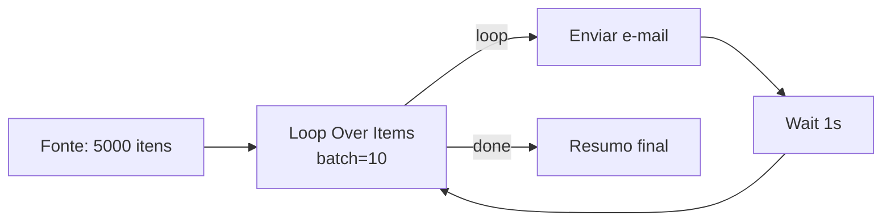
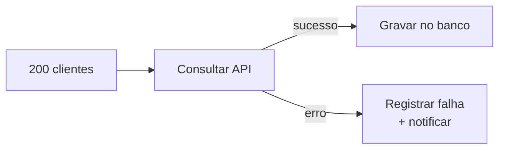
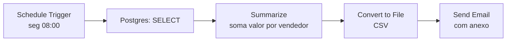
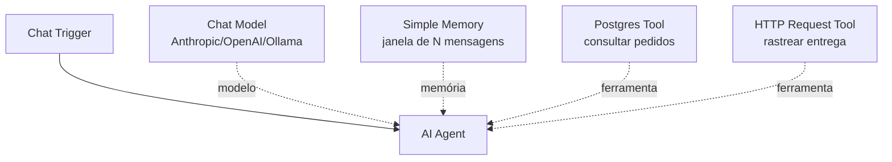
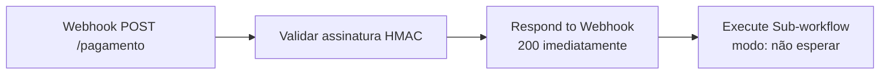
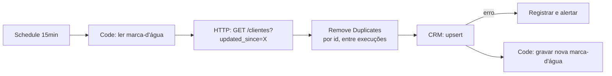

# 06 · Exemplos — do trivial ao de produção

`Nível: iniciante → avançado` · `Testado em: n8n 2.36.9, em 01/09/2026`

---

**Como usar este arquivo:** cada exemplo traz *problema → solução → explicação*.
Onde há JSON de workflow, você pode **selecionar, copiar e colar direto no canvas
do n8n** (`Ctrl+V` com o canvas em foco) — nós no clipboard são JSON.

Os exemplos 1, 2 e 4 foram **executados de verdade** na versão 2.36.9 e as saídas
mostradas são reais. Os demais são código completo, sem `...`, mas dependem de
serviços externos que você precisa ter.

---

## Exemplo 1 — Validar e responder um webhook (o esqueleto de tudo)

**Problema.** Expor um endpoint que recebe um pedido em JSON, valida e devolve
`200` ou a lista de erros.

**Solução (workflow completo, colável):**

```json
{
  "nodes": [
    { "parameters": { "httpMethod": "POST", "path": "eco", "responseMode": "responseNode", "options": {} },
      "id": "aaaaaaaa-0000-0000-0000-000000000001", "name": "Webhook",
      "type": "n8n-nodes-base.webhook", "typeVersion": 2, "position": [0, 0] },
    { "parameters": { "jsCode": "const body = $json.body ?? {};\nconst erros = [];\nif (!body.cliente) erros.push('cliente obrigatorio');\nif (typeof body.valor !== 'number') erros.push('valor deve ser numero');\nreturn [{ json: { ok: erros.length === 0, erros, recebido: body } }];" },
      "id": "aaaaaaaa-0000-0000-0000-000000000002", "name": "Validar",
      "type": "n8n-nodes-base.code", "typeVersion": 2, "position": [220, 0] },
    { "parameters": { "respondWith": "json", "responseBody": "={{ JSON.stringify($json) }}", "options": { "responseCode": 200 } },
      "id": "aaaaaaaa-0000-0000-0000-000000000003", "name": "Responder",
      "type": "n8n-nodes-base.respondToWebhook", "typeVersion": 1.1, "position": [440, 0] }
  ],
  "connections": {
    "Webhook": { "main": [[{ "node": "Validar", "type": "main", "index": 0 }]] },
    "Validar": { "main": [[{ "node": "Responder", "type": "main", "index": 0 }]] }
  }
}
```

**Teste e saída real:**

```bash
curl -s -X POST http://localhost:5678/webhook/eco -H 'Content-Type: application/json' \
  -d '{"cliente":"Ana","valor":150}'
# {"ok":true,"erros":[],"recebido":{"cliente":"Ana","valor":150}}

curl -s -X POST http://localhost:5678/webhook/eco -H 'Content-Type: application/json' \
  -d '{"valor":"muito"}'
# {"ok":false,"erros":["cliente obrigatorio","valor deve ser numero"],"recebido":{"valor":"muito"}}
```

**Explicação.** `responseMode: responseNode` transfere a responsabilidade de
responder para o nó **Respond to Webhook**, em vez de devolver automaticamente
o resultado do último nó. Isso permite código de status e corpo à sua escolha, e
permite responder **antes** de terminar o trabalho pesado (veja o exemplo 11).
Note `$json.body`: o webhook entrega o envelope HTTP inteiro, não só o corpo.

---

## Exemplo 2 — "Um item com lista" vs. "lista de itens" (o mal-entendido nº 1)

**Problema.** Uma API devolveu um pedido com três itens dentro de um array. Você
precisa processar **cada** item separadamente e depois juntar tudo de novo.

**Solução:**

```json
{
  "nodes": [
    { "parameters": {}, "id": "b0000000-0000-0000-0000-000000000001", "name": "Manual",
      "type": "n8n-nodes-base.manualTrigger", "typeVersion": 1, "position": [0,0] },
    { "parameters": { "jsCode": "return [{ json: { pedido: 'P-1', itens: [ {sku:'A', qtd:2, preco:10}, {sku:'B', qtd:1, preco:50}, {sku:'C', qtd:3, preco:5} ] } }];" },
      "id": "b0000000-0000-0000-0000-000000000002", "name": "Um item com array",
      "type": "n8n-nodes-base.code", "typeVersion": 2, "position": [200,0] },
    { "parameters": { "fieldToSplitOut": "itens", "options": {} },
      "id": "b0000000-0000-0000-0000-000000000003", "name": "Split Out",
      "type": "n8n-nodes-base.splitOut", "typeVersion": 1, "position": [400,0] },
    { "parameters": { "jsCode": "return $input.all().map(i => ({ json: { ...i.json, total: i.json.qtd * i.json.preco } }));" },
      "id": "b0000000-0000-0000-0000-000000000004", "name": "Calcular total",
      "type": "n8n-nodes-base.code", "typeVersion": 2, "position": [600,0] },
    { "parameters": { "aggregate": "aggregateAllItemData", "options": {} },
      "id": "b0000000-0000-0000-0000-000000000005", "name": "Aggregate",
      "type": "n8n-nodes-base.aggregate", "typeVersion": 1, "position": [800,0] }
  ],
  "connections": {
    "Manual": { "main": [[{ "node": "Um item com array", "type": "main", "index": 0 }]] },
    "Um item com array": { "main": [[{ "node": "Split Out", "type": "main", "index": 0 }]] },
    "Split Out": { "main": [[{ "node": "Calcular total", "type": "main", "index": 0 }]] },
    "Calcular total": { "main": [[{ "node": "Aggregate", "type": "main", "index": 0 }]] }
  }
}
```

**Saída real, nó a nó** (executada com `n8n execute --id=... --rawOutput`):

```
Um item com array => 1 item : [{"pedido":"P-1","itens":[{...A},{...B},{...C}]}]
Split Out         => 3 itens: [{"sku":"A","qtd":2,"preco":10}, {"sku":"B",...}, {"sku":"C",...}]
Calcular total    => 3 itens: [{"sku":"A","qtd":2,"preco":10,"total":20}, {...,"total":50}, {...,"total":15}]
Aggregate         => 1 item : [{"data":[{...A,total:20},{...B,total:50},{...C,total:15}]}]
```

**Explicação.** Repare na coluna de contagem: `1 → 3 → 3 → 1`. É esse número que
você precisa acompanhar mentalmente em todo fluxo. Sem o **Split Out**, o nó
"Calcular total" rodaria uma vez e você teria de escrever o laço na mão — e, pior,
qualquer nó de API depois dele faria **uma** chamada em vez de três.

---

## Exemplo 3 — Buscar uma API paginada sem escrever laço

**Problema.** Uma API devolve 100 registros por página e você quer todos.

**Solução.** Nó **HTTP Request**, seção *Options → Pagination*:

| Campo | Valor |
|---|---|
| Pagination Mode | `Update a Parameter in Each Request` |
| Type | `Query` |
| Name | `page` |
| Value | `{{ $pageCount + 1 }}` |
| Pagination Complete When | `Receive an Empty Response` |
| Limit Pages Fetched | ligado, `Max Pages: 50` |

**Explicação.** `$pageCount` é uma variável que só existe dentro do contexto de
paginação do nó (base 0). O modo alternativo — `Response Contains Next URL` — usa
`{{ $response.body.next }}` e é o certo para APIs com cursor.
**Sempre** limite o número de páginas: uma API que nunca devolve resposta vazia
transforma seu fluxo em um laço infinito com custo por requisição.

---

## Exemplo 4 — Deduplicação idempotente com estado persistente

**Problema.** Um webhook pode ser reenviado pelo provedor (é o comportamento
normal de quase todos). Você não pode processar o mesmo evento duas vezes.

**Solução (node Code, modo *Run Once for All Items*):**

```javascript
// Guarda os últimos 1000 IDs já vistos, entre execuções.
// ATENÇÃO: staticData só persiste em execução de PRODUÇÃO (fluxo publicado).
const estado = $getWorkflowStaticData('global');
estado.vistos = estado.vistos ?? [];

const novos = [];
for (const item of $input.all()) {
  const id = item.json.body?.evento_id;
  if (!id) {
    // sem id não dá para deduplicar: falhe alto em vez de aceitar em silêncio
    throw new Error('evento sem evento_id — impossível garantir idempotência');
  }
  if (!estado.vistos.includes(id)) {
    estado.vistos.push(id);
    novos.push(item);
  }
}

// mantém a janela limitada para não crescer sem fim
if (estado.vistos.length > 1000) {
  estado.vistos = estado.vistos.slice(-1000);
}

return novos;
```

**Explicação.** Três decisões importantes aqui:
1. **Falhar quando não há chave de idempotência** é melhor que processar duas vezes.
   Erro visível > corrupção silenciosa.
2. A janela limitada evita que o `staticData` cresça indefinidamente (ele é salvo
   no banco a cada execução).
3. **Alternativa em produção séria:** o nó **Remove Duplicates** com escopo
   *across executions*, ou uma constraint `UNIQUE` no banco. `staticData` não é
   seguro contra concorrência — com dois workers processando ao mesmo tempo,
   dois eventos iguais podem passar. Ver [18-erros-e-confiabilidade.md](18-erros-e-confiabilidade.md).

---

## Exemplo 5 — Loop com lote e pausa (respeitar limite de taxa)

**Problema.** Enviar 5.000 e-mails numa API que aceita 10 por segundo.

**Solução.** Nó **Loop Over Items (Split in Batches)**, `Batch Size: 10`, com o
fio de saída do último nó **voltando** para a entrada do Loop:



**Explicação.** O nó Loop tem **duas saídas**: `done` (quando acabou) e `loop`
(o lote atual). O fio de volta é o que cria a repetição — sem ele, o Loop roda
uma vez e para. A saída `done` só dispara no fim.

**Alternativa melhor, quase sempre:** as opções **Batching** do próprio nó
HTTP Request (*Items per Batch* + *Batch Interval*) fazem o mesmo sem poluir o
canvas. Use o Loop quando precisar de lógica **entre** os lotes.

---

## Exemplo 6 — Tratar erro por item, sem derrubar o fluxo

**Problema.** De 200 clientes, 3 têm CNPJ inválido e a API de consulta devolve 422.
Você quer processar os 197 e registrar os 3.

**Solução.** No nó de consulta: *Settings → On Error → **Continue (using error output)***.
O nó ganha uma **segunda saída** (vermelha):



E, no ramo de erro, um Code para extrair a mensagem útil:

```javascript
return $input.all().map(i => ({
  json: {
    item_original: i.json,
    erro: i.error?.message ?? 'desconhecido',
    status: i.error?.httpCode ?? null,
    quando: $now.toISO(),
  },
}));
```

**Explicação.** Este é **o** padrão que separa fluxo de brinquedo de fluxo de
produção. O padrão de fábrica (`Stop workflow`) faz a execução inteira falhar no
item 4 de 200 — e você fica sem saber o que foi processado. Ver
[18-erros-e-confiabilidade.md](18-erros-e-confiabilidade.md).

---

## Exemplo 7 — Fluxo de erro global (`Error Workflow`)

**Problema.** Você quer ser avisado sempre que **qualquer** fluxo falhar, com
link direto para a execução.

**Solução.** Crie um fluxo chamado `Alerta de falhas`:

```json
{
  "nodes": [
    { "parameters": {}, "id": "c0000000-0000-0000-0000-000000000001", "name": "Error Trigger",
      "type": "n8n-nodes-base.errorTrigger", "typeVersion": 1, "position": [0,0] },
    { "parameters": { "jsCode": "const e = $json;\nreturn [{ json: {\n  texto: `🚨 Falhou: ${e.workflow?.name}\\nNó: ${e.execution?.lastNodeExecuted}\\nErro: ${e.execution?.error?.message}\\nExecução: ${e.execution?.url}`\n} }];" },
      "id": "c0000000-0000-0000-0000-000000000002", "name": "Formatar",
      "type": "n8n-nodes-base.code", "typeVersion": 2, "position": [220,0] }
  ],
  "connections": { "Error Trigger": { "main": [[{ "node": "Formatar", "type": "main", "index": 0 }]] } }
}
```

Depois, ligue um nó de notificação (Slack, Telegram, e-mail) e, **em cada fluxo
de produção**, vá em *Settings → Error Workflow* e escolha este.

**Explicação.** O `Error Trigger` recebe um objeto com `workflow` (id e nome),
`execution` (id, url, `lastNodeExecuted`, `error`) e o modo. O `execution.url` é
o que torna o alerta útil: um clique e você está olhando os dados exatos da falha.
**Sem Error Workflow configurado, falhas em produção são silenciosas.**

---

## Exemplo 8 — Relatório agendado (Schedule + Summarize + arquivo)

**Problema.** Toda segunda às 8h, resumir as vendas da semana e enviar um CSV.

**Solução:**



Configuração do **Schedule Trigger**: *Trigger Interval* `Custom (Cron)`,
expressão `0 8 * * 1` (minuto hora dia mês dia-da-semana).

Consulta do nó Postgres (modo *Execute Query*):

```sql
SELECT vendedor, data, valor
FROM vendas
WHERE data >= CURRENT_DATE - INTERVAL '7 days'
ORDER BY vendedor, data;
```

**Summarize:** *Fields to Split By* = `vendedor`; *Aggregation* = `sum` no campo `valor`.

**Explicação.** Três coisas que sempre esquecem:
1. O cron usa o fuso de `GENERIC_TIMEZONE` (ou o do workflow). Em UTC, `0 8 * * 1`
   é 5h da manhã em Brasília.
2. **Nunca interpole valores na SQL por expressão** — use os parâmetros de query do
   nó (`$1`, `$2`). Interpolar é injeção de SQL. Ver [22-seguranca.md](22-seguranca.md).
3. O `Convert to File` gera o **binário**; o nó de e-mail o anexa referenciando o
   nome da propriedade binária (`data`, por padrão).

---

## Exemplo 9 — Agente de IA com ferramentas (padrão atual)

**Problema.** Um assistente de chat que consulta seus pedidos e responde em português.

**Solução:**



**System message do agente:**

```
Você é o assistente de pedidos da Acme.
Responda em português do Brasil, de forma curta e direta.
Use a ferramenta "consultar_pedidos" sempre que a pergunta envolver
um número de pedido. Se a ferramenta não retornar nada, diga que não
encontrou — nunca invente um status.
```

**Explicação.** Os fios pontilhados **não são fios de dados**: são portas de
capacidade (modelo, memória, ferramenta, parser). É outra topologia dentro do
mesmo canvas, e confundir as duas é o erro clássico de quem chega na parte de IA.

Os modos antigos de agente (Conversational, ReAct, Plan-and-Execute, OpenAI
Functions, SQL Agent) **são removidos no n8n 3.0** — se você achar um tutorial de
2024 ensinando a escolher entre eles, ele está desatualizado. Ver
[24-ia-e-agentes.md](24-ia-e-agentes.md).

---

## Exemplo 10 — Sub-workflow reutilizável

**Problema.** Cinco fluxos precisam normalizar telefone brasileiro. Você não quer
copiar o mesmo Code cinco vezes.

**Solução.** Fluxo `util-normalizar-telefone`:

```json
{
  "nodes": [
    { "parameters": { "workflowInputs": { "values": [ { "name": "telefone" } ] } },
      "id": "d0000000-0000-0000-0000-000000000001", "name": "Quando executado por outro fluxo",
      "type": "n8n-nodes-base.executeWorkflowTrigger", "typeVersion": 1.1, "position": [0,0] },
    { "parameters": { "jsCode": "return $input.all().map(i => {\n  const so = String(i.json.telefone ?? '').replace(/\\D/g, '');\n  const com55 = so.startsWith('55') ? so : '55' + so;\n  const valido = com55.length === 12 || com55.length === 13;\n  return { json: { original: i.json.telefone, e164: valido ? '+' + com55 : null, valido } };\n});" },
      "id": "d0000000-0000-0000-0000-000000000002", "name": "Normalizar",
      "type": "n8n-nodes-base.code", "typeVersion": 2, "position": [220,0] }
  ],
  "connections": { "Quando executado por outro fluxo": { "main": [[{ "node": "Normalizar", "type": "main", "index": 0 }]] } }
}
```

Nos outros fluxos, use **Execute Sub-workflow** apontando para ele.

**Explicação.** O nó pai tem duas maneiras de chamar: *Run once with all items*
(uma execução, todos os itens — rápido) ou *Run once for each item* (N execuções —
lento, mas isola falhas). O padrão é o primeiro; escolha conscientemente.

Em *Settings → Caller policy* do sub-workflow, restrinja quem pode chamá-lo.
Sub-workflow chamável por qualquer um é uma porta lateral de segurança.

---

## Exemplo 11 — Caso de produção: webhook rápido + processamento assíncrono

**Problema real.** O gateway de pagamento exige resposta em **menos de 5 segundos**,
senão considera falha e reenvia. Seu processamento leva 30 segundos.

**Solução.** Divida em dois fluxos.

**Fluxo A — recebedor (responde em milissegundos):**



Validação da assinatura, no Code:

```javascript
const crypto = require('crypto');
const segredo = $env.GATEWAY_WEBHOOK_SECRET;
const bruto  = JSON.stringify($json.body);
const esperado = crypto.createHmac('sha256', segredo).update(bruto).digest('hex');
const recebido = $json.headers['x-signature'];

// comparação em tempo constante — evita ataque de temporização
const ok = recebido && crypto.timingSafeEqual(
  Buffer.from(esperado), Buffer.from(String(recebido)));
if (!ok) throw new Error('assinatura inválida');

return [{ json: $json.body }];
```

**Fluxo B — processador:** faz o trabalho pesado, com retry e error output.

**Explicação.** Este é o padrão *ack-then-process*, e é a diferença entre uma
integração de pagamento que funciona e uma que gera cobranças duplicadas.
Três detalhes que só a prática ensina:
- Responder **antes** de processar significa que você aceitou a responsabilidade:
  se o fluxo B falhar, ninguém vai reenviar. **Fluxo B precisa de Error Workflow.**
- `timingSafeEqual` explode se os buffers tiverem tamanhos diferentes — em código
  real, compare os tamanhos antes.
- O segredo vem de `$env`, não escrito no fluxo. Se `N8N_BLOCK_ENV_ACCESS_IN_NODE`
  estiver ligado (o correto em instância multiusuário), use uma **credencial** em vez disso.

---

## Exemplo 12 — Caso de produção: sincronização incremental com marca-d'água

**Problema real.** Sincronizar clientes de um ERP para um CRM a cada 15 minutos,
sem reprocessar tudo e sem perder registros.

**Solução:**



```javascript
// nó "ler marca-d'água"
const estado = $getWorkflowStaticData('global');
// primeira execução: 24h atrás; e 5 min de sobreposição para tolerar relógios diferentes
const desde = estado.ultimaSync ?? $now.minus({ hours: 24 }).toISO();
return [{ json: { desde } }];
```

```javascript
// nó "gravar nova marca-d'água" — SÓ depois do upsert bem-sucedido
const estado = $getWorkflowStaticData('global');
estado.ultimaSync = $now.minus({ minutes: 5 }).toISO(); // sobreposição proposital
return $input.all();
```

**Explicação.** Quatro decisões de engenharia embutidas:
1. **Sobreposição de 5 minutos** de propósito: relógios do ERP e do n8n não são
   iguais, e registros salvos exatamente na fronteira se perderiam. Sobrepor e
   deduplicar é mais seguro que confiar em relógio alheio.
2. **A marca-d'água só avança depois do sucesso.** Se avançar antes e o upsert
   falhar, aqueles registros nunca mais são vistos. Esse é o bug clássico de
   sincronização incremental, e ele é silencioso.
3. **`Remove Duplicates` entre execuções** absorve a sobreposição.
4. **Upsert, não insert.** Reprocessar precisa ser inofensivo (idempotência).

---

## Exemplo 13 — Consultar JSON aninhado sem `for` aninhado

**Problema.** Extrair todos os e-mails de contatos com papel `financeiro`, de uma
estrutura profunda.

**Solução (expressão):**

```
{{ $jmespath($json, "empresas[*].contatos[?papel=='financeiro'].email[]") }}
```

**Explicação.** `$jmespath` implementa a linguagem de consulta
[JMESPath](https://jmespath.org/), a mesma do `aws-cli`. Vale aprender a sintaxe
básica: substitui laços aninhados por uma linha legível. Só existe **no editor de
expressões**, não no node Code — lá, use `.filter().map()` normal.

---

## Exemplo 14 — Chamar seu fluxo como uma ferramenta MCP

**Problema.** Você quer que um assistente de IA externo (Claude, um agente próprio)
possa chamar seus fluxos como ferramentas.

**Solução.** Nó **MCP Server Trigger** no início do fluxo. Ele expõe uma URL que
fala o protocolo MCP (*Model Context Protocol*); cada nó marcado como ferramenta
naquele fluxo vira uma ferramenta anunciada.

**Explicação.** MCP é o padrão de fato para expor ferramentas a modelos de
linguagem, e a adoção pelo n8n em 2025 foi rápida. Do outro lado, o nó
**MCP Client** deixa o AI Agent do n8n consumir ferramentas de servidores MCP
externos. Isso muda o papel do n8n: de "ferramenta que chama IA" para
"plataforma que **serve** capacidades para IA". Ver
[24-ia-e-agentes.md](24-ia-e-agentes.md) e [65-estado-da-arte.md](65-estado-da-arte.md).

> **Aviso de segurança, e não é teórico:** um servidor MCP exposto sem autenticação
> dá a qualquer agente do mundo acesso a executar seus fluxos — com as suas
> credenciais. Autentique, restrinja, e nunca exponha um MCP Server Trigger na
> internet aberta.

---

## Autoteste

1. No exemplo 1, por que o corpo está em `$json.body` e não em `$json`?
2. No exemplo 2, qual é a sequência de contagens de itens? Por que ela importa?
3. Por que limitar o número de páginas na paginação automática?
4. Cite duas razões pelas quais `$getWorkflowStaticData` não é seguro para
   deduplicação em produção com múltiplos workers.
5. Qual é a diferença entre as saídas `done` e `loop` do nó Loop Over Items?
6. O que muda ao configurar *On Error → Continue (using error output)*?
7. Por que o padrão *ack-then-process* exige obrigatoriamente um Error Workflow?
8. Na sincronização incremental, por que a marca-d'água só pode avançar após o
   sucesso — e por que existe a sobreposição de 5 minutos?
9. Por que interpolar valor em SQL por expressão é perigoso?
10. Qual o risco concreto de expor um MCP Server Trigger sem autenticação?

---

*Anterior: [05-manual-de-uso.md](05-manual-de-uso.md) · Próximo: [07-projeto-modelo/](07-projeto-modelo/README.md)*
