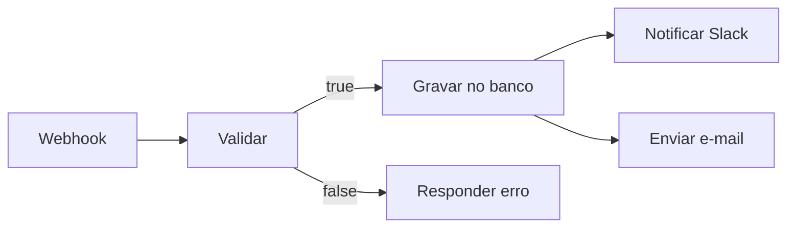
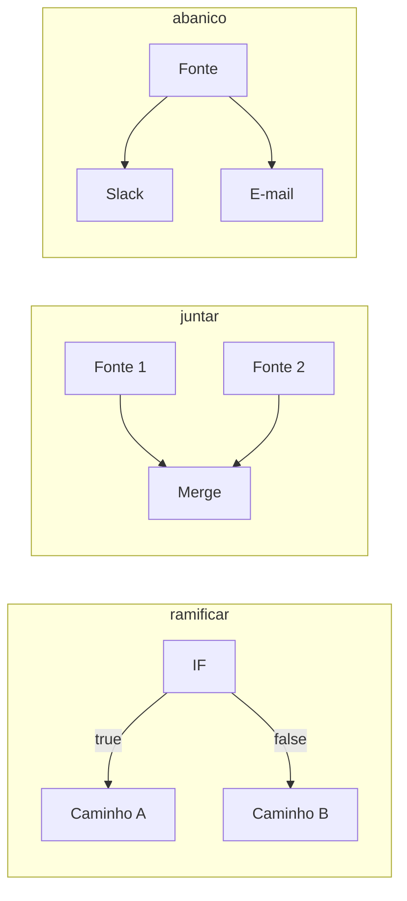

# 10 · Fundamentos — o vocabulário e os modelos mentais

`Nível: iniciante → intermediário` · `Atualizado em: 01/09/2026`

---

Este é o arquivo mais importante do curso. Tudo o que vem depois assume que estes
sete conceitos estão firmes. Leia com calma; se algum ficar nebuloso, volte aqui
antes de seguir.

---

## 1. Os sete conceitos

```
     WORKFLOW  (o desenho inteiro)
        │
        ├── NODE (estação)  ── NODE ── NODE
        │      │
        │      └── PARÂMETROS (o que a estação faz)
        │             └── EXPRESSÕES ({{ ... }} — valores calculados)
        │      └── CREDENCIAL (como a estação se autentica)
        │
        ├── CONEXÃO (o fio: quem alimenta quem)
        │
        ├── ITEM (o pacote de dados que anda pelo fio)
        │
        └── EXECUTION (uma rodada completa do desenho)
```

| Termo | Definição formal | Em uma frase |
|---|---|---|
| **Workflow** | Grafo dirigido de nós conectados, persistido como JSON | O desenho |
| **Node** | Unidade de trabalho: recebe itens, produz itens | A estação |
| **Conexão** | Aresta dirigida entre a saída de um nó e a entrada de outro | O fio |
| **Item** | Objeto `{ json: {...}, binary?: {...} }` | O pacote |
| **Execution** | Uma rodada do workflow, com todos os dados de entrada e saída de cada nó | A rodada |
| **Credencial** | Segredo cifrado, guardado separado do workflow | A chave |
| **Trigger** | Nó especial que inicia execuções | O interruptor |

---

## 2. Workflow — o desenho é um grafo, não uma lista

Um workflow **não** é uma sequência linear de passos. É um **grafo dirigido**:
um nó pode ter várias saídas, várias entradas, e vários nós podem rodar em ramos
paralelos.



Duas propriedades importantes:

1. **É acíclico por construção do editor** — você não consegue ligar um nó a um
   ancestral dele. Laços existem, mas com nós próprios (`Loop Over Items`) ou
   com sub-workflows, não com fios em círculo. *Por quê?* Porque um ciclo em um
   grafo de fluxo de dados exige uma semântica de terminação (quando parar?) que
   o modelo simples "cada nó roda uma vez" não tem. Ver [60-teoria-avancada.md](60-teoria-avancada.md).
2. **É um arquivo JSON.** Você pode ler, versionar, gerar por programa e mandar
   por e-mail. Isso é mais poderoso do que parece: um workflow é dado, não código
   compilado. Veja [23-ciclo-de-vida-e-versionamento.md](23-ciclo-de-vida-e-versionamento.md).

O JSON de um workflow mínimo, por dentro:

```json
{
  "name": "Meu primeiro fluxo",
  "nodes": [
    {
      "parameters": { "path": "pedidos", "httpMethod": "POST" },
      "type": "n8n-nodes-base.webhook",
      "typeVersion": 2,
      "position": [0, 0],
      "id": "a1b2c3d4-0000-0000-0000-000000000001",
      "name": "Webhook"
    },
    {
      "parameters": { "assignments": { "assignments": [
          { "name": "recebido", "value": "={{ $json.body }}", "type": "object" } ] } },
      "type": "n8n-nodes-base.set",
      "typeVersion": 3.4,
      "position": [220, 0],
      "id": "a1b2c3d4-0000-0000-0000-000000000002",
      "name": "Edit Fields"
    }
  ],
  "connections": {
    "Webhook": { "main": [ [ { "node": "Edit Fields", "type": "main", "index": 0 } ] ] }
  },
  "settings": { "executionOrder": "v1" }
}
```

Repare: **as conexões são indexadas pelo _nome_ do nó**, não pelo id. Consequência
prática que morde muita gente: **renomear um nó reescreve as conexões e quebra
expressões que citam o nome antigo** (`$('Webhook').item`). Renomeie cedo, ou não renomeie.

---

## 3. Node — a taxonomia que você precisa ter na cabeça

Existem centenas de nós. Eles caem em **cinco famílias**, e reconhecer a família
é mais útil que decorar nomes.

| Família | O que faz | Exemplos | Tem entrada? | Tem saída? |
|---|---|---|---|---|
| **Trigger** | Inicia a execução | Webhook, Schedule Trigger, Chat Trigger, Error Trigger, gatilhos de apps | ❌ | ✅ |
| **App / integração** | Fala com um serviço externo | Slack, Google Sheets, Postgres, HTTP Request | ✅ | ✅ |
| **Core / dados** | Transforma dados sem sair do n8n | Edit Fields (Set), Code, Merge, Aggregate, Split Out, Filter, Sort | ✅ | ✅ |
| **Fluxo** | Decide o caminho | IF, Switch, Loop Over Items, Wait, Stop and Error, Execute Sub-workflow | ✅ | ✅ |
| **IA (LangChain)** | Modelos, agentes, memória, ferramentas, vetores | AI Agent, Chat Model, Vector Store, MCP Client | ✅ | ✅ |

**O nó mais importante de todos é o `HTTP Request`.** Ele é o coringa: qualquer
serviço com API REST pode ser usado por ele, mesmo sem nó dedicado. Se você domina
o `HTTP Request`, você não depende do catálogo de integrações. Detalhes em
[14-nos-e-integracoes.md](14-nos-e-integracoes.md).

**O segundo mais importante é o `Code`.** É a válvula de escape: quando o desenho
não expressa a transformação, você escreve dez linhas de JavaScript.
Ver [17-code-node-e-task-runners.md](17-code-node-e-task-runners.md).

### 3.1 Versão de nó (`typeVersion`) — um detalhe que evita dor

Cada nó tem uma versão própria. Quando o n8n muda o comportamento de um nó, ele
**cria uma versão nova em vez de alterar a antiga**. Fluxos existentes continuam
usando a versão antiga e não quebram; fluxos novos nascem na versão nova.

*Por que isso existe?* Porque milhões de workflows salvos dependem do comportamento
exato de cada nó. Sem versionamento por nó, toda melhoria seria uma quebra. É o
mesmo princípio de versionamento de API — e é a razão pela qual dois nós "IF" no
mesmo fluxo podem se comportar de forma sutilmente diferente se foram criados em
épocas distintas. Ao depurar comportamento estranho, **olhe o `typeVersion`**.

---

## 4. Item — o modelo de dados que define tudo

Este é o conceito que separa quem usa n8n de quem sofre com n8n.

> **Tudo o que trafega entre nós é um _array de itens_. Sempre. Mesmo quando é um só.**

Formato canônico:

```json
[
  {
    "json":   { "nome": "Ana", "idade": 33 },
    "binary": { "foto": { "data": "<base64>", "mimeType": "image/png", "fileName": "ana.png" } }
  },
  {
    "json":   { "nome": "Bruno", "idade": 41 }
  }
]
```

- A chave **`json`** carrega os dados estruturados. É o que você acessa com `$json`.
- A chave **`binary`** carrega arquivos. Cada arquivo tem um **nome de propriedade**
  (aqui, `foto`) e um objeto com `data` (base64), `mimeType`, `fileName`, `fileExtension`.

### 4.1 A consequência prática nº 1: nós rodam uma vez POR ITEM

Se um nó recebe 50 itens, ele executa a operação **50 vezes**. Um nó "criar card no
Trello" com 50 itens de entrada cria 50 cards. Um nó `HTTP Request` com 50 itens
faz 50 requisições.

Isso é ótimo (paraleliza sozinho, sem você escrever laço) e é perigoso (um erro de
filtro vira 50.000 requisições e uma conta salgada). Ver [75-armadilhas.md](75-armadilhas.md).

### 4.2 A consequência prática nº 2: "um item com uma lista" ≠ "uma lista de itens"

Este é **o** mal-entendido do n8n. Compare:

```json
// A) UM item, cujo json contém um array
[ { "json": { "pedidos": [ {"id":1}, {"id":2}, {"id":3} ] } } ]

// B) TRÊS itens
[ { "json": {"id":1} }, { "json": {"id":2} }, { "json": {"id":3} } ]
```

Em **(A)**, o próximo nó roda **uma vez**. Em **(B)**, roda **três vezes**.
A conversão de (A) para (B) é feita pelo nó **Split Out**; de (B) para (A), pelo
nó **Aggregate**. Metade dos "por que só processou o primeiro?" é isto.

### 4.3 Item linking (`pairedItem`) — a rastreabilidade

Cada item carrega, internamente, um ponteiro para **qual item de entrada o gerou**.
É isso que permite a expressão `$('Nó Anterior').item` significar "o item *daquele*
nó que corresponde a *este* item aqui".

Quando você escreve código que muda o número de itens (agrupa, filtra, expande) e
não informa a correspondência, o n8n perde o rastro e você vê:

```
Can't determine which item to use... / Paired item data for item from node is unavailable
```

A solução e a mecânica completa estão em [12-o-modelo-de-dados.md](12-o-modelo-de-dados.md).
Por ora, guarde: **essa mensagem de erro não é um bug — é o n8n dizendo que você
quebrou a correspondência entre itens.**

### 4.4 Dado binário não anda no meio dos itens (em produção)

Em n8n 2.x, o modo padrão de armazenamento de binário é `filesystem` (modo normal)
ou `database` (modo fila) — o antigo modo "tudo na memória" **foi removido**.
O item carrega apenas uma *referência*; o arquivo vive fora. Isso existe porque
manter um PDF de 80 MB na memória do processo durante uma execução inteira é como
se derrubam instâncias. Ver [21-escala-e-producao.md](21-escala-e-producao.md).

---

## 5. Conexão — mais que um fio

Uma conexão liga **uma saída específica** de um nó a **uma entrada específica** de
outro. Nós com múltiplas saídas (IF tem duas: verdadeiro/falso; Switch tem N) usam
o índice da saída.

Três padrões que você vai usar sempre:



- **Ramificar**: IF/Switch. Cada item vai por **um** caminho.
- **Juntar**: Merge. Combina dois fluxos (por posição, por chave, ou concatenando).
- **Leque (fan-out)**: uma saída para vários nós. **Todos** recebem **todos** os itens.

---

## 6. Execution — a rodada, e por que ela é gravada

Cada vez que um trigger dispara, nasce uma **execution**. Ela guarda:
os itens de entrada e de saída de **cada nó**, o tempo de cada um, o status
(`success`, `error`, `waiting`, `running`, `canceled`) e o erro, se houve.

**Esse é o superpoder do n8n como ferramenta de operação.** Quando um script em
Python falha às 3 da manhã, você tem uma linha de log. Quando um workflow falha,
você **abre a execução e vê exatamente o dado que entrou em cada caixa**. Depurar
integração vira arqueologia com evidência, não adivinhação.

**E é também o seu maior problema de disco.** Guardar todos os dados de todas as
execuções faz o banco crescer sem limite. É por isso que o `compose.yml` do
[03-instalacao.md](03-instalacao.md) traz `EXECUTIONS_DATA_PRUNE=true`.
Ver [21-escala-e-producao.md](21-escala-e-producao.md).

### 6.1 Ordem de execução

Com `executionOrder: "v1"` (padrão desde 2022), o n8n percorre o grafo **em
profundidade, ramo a ramo, de cima para baixo pela posição vertical dos nós no
canvas**. Ou seja: **a posição visual dos nós influencia a ordem de execução dos
ramos.** Não é elegante, mas é o comportamento real, e é determinístico.

Fluxos antigos podem ter `executionOrder: "v0"` (largura primeiro), que dá ordens
diferentes. Se você importar um workflow antigo e a ordem parecer estranha, olhe
essa chave em *Settings → Workflow*.

### 6.2 Modo manual × modo produção

| | Execução manual (botão "Test workflow") | Execução de produção (trigger real) |
|---|---|---|
| Quem dispara | Você, no editor | Webhook, agendamento, evento |
| Dados salvos | Sempre, e mostrados na tela | Conforme a configuração do workflow |
| Webhook usado | URL de **teste**, ativa por uma chamada | URL de **produção**, sempre ativa |
| Nó desativado | Respeitado | Respeitado |

A dupla URL de webhook (teste × produção) confunde todo iniciante. A URL de teste
só escuta enquanto você está com o editor aberto esperando. A de produção só
funciona com o workflow **ativo/publicado**.

### 6.3 Save × Publish (mudança do n8n 2.0)

Em 1.x, salvar um workflow ativo **atualizava a produção na hora**. Era fácil
publicar uma edição pela metade sem querer.

Em **2.0**, `Save` guarda o rascunho e **`Publish`** é um ato explícito que promove
a versão salva para produção. *Por que mudou?* Porque a semântica antiga misturava
"guardar meu trabalho" com "colocar no ar" — duas intenções diferentes com o mesmo
botão. É uma correção de design tardia e bem-vinda. Ver [23](23-ciclo-de-vida-e-versionamento.md).

---

## 7. Credencial — segredo separado do desenho

Uma credencial é um objeto guardado **cifrado no banco**, com a
`N8N_ENCRYPTION_KEY`. O workflow guarda apenas o **id** da credencial, nunca o
segredo.

Isso tem quatro consequências que importam:

1. **Exportar um workflow não vaza senha.** Você pode mandar o JSON para alguém.
2. **Importar um workflow em outra instância deixa a credencial "faltando"** —
   é preciso recriá-la ou importá-la à parte.
3. **Perder a chave de criptografia = perder todas as credenciais**, mesmo com
   backup do banco.
4. Uma credencial é **compartilhável entre workflows** e, nos planos pagos, tem
   controle de quem pode usá-la (RBAC).

Tipos comuns: API key em cabeçalho, Basic Auth, OAuth 2.0 (com o n8n fazendo o
dança de redirecionamento), certificado, e credenciais específicas de cada serviço.
Detalhes em [14-nos-e-integracoes.md](14-nos-e-integracoes.md) e [22-seguranca.md](22-seguranca.md).

---

## 8. Trigger — os quatro tipos, e o que os diferencia

| Tipo | Como funciona | Exemplos | Latência | Custo |
|---|---|---|---|---|
| **Webhook (push)** | O serviço externo chama uma URL sua | Webhook, gatilhos de app com webhook | Imediata | Baixo |
| **Polling (pull)** | O n8n pergunta "tem novidade?" de tempos em tempos | Gmail Trigger, RSS, muitos gatilhos de app | Igual ao intervalo | Alto: consome execução mesmo sem novidade |
| **Agendamento** | Relógio | Schedule Trigger (cron) | Exata | Previsível |
| **Manual / Chat / Formulário** | Uma pessoa | Manual Trigger, Chat Trigger, Form Trigger | — | — |

**Regra prática:** prefira **push** sempre que o serviço oferecer. Polling de 1
minuto = 43.200 execuções por mês **sem que nada aconteça**. Nos planos pagos, isso
é dinheiro; no autogerido, é banco crescendo. Detalhes em
[16-gatilhos-e-webhooks.md](16-gatilhos-e-webhooks.md).

---

## 9. Os cinco porquês do modelo de itens

**1. Por que tudo é um array de itens, e não "um objeto de dados"?**
Porque a operação mais comum em integração é "faça isto para cada registro". Tornar
o array o caso base elimina o laço explícito de 90% dos fluxos.

**2. Por que o item é `{json: {...}}` e não o objeto direto?**
Para abrir espaço à chave `binary` sem colidir com campos de negócio. Se o item
fosse o objeto direto, um campo chamado `binary` no seu dado quebraria o sistema.
É *namespacing*: separar o que é do n8n do que é do usuário.

**3. Por que existe `pairedItem` em vez de simplesmente casar por posição?**
Porque nós mudam a cardinalidade. Um nó que recebe 10 e devolve 3 destrói a
correspondência por posição. Sem uma referência explícita, `$('Nó').item` seria
indefinível — e essa expressão é o que torna o n8n utilizável sem escrever *joins*
manuais o tempo todo.

**4. Por que o dado binário saiu da memória?**
Trade-off técnico explícito e documentado: manter binário em memória custava RAM
proporcional ao maior arquivo × execuções simultâneas. Em n8n 2.0 o modo em
memória foi **removido**, restando `filesystem` e `database`. É mais lento por
item, e muito mais estável sob carga. Trocaram latência por sobrevivência.

**5. Por que não usaram *streaming* (processar sem carregar tudo)?**
Porque o modelo de execução do n8n é "cada nó vê **todos** os itens de entrada de
uma vez" — é isso que permite nós como Sort, Aggregate e Merge existirem, e é
isso que permite a interface mostrar a tabela de dados de cada nó ao depurar.
*Streaming* verdadeiro exigiria um modelo de execução incremental e destruiria a
depuração visual, que é a razão de ser da ferramenta. **Este é o limite arquitetural
do n8n**, e a fronteira do que ele não deve fazer. Ver [60-teoria-avancada.md](60-teoria-avancada.md).

Parada legítima: trade-off arquitetural explícito, com consequência conhecida.

---

## 10. O modelo mental que eu uso, depois de anos

Quando eu olho um workflow, penso em três perguntas, nesta ordem:

1. **Quantos itens estão passando por este fio?** (Não "quais dados" — *quantos*.)
   90% dos bugs de n8n são de cardinalidade, não de valor.
2. **O que acontece se este nó falhar no item 37 de 50?** (Os 36 anteriores já
   foram gravados. É reversível? É repetível?) Ver [18](18-erros-e-confiabilidade.md).
3. **Se eu rodar isto duas vezes com a mesma entrada, o resultado é o mesmo?**
   (Idempotência. Webhooks são reenviados. Retries acontecem.)

Quem responde essas três perguntas antes de publicar tem fluxos que funcionam.
Quem não responde tem fluxos que funcionam **no teste**.

---

## Autoteste

1. Um nó recebe 50 itens. Quantas vezes ele executa? E se receber 1 item cujo
   `json` tem um array de 50 elementos?
2. Escreva o formato canônico de um item com dado binário. O que vai em `binary`?
3. Qual nó converte "um item com uma lista" em "vários itens"? E o inverso?
4. O que significa a mensagem `Paired item data ... is unavailable`? É bug?
5. Por que renomear um nó pode quebrar o fluxo? Onde, no JSON, isso se manifesta?
6. Explique a diferença entre a URL de webhook de teste e a de produção.
7. O que mudou entre `Save` e `Publish` do n8n 1.x para o 2.0, e por quê?
8. Você exporta um workflow e manda para um colega. Ele consegue usar suas
   credenciais? Por quê?
9. Por que preferir trigger de push a polling? Calcule as execuções mensais de um
   polling de 5 minutos.
10. Qual é o limite arquitetural do n8n quanto a volume de dados, e qual decisão
    de projeto o causa?

---

*Anterior: [04-como-comecar.md](04-como-comecar.md) · Próximo: [11-historia.md](11-historia.md)*
