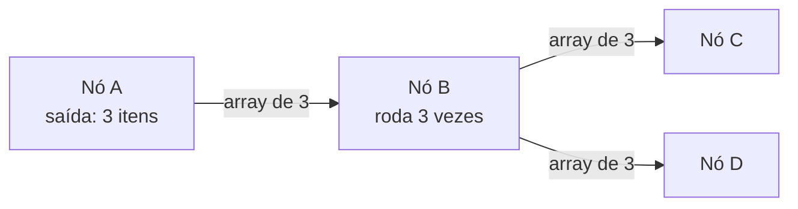

# 12 · O modelo de dados por dentro

`Nível: intermediário → avançado` · `Verificado em n8n 2.36.9, 01/09/2026`

---

Se você entender só um arquivo do núcleo, que seja este. **A maioria absoluta dos
bugs de n8n é de cardinalidade e de correspondência entre itens** — não de valor.

---

## 1. A estrutura canônica

```json
[
  {
    "json":   { "qualquer": "coisa" },
    "binary": { "nomeDaPropriedade": { "data": "<base64>", "mimeType": "...", "fileName": "...", "fileExtension": "..." } },
    "pairedItem": { "item": 0 }
  }
]
```

Três chaves, três papéis:

| Chave | Obrigatória? | Papel |
|---|---|---|
| `json` | sim | Os dados. É o que `$json` devolve |
| `binary` | não | Arquivos. Chaveado por **nome de propriedade**, não pelo nome do arquivo |
| `pairedItem` | gerada | Rastreabilidade: de qual item de entrada este saiu |

> **Facilidade só do node Code:** desde a versão 0.166.0, se o seu `return` esquecer
> a chave `json`, ou devolver um objeto em vez de um array, o Code node conserta.
> **Isso vale só ali.** Ao escrever um nó próprio, você é obrigado a devolver o
> formato completo.

### O nome da propriedade binária confunde todo mundo

```json
"binary": { "data": { "fileName": "relatorio.csv", ... } }
```

`data` é o **nome da propriedade** (o padrão da maioria dos nós). `relatorio.csv`
é o nome do arquivo. Nós que produzem arquivo têm um campo *Put Output File in
Field* e nós que consomem têm *Input Binary Field* — os dois precisam combinar.
"O nó de e-mail não achou o anexo" é, em 9 de 10 vezes, esses dois nomes diferentes.

---

## 2. Cardinalidade: a conta que você tem de fazer de cabeça

Cada nó tem um **fator de cardinalidade**:

| Comportamento | Nós | Entrada → saída |
|---|---|---|
| **1:1** | Edit Fields, a maioria dos nós de app | N → N |
| **1:N** | Split Out, Extract from File (CSV), HTTP Request com paginação | N → M, M ≥ N |
| **N:1** | Aggregate, Summarize, Merge (combine), Limit | N → 1 (ou poucos) |
| **N:M (filtra)** | Filter, IF, Switch, Remove Duplicates | N → ≤ N |
| **1:1 por execução** | Nó com *Execute Once* ligado | N → 1 |

**Exercício mental que evita 90% dos problemas:** antes de rodar, escreva o número
esperado de itens em cada fio. Depois rode e compare. Foi exatamente isso que a
execução real do [exemplo 2](06-exemplos.md#exemplo-2--um-item-com-lista-vs-lista-de-itens-o-mal-entendido-nº-1)
mostrou:

```
Um item com array => 1
Split Out         => 3
Calcular total    => 3
Aggregate         => 1
```

### O multiplicador escondido

Um nó de API recebendo N itens faz **N chamadas**. Se antes dele houver um Split
Out que gerou 500 itens a partir de 1, você acabou de fazer 500 requisições.
Se esse fluxo roda a cada minuto por polling, são 720 mil chamadas por dia.
**Isto já derrubou conta de gente em provedor pago e já rendeu bloqueio por abuso
em API alheia.** Ver [75-armadilhas.md](75-armadilhas.md).

---

## 3. Como o dado anda entre nós



Regras que valem sempre:

1. **Leque (fan-out) copia, não divide.** Se a saída de B vai para C e D, **os dois
   recebem os três itens**. Não é balanceamento de carga.
2. **Um ramo sem itens simplesmente não roda.** Sem erro, sem aviso. É a causa de
   "o fluxo terminou verde mas não fez nada". O remédio é `Always Output Data`.
3. **O item corrente muda a cada iteração.** Dentro de um nó que roda por item,
   `$json` é o item da vez, e `$('Outro Nó').item` é o item *correspondente* daquele
   outro nó — o que nos leva ao assunto seguinte.

---

## 4. Item linking

### 4.1 O problema que ele resolve

```
Buscar Clientes  →  Filtrar ativos  →  Buscar Pedidos  →  Montar e-mail
   (10 itens)        (4 itens)          (4 itens)
```

No nó "Montar e-mail", você quer o **e-mail do cliente** — que está lá atrás, no
"Buscar Clientes", entre 10 itens. Qual dos 10 corresponde a este pedido?

Por posição não dá: o filtro embaralhou os índices. A resposta é o **`pairedItem`**:
cada item carrega o índice do item de entrada que o originou, e o n8n percorre essa
cadeia para trás.

```
{{ $('Buscar Clientes').item.json.email }}
```

Essa expressão só é possível por causa dessa cadeia. Sem ela, você teria de fazer
o *join* na mão, com Merge ou com um `Map` em Code.

### 4.2 Quando a cadeia quebra

Erros literais que você vai ver:

```
Can't determine which item to use
Paired item data for item from node '<nó>' is unavailable. Ensure 'Always Output Data' is checked
Invalid syntax / no path back to node
```

Todos significam a mesma coisa: **algum nó no meio do caminho produziu itens sem
declarar de onde vieram.** O culpado quase sempre é um node Code que agrega,
filtra ou expande.

### 4.3 Como preservar a correspondência no Code node

**Errado** (perde o vínculo):

```javascript
const total = $input.all().reduce((s, i) => s + i.json.valor, 0);
return [{ json: { total } }];        // de onde veio este item? o n8n não sabe
```

**Certo** (declara a origem):

```javascript
const itens = $input.all();
const total = itens.reduce((s, i) => s + i.json.valor, 0);
return [{
  json: { total },
  pairedItem: itens.map((_, i) => ({ item: i })),   // veio de TODOS os itens
}];
```

**Um-para-um, preservando:**

```javascript
return $input.all().map((item, i) => ({
  json: { ...item.json, dobro: item.json.valor * 2 },
  pairedItem: { item: i },
}));
```

**Um-para-muitos (expandindo):**

```javascript
const saida = [];
$input.all().forEach((item, i) => {
  for (const filho of item.json.filhos) {
    saida.push({ json: filho, pairedItem: { item: i } });  // todos apontam para o pai
  }
});
return saida;
```

### 4.4 Escapes quando não dá para preservar

| Situação | Alternativa |
|---|---|
| Só quer o primeiro/último | `$('Nó').first()` / `$('Nó').last()` — não dependem de correspondência |
| Quer um item específico | `$('Nó').all()[i]` |
| Quer casar por chave de negócio | Nó **Merge** em modo *Combine by Matching Fields* — é um `JOIN` de verdade |
| Está no Code node e precisa achar o par | `$('Nó').itemMatching(indiceDoItemAtualNaEntrada)` |

> **Recomendação profissional:** quando a correspondência entre dois conjuntos é
> por uma **chave de negócio** (id do cliente, número do pedido), use o nó **Merge**
> e pare de brigar com `pairedItem`. O item linking é bom para "de onde isto veio";
> ele não é um substituto para um `JOIN` explícito. Confundir os dois é uma fonte
> constante de fluxos frágeis.

---

## 5. Dado binário: onde ele realmente vive

O item **não** carrega o arquivo — carrega uma referência. Onde está o conteúdo
depende de `N8N_DEFAULT_BINARY_DATA_MODE`:

| Modo | Onde fica | Padrão em | Observação |
|---|---|---|---|
| `filesystem` | disco do processo, em `~/.n8n/binaryData` | modo regular | Precisa de volume persistente; **não funciona** com workers em máquinas diferentes |
| `database` | no banco (bytea/blob) | modo fila | Funciona com múltiplos workers; engorda o banco |
| ~~`memory`~~ | — | — | **Removido no n8n 2.0** |
| S3/objeto | armazenamento externo | — | Recurso licenciado (*external storage*) |

*Por que o modo em memória foi removido?* Porque o consumo de RAM era
proporcional a (tamanho do maior arquivo) × (execuções simultâneas), e derrubar a
instância por causa de um PDF de 80 MB era rotina. A troca foi consciente: mais
I/O por item, muito mais estabilidade sob carga.

**Consequência operacional que pega gente em produção:** se você tem workers em
contêineres diferentes e deixa `filesystem`, o worker A grava o binário no disco
dele e o worker B não acha. Em queue mode, use `database` (o padrão) ou
armazenamento externo.

---

## 6. Limites reais

| Limite | Valor típico | O que acontece ao passar |
|---|---|---|
| Itens numa execução | não há limite rígido | A memória do processo é o limite real |
| Tamanho de um payload | prático: dezenas de MB | Execução lenta e depois OOM |
| Data tables (armazenamento interno) | **200 MiB** por instância, ajustável por `N8N_DATA_TABLES_MAX_SIZE_BYTES` | Avisos em 80%; erro na inserção ao estourar |
| Descompactação (nó Compression) | 2 GiB hoje, **256 MiB a partir do 3.0** | Erro explícito |
| Entradas num zip | 5.000 hoje, **1.000 a partir do 3.0** | Erro explícito |

**Regra de dimensionamento que eu uso:** se um único item pode passar de ~1 MB de
JSON, ou se uma execução pode passar de ~10 mil itens, repense. Ou pagine na
origem, ou empurre a transformação para o banco, ou quebre em sub-workflows.
O n8n é ótimo em orquestração e ruim em processamento pesado — e isso é uma
decisão de projeto, não um defeito. Ver [60-teoria-avancada.md](60-teoria-avancada.md).

---

## 7. Os cinco porquês do `pairedItem`

1. **Por que existe?** Para que `$('Nó').item` tenha significado.
2. **Por que `$('Nó').item` precisa existir?** Porque, sem ele, todo acesso a dado
   de nó anterior viraria um *join* manual, e o fluxo visual perderia a vantagem
   sobre escrever código.
3. **Por que não casar por índice?** Porque nós mudam a cardinalidade; o índice 3
   depois de um filtro não é o índice 3 antes dele.
4. **Por que o n8n não infere sozinho no Code node?** Porque não tem como: seu
   código pode ter combinado dez itens de formas que só você conhece. Inferir
   errado seria pior que falhar — daria um dado errado sem aviso. **Falhar alto é
   a decisão certa aqui.**
5. **Por que a mensagem de erro sugere `Always Output Data`?** Porque um caso
   frequente é a cadeia terminar num nó que não emitiu nada; com a opção ligada,
   ele emite um item vazio e a cadeia continua existindo. É paliativo, não conserto.

---

## Autoteste

1. Escreva a estrutura completa de um item com JSON e um arquivo binário.
2. Qual a diferença entre "nome da propriedade binária" e "nome do arquivo"?
3. Classifique quanto à cardinalidade: Split Out, Aggregate, Filter, Edit Fields.
4. Um Split Out gerou 500 itens antes de um HTTP Request. Quantas chamadas?
5. Num leque de uma saída para dois nós, cada um recebe metade dos itens? Justifique.
6. Escreva um Code node que soma um campo de todos os itens **preservando** o
   `pairedItem`.
7. Quando usar Merge em vez de `$('Nó').item`?
8. Por que `filesystem` é uma escolha ruim em queue mode com vários workers?
9. Por que o modo de binário em memória foi removido no 2.0?
10. Por que o n8n prefere falhar com `Can't determine which item to use` em vez de
    adivinhar?

---

*Anterior: [11-historia.md](11-historia.md) · Próximo: [13-expressoes.md](13-expressoes.md)*
