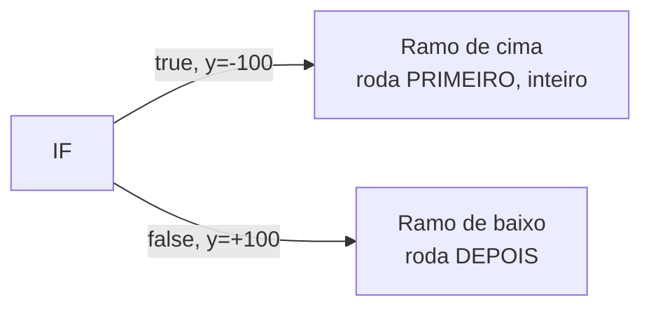
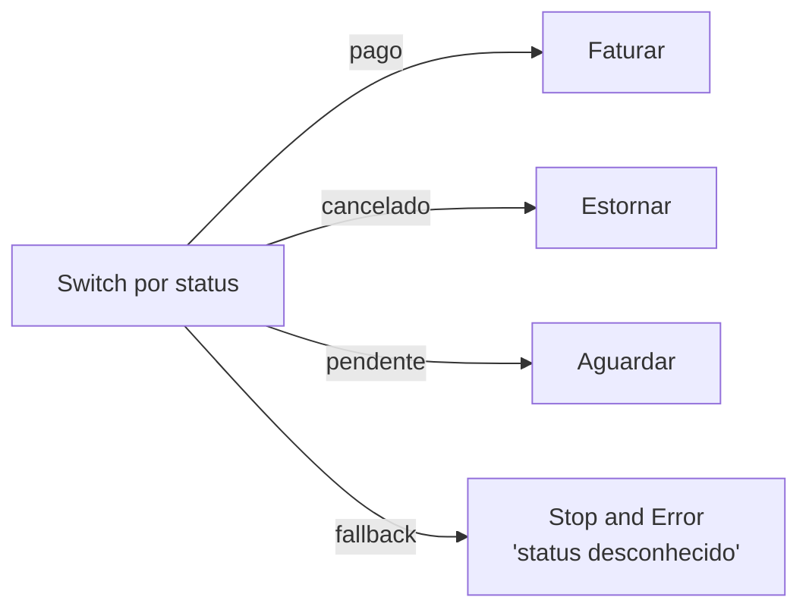
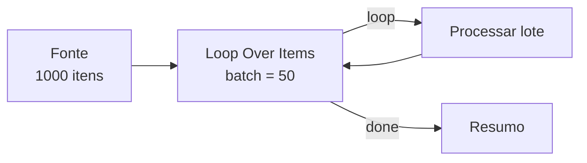
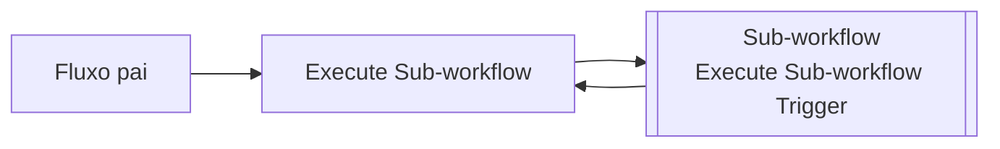
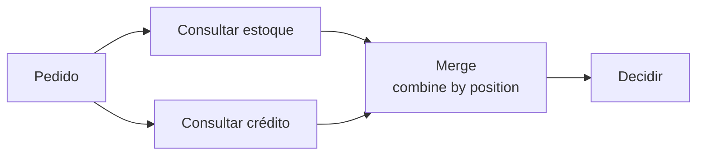
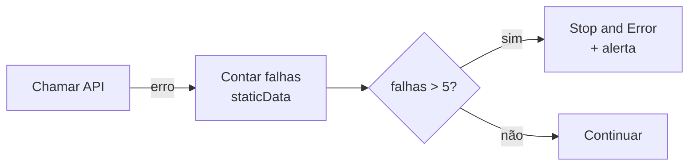

# 15 · Fluxo de controle — ramificar, juntar, repetir, esperar

`Nível: intermediário` · `01/09/2026`

---

Um workflow é um grafo. Este arquivo é sobre as formas do grafo, e sobre a
semântica de execução que faz cada forma se comportar como se comporta.

---

## 1. Ordem de execução (`executionOrder: v1`)

Regra real, e ela surpreende:

> O n8n percorre o grafo **em profundidade**, um ramo inteiro por vez, e escolhe
> qual ramo vem primeiro pela **posição vertical dos nós no canvas** (de cima para
> baixo) e depois pela horizontal.

Ou seja: **arrastar um nó para cima muda a ordem de execução.** Não é elegante,
mas é determinístico e documentado.



Consequências práticas:

- Se o ramo de cima grava no banco e o de baixo notifica, **a notificação nunca sai
  antes da gravação** — mesmo que os dois "pareçam" paralelos. **Não há paralelismo
  real entre ramos**; o canvas mostra ramos, o motor executa em sequência.
- Fluxos antigos podem estar em `v0` (largura primeiro). Se importar um workflow
  antigo e a ordem parecer errada, confira em *Settings → Execution order*.

**Por que profundidade e não largura?** Decisão de projeto documentada na mudança
para v1: em largura, um ramo longo intercalava com outro e a leitura da execução
ficava incompreensível. Profundidade faz o histórico contar uma história linear
por ramo. Trocaram teoria por depurabilidade — e, dado que a depuração visual é a
razão de ser da ferramenta, foi a troca certa.

---

## 2. Ramificar: IF, Switch, Filter

| Nó | Saídas | Use quando |
|---|---|---|
| **Filter** | 1 | Só quer descartar o que não passa |
| **IF** | 2 (true/false) | Dois caminhos, e você quer tratar os dois |
| **Switch** | N + fallback | Roteamento por valor (status, tipo, região) |

**Todos usam o mesmo componente de condições**, com um detalhe que causa dor:

```json
"options": { "typeValidation": "strict" }
```

- `strict`: comparar `"10"` (string) com `10` (número) **dá erro**. Bom: pega bug cedo.
- `loose`: converte antes de comparar. Conveniente e traiçoeiro.

**Recomendação:** deixe `strict` e converta explicitamente com `Number()`/`String()`.
Comparação frouxa é onde bug de produção se esconde.

### Padrão: nunca deixe um caso cair no vazio



O `Switch` tem uma saída *fallback*. **Ligue-a sempre**, nem que seja num
`Stop and Error`. Status novo aparecendo em silêncio é o bug que ninguém acha.

---

## 3. Juntar: o nó Merge

Quatro modos, e escolher errado é a segunda causa de dado errado no n8n:

| Modo | O que faz | Quando |
|---|---|---|
| **Append** | Empilha: A com 3 e B com 2 → 5 itens | Juntar listas do mesmo tipo |
| **Combine → Matching Fields** | `JOIN` por chave. Tem *keep everything / keep matches / enrich* | **O certo** para casar dados de fontes diferentes |
| **Combine → Position** | Item 1 com item 1, 2 com 2… | Só quando você **garante** a ordem e a quantidade |
| **Combine → All Combinations** | Produto cartesiano | Raro; explode a contagem |
| **SQL** | Consulta SQL sobre as entradas | Junções complexas sem sair do n8n |

> **Combine by Position é uma armadilha.** Parece funcionar no teste (as duas
> fontes vêm ordenadas) e falha em produção quando uma fonte devolve um item a
> menos. Se existe uma chave de negócio, use *Matching Fields*.

**Merge espera as duas entradas.** Se um ramo não produzir item nenhum, o
comportamento depende do modo e das opções — outro motivo para `Always Output Data`
nos nós que podem vir vazios.

---

## 4. Repetir: Loop Over Items



Pontos que confundem:

1. **São duas saídas.** `done` (índice 0) e `loop` (índice 1). O fio de volta parte
   do **último nó do laço** para a **entrada** do Loop.
2. **Sem o fio de volta, não há laço.** O nó roda uma vez e para.
3. `$runIndex` conta as voltas (base 0). Use para "só na primeira volta" ou para
   limitar iterações.
4. **Loop é lento.** Cada volta é uma passada completa pelo ramo. Antes de usar,
   pergunte: o nó já não processa todos os itens sozinho? Quase sempre sim.

**Quando o Loop é realmente necessário:**

- Precisa de estado entre lotes (paginação com cursor, acumulador).
- Precisa de pausa entre lotes e o nó não tem *Batching*.
- Precisa parar no meio por uma condição.

**Quando não usar:** para "fazer para cada item" — os nós já fazem isso.

---

## 5. Esperar: o nó Wait

Três modos:

| Modo | Comportamento |
|---|---|
| **After time interval** | Espera N segundos/minutos/horas |
| **At specified time** | Espera até um instante |
| **On webhook call** | Fica parado até alguém chamar `$execution.resumeUrl` |

**O detalhe que importa:** esperas curtas seguram o processo; esperas longas fazem
o n8n **persistir a execução e liberar o processo**, retomando depois. É isso que
permite um fluxo de aprovação humana esperar três dias sem consumir memória.

`On webhook call` é o padrão de **aprovação humana**: mande um e-mail contendo
`{{ $execution.resumeUrl }}`, e o fluxo retoma quando a pessoa clicar.

> **Cuidado:** a execução pausada continua existindo no banco. Milhares de execuções
> aguardando é um problema real de armazenamento e de poda. Ponha `Timeout Workflow`.

---

## 6. Sub-workflows



**Dois modos de chamada, e a diferença é enorme:**

| Modo | Execuções | Velocidade | Isolamento de falha |
|---|---|---|---|
| *Run once with all items* (padrão) | 1 | Rápido | Nenhum: um item ruim derruba tudo |
| *Run once for each item* | N | Lento (N execuções completas) | Total: falha de um não afeta os outros |

**Quando vale a pena criar um sub-workflow:**

- A lógica se repete em três ou mais fluxos.
- Você quer isolar uma parte arriscada.
- O fluxo passou de ~30 nós e ninguém mais entende o canvas.
- Você quer expor a lógica como **ferramenta de IA** (o AI Agent chama sub-workflow
  como tool).

**Quando não vale:** para dividir em dois só por estética. Cada chamada tem custo,
cria uma execução separada no histórico e dificulta a leitura de ponta a ponta.

**Segurança:** *Settings → Caller policy* define quem pode chamar. As opções vão de
"qualquer workflow" a "só workflows desta lista". Um sub-workflow que grava no
banco e aceita qualquer chamador é uma porta lateral.

---

## 7. Padrões de composição que valem memorizar

### 7.1 Fan-out / fan-in (leque e reunião)


Lembre: **não há paralelismo**; B roda inteiro, depois C. O ganho é de organização,
não de tempo.

### 7.2 Circuit breaker manual


O n8n não tem disjuntor nativo. Este arranjo aproxima, e evita martelar uma API
que já está fora do ar.

### 7.3 Roteador por tipo com fallback obrigatório

Ver a seção 2. É o padrão que impede casos novos de sumirem em silêncio.

### 7.4 Máquina de estados com Wait

```
Recebe → grava estado 'aguardando' → Wait (webhook) → grava 'aprovado' → executa
```
Substitui, com honestidade, muita coisa que as pessoas tentam fazer com laços.

---

## Autoteste

1. Em `executionOrder: v1`, o que determina qual ramo roda primeiro?
2. Existe paralelismo real entre ramos no n8n? O que isso implica?
3. Qual a diferença entre Filter e IF?
4. O que faz `typeValidation: strict` e por que recomendo mantê-lo?
5. Por que a saída *fallback* do Switch deve ser sempre conectada?
6. Cite os modos do Merge e diga quando *Combine by Position* é perigoso.
7. Quantas saídas tem o Loop Over Items? O que acontece sem o fio de volta?
8. Cite três casos em que o Loop é realmente necessário.
9. O que muda entre espera curta e longa no nó Wait?
10. Quais são os dois modos do Execute Sub-workflow e qual o trade-off?

---

*Anterior: [14-nos-e-integracoes.md](14-nos-e-integracoes.md) · Próximo: [16-gatilhos-e-webhooks.md](16-gatilhos-e-webhooks.md)*
