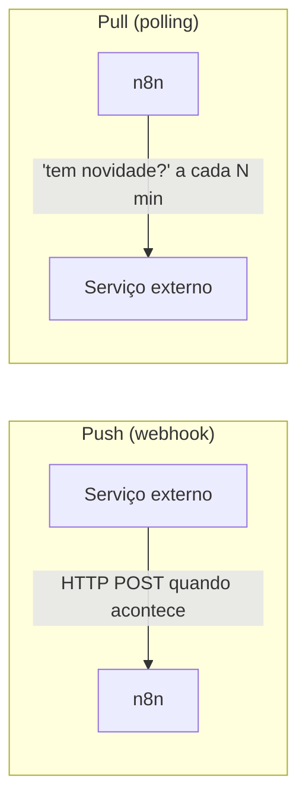

# 16 · Gatilhos, webhooks e agendamento

`Nível: intermediário → avançado` · `Pesquisado na web em 01/09/2026`

---

O gatilho decide **quando** um fluxo roda. Escolher errado custa dinheiro (execuções
desperdiçadas), latência (novidade descoberta 15 minutos depois) ou confiabilidade
(evento perdido). É uma decisão de arquitetura, não de conveniência.

---

## 1. Push vs. pull — a decisão que mais importa



| | Push (webhook) | Pull (polling) |
|---|---|---|
| Latência | milissegundos | metade do intervalo, em média |
| Execuções gastas | 1 por evento | 1 por verificação, **haja evento ou não** |
| Precisa ser alcançável da internet | **sim** | não |
| Perde evento se você estiver fora do ar | **sim**, se o provedor não repetir | não (recupera na próxima) |
| Ordem garantida | não | mais ou menos |
| Duplicatas | **sim** (reenvios) | possíveis |

**A conta que decide:** polling a cada 5 minutos = **8.640 execuções/mês** por
fluxo, mesmo sem nenhum evento. No plano Starter do n8n Cloud (2.500 execuções/mês),
**um único** fluxo de polling de 5 minutos já estoura o plano três vezes. No
autogerido, "só" enche o banco.

**Regra:** use push quando o serviço oferecer. Use polling quando não houver
alternativa — e aí com o maior intervalo que o negócio tolerar.

---

## 2. Webhook

### 2.1 As duas URLs

| | Teste | Produção |
|---|---|---|
| Caminho | `/webhook-test/<path>` | `/webhook/<path>` |
| Quando responde | só enquanto você clicou em *Execute workflow* e o nó está aguardando | sempre que o fluxo estiver **publicado** |
| Quantas chamadas | uma, depois para | ilimitadas |
| Dados salvos | sempre | conforme as configurações do fluxo |

Confundir as duas é o erro nº 1 de todo iniciante, e o sintoma é um **404**.

### 2.2 O que o nó entrega

Um item com o envelope HTTP inteiro:

```json
{
  "headers": { "content-type": "application/json", "x-signature": "..." },
  "params":  { },
  "query":   { "id": "P-1" },
  "body":    { "pedido_id": "P-1", "cliente": "Ana" },
  "webhookUrl": "http://localhost:5678/webhook/pedido",
  "executionMode": "production"
}
```

**Por isso o corpo é `$json.body`, e não `$json`.** Vale para query (`$json.query.id`)
e cabeçalhos (`$json.headers['x-signature']`, sempre em minúsculas).

### 2.3 Modos de resposta

| Respond | Comportamento |
|---|---|
| *Immediately* | Responde `200 { "message": "Workflow got started." }` na hora e processa depois |
| *When Last Node Finishes* | Responde com a saída do último nó — simples, mas prende o cliente pelo tempo do fluxo |
| *Using 'Respond to Webhook' Node* | **Você controla** status, corpo e o momento |

**O terceiro é o certo para qualquer coisa séria.** Foi o usado no
[projeto-modelo](07-projeto-modelo/README.md), e permitiu o padrão *ack-then-process*:
responder `202` e só então gravar.

Verificado na prática: com o banco inacessível, o cliente **ainda recebeu 202** e a
execução ficou marcada como erro no histórico. É o comportamento desejado — e a
razão pela qual esse padrão **exige** Error Workflow.

### 2.4 Métodos e caminhos

- Um mesmo `path` pode ter **vários métodos** em fluxos diferentes: `POST /pedido`
  em um workflow e `GET /pedido` em outro convivem (é o que o projeto-modelo faz).
- Parâmetros de rota: `path` = `pedido/:id` → `$json.params.id`.
- O caminho pode ser um UUID gerado (padrão) ou um nome seu. **Nome legível é melhor
  para você e pior para segurança** — um caminho adivinhável convida a varredura.

### 2.5 Autenticar o webhook

Opções do nó, em ordem de força:

1. **Nenhuma** — só se o conteúdo for público e a ação, inofensiva.
2. **Basic Auth / Header Auth** — credencial no nó. Suficiente para integração interna.
3. **Assinatura HMAC** validada em Code — **o padrão da indústria** para webhooks de
   provedores (Stripe, GitHub, gateways de pagamento). Modelo completo no
   [exemplo 11](06-exemplos.md#exemplo-11--caso-de-produção-webhook-rápido--processamento-assíncrono).
4. **mTLS** no proxy reverso — quando o outro lado suporta.

> **Um webhook sem autenticação é um endpoint público que executa lógica de negócio
> com as suas credenciais.** Qualquer pessoa que descubra a URL dispara o fluxo.

### 2.6 Expor o webhook para a internet

| Situação | Solução |
|---|---|
| Produção | Domínio + proxy reverso com TLS + `WEBHOOK_URL` |
| Desenvolvimento | Cloudflare Tunnel ou ngrok + `WEBHOOK_URL` + `N8N_PROXY_HOPS=1` |
| Teste rápido | Túnel embutido (`--tunnel`) — **a documentação avisa que não é seguro em produção** |

Sem `WEBHOOK_URL`, o nó exibe `http://localhost:5678/...`, que o serviço externo
não alcança. Ver [03-instalacao.md](03-instalacao.md#53-túnel-para-receber-webhooks-na-sua-máquina).

### 2.7 Escalar webhooks

Em queue mode, dá para subir processos dedicados só a webhooks:

```bash
n8n webhook     # intercepta apenas URLs de produção
```

Isso tira da instância principal a carga de receber requisições. Ver
[21-escala-e-producao.md](21-escala-e-producao.md).

---

## 3. Schedule Trigger

### 3.1 Intervalos e cron

O nó aceita intervalos prontos (segundos, minutos, horas, dias, semanas, meses) ou
**expressão cron**:

```
┌─ minuto (0-59)
│ ┌─ hora (0-23)
│ │ ┌─ dia do mês (1-31)
│ │ │ ┌─ mês (1-12)
│ │ │ │ ┌─ dia da semana (0-6, 0 = domingo)
│ │ │ │ │
0 7 * * *        todo dia às 07:00
*/15 * * * *     a cada 15 minutos
0 8 * * 1        segunda às 08:00
0 0 1 * *        dia 1 de cada mês, meia-noite
```

**O fuso é o de `GENERIC_TIMEZONE`** (ou o do workflow, se sobrescrito). Em UTC,
`0 8 * * 1` dispara às 5h da manhã em Brasília. Configure o fuso **antes** de
escrever cron.

### 3.2 O agendador durável (novidade importante do 2.x)

Historicamente, o n8n mantinha os temporizadores **na memória** de cada instância.
Duas limitações conhecidas:

- **Reinício perde execuções pendentes.** Se a instância estava fora no horário, a
  execução simplesmente não acontece — nem depois.
- **Com várias instâncias principais, é preciso um líder.** Só o líder dispara, e
  troca de liderança na hora errada atrasa disparos.

O **durable scheduler** move o agendamento para o banco:

| | Em memória | Durável |
|---|---|---|
| Sobrevive a reinício | ❌ | ✅ (dentro do *grace period*) |
| Múltiplas instâncias | precisa de líder | cada execução é reivindicada por **uma** instância |
| Execução perdida | descartada | segue a **política de misfire** |

**Disponibilidade e como ligar** (verificado em 01/09/2026):
- Disponível a partir do **n8n 2.36.0**; entre 2.32.0 e 2.35 existia como *preview*.
- **Desligado por padrão.** Instâncias existentes continuam com o agendador em memória.
- Exige **duas** variáveis: `N8N_SCHEDULER_ENABLED=true` **e**
  `N8N_USE_WORKFLOW_PUBLICATION_SERVICE=true`. Só a primeira faz o n8n registrar um
  aviso e continuar no agendador em memória.
- Gatilhos de **polling** continuam em memória, a menos que você ligue
  `N8N_SCHEDULER_POLL_TRIGGERS_ENABLED` — que a própria documentação diz **não
  estar 100% estável**; mantenha desligado em produção.

**Políticas de misfire** (o que fazer com um disparo perdido):

| Política | Comportamento |
|---|---|
| *Don't Run Missed Executions* (padrão) | Descarta a fila atrasada. Igual ao agendador em memória |
| *Run the Most Recent Missed Execution* | Um único disparo de recuperação, no horário perdido mais recente |
| *Run the Most Recent Missed Execution Per Rule* | Idem, mas uma recuperação por regra do nó |

O *grace period* padrão é `N8N_SCHEDULER_MISFIRE_GRACE` (60 s), e nós criados a
partir do 2.36.0 podem definir o seu. **Nenhuma política reexecuta a fila inteira**:
o relógio avança e você não recebe 40 execuções de uma vez após um fim de semana fora.

> **Recomendação profissional:** ligue o agendador durável se você tem mais de uma
> instância principal, ou se um disparo perdido tem consequência real (fechamento
> financeiro, envio de cobrança). Para um n8n único, com fluxos que toleram pular
> uma rodada, o ganho não paga a mudança de comportamento — e mudança de
> comportamento em agendamento é coisa que assusta às 3 da manhã.

---

## 4. Os demais gatilhos

| Gatilho | Uso | Observação |
|---|---|---|
| **Manual Trigger** | Testes e execução sob demanda | Não roda em produção |
| **n8n Form Trigger** | Formulário hospedado pelo n8n | Ótimo para processos internos; sem front-end para escrever |
| **Chat Trigger** | Janela de chat embutível | Porta de entrada dos agentes de IA |
| **Error Trigger** | Reage à falha de outros fluxos | **Configure um**. Ver [18](18-erros-e-confiabilidade.md) |
| **Execute Sub-workflow Trigger** | Chamado por outro fluxo | Restrinja o *caller policy* |
| **MCP Server Trigger** | Expõe o fluxo como ferramenta para agentes | **Autentique** |
| **Gatilhos de app** | Gmail, Slack, Sheets, Airtable… | Alguns são push (webhook), outros polling — **verifique qual** |

> **Detalhe que engana:** dois gatilhos com nome parecido podem ter naturezas
> diferentes. "Gmail Trigger" faz polling; "Slack Trigger" registra webhook.
> Abra o nó e procure o parâmetro **Poll Times**: se existe, é polling.

---

## 5. Múltiplos gatilhos no mesmo fluxo

Um workflow pode ter vários gatilhos (um webhook e um agendamento, por exemplo).
Cada um inicia uma execução independente pelo seu ramo.

Cuidado: `$('Nó')` de um ramo que **não rodou** falha. Use `$('Nó').isExecuted`
para decidir. Na prática, dois gatilhos em um fluxo costumam ser sinal de que
deveriam ser dois fluxos chamando um sub-workflow comum.

---

## Autoteste

1. Quantas execuções por mês gasta um polling de 5 minutos? O que isso significa no
   plano Starter do Cloud?
2. Quais as duas URLs de um webhook e quando cada uma responde?
3. Onde está o corpo da requisição no item entregue pelo nó Webhook?
4. Quais os três modos de resposta do webhook e qual usar em produção?
5. Por que o padrão *ack-then-process* exige Error Workflow?
6. Cite quatro formas de autenticar um webhook, da mais fraca à mais forte.
7. Escreva o cron para "toda segunda às 8h" e diga em que fuso ele será interpretado.
8. Quais os dois problemas do agendador em memória, e como o durável os resolve?
9. Quais **duas** variáveis é preciso ligar para o agendador durável funcionar?
10. Como descobrir se um gatilho de app é push ou polling?

---

*Fontes consultadas em 01/09/2026: [Durable scheduler](https://docs.n8n.io/deploy/host-n8n/configure-n8n/durable-scheduler.md),
[Webhook node](https://docs.n8n.io/integrations/builtin/core-nodes/n8n-nodes-base.webhook.md),
[Schedule Trigger node](https://docs.n8n.io/integrations/builtin/core-nodes/n8n-nodes-base.scheduletrigger.md).*

*Anterior: [15-fluxo-de-controle.md](15-fluxo-de-controle.md) · Próximo: [17-code-node-e-task-runners.md](17-code-node-e-task-runners.md)*
