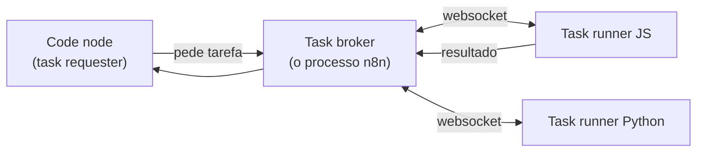

# 17 · O node Code e os task runners

`Nível: avançado` · `Pesquisado na web em 01/09/2026`

---

O node Code é a válvula de escape do n8n. Este arquivo trata de duas coisas
diferentes que costumam ser confundidas: **como escrever bom código nele** e
**onde esse código roda** — que é uma questão de segurança, não de estilo.

---

## 1. Quando usar Code (e quando não usar)

**Use Code quando:**

- A transformação não cabe em Edit Fields / Split Out / Aggregate / Summarize.
- Você precisa de lógica condicional dentro de um item (não entre itens).
- Precisa gerar itens a partir de um cálculo.
- Precisa de estado entre execuções (`$getWorkflowStaticData`).

**Não use Code quando:**

- Existe um nó que faz isso. Um Code de três linhas que renomeia campos é pior que
  um Edit Fields: quebra item linking, ninguém de negócio lê, e não aparece nas
  buscas do editor.
- Você quer fazer requisição HTTP ou ler arquivo — **o Code node não faz isso**,
  por decisão de projeto. Use `HTTP Request` e `Read/Write Files from Disk`.
- O código passou de ~50 linhas. Isso é um serviço, não um nó. Extraia.

> **Opinião profissional:** o sinal de um fluxo mal projetado não é ter Code node.
> É ter **muitos** Code nodes pequenos. Cada um é um ponto onde a rastreabilidade
> de itens pode quebrar e onde a lógica some da visão de quem lê o canvas.

---

## 2. Os dois modos

| Modo | Roda | Recebe | Devolve |
|---|---|---|---|
| **Run Once for All Items** (padrão) | uma vez | `$input.all()` | array de itens |
| **Run Once for Each Item** | N vezes | `$json` (o item da vez) | um item |

```javascript
// all items — agregações, filtros, mudanças de cardinalidade
const itens = $input.all();
return itens
  .filter(i => i.json.status === 'pago')
  .map((i, idx) => ({ json: { ...i.json, ordem: idx }, pairedItem: { item: idx } }));
```

```javascript
// each item — transformação simples, item a item
return { json: { ...$json, total: $json.qtd * $json.preco } };
```

**Qual escolher?** *All items* por padrão: é uma execução só, é mais rápido e você
enxerga o conjunto. *Each item* quando quer que uma falha isole um item — mas
lembre que uma exceção lançada ainda derruba o nó todo a menos que `On Error` diga
o contrário.

---

## 3. O que existe lá dentro (e o que não existe)

**Existe:** `$input`, `$json`, `$binary`, `$('Nó')`, `$execution`, `$workflow`,
`$runIndex`, `$prevNode`, `$now`, `$today`, `$getWorkflowStaticData`, `$env`
(se não bloqueado), `console.log` (sai no console do navegador), `Promise`/`await`.

**Não existe:**
- `$itemIndex`, `$version`, `$secrets`;
- as *data transformation functions* (`$if`, `$jmespath`, `$ifEmpty`) — **só no
  editor de expressões**;
- as extensões n8n do Luxon. Ali é Luxon nativo.

### A pegadinha das datas, de novo

```javascript
// ❌ no Code node isto NÃO dá erro e NÃO faz o que você quer
const d = $now.plus(7, 'days');

// ✅ Luxon nativo
const d = $now.plus({ days: 7 });
```

A documentação oficial destaca este caso específico. É o tipo de bug que passa em
revisão de código e aparece três meses depois num relatório com data errada.

### Módulos externos

- **n8n Cloud:** apenas `crypto` (Node.js) e `moment`. Nada mais.
- **Autogerido:** liberável por variável de ambiente
  ([guia oficial](https://docs.n8n.io/deploy/host-n8n/configure-n8n/basic-configuration/configuration-examples/enable-modules-in-code-node.md)).
  Pense duas vezes: liberar módulos externos amplia a superfície de ataque de quem
  pode editar workflows.

---

## 4. Python

**Estado em 2026:** o Python **Pyodide** (CPython compilado para WebAssembly),
introduzido no n8n 1.0, **foi removido no n8n 2.0**. Restou o **Python nativo**,
executado pelos task runners, estável desde o 2.0.

Diferenças que quebram código antigo:

| Pyodide (removido) | Python nativo (atual) |
|---|---|
| `item.json.campo` (ponto) | **`item["json"]["campo"]`** (colchetes, e só) |
| Várias variáveis embutidas (`_execution`, `_workflow`…) | **só `_items` e `_item`** |
| Pacotes do Pyodide | só o que a imagem `n8nio/runners` incluir **e** estiver na lista de permissão |
| — | *built-ins* inseguros negados por padrão |

```python
# modo all items
saida = []
for item in _items:
    d = item["json"]
    saida.append({"json": {"sku": d["sku"], "total": d["qtd"] * d["preco"]}})
return saida
```

No **n8n Cloud**, o Python do Code node **não permite importar biblioteca nenhuma** —
nem da biblioteca padrão. Se o seu caso precisa de `pandas`, ou você autogere com
runners configurados, ou usa JavaScript.

> **Recomendação:** em n8n, escreva JavaScript. O Python existe e funciona, mas o
> suporte é mais restrito, mais lento de configurar e tem menos exemplos.
> Use Python quando a lógica **já existe** em Python e reescrevê-la não compensa.

---

## 5. Task runners: onde o código realmente roda

Aqui a conversa deixa de ser sobre estilo e passa a ser sobre **segurança**.

### 5.1 A arquitetura



Três papéis: **requester** (o Code node), **broker** (o próprio n8n, main ou
worker) e **runners** (processos que executam o código).

### 5.2 Os dois modos, e por que isso importa muito

| Modo | Como | Isolamento |
|---|---|---|
| **Internal** | O n8n lança o runner como **processo filho**, com o mesmo `uid`/`gid` | **Nenhum na prática** |
| **External** | Um *launcher* sobe os runners em contêiner separado (imagem `n8nio/runners`) | Real |

A documentação é direta ao ponto, e vale citar:

> *"Task runners are the only isolation layer between user-provided code and n8n.
> Without them, or with internal mode, anyone who can edit a workflow could
> potentially read your database, encryption key, stored credentials, and
> environment variables."*

Traduzindo o que isso significa na sua empresa: **em modo interno, dar a alguém
permissão para editar workflows é equivalente a dar acesso de leitura a todas as
credenciais da instância.** Não é uma escalada de privilégio exótica; é o
comportamento normal, documentado.

### 5.3 Modo externo, na prática

Sidecar com a imagem `n8nio/runners`, **na mesma versão** do `n8nio/n8n`:

```yaml
services:
  n8n:
    image: n8nio/n8n:2.36.9
    environment:
      N8N_RUNNERS_MODE: external
      N8N_RUNNERS_BROKER_LISTEN_ADDRESS: 0.0.0.0
      N8N_RUNNERS_AUTH_TOKEN: ${RUNNERS_TOKEN}
      N8N_NATIVE_PYTHON_RUNNER: "true"

  runners:
    image: n8nio/runners:2.36.9          # a versão TEM de bater com a do n8n
    environment:
      N8N_RUNNERS_TASK_BROKER_URI: http://n8n:5679
      N8N_RUNNERS_AUTH_TOKEN: ${RUNNERS_TOKEN}
```

Detalhes que pegam:

- **Em queue mode, cada worker precisa do seu próprio sidecar.**
- Se `OFFLOAD_MANUAL_EXECUTIONS_TO_WORKERS=false`, a instância principal também roda
  execuções manuais e também precisa de sidecar.
- A partir do **n8n 2.0**, a imagem `n8nio/n8n` **não inclui mais** o runner externo —
  é obrigatório o contêiner `n8nio/runners`.
- `N8N_RUNNERS_ENABLED` está **depreciada no 2.x** (já é padrão). Em 1.x, era preciso.

### 5.4 Endurecimento

O n8n publica um guia específico ([Harden task runners](https://docs.n8n.io/deploy/host-n8n/configure-n8n/security/harden-task-runners.md)).
As medidas de maior efeito:

| Medida | Efeito |
|---|---|
| Modo externo | O básico. Sem isso, o resto é decoração |
| Limite de memória e CPU no contêiner do runner | Um laço infinito não derruba o n8n |
| `N8N_RUNNERS_TASK_TIMEOUT` | Mata tarefa presa. **O padrão cai de 300 s para 60 s numa versão futura** — defina explicitamente |
| Rede do runner restrita | O código do usuário não alcança sua rede interna |
| Sem montar segredos no runner | Ele não precisa deles |
| Bloquear módulos externos | Menos superfície |

---

## 6. Padrões de código que valem a pena

**Falhar com mensagem que ajuda:**

```javascript
if (!$json.pedido_id) {
  throw new Error(`item sem pedido_id: ${JSON.stringify($json).slice(0, 200)}`);
}
```
Mensagem com o dado (truncado) transforma "deu erro" em "achei o problema".

**Preservar item linking (releia [12](12-o-modelo-de-dados.md#43-como-preservar-a-correspondência-no-code-node)):**

```javascript
return $input.all().map((item, i) => ({ json: transformar(item.json), pairedItem: { item: i } }));
```

**Estado entre execuções, com janela limitada:**

```javascript
const s = $getWorkflowStaticData('global');
s.vistos = (s.vistos ?? []).slice(-1000);
```

**Nunca engolir erro:**

```javascript
// ❌ o pior padrão possível
try { arriscado(); } catch (e) { /* nada */ }

// ✅ decida explicitamente
try {
  arriscado();
} catch (e) {
  return [{ json: { ok: false, erro: e.message, entrada: $json } }];
}
```
Um `catch` vazio transforma falha em sucesso silencioso — o pior estado possível de
um sistema de integração.

---

## Autoteste

1. Cite três situações em que **não** se deve usar Code node.
2. Por que muitos Code nodes pequenos são um sinal ruim?
3. Qual a diferença entre os dois modos, e qual é o padrão?
4. Cite três coisas que existem nas expressões e não no Code node.
5. Por que `$now.plus(7, 'days')` no Code node é perigoso?
6. O que aconteceu com o Python Pyodide no n8n 2.0? Cite duas diferenças de sintaxe.
7. Descreva os três papéis da arquitetura de task runners.
8. Em modo interno, o que "permissão para editar workflow" equivale, na prática?
9. Em queue mode, quantos sidecars de runner você precisa?
10. Por que um `catch` vazio é o pior padrão num fluxo de integração?

---

*Fontes consultadas em 01/09/2026: [Set up task runners](https://docs.n8n.io/deploy/host-n8n/configure-n8n/set-up-task-runners.md),
[Harden task runners](https://docs.n8n.io/deploy/host-n8n/configure-n8n/security/harden-task-runners.md),
[Using the Code node](https://docs.n8n.io/build/code-in-n8n/using-the-code-node.md).*

*Anterior: [16-gatilhos-e-webhooks.md](16-gatilhos-e-webhooks.md) · Próximo: [18-erros-e-confiabilidade.md](18-erros-e-confiabilidade.md)*
