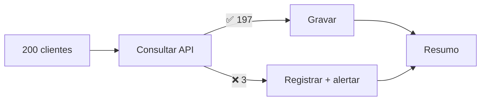

# 18 · Erros, retentativas e confiabilidade

`Nível: avançado` · `01/09/2026`

---

Este é o arquivo que separa quem "sabe n8n" de quem entrega automação em que se
pode confiar. É também o mais ignorado, porque nada aqui aparece na demonstração.

> **A tese deste arquivo:** o oposto de "funcionou" não é "deu erro". É
> **"disse que funcionou e não funcionou"**. Todo o esforço a seguir serve para
> tornar impossível o terceiro estado.

---

## 1. Os quatro estados de uma execução

| Estado | O que significa | Perigo |
|---|---|---|
| ✅ Sucesso | Fez tudo | — |
| ❌ Erro | Falhou e **você sabe** | Baixo: é visível |
| ⚠️ **Sucesso parcial silencioso** | Processou 37 de 200 e terminou verde | **Alto** |
| 👻 **Nunca rodou** | O gatilho não disparou | **Altíssimo**: não há execução para olhar |

Os dois últimos são o inimigo. Quase tudo neste arquivo é sobre convertê-los em
erro visível.

### O caso "nunca rodou"

Não existe execução, então não existe alerta. Como detectar:

- **Heartbeat:** um fluxo agendado que grava um "estou vivo" e um segundo fluxo que
  alerta se o registro ficou velho. É o mesmo princípio de *dead man's switch*.
- **Monitoramento externo:** Healthchecks.io, Uptime Kuma, Better Stack — o fluxo
  chama uma URL no fim; o serviço avisa se a chamada não chegar.
- **`/healthz`** só diz que o processo está de pé, não que os fluxos rodam.

---

## 2. Configurar erro no nível do nó

*Settings* de cada nó:

| Opção | Efeito | Quando |
|---|---|---|
| `On Error: Stop Workflow` (padrão) | A execução inteira falha | Quando continuar não faz sentido |
| `On Error: Continue` | Segue com o item de erro na saída normal | Quase nunca — mistura sucesso e falha |
| `On Error: Continue (using error output)` | **Segunda saída** só para os que falharam | **O certo, na maioria dos casos** |
| `Retry On Fail` + `Max Tries` + `Wait Between Tries` | Repete o nó | **Só se a operação for idempotente** |
| `Always Output Data` | Emite item vazio quando não produziria nada | Impede ramo morrer em silêncio |
| `Execute Once` | Roda uma vez mesmo com N itens | Notificação de resumo |

### O padrão de saída de erro



Sem isso, o item 4 derruba os 196 restantes — e você não sabe quais foram feitos.

---

## 3. Retentativa: quando ajuda e quando estraga

### 3.1 A regra

> **Retry sem idempotência não é resiliência. É duplicação automatizada.**

Antes de ligar `Retry On Fail`, responda: *executar esta operação duas vezes com a
mesma entrada produz o mesmo estado final?*

| Operação | Idempotente? | Pode repetir? |
|---|---|---|
| `GET` | sim | ✅ |
| `PUT` com id conhecido | sim | ✅ |
| `INSERT ... ON CONFLICT DO NOTHING` | sim | ✅ |
| `UPSERT` por chave | sim | ✅ |
| `POST /pedidos` sem chave de idempotência | **não** | ❌ cria pedido duplicado |
| Enviar e-mail | **não** | ❌ o cliente recebe duas vezes |
| `UPDATE saldo = saldo - 10` | **não** | ❌ debita duas vezes |

### 3.2 Como tornar idempotente

1. **Chave de idempotência no banco** — o método mais forte, porque a garantia está
   onde existe atomicidade. É o que o [projeto-modelo](07-projeto-modelo/README.md) faz:
   ```sql
   pedido_id TEXT PRIMARY KEY
   INSERT ... ON CONFLICT (pedido_id) DO NOTHING
   ```
2. **Cabeçalho `Idempotency-Key`** — várias APIs modernas (Stripe, por exemplo)
   aceitam. Mande um valor determinístico derivado do conteúdo.
3. **Verificar antes de agir** — o mais fraco: existe janela de corrida entre a
   verificação e a ação. Serve para reduzir ruído, **não** para garantir.
4. **Nó Remove Duplicates** com escopo *across executions*.

### 3.3 Intervalo entre tentativas

O n8n usa intervalo fixo (`Wait Between Tries`). Não há *exponential backoff*
nativo no nó. Se você precisa de recuo exponencial, faça com Loop + Wait e
`$runIndex`:

```javascript
// dentro do laço: 2^tentativa segundos, com teto
const espera = Math.min(2 ** $runIndex, 60);
return [{ json: { esperaSegundos: espera } }];
```

**Não retente erro 4xx.** `400`, `401`, `403`, `422` significam "sua requisição
está errada" — repetir dá o mesmo resultado e queima cota. Retente `429`
(respeitando `Retry-After`), `500`, `502`, `503`, `504` e falhas de rede.

---

## 4. Error Workflow: a rede de segurança

Configure em *Settings → Error Workflow* de **todo** fluxo de produção.
Sem isso, uma falha em produção é um registro no histórico que ninguém abre.

O `Error Trigger` recebe:

```json
{
  "workflow":  { "id": "...", "name": "..." },
  "execution": {
    "id": "...",
    "url": "https://n8n.exemplo/workflow/<id>/executions/<execId>",
    "lastNodeExecuted": "Gravar pedido",
    "error": { "message": "...", "stack": "..." },
    "mode": "production"
  }
}
```

O `execution.url` é o que torna o alerta acionável. Implementação completa em
[04-alerta-de-falhas.json](07-projeto-modelo/workflows/04-alerta-de-falhas.json).

**Boas práticas para o fluxo de erro:**

- Ele próprio precisa ser **à prova de falha**: sem dependências frágeis. Se o
  alerta depende de uma API que caiu junto, você não é avisado.
- **Agrupe.** Um fluxo com 500 itens falhando gera 500 alertas e ninguém lê o 501º.
  Registre tudo, alerte com resumo.
- **Grave também**, não só notifique. Mensagem em chat some; tabela fica.

---

## 5. Entrega: quantas vezes esse trabalho acontece?

Vocabulário de sistemas distribuídos, aplicado ao n8n:

| Garantia | Significa | No n8n |
|---|---|---|
| *At most once* | zero ou uma vez | Webhook sem reenvio, sem retry |
| *At least once* | uma ou mais | **O caso normal**: reenvio do provedor + retry |
| *Exactly once* | exatamente uma | **Não existe** de ponta a ponta em sistema distribuído |

**Exactly-once é uma ilusão** quando há rede no meio: você nunca sabe se a resposta
que não chegou significa "não fez" ou "fez e a resposta se perdeu". O que se
consegue é *at-least-once* + **idempotência** — que produz o mesmo efeito
observável. É por isso que idempotência não é um detalhe: **é a única forma prática
de correção.**

---

## 6. Onde o n8n pode perder trabalho

Honestidade sobre os limites da ferramenta:

| Cenário | O que acontece | Mitigação |
|---|---|---|
| Processo cai no meio da execução (modo regular) | A execução fica `running` para sempre; o trabalho para no meio | Queue mode + `QUEUE_RECOVERY_INTERVAL` |
| Worker morre (queue mode) | A execução volta para a fila e é reprocessada | **Por isso idempotência é obrigatória** |
| Reinício com agendador em memória | O disparo daquele horário é perdido | Agendador durável ([16](16-gatilhos-e-webhooks.md#32-o-agendador-durável-novidade-importante-do-2x)) |
| Webhook recebido durante uma queda | Perdido, a menos que o provedor reenvie | Túnel/proxy sempre no ar; provedor com reenvio |
| Wait longo e o banco é restaurado de um backup antigo | A execução pendente pode sumir | Evite Wait de dias para coisas críticas |

---

## 7. Observabilidade: como saber que está tudo bem

| Camada | Ferramenta | Responde |
|---|---|---|
| Processo vivo | `/healthz` | O n8n está de pé? |
| Banco vivo | `/healthz/readiness` | O banco responde? |
| Fluxos rodando | **Insights** (na interface) | Taxa de sucesso e tempo por fluxo |
| Métricas | `N8N_METRICS=true` → endpoint Prometheus | Fila, execuções, latência |
| Rastreamento | Variáveis de **OpenTelemetry** | Onde o tempo é gasto |
| Logs | `N8N_LOG_LEVEL`, `N8N_LOG_OUTPUT` | O que aconteceu |
| Negócio | `$execution.customData` | Filtrar execuções por cliente/pedido |

**`$execution.customData` é subutilizado.** Marque a execução com dados de negócio:

```javascript
$execution.customData.set('cliente', $json.cliente);
$execution.customData.set('pedido', $json.pedido_id);
```

Depois você filtra na lista de execuções por esses valores. Quando o cliente liga
perguntando do pedido P-4711, você acha a execução em cinco segundos.

---

## 8. Checklist de produção

Antes de publicar um fluxo que importa:

- [ ] Tem **Error Workflow** configurado.
- [ ] Toda operação com `Retry On Fail` é **idempotente**.
- [ ] Existe **chave de idempotência**, garantida no banco.
- [ ] Nós que podem não retornar nada têm `Always Output Data`, e há tratamento do caso vazio.
- [ ] Nós de API críticos usam **error output**, não `Stop Workflow`.
- [ ] `Timeout Workflow` definido.
- [ ] Poda de execuções ligada (`EXECUTIONS_DATA_PRUNE`).
- [ ] Existe **heartbeat** ou monitoramento externo para o caso "nunca rodou".
- [ ] O `Switch` tem a saída *fallback* conectada.
- [ ] `$execution.customData` marca os dados de negócio.
- [ ] Foi testado com: entrada vazia, entrada malformada, serviço externo fora,
      **e o mesmo evento duas vezes**.
- [ ] Alguém além de você consegue ler o canvas (há sticky notes explicando).

---

## Autoteste

1. Quais são os quatro estados de uma execução e por que dois deles são perigosos?
2. Como detectar o estado "nunca rodou"? Por que `/healthz` não basta?
3. Qual configuração de nó cria a segunda saída para erros?
4. Enuncie a regra sobre retry e idempotência.
5. Classifique como idempotente ou não: `PUT` com id, envio de e-mail,
   `UPDATE saldo = saldo - 10`, `INSERT ... ON CONFLICT DO NOTHING`.
6. Quais códigos HTTP **não** devem ser retentados, e por quê?
7. Por que *exactly once* não existe, e o que se usa no lugar?
8. Em queue mode, o que acontece quando um worker morre? Que exigência isso cria?
9. Para que serve `$execution.customData` e por que é subutilizado?
10. Cite cinco itens do checklist de produção.

---

*Anterior: [17-code-node-e-task-runners.md](17-code-node-e-task-runners.md) · Próximo: [20-arquitetura-interna.md](20-arquitetura-interna.md)*
