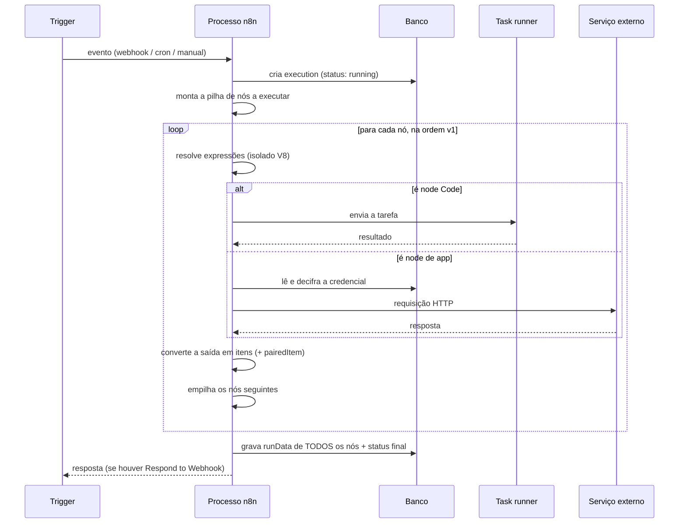

# 20 · Arquitetura interna — como o n8n funciona por dentro

`Nível: avançado` · `n8n 2.36.9` · `01/09/2026`

---

Sem caixas-pretas. O que roda, onde mora o estado, e o que acontece entre você
clicar em "Execute" e o dado aparecer na tela.

---

## 1. As peças

```
┌──────────────────────────────────────────────────────────────────┐
│  EDITOR (Vue.js, roda no seu navegador)                          │
│    fala com o backend por REST em /rest/* e por WebSocket/push   │
├──────────────────────────────────────────────────────────────────┤
│  BACKEND (Node.js / TypeScript)                                  │
│   ┌────────────┐ ┌──────────────┐ ┌───────────┐ ┌──────────────┐ │
│   │ Servidor   │ │  Workflow    │ │ Registro  │ │ Task broker  │ │
│   │ HTTP       │ │  Execute     │ │ de nós    │ │ (runners)    │ │
│   │ (REST +    │ │  (o motor)   │ │ (910 no   │ │              │ │
│   │  webhooks) │ │              │ │  padrão)  │ │              │ │
│   └────────────┘ └──────────────┘ └───────────┘ └──────────────┘ │
│   ┌────────────┐ ┌──────────────┐ ┌───────────────────────────┐  │
│   │ Agendador  │ │ Motor de     │ │ Camada de credenciais     │  │
│   │ (memória   │ │ expressões   │ │ (AES + N8N_ENCRYPTION_KEY)│  │
│   │  ou banco) │ │ (isolado V8) │ │                           │  │
│   └────────────┘ └──────────────┘ └───────────────────────────┘  │
├──────────────────────────────────────────────────────────────────┤
│  PERSISTÊNCIA                                                    │
│   SQLite (padrão) ou PostgreSQL · Redis (só em queue mode)        │
│   Disco: ~/.n8n (chave, config, binários em modo filesystem)      │
└──────────────────────────────────────────────────────────────────┘
```

**Tudo é Node.js.** Um único processo, monolítico por padrão, que pode ser
desdobrado em papéis (`start`, `worker`, `webhook`) quando você escala.

---

## 2. O ciclo de vida de uma execução



Cinco observações que explicam quase todo comportamento estranho:

1. **A execução é uma pilha, não um pipeline.** Daí a ordem em profundidade e a
   ausência de paralelismo entre ramos ([15](15-fluxo-de-controle.md)).
2. **Os dados vivem na memória do processo durante a execução inteira.** É por isso
   que payload grande derruba a instância, e por isso o binário saiu da memória.
3. **`runData` guarda entrada e saída de cada nó.** É o que dá a depuração
   maravilhosa e o que enche o banco.
4. **Credenciais são decifradas sob demanda**, na memória do processo que executa.
   Por isso todo worker precisa da mesma `N8N_ENCRYPTION_KEY`.
5. **Expressões rodam em isolado V8;** o Code node roda no task runner. São dois
   ambientes distintos — daí as diferenças do arquivo [17](17-code-node-e-task-runners.md).

---

## 3. Onde mora cada pedaço de estado

| Estado | Onde | Sobrevive a quê |
|---|---|---|
| Workflows | tabela `workflow_entity` | tudo, se o banco tem backup |
| Credenciais (cifradas) | tabela `credentials_entity` | idem — **e só se você tiver a chave** |
| Chave de criptografia | `N8N_ENCRYPTION_KEY` ou `~/.n8n/config` | é **o** ponto único de falha |
| Execuções + `runData` | `execution_entity`, `execution_data` | poda apaga por idade/quantidade |
| Webhooks registrados | `webhook_entity` | recriado ao ativar/publicar |
| `staticData` do workflow | junto do workflow | só grava em execução de produção |
| Binários | disco (`filesystem`) ou banco (`database`) | ver [12](12-o-modelo-de-dados.md#5-dado-binário-onde-ele-realmente-vive) |
| Fila de execuções | Redis (queue mode) | perdido se o Redis não persistir |
| Agendamentos | memória **ou** banco (agendador durável) | ver [16](16-gatilhos-e-webhooks.md#32-o-agendador-durável-novidade-importante-do-2x) |
| Data tables | banco, limitadas a 200 MiB por padrão | — |

**Verificado na prática:** o `webhook_entity` guarda, por linha,
`(workflowId, path, method, node, ...)`. Foi assim que se confirmou que
`POST /pedido` e `GET /pedido` podem viver em workflows diferentes — a chave inclui
o método.

---

## 4. Banco: SQLite ou PostgreSQL

| | SQLite | PostgreSQL |
|---|---|---|
| Instalar | nada | um serviço |
| Concorrência de escrita | **uma por vez** | alta |
| Queue mode | **não suportado** | obrigatório |
| Múltiplas instâncias | impossível | sim |
| Quando usar | aprender, instância pessoal | qualquer coisa séria |

O n8n 2.0 tornou o driver **`sqlite-pooled` o padrão**, e `DB_SQLITE_POOL_SIZE > 0`
liga o pool. Isso alivia, mas não elimina, o limite de escrita única do SQLite.

> **Recomendação:** SQLite para aprender; Postgres a partir do momento em que
> alguém depende dos fluxos. A migração **não é automática** — o n8n cria o esquema
> novo e vazio no Postgres. Migre com `export:workflow` / `export:credentials` e
> importe do outro lado.

---

## 5. Os três modos de execução

| Modo | Como se liga | Onde a execução roda |
|---|---|---|
| **regular** (padrão) | nada | No próprio processo principal |
| **queue** | `EXECUTIONS_MODE=queue` | Em processos `worker`, coordenados por Redis |
| ~~own~~ | — | Removido (era um processo por execução; caro demais) |

Detalhes de queue mode em [21-escala-e-producao.md](21-escala-e-producao.md).

---

## 6. Segurança da arquitetura, em três camadas

Vale enxergar como um todo, porque cada camada protege de uma coisa diferente:

| Camada | Protege de | Mecanismo |
|---|---|---|
| **Credenciais cifradas** | quem lê o banco | AES com `N8N_ENCRYPTION_KEY` |
| **Task runners externos** | código de usuário lendo segredos do processo | isolamento de processo/contêiner |
| **Isolado V8 das expressões** | expressão fazendo I/O | sem `require`, sem rede, sem disco |
| **RBAC + projetos** (licenciado) | usuário ver o que não é dele | autorização na aplicação |
| **`N8N_BLOCK_ENV_ACCESS_IN_NODE`** | expressão lendo `$env` | desliga a variável |
| **Proteção SSRF** | fluxo alcançar a rede interna | bloqueio de destinos |

**O elo mais fraco continua sendo quem pode editar workflow.** Editar workflow é
executar código no servidor. Toda a governança de um n8n corporativo gira em torno
disso. Ver [22-seguranca.md](22-seguranca.md).

---

## 7. Como um nó é implementado (para entender os limites)

Um nó é uma classe TypeScript com duas partes:

```typescript
export class MeuNo implements INodeType {
  description: INodeTypeDescription = {
    displayName: 'Meu Nó',
    name: 'meuNo',
    version: [1, 1.1],                 // versionamento por nó
    inputs: ['main'],
    outputs: ['main'],
    credentials: [{ name: 'minhaApi', required: true }],
    properties: [ /* resource, operation, campos */ ],
  };

  async execute(this: IExecuteFunctions): Promise<INodeExecutionData[][]> {
    const itens = this.getInputData();
    const saida: INodeExecutionData[] = [];
    for (let i = 0; i < itens.length; i++) {
      const valor = this.getNodeParameter('campo', i) as string;  // <- por item!
      saida.push({ json: { resultado: valor }, pairedItem: { item: i } });
    }
    return [saida];                     // array de saídas (uma por conector)
  }
}
```

O que isso revela:

- `getNodeParameter('campo', i)` recebe o índice do item: **é aqui que as expressões
  são resolvidas por item**.
- O retorno é `INodeExecutionData[][]` — um array **por saída**. Um IF devolve
  `[verdadeiros, falsos]`.
- **O nó é obrigado a declarar `pairedItem`.** A conveniência de omitir existe só no
  Code node.
- `version` é um array: um mesmo arquivo serve várias versões de comportamento.

---

## 8. Limites arquiteturais (e por que existem)

| Limite | Causa raiz | Consequência |
|---|---|---|
| Sem paralelismo entre ramos | modelo de execução em pilha, single-threaded | ramos "paralelos" são sequenciais |
| Dados na memória durante a execução | cada nó vê **todos** os itens de entrada | volume grande = OOM |
| Sem *streaming* | mesma razão | não serve para ETL pesado |
| Sem transação distribuída | não há coordenador | "gravou no A, falhou no B" é possível; use compensação |
| `staticData` sem controle de concorrência | é um campo do workflow | não é seguro com múltiplos workers |

> **Nenhum desses é bug.** São consequências diretas da decisão de projeto que dá
> ao n8n a sua maior qualidade: **você vê todos os dados de todos os nós de todas as
> execuções**. Streaming e paralelismo real tornariam essa visão impossível.
> Discussão formal em [60-teoria-avancada.md](60-teoria-avancada.md).

---

## Autoteste

1. Em que linguagem/runtime roda o backend? Quantos processos há por padrão?
2. Descreva o ciclo de vida de uma execução em cinco passos.
3. Por que todo worker precisa da mesma `N8N_ENCRYPTION_KEY`?
4. Onde ficam os dados de entrada e saída de cada nó, e qual o custo disso?
5. Quais os limites do SQLite e por que ele não serve para queue mode?
6. Quais os três modos de execução? Qual foi removido e por quê?
7. O que a assinatura `getNodeParameter('campo', i)` revela sobre expressões?
8. Por que um nó devolve `INodeExecutionData[][]` e não `[]`?
9. Cite três limites arquiteturais e a decisão de projeto que os causa.
10. Qual é o elo mais fraco da segurança do n8n?

---

*Anterior: [18-erros-e-confiabilidade.md](18-erros-e-confiabilidade.md) · Próximo: [21-escala-e-producao.md](21-escala-e-producao.md)*
