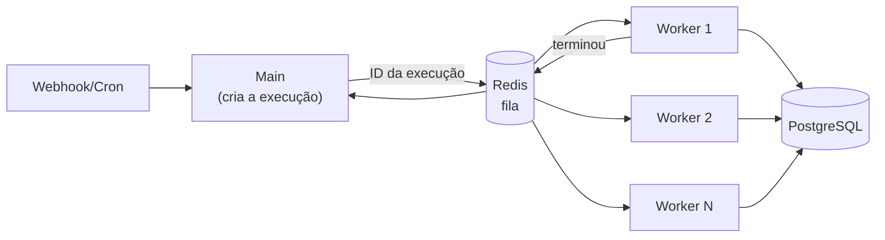

# 21 · Escala e produção — queue mode, workers, disco e memória

`Nível: avançado` · `Pesquisado na web em 01/09/2026`

---

Quando um n8n deixa de ser "um contêiner que roda" e passa a ser infraestrutura.

---

## 1. Quando escalar (e quando não)

Ordem de intervenção — **faça na ordem**, porque cada passo é mais barato que o seguinte:

| Sintoma | Primeiro tente | Só depois |
|---|---|---|
| Banco crescendo | ligar poda de execuções | trocar de banco |
| Instância lenta ao editar | limitar concorrência de produção | queue mode |
| Execuções esperando | mais CPU/RAM na máquina | queue mode |
| Muitos webhooks simultâneos | proxy reverso decente | processos `webhook` dedicados |
| Fluxo lento | corrigir o fluxo (paginação, batching, menos itens) | infraestrutura |

> **Na minha experiência, 80% dos "preciso escalar o n8n" são um fluxo que traz
> 50 mil itens quando precisava de 50, ou um polling de um minuto que podia ser
> webhook.** Otimize o fluxo antes de comprar máquina. Escalar um fluxo ruim só
> torna o desperdício mais rápido.

---

## 2. Queue mode

### 2.1 Como funciona



O fluxo exato, conforme a documentação:

1. A instância **main** trata temporizadores e webhooks e **gera** (mas não executa)
   uma execução.
2. Passa o **ID da execução** para o Redis, que mantém a fila.
3. Um **worker** disponível pega a mensagem.
4. O worker usa o ID para **ler o workflow do banco**.
5. Ao terminar, grava o resultado no banco e avisa o Redis.
6. O Redis notifica a main.

Repare: **o dado do workflow trafega pelo banco, não pelo Redis.** O Redis carrega
só o ID. Isso é o que permite payloads grandes sem estourar a memória do Redis.

### 2.2 Requisitos inegociáveis

| Requisito | Por quê |
|---|---|
| **PostgreSQL** | SQLite não suporta múltiplos processos escrevendo. A documentação diz explicitamente que queue mode com SQLite **não é recomendado** |
| **Mesma `N8N_ENCRYPTION_KEY` em todos** | Sem ela, o worker não decifra credenciais |
| **`EXECUTIONS_MODE=queue` na main e em todos os workers** | — |
| **Redis alcançável por todos** | — |
| **Binário fora do `filesystem`** | A documentação afirma: **queue mode não suporta binário em filesystem**. Use `database` ou armazenamento externo S3 |
| **Um sidecar de task runner por worker** | Cada worker precisa do seu ([17](17-code-node-e-task-runners.md)) |

### 2.3 Compose de referência

```yaml
x-n8n-comum: &n8n-comum
  image: n8nio/n8n:2.36.9
  environment: &n8n-env
    EXECUTIONS_MODE: queue
    QUEUE_BULL_REDIS_HOST: redis
    QUEUE_BULL_REDIS_PORT: "6379"
    DB_TYPE: postgresdb
    DB_POSTGRESDB_HOST: postgres
    DB_POSTGRESDB_DATABASE: ${POSTGRES_DB}
    DB_POSTGRESDB_USER: ${POSTGRES_USER}
    DB_POSTGRESDB_PASSWORD: ${POSTGRES_PASSWORD}
    N8N_ENCRYPTION_KEY: ${N8N_ENCRYPTION_KEY}
    N8N_DEFAULT_BINARY_DATA_MODE: database
    GENERIC_TIMEZONE: America/Sao_Paulo
    TZ: America/Sao_Paulo
  depends_on: [postgres, redis]

volumes: { db_data:, redis_data:, n8n_data: }

services:
  postgres:
    image: postgres:18
    environment:
      POSTGRES_USER: ${POSTGRES_USER}
      POSTGRES_PASSWORD: ${POSTGRES_PASSWORD}
      POSTGRES_DB: ${POSTGRES_DB}
      PGDATA: /var/lib/postgresql/data
    volumes: [db_data:/var/lib/postgresql/data]
    healthcheck:
      test: ["CMD-SHELL", "pg_isready -U ${POSTGRES_USER}"]
      interval: 5s
      retries: 10

  redis:
    image: redis:7-alpine
    command: ["redis-server", "--appendonly", "yes"]   # persistência: fila sobrevive a restart
    volumes: [redis_data:/data]
    healthcheck:
      test: ["CMD", "redis-cli", "ping"]
      interval: 5s
      retries: 10

  n8n-main:
    <<: *n8n-comum
    ports: ["5678:5678"]
    environment:
      <<: *n8n-env
      N8N_DISABLE_PRODUCTION_MAIN_PROCESS: "true"   # webhooks só nos processos dedicados
    volumes: [n8n_data:/home/node/.n8n]

  n8n-worker:
    <<: *n8n-comum
    command: worker --concurrency=10
    environment:
      <<: *n8n-env
      QUEUE_HEALTH_CHECK_ACTIVE: "true"
    deploy:
      replicas: 3

  n8n-webhook:
    <<: *n8n-comum
    command: webhook
    ports: ["5679:5678"]
```

Verificação:

```bash
docker compose ps
# esperado: postgres (healthy), redis (healthy), main Up, 3 workers Up, webhook Up

curl -sf http://localhost:5678/healthz          # main
curl -sf http://localhost:5679/healthz          # processo de webhook
docker compose exec redis redis-cli llen bull:jobs:wait   # tamanho da fila
```

### 2.4 Concorrência

Dois mecanismos, uma variável:

| Modo | Mecanismo | Padrão |
|---|---|---|
| **regular** | `N8N_CONCURRENCY_PRODUCTION_LIMIT` — excedente entra numa fila FIFO | desligado (`-1`, sem limite) |
| **queue** | `--concurrency=N` por worker; `N8N_CONCURRENCY_PRODUCTION_LIMIT` sobrepõe se ≠ `-1` | conforme o flag |

Detalhes que importam (da documentação):

- O limite vale **só para execuções de produção**. Manuais, sub-workflows, fluxos de
  erro e execuções por CLI **não** contam.
- **Execução enfileirada não pode ser retentada.** Cancelar ou apagar a remove da fila.
- Ao reiniciar, o n8n retoma até o limite e reenfileira o resto.

**Como escolher o número:** comece com `--concurrency=5` por worker e observe CPU e
memória. A regra prática é *concorrência ≈ 5 a 10 por vCPU* para fluxos dominados
por espera de rede, e *≈ 1 a 2 por vCPU* para fluxos que fazem trabalho de CPU
(transformações grandes, Code pesado).

### 2.5 Processos de webhook dedicados

`n8n webhook` intercepta **apenas URLs de produção**. Recomendações da documentação:

- **Não** coloque o processo main no pool do balanceador — ele ficaria lento para
  editar e visualizar.
- Roteie no balanceador:
  - `/webhook/*` e `/webhook-waiting/*` → pool de webhook;
  - **`/webhook-test/*` e todo o resto → main** (senão você não consegue testar
    nada no editor).
- `N8N_DISABLE_PRODUCTION_MAIN_PROCESS=true` tira os webhooks de produção da main.

---

## 3. Disco: o problema que chega sem avisar

O n8n grava entrada e saída de **cada nó** de **cada execução**. Um fluxo com 20 nós
e 1.000 itens gera dezenas de MB por execução.

```yaml
EXECUTIONS_DATA_PRUNE: "true"
EXECUTIONS_DATA_MAX_AGE: "168"            # horas (7 dias)
EXECUTIONS_DATA_PRUNE_MAX_COUNT: "10000"  # teto de execuções guardadas
```

E, por workflow (*Settings*):

| Configuração | Recomendação |
|---|---|
| Save successful production executions | **desligue** em fluxos de alto volume |
| Save failed production executions | **mantenha ligado** — é o que você precisa ver |
| Save manual executions | ligado em desenvolvimento, desligado em produção |

> Ligar a poda quando o banco já tem 60 GB é uma tarde de `DELETE` em lotes com o
> disco no limite. Ligar no primeiro dia custa três linhas de YAML.
> **Este é, disparado, o problema operacional mais comum de n8n autogerido.**

---

## 4. Memória

**A memória do n8n é dominada pelos dados do fluxo, não pelo n8n.**

Causas típicas de OOM, em ordem de frequência:

1. Baixar um arquivo grande e convertê-lo em itens (CSV de 200 MB → 2 milhões de itens).
2. `HTTP Request` sem paginação trazendo tudo de uma vez.
3. Binário grande com o modo errado de armazenamento.
4. Concorrência alta demais para a RAM disponível.

Mitigações, em ordem de eficácia:

| Ação | Efeito |
|---|---|
| Paginar na origem | Resolve a causa |
| `Loop Over Items` com lotes | Reduz o pico |
| Empurrar filtro/agregação para o banco (SQL) | Traz 50 linhas em vez de 50 mil |
| Binário em `database` ou S3 | Tira o arquivo da memória |
| `--max-old-space-size` no Node | Paliativo |
| Mais RAM | Último recurso |

---

## 5. Alta disponibilidade

| Componente | Como | Observação |
|---|---|---|
| **Workers** | Vários; sem estado | Trivial |
| **Processos de webhook** | Vários atrás de balanceador | Trivial |
| **Main** | *multi-main* | **Recurso Enterprise**; sem licença, uma main só |
| **PostgreSQL** | Réplica/gerenciado | Padrão |
| **Redis** | Sentinel ou gerenciado | Com `appendonly` |

**Consequência honesta:** sem licença Enterprise, a instância principal é ponto
único de falha para agendamentos e para a interface. Os workers continuam
processando a fila, mas nenhum agendamento novo dispara enquanto a main estiver
fora — a menos que o **agendador durável** esteja ligado, e mesmo assim é preciso
mais de uma main para haver de fato failover.

---

## 6. Monitoramento

```yaml
N8N_METRICS: "true"                       # expõe /metrics no formato Prometheus
QUEUE_HEALTH_CHECK_ACTIVE: "true"         # /healthz e /healthz/readiness nos workers
N8N_LOG_LEVEL: info
N8N_LOG_OUTPUT: console
```

O que vigiar, e o alarme de cada um:

| Métrica | Alarme |
|---|---|
| Tamanho da fila no Redis | Cresce sem voltar → faltam workers |
| Execuções com erro / total | Salto súbito → API externa mudou ou caiu |
| Duração p95 por workflow | Dobrou → investigar |
| Tamanho do banco | Cresce apesar da poda → poda não está rodando |
| RAM dos workers | Perto do limite → OOM a caminho |
| **Heartbeat de fluxo crítico** | Sem sinal → o gatilho parou ([18](18-erros-e-confiabilidade.md)) |

---

## 7. Backup e recuperação

**Três coisas, e as três são obrigatórias:**

```bash
# 1) banco
docker compose exec -T postgres pg_dump -U n8n n8n | gzip > n8n-$(date +%F).sql.gz

# 2) chave de criptografia  →  para um cofre de segredos, NUNCA junto do backup
echo "$N8N_ENCRYPTION_KEY"

# 3) infraestrutura como código
git add compose.yml .env.example workflows/
```

**Teste de restauração — e faça de verdade:**

```bash
gunzip -c n8n-2026-09-01.sql.gz | docker compose exec -T postgres psql -U n8n -d n8n_restore
```

> Backup nunca testado **não é backup**: é uma sensação. E backup do banco sem a
> chave de criptografia restaura tudo, menos as credenciais — que é justamente o que
> você não consegue recriar rapidamente.

---

## 8. Dimensionamento inicial

Números de partida, para ajustar com medição (não são garantia):

| Carga | Arquitetura | Máquina |
|---|---|---|
| < 1.000 execuções/dia, fluxos leves | main única, Postgres | 2 vCPU, 4 GB |
| 1.000–20.000/dia | main + 2 workers | 4 vCPU, 8 GB |
| 20.000–200.000/dia | main + 4–8 workers + 2 webhook | 8–16 vCPU, 16–32 GB, Postgres separado |
| > 200.000/dia | multi-main (Enterprise), workers em Kubernetes com HPA, Postgres gerenciado, S3 para binário | — |

**Meça antes de crescer.** O n8n publica um guia de *benchmarking*
([Measure performance](https://docs.n8n.io/deploy/host-n8n/configure-n8n/scaling/measure-performance.md)).

---

## Autoteste

1. Qual a ordem correta de intervenções antes de partir para queue mode?
2. Descreva os seis passos do fluxo de uma execução em queue mode.
3. O que trafega pelo Redis: o workflow inteiro ou só o ID? Por que isso importa?
4. Cite os seis requisitos inegociáveis do queue mode.
5. Por que binário em `filesystem` não funciona com múltiplos workers?
6. A quais tipos de execução o limite de concorrência **não** se aplica?
7. Quais caminhos devem ir para o pool de webhook e qual **não** pode ir?
8. Quais as quatro causas típicas de OOM, e a mitigação mais eficaz?
9. Sem licença Enterprise, qual é o ponto único de falha, e o que continua funcionando?
10. Quais são as três partes obrigatórias de um backup, e por que a chave vai separada?

---

*Fontes consultadas em 01/09/2026: [Enable queue mode](https://docs.n8n.io/deploy/host-n8n/configure-n8n/scaling/enable-queue-mode.md),
[Control concurrency](https://docs.n8n.io/deploy/host-n8n/configure-n8n/scaling/control-concurrency.md),
[Manage execution data](https://docs.n8n.io/deploy/host-n8n/configure-n8n/scaling/manage-execution-data.md),
[Queue mode environment variables](https://docs.n8n.io/deploy/host-n8n/configure-n8n/basic-configuration/use-environment-variables/queue-mode.md).*

*Anterior: [20-arquitetura-interna.md](20-arquitetura-interna.md) · Próximo: [22-seguranca.md](22-seguranca.md)*
