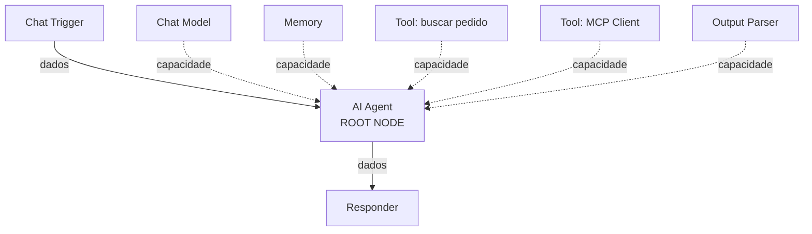
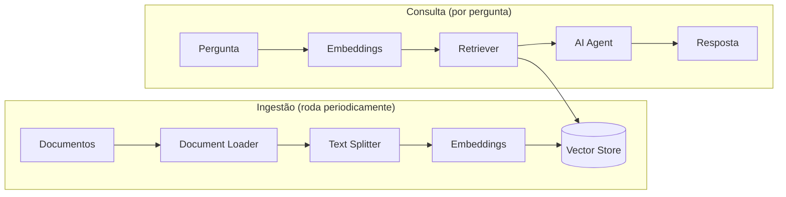

# 24 · IA e agentes no n8n

`Nível: avançado` · `Pesquisado na web em 01/09/2026`

---

Foi a parte de IA que levou o n8n de "ferramenta de automação" a produto avaliado em
US$ 2,5 bilhões ([11-historia.md](11-historia.md)). Este arquivo explica a mecânica,
não o marketing.

---

## 1. A topologia que confunde: cluster nodes

O n8n implementa o **LangChain (versão JavaScript)**. E introduz uma topologia
diferente no mesmo canvas:



- **Linha cheia** = fluxo de dados (itens andando).
- **Linha pontilhada** = **sub-node** ligado a um **root node**: não passa item,
  **fornece capacidade**.

Confundir os dois é o erro nº 1 de quem chega na parte de IA. Um Chat Model não
"recebe os itens": ele fica disponível para o agente usar.

### O mapa LangChain → n8n

| Conceito LangChain | No n8n | Exemplos |
|---|---|---|
| Chain | root node | Basic LLM Chain, Q&A Chain, Summarization Chain |
| Agent | root node | **AI Agent** |
| Language model | sub-node | Anthropic Chat Model, OpenAI Chat Model, Ollama Chat Model |
| Vector store | root node | Qdrant, Pinecone, PGVector, Simple (em memória) |
| Memory | sub-node | Simple Memory (janela), Postgres Chat Memory, Redis Chat Memory |
| Tool | sub-node | Call n8n Workflow Tool, Custom Code Tool, Wikipedia, MCP Client |
| Retriever | sub-node | Vector Store Retriever, Workflow Retriever |
| Embeddings | sub-node | Embeddings OpenAI, Embeddings Cohere |
| Document loader | sub-node | Default Data Loader, GitHub Document Loader |
| Output parser | sub-node | Structured Output Parser, Auto-fixing Output Parser |
| Text splitter | sub-node | Recursive Character, Token Splitter |

> **Detalhe documentado que economiza uma tarde:** **memória só se conecta ao AI
> Agent**. Diferente do LangChain, **nenhum nó de chain do n8n suporta memória** —
> uma chain não lembra da mensagem anterior. Se o seu caso precisa de conversa, use
> agente, não chain.

---

## 2. Agent × Chain: qual usar

| | Chain (Basic LLM Chain) | Agent (AI Agent) |
|---|---|---|
| Decide sozinho o que fazer | não | **sim** |
| Usa ferramentas | não | sim |
| Memória | **não** | sim |
| Previsível | **sim** | não |
| Custo por chamada | 1 chamada | 1..N chamadas (o laço de raciocínio) |
| Depuração | simples | difícil |

**Recomendação profissional, e ela é impopular:** *use chain sempre que der.*
A maioria dos "agentes" que vejo em produção não precisa decidir nada — precisa
classificar, extrair ou redigir, com um caminho fixo. Um agente nessas condições
é mais caro, mais lento, mais imprevisível e mais difícil de testar.

**Use agente quando** o caminho depende genuinamente do conteúdo e você não
consegue enumerar os casos. Se você consegue desenhar um Switch com as opções,
desenhe o Switch.

---

## 3. Modelos: o que escolher

| Provedor | Nó | Observação |
|---|---|---|
| **Anthropic** | Anthropic Chat Model | Família Claude |
| OpenAI | OpenAI Chat Model | |
| Google | Google Gemini | |
| **Ollama** | Ollama Chat Model | **Local, gratuito**, sem dado saindo da rede |
| Outros | Mistral, Cohere, Groq, Azure OpenAI, Bedrock, OpenRouter… | |

**Ollama merece destaque num curso de n8n autogerido:** se o motivo de você
autogerir é não mandar dados para fora, mandar tudo para uma API de LLM externa
anula esse motivo. Ollama roda o modelo na sua máquina. Custo: precisa de RAM/GPU e
os modelos abertos são mais fracos que os de fronteira. É um trade-off, não um
almoço grátis.

---

## 4. Ferramentas (tools)

Uma *tool* é uma capacidade que o agente pode invocar. No n8n:

| Tipo | O que é |
|---|---|
| **Nó marcado como tool** | Vários nós (HTTP Request, Postgres, Gmail…) têm versão "Tool" |
| **Call n8n Workflow Tool** | **Um sub-workflow inteiro vira uma ferramenta.** O mais poderoso |
| **Custom Code Tool** | Código JavaScript |
| **MCP Client** | Consome ferramentas de um servidor MCP externo |

**O padrão que funciona:** o agente decide *o quê*; sub-workflows determinísticos
fazem *como*. Assim você mantém a lógica de negócio testável e o modelo só escolhe
o caminho.

**Regras para descrever uma tool** (é o que o modelo lê para decidir):

1. Diga **quando** usar, não só o que faz: *"Use quando a pergunta citar um número
   de pedido no formato P-NNNN"*.
2. Descreva os parâmetros com exemplo.
3. Diga o que ela devolve quando **não** acha nada.
4. Nomes curtos e específicos: `consultar_pedido`, não `ferramenta_de_dados`.

> Ferramenta mal descrita é a causa nº 1 de "o agente não usa a ferramenta" ou "usa
> a errada". Ajustar a descrição rende mais que trocar de modelo.

---

## 5. Memória

| Tipo | Onde guarda | Quando |
|---|---|---|
| Simple Memory (buffer window) | memória do processo | Testes; **some ao reiniciar** e não funciona com múltiplos workers |
| Postgres Chat Memory | banco | **Produção** |
| Redis Chat Memory | Redis | Produção, alta rotatividade |
| Motor de memória | serviço externo | Casos avançados |

A memória é chaveada por **session ID**. Definir isso errado faz duas pessoas
compartilharem conversa — vazamento de dados entre usuários. Use um identificador
estável e realmente único (id do usuário, do canal, do ticket).

**Janela de contexto custa dinheiro.** Uma janela de 50 mensagens reenvia 50
mensagens a cada turno. Comece com 5–10.

---

## 6. RAG: buscar antes de responder



Decisões que determinam a qualidade, em ordem de impacto:

| Decisão | Efeito |
|---|---|
| **Tamanho do chunk e sobreposição** | O maior fator isolado. Chunk grande demais dilui; pequeno demais perde contexto. Comece em 500–1000 tokens com 10–20% de sobreposição |
| **Quantos trechos recuperar (`k`)** | 3–5 costuma bastar; mais é ruído e custo |
| **Modelo de embedding** | Precisa ser **o mesmo** na ingestão e na consulta |
| **Metadados no chunk** | Permite filtrar por fonte, data, cliente. Quase sempre esquecido |
| **Reindexar quando o documento muda** | Senão você responde com informação velha, com confiança total |

**Simple Vector Store (em memória)** é para experimentar: some ao reiniciar.
Produção pede Qdrant, PGVector (aproveita o Postgres que você já tem) ou Pinecone.

---

## 7. MCP: os dois lados

O **Model Context Protocol** virou o padrão de fato para expor ferramentas a
modelos. O n8n suporta os dois papéis:

| Nó | Papel |
|---|---|
| **MCP Client** | O agente do n8n **consome** ferramentas de um servidor MCP externo |
| **MCP Server Trigger** | O n8n **expõe** seus fluxos como ferramentas para agentes externos |

O segundo muda o posicionamento do n8n: de "ferramenta que chama IA" para
"plataforma que serve capacidades para IA". Seus 900+ nós e suas credenciais já
configuradas viram ferramentas de qualquer agente.

> **Aviso de segurança, e não é hipotético:** um MCP Server Trigger sem autenticação
> permite que qualquer agente execute seus fluxos **com as suas credenciais**.
> Autentique, restrinja o que é exposto, e jamais publique isso na internet aberta.

---

## 8. Guardrails e saída estruturada

| Recurso | Para quê |
|---|---|
| **Guardrails** (nó) | Filtra entrada e saída: PII, jailbreak, tópicos proibidos |
| **Structured Output Parser** | Força a saída num esquema JSON |
| **Auto-fixing Output Parser** | Se a saída não bate com o esquema, pede correção ao modelo |
| **Information Extractor** | Extrai campos definidos de texto livre |

**Regra que evita a maior parte dos incidentes:** se a saída do modelo alimenta uma
ação com efeito real (gravar, cobrar, enviar), **valide com esquema antes de agir**.
Um `Structured Output Parser` seguido de um `IF` custa dois nós e evita um
"o robô mandou e-mail para o cliente errado".

---

## 9. Custo e observabilidade

**A conta de LLM surpreende porque escala com itens**, e itens escalam sozinhos
([12](12-o-modelo-de-dados.md)). Um fluxo que processa 1.000 itens e chama um modelo
por item faz 1.000 chamadas — e um **agente** pode fazer várias por item.

Controles:

| Controle | Como |
|---|---|
| Filtrar **antes** do nó de IA | O mais eficaz, e o mais esquecido |
| Chain em vez de agente | 1 chamada em vez de N |
| Modelo menor para tarefas simples | Classificar não precisa do modelo de fronteira |
| Limitar iterações do agente | *Max Iterations* |
| Cache de resultados | Data Table com hash da entrada |
| Janela de memória curta | Menos tokens por turno |

**Rastreamento:** em instância autogerida (qualquer edição), dá para ligar
**LangSmith** com variáveis de ambiente:

```yaml
LANGCHAIN_TRACING_V2: "true"
LANGCHAIN_ENDPOINT: https://api.smith.langchain.com
LANGCHAIN_API_KEY: ${LANGSMITH_KEY}
LANGCHAIN_PROJECT: n8n-producao
```
**Não está disponível no n8n Cloud.** Para depurar por que um agente escolheu o que
escolheu, é a melhor ferramenta que existe hoje.

---

## 10. Aviso sobre o n8n 3.0

O **AI Agent v1**, com os modos antigos (**SQL Agent, Conversational, OpenAI
Functions, Plan-and-Execute, ReAct**), **é removido no n8n 3.0** (outubro de 2026),
junto com o **Chat Hub**.

Consequência prática: **todo tutorial de 2024 que ensina a escolher entre esses
modos está obsoleto.** Se você tem fluxos assim, migre para o AI Agent atual antes
de atualizar. Este é o maior risco de quebra para quem faz IA no n8n.

---

## Autoteste

1. Qual a diferença entre linha cheia e linha pontilhada no canvas de IA?
2. Por que uma chain não consegue lembrar da mensagem anterior?
3. Quando usar agente e quando usar chain? Qual é o padrão recomendado e por quê?
4. Por que Ollama é relevante especificamente em n8n autogerido?
5. Cite as quatro regras para descrever uma tool.
6. Por que Simple Memory não serve em produção?
7. O que acontece se o session ID da memória for mal definido?
8. Quais são os cinco fatores de qualidade de um RAG, em ordem de impacto?
9. Qual a diferença entre MCP Client e MCP Server Trigger, e qual o risco do segundo?
10. Cite três formas de reduzir o custo de LLM num fluxo n8n.
11. O que é removido no n8n 3.0 na parte de IA, e o que isso implica para tutoriais antigos?

---

*Fontes consultadas em 01/09/2026: [LangChain in n8n](https://docs.n8n.io/build/integrate-ai/langchain-in-n8n.md),
[Cluster nodes](https://docs.n8n.io/integrations/builtin/cluster-nodes.md),
[MCP Server Trigger](https://docs.n8n.io/integrations/builtin/core-nodes/n8n-nodes-langchain.mcptrigger.md),
[v3.0 breaking changes](https://docs.n8n.io/changelog/v30-breaking-changes).*

*Anterior: [23-ciclo-de-vida-e-versionamento.md](23-ciclo-de-vida-e-versionamento.md) · Próximo: [25-api-e-integracao-externa.md](25-api-e-integracao-externa.md)*
