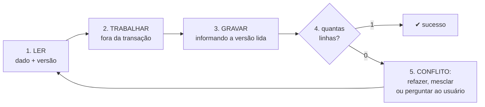

# 04 · Como começar — do ambiente pronto ao conflito detectado

`Nível: iniciante` · `Atualizado em: 14/08/2026`
`Testado em: Node v24.18.0, Ubuntu 22.04.5 LTS, 14/08/2026`

Este arquivo assume o ambiente já montado. Se `node --version` não responder `v22.5` ou
superior, volte para [`03-instalacao.md`](03-instalacao.md).

Em 10 minutos você vai ver, na sua tela, uma escrita ser **recusada** porque outra chegou antes.

---

## 1. O menor programa que demonstra a ideia

Crie um arquivo `primeiro.mjs` em qualquer diretório:

```javascript
// primeiro.mjs — optimistic locking em 25 linhas, sem dependência nenhuma.
import { DatabaseSync } from 'node:sqlite';

const db = new DatabaseSync(':memory:');
db.exec(`CREATE TABLE conta (id INTEGER PRIMARY KEY, saldo INTEGER, version INTEGER)`);
db.prepare('INSERT INTO conta VALUES (1, 100, 1)').run();

function ler(id) {
  return db.prepare('SELECT * FROM conta WHERE id = ?').get(id);
}

// A função inteira do optimistic locking está no WHERE da linha de baixo.
function gravar(id, saldoNovo, versaoLida) {
  const r = db.prepare(
    'UPDATE conta SET saldo = ?, version = version + 1 WHERE id = ? AND version = ?'
  ).run(saldoNovo, id, versaoLida);
  return r.changes === 1;      // <<< a DETECÇÃO é este número
}

const ana   = ler(1);          // Ana lê a versão 1
const bruno = ler(1);          // Bruno lê a MESMA versão 1
console.log(`Ana leu   : saldo=${ana.saldo} version=${ana.version}`);
console.log(`Bruno leu : saldo=${bruno.saldo} version=${bruno.version}`);

console.log('Ana grava 150 ......', gravar(1, 150, ana.version)   ? 'ACEITO' : 'RECUSADO');
console.log('Bruno grava 200 ....', gravar(1, 200, bruno.version) ? 'ACEITO' : 'RECUSADO');

console.log('Estado final:', ler(1));
```

Execute:

```bash
node --no-warnings primeiro.mjs
```

**Saída esperada** (verificada em 14/08/2026):

```
Ana leu   : saldo=100 version=1
Bruno leu : saldo=100 version=1
Ana grava 150 ...... ACEITO
Bruno grava 200 .... RECUSADO
Estado final: [Object: null prototype] { id: 1, saldo: 150, version: 2 }
```

### Como saber que deu certo

Três coisas precisam ser verdade na saída:

1. **`Bruno grava 200 .... RECUSADO`** — se aparecer `ACEITO`, a guarda não está funcionando.
2. **`saldo: 150`** — o valor que Ana gravou sobreviveu.
3. **`version: 2`** — a versão avançou **uma** vez, não duas. Duas escritas tentaram, uma passou.

Se você tirar `AND version = ?` do `UPDATE` e rodar de novo, verá `ACEITO`/`ACEITO`,
`saldo: 200` e `version: 3`. O saldo de Ana evaporou sem que ninguém fosse avisado.
**Faça esse teste agora** — ver o bug acontecer vale mais que qualquer parágrafo deste curso.

> O `--no-warnings` só esconde o aviso de que `node:sqlite` ainda é experimental. Sem ele,
> tudo funciona igual, com uma linha a mais na saída.

---

## 2. O que acabou de acontecer, linha por linha

```
tempo →

Ana   ── ler(1) ──────────────────────────── gravar(150, v=1) ── ✔ v vira 2
                        ↘
Bruno ── ler(1) ────────────────────────────────── gravar(200, v=1) ── ✘ 0 linhas
                (leu v=1, mas o banco já está em v=2)
```

O `UPDATE` de Bruno **não deu erro**. Ele executou perfeitamente e encontrou **zero** linhas
que casassem com `id = 1 AND version = 1`. Zero linhas alteradas é sucesso, do ponto de vista
do banco. É o seu código que precisa interpretar esse zero como "conflito".

**Esta é a frase mais importante deste curso:**

> Quem detecta o conflito não é o banco. É o `if` que você escreve depois do `UPDATE`.

---

## 3. O ciclo de trabalho do dia a dia

Todo uso de optimistic locking segue estes cinco passos, sempre nesta ordem:



O passo 2 é o motivo de a técnica existir: entre ler e gravar você pode gastar **um
milissegundo ou vinte minutos** — mostrar um formulário, esperar o usuário digitar, chamar
outro serviço — sem segurar nada do banco.

**O passo 5 é onde os projetos se diferenciam.** As três respostas possíveis:

| Resposta | Quando é a certa | Onde ver |
|---|---|---|
| **Refazer sozinho** (retentar) | a operação é recalculável a partir do estado novo | [`19`](19-retentativa-e-idempotencia.md) |
| **Mesclar** | os dois mexeram em campos diferentes | [`20`](20-ux-e-resolucao-de-conflitos.md) |
| **Perguntar ao usuário** | a decisão dele dependia do que ele leu | [`20`](20-ux-e-resolucao-de-conflitos.md) |

---

## 4. Agora com concorrência de verdade

O exemplo acima é sequencial: ele *simula* dois atores. Para ver requisições realmente
simultâneas disputando a mesma linha, rode o projeto-modelo:

```bash
cd 07-projeto-modelo
```

```bash
npm run demo:perde
```

**Saída esperada** (o número varia entre execuções; o que não varia é ser maior que zero):

```
modo .................. inseguro
clientes .............. 20
edições sobreviventes . 10 de 20
edições PERDIDAS ...... 10
versão final .......... 21
escritas HTTP gastas .. 20 (1.00x por edição)
tempo ................. 64.0 ms

Resultado: 10 edições sumiram sem erro nenhum. Ninguém foi avisado.
```

```bash
npm run demo:protege
```

```
modo .................. seguro
clientes .............. 20
edições sobreviventes . 20 de 20
edições PERDIDAS ...... 0
versão final .......... 21
escritas HTTP gastas .. 67 (3.35x por edição)
tempo ................. 239.7 ms

Resultado: nada se perdeu. O preço foi a retentativa.
```

Repare no detalhe cruel: **nos dois casos a versão final é 21**. A coluna `version` foi
incrementada 20 vezes mesmo no modo inseguro. Ter a coluna não protege nada — **usá-la no
`WHERE` é que protege**.

E repare no preço: 3,35 escritas HTTP por edição bem-sucedida, e 3,7× mais tempo. Esse é o
custo do otimismo sob contenção máxima. Em carga real, com conflitos raros, ele some.

---

## 5. O mesmo no HTTP, com `curl`

Optimistic locking na web tem nome próprio: `ETag` + `If-Match`. Suba o servidor:

```bash
npm start
# esperado: catálogo otimista em http://localhost:3000 (db: :memory:)
```

Em **outro terminal**:

```bash
curl -i http://localhost:3000/produtos/1
```

```
HTTP/1.1 200 OK
content-type: application/json; charset=utf-8
etag: "1"          <<< a versão, viajando pelo protocolo
...
```

Edite informando o ETag que você recebeu:

```bash
curl -i -X PUT http://localhost:3000/produtos/1 \
  -H 'content-type: application/json' -H 'if-match: "1"' \
  -d '{"nome":"Teclado editado"}'
# esperado: HTTP/1.1 200 OK  e  etag: "2"
```

Agora tente de novo com o ETag **velho** — é exatamente o que faria um usuário que abriu o
formulário há dez minutos:

```bash
curl -i -X PUT http://localhost:3000/produtos/1 \
  -H 'content-type: application/json' -H 'if-match: "1"' \
  -d '{"nome":"Editado com ETag velho"}'
```

```
HTTP/1.1 412 Precondition Failed
etag: "2"
{
  "erro": "conflito_de_versao",
  "versao_enviada": 1,
  "versao_atual": 2,
  "atual": { ... o estado de agora, para você mesclar ... }
}
```

E o que acontece se o cliente simplesmente **esquecer** a pré-condição:

```bash
curl -i -X PUT http://localhost:3000/produtos/1 \
  -H 'content-type: application/json' -d '{"nome":"Sem precondição"}'
# esperado: HTTP/1.1 428 Precondition Required
```

O servidor **exige** a pré-condição. Se ele aceitasse, seria cúmplice do *lost update*.
Detalhes e o debate `412` vs. `409` em [`17-http-e-apis.md`](17-http-e-apis.md).

---

## 6. Os cinco primeiros erros de uso (não de instalação)

Todos já me apareceram em revisão de código de gente boa.

### Erro 1 — ignorar o número de linhas afetadas

```javascript
// ERRADO: a guarda existe, mas ninguém olha o resultado
db.prepare('UPDATE conta SET saldo=?, version=version+1 WHERE id=? AND version=?')
  .run(150, 1, versaoLida);
return 'salvo!';   // mentira: pode não ter salvado nada
```

```javascript
// CERTO
const r = db.prepare('UPDATE ... WHERE id=? AND version=?').run(150, 1, versaoLida);
if (r.changes === 0) throw new ConflitoDeVersao(versaoLida);
```

**Sintoma em produção:** usuários dizendo "salvei e não salvou". Nenhum erro no log.

### Erro 2 — retentar sem reler

```javascript
// ERRADO: retenta com a MESMA versão, que já era velha na primeira vez
for (let i = 0; i < 5; i++) {
  if (gravar(id, novoValor, versaoLida)) break;   // vai falhar 5 vezes
}
```

```javascript
// CERTO: reler faz parte da retentativa
for (let i = 0; i < 5; i++) {
  const atual = ler(id);
  if (gravar(id, calcular(atual), atual.version)) break;
}
```

**Sintoma:** taxa de erro constante e imune ao aumento do número de tentativas.

### Erro 3 — deixar o cliente escolher a versão nova

```sql
-- ERRADO: dois clientes podem mandar version = 8
UPDATE conta SET saldo = ?, version = ? WHERE id = ? AND version = ?
```

```sql
-- CERTO: o banco calcula
UPDATE conta SET saldo = ?, version = version + 1 WHERE id = ? AND version = ?
```

### Erro 4 — usar versão onde o certo é um delta atômico

```javascript
// ERRADO: gera conflito falso; dois "-1" simultâneos não conflitam de verdade
const p = ler(id);
gravar(id, { estoque: p.estoque - 1 }, p.version);
```

```sql
-- CERTO: comutativo, sem versão, sem retentativa
UPDATE produto SET estoque = estoque - 1 WHERE id = ? AND estoque >= 1;
```

Critério: **versão** quando a intenção é *"substituir o que eu li"*; **delta** quando é
*"aplicar esta diferença ao que estiver lá"*. Mais em [`14`](14-otimista-vs-pessimista.md).

### Erro 5 — mostrar o erro cru ao usuário

```
OptimisticLockException: Row was updated or deleted by another transaction
(or unsaved-value mapping was incorrect)
```

Ninguém fora da equipe entende isso, e quem entende também não sabe o que fazer. O usuário
precisa de: **o que mudou**, **quem mudou**, e **dois botões** ("manter o meu" / "usar o
deles"). Veja [`20-ux-e-resolucao-de-conflitos.md`](20-ux-e-resolucao-de-conflitos.md).

---

## 7. Verificação final antes de seguir

Marque tudo antes de ir para o próximo arquivo:

- [ ] `primeiro.mjs` rodou e mostrou `RECUSADO` para o Bruno.
- [ ] Você **removeu** o `AND version = ?`, rodou de novo e viu o *lost update* acontecer.
- [ ] `npm test` no projeto-modelo respondeu `pass 21 / fail 0`.
- [ ] `npm run demo:perde` mostrou edições perdidas; `demo:protege` mostrou zero.
- [ ] Você viu um `412` e um `428` com `curl`.
- [ ] Você sabe dizer, sem consultar, o que significa "zero linhas afetadas".

---

## Onde ir depois

| Se você quer… | Vá para |
|---|---|
| Receitas prontas na sua linguagem | [`06-exemplos.md`](06-exemplos.md) — 12 exemplos completos |
| Uma referência para consultar enquanto programa | [`05-manual-de-uso.md`](05-manual-de-uso.md) |
| Ler o código do projeto inteiro | [`07-projeto-modelo/README.md`](07-projeto-modelo/README.md) |
| Entender por que funciona | [`10-fundamentos.md`](10-fundamentos.md) |
| Evitar os erros caros | [`75-armadilhas.md`](75-armadilhas.md) |

---

## Autoteste

1. Por que `r.changes === 0` é a detecção do conflito, e não uma exceção do banco?
2. Na saída do `primeiro.mjs`, por que a versão final é 2 e não 3?
3. O que você espera ver se remover `AND version = ?` do `UPDATE`?
4. Nos dois modos da demonstração, a versão final foi 21. O que isso prova?
5. Qual é o passo do ciclo de trabalho que separa um sistema bem-feito de um irritante?
6. Um colega retenta cinco vezes e sempre falha. Qual é o bug mais provável?
7. Quando você **não** deve usar coluna de versão? Dê um exemplo concreto.
